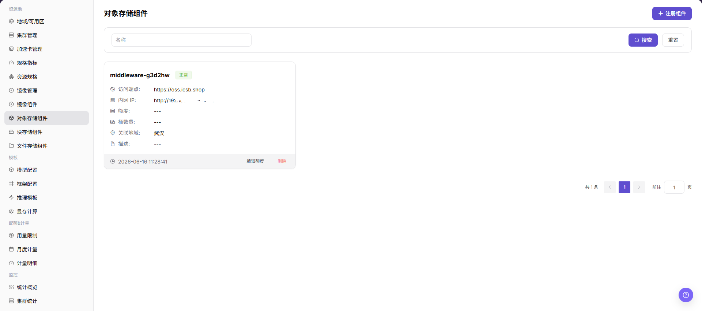
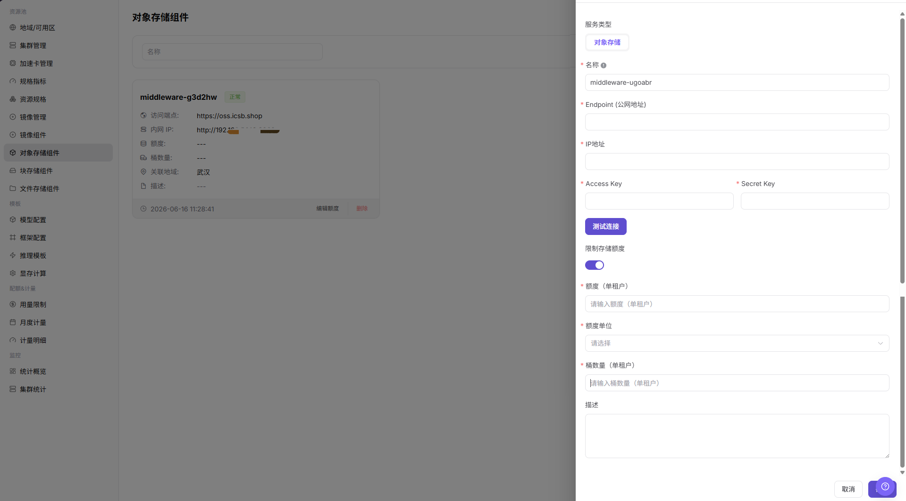

# 对象存储组件

::: info 文档信息
版本：v1.0
更新日期：2026-07-08
:::

## 功能概述

`对象存储组件` 用于接入 MinIO、S3 兼容存储或其他对象存储服务，为地域、用户侧对象存储、作业读写对象路径和模型数据管理提供 Bucket、对象路径和非结构化数据能力。

| 项目 | 内容 |
| --- | --- |
| 适用角色 | 运营方 |
| 导航路径 | AI基础设施 > On-Prem > 资源池 > 对象存储组件 |
| 页面路由 | `/powerone/resourcepool/storage` |
| 管理对象 | 服务类型、对象存储、名称、Endpoint（公网地址）、IP地址、Access Key、Secret Key、限制存储额度、描述和操作 |
| 典型途径 | 接入 MinIO/S3，支撑模型文件、数据集、产物包、任务输出和用户侧 Bucket 管理 |

#### 新手理解

- **对象存储** 像一个按桶组织的文件仓库，适合保存模型权重、数据集、压缩包和运行产物。
- **Bucket** 像对象存储的顶层容器，用户侧创建桶后才能组织对象。
- **Endpoint** 是访问入口，平台、集群或作业需要通过它访问对象存储。
- **AK/SK** 是访问凭据，属于敏感信息，不应出现在截图、文档或工单中。

#### 术语速查

| 术语 | 说明 |
| --- | --- |
| MinIO | 常见的 S3 兼容对象存储实现。 |
| S3 | 对象存储 API 协议或兼容接口。 |
| Bucket | 对象存储顶层容器，用于组织对象。 |
| Object | 桶中的单个文件或数据项。 |
| Endpoint | 对象存储访问入口，需确认平台侧和集群侧网络可达。 |
| AK/SK | 访问密钥，属于敏感凭据。 |

## 前提条件

1. 对象存储服务已部署完成，并能从平台管理侧和目标集群访问。
2. 已准备 Endpoint、内网地址、访问协议、认证方式、访问凭据、容量规划和关联地域。
3. 已确认 Bucket 命名、租户隔离、权限边界和数据保留策略。
4. 当前账号具备运营方资源池管理权限。
5. 学习或截图场景只查看字段和表单，不提交真实对象存储组件配置。

## 页面说明

页面展示已接入的对象存储组件、状态、访问端点、内网地址、容量信息和关联地域。

下图展示对象存储组件列表，可查看组件状态、Endpoint、内网地址、容量和操作入口。

## 主要操作

### 注册存储组件

#### 适用场景

当需要接入新的 MinIO、S3 兼容存储或其他对象存储服务，并让地域、用户侧 Bucket 或作业读写对象路径使用该存储能力时，注册存储组件。正文中的对象存储组件仍指本页面管理的对象存储接入对象。

#### 操作步骤

1. 进入 `AI基础设施 > On-Prem > 资源池 > 对象存储组件`。
2. 点击 `注册组件`。
3. 按页面字段填写 `服务类型`、`对象存储`、`名称`、`Endpoint (公网地址)`、`IP地址`、`Access Key`、`Secret Key`、`限制存储额度` 和 `描述`。
4. 如页面提供 `测试连接`，先执行只读连通性检查并确认返回结果。
5. 点击最终 `保存`、`提交` 或 `确定` 前，再次核对 Endpoint (公网地址)、IP地址、Access Key、Secret Key 和容量限制。
6. 如仅学习或验证页面，只查看字段和表单，不提交真实对象存储组件配置。

下图展示注册对象存储组件表单，用于配置对象存储访问方式和连接参数。

## 参数说明

| 字段名称 | 是否必填 | 字段类型 | 示例 | 说明 |
| --- | --- | --- | --- | --- |
| 服务类型 | 必填 | 下拉 / 枚举 | `镜像` | 当前组件所属服务类型。 对象存储页面通常显示为 `对象存储`。 |
| 对象存储 | 必填 | 下拉 / 枚举 | `对象存储` | 注册存储组件时的服务类型取值。 与页面实际选项保持一致。 |
| 名称 | 必填 | 文本 | `示例名称` | 对象存储组件展示名称。 建议体现存储类型、环境或地域。 |
| Endpoint (公网地址) | 必填 | 地址 / 路径 | `https://endpoint.example.com` | 对象存储对平台或业务侧暴露的公网入口。 文档中不写真实 Endpoint。 |
| IP地址 | 条件必填 | 地址 / 路径 | `192.0.2.10` | 集群或平台访问对象存储的地址。 与实际网络、DNS 和路由配置一致。 |
| Access Key | 必填 | 凭据 / 敏感文本 | `<access-key>` | 对象存储访问 AK。 只在系统表单中填写，不写入文档、截图或工单。 |
| Secret Key | 必填 | 凭据 / 敏感文本 | `<secret-key>` | 对象存储访问 SK。 属于敏感凭据，不写入文档、截图或工单。 |
| 限制存储额度 | 否 | 数值 / 容量 | `开启` | 是否限制对象存储容量额度。 根据租户、地域和作业规模规划。 |
| 描述 | 否 | 多行文本 | `示例说明` | 组件用途、边界或维护说明。 只记录非敏感说明。 |
| 操作 | 系统生成 | 操作入口 | `编辑` | 注册组件、测试连接、取消、确定、编辑额度、删除等入口。 `确定`、`删除` 属于高风险动作。 |

## 踩坑提示

- 注册存储组件会影响地域对象存储能力、用户侧 Bucket 创建、作业读写对象路径和数据访问范围。
- Endpoint、内网地址、证书、AK/SK、Bucket 策略或地域绑定错误，可能导致作业无法读写对象存储。
- AK/SK、Token、内部连接串、生产 Bucket 路径属于敏感信息，不能写入文档、截图或工单。
- `保存 / Save`、`提交 / Submit`、`确定 / OK` 属于高风险最终动作。
- 不写真实 Endpoint、内网地址、AK/SK、Token、Bucket 名称、生产对象路径、集群 ID、资源池 ID 或内部测试参数。

## 结果校验

| 检查项 | 成功表现 | 异常时处理 |
| --- | --- | --- |
| 页面可进入 | 能进入 `AI Infra > On-Prem > 资源池管理 > 对象存储组件`。 | 检查菜单配置和账号权限。 |
| 组件列表正常加载 | 名称、Endpoint (公网地址)、IP地址、容量配置和状态正常显示。 | 刷新页面并检查服务状态或浏览器控制台错误。 |
| 注册入口可见 | 页面显示 `注册组件` 入口。 | 检查运营方权限、License 和页面配置。 |
| 注册表单可打开 | 点击入口后可查看服务类型、名称、Endpoint (公网地址)、IP地址、Access Key、Secret Key 和限制存储额度字段。 | 检查路由、权限和前端错误。 |
| 必填字段校验正常 | 未填写名称、Endpoint、Access Key、Secret Key 或容量字段时出现校验提示。 | 按页面提示补齐字段，不绕过校验。 |
| 仅学习时未提交 | 未触发真实保存、提交或确定动作。 | 如误提交，立即核对组件列表和地域绑定范围。 |
| 真实提交后状态可追踪 | 组件出现在对象存储组件列表中，状态符合预期。 | 核对 Endpoint、内网地址、凭据、证书和连接测试结果。 |
| 地域绑定可验证 | 在 `地域/可用区` 中可以将对象存储组件绑定到目标地域。 | 检查组件状态、关联地域、权限和可见范围。 |
| 下游读写可验证 | 用户侧对象存储页面可创建 Bucket，测试作业能读取或写入对象路径。 | 检查 AK/SK、Bucket 策略、网络、证书和路径配置。 |

## 常见问题

#### 对象存储组件列表为空

**问题现象：**

进入页面后没有对象存储组件记录。

**可能原因：**

- 尚未注册对象存储组件。
- 筛选条件限制了结果。
- 当前账号没有查看权限。
- 组件注册失败或状态未同步。

**处理方式：**

1. 点击 `重置` 清空筛选条件。
2. 确认是否已完成组件注册。
3. 检查当前账号的资源池管理权限。
4. 查看注册结果、同步状态和错误提示。

#### 地域中无法选择对象存储组件

**问题现象：**

创建或编辑地域时，对象存储下拉列表为空。

**可能原因：**

- 组件未启用或状态异常。
- 组件没有与目标地域建立可绑定关系。
- 当前账号没有绑定权限。
- 关联地域或可见范围没有覆盖目标地域。

**处理方式：**

1. 回到对象存储组件列表检查状态。
2. 确认组件关联地域和可见范围。
3. 检查账号权限后重新打开地域表单。
4. 如仍为空，检查 Endpoint、内网地址和连接测试状态。

#### 作业无法读写对象路径

**问题现象：**

用户作业启动后无法读取模型文件、数据集或输出对象。

**可能原因：**

- Endpoint、内网地址、凭据或 Bucket 权限配置错误。
- 集群到对象存储网络不可达。
- 对象路径、Bucket 名称或访问策略不正确。
- 证书、DNS 或跨地域访问策略未配置正确。

**处理方式：**

1. 检查 Endpoint、内网地址和网络连通性。
2. 核对 AK/SK、Token 或访问策略。
3. 检查 Bucket 策略、对象路径和地域绑定范围。
4. 使用测试作业验证 Bucket 读写。

## 后续操作

1. 进入 [地域/可用区](../regions-zones/) 绑定对象存储组件。
2. 指导用户在 [对象存储](../../../user/storage/object-storage/) 中创建 Bucket 并上传数据。
3. 通过测试作业验证对象读写、权限和路径配置。
4. 定期核对容量使用、Bucket 策略和数据保留策略。

## 注意事项

- 注册存储组件会影响地域对象存储能力、用户侧 Bucket 创建、作业读写对象路径和数据访问范围。
- 不要截图或记录真实 Endpoint、内网地址、AK/SK、Token、内部连接串、生产 Bucket 名称和生产对象路径。
- 删除、禁用或替换对象存储组件前，应确认数据迁移、备份、地域绑定和依赖作业。
- `保存 / Save`、`提交 / Submit`、`确定 / OK` 属于高风险最终动作，学习或截图时不要触发。
- 不写真实 Endpoint、内网地址、AK/SK、Token、Bucket 名称、生产对象路径、集群 ID、资源池 ID 或内部测试参数。
