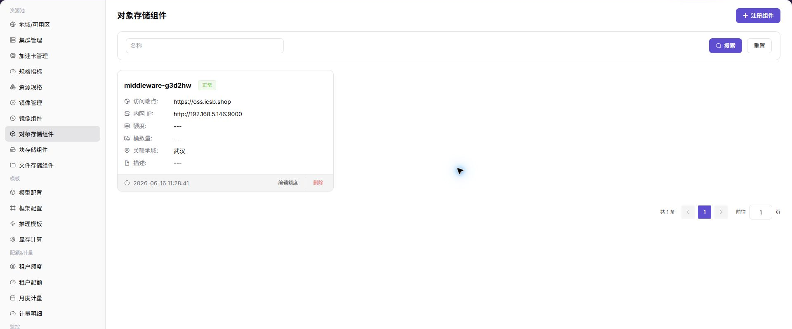
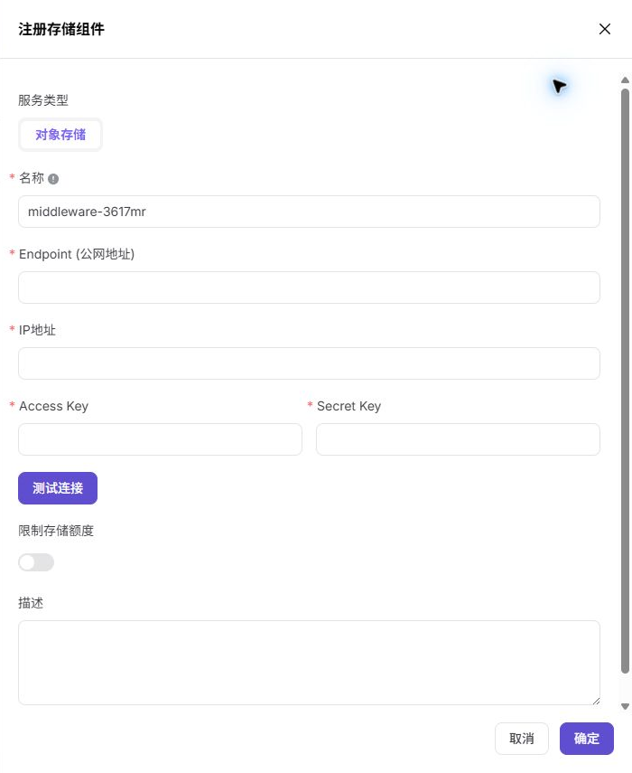

# 对象存储组件

## 功能概述

`对象存储组件` 用于接入 MinIO、S3 兼容存储或其他对象存储服务，为地域和用户侧对象存储提供桶、对象路径和非结构化数据能力。

| 项目 | 内容 |
| --- | --- |
| 适用角色 | 运营方 |
| 导航路径 | 资源池 > 对象存储组件 |
| 页面路由 | `/powerone/resourcepool/storage` |
| 管理对象 | 对象存储服务、Endpoint、内网地址、桶能力、容量限制和关联地域 |
| 典型用途 | 接入 MinIO/S3，支撑模型文件、数据集、产物包和任务输出 |

### 新手理解

- **对象存储** 像一个按桶组织的文件仓库，适合保存模型权重、数据集、压缩包和运行产物。
- **Bucket** 是对象存储的顶层容器，用户侧创建桶后才能组织对象。
- **Endpoint** 是访问入口，平台、集群或作业需要通过它访问对象存储。
- **AK/SK** 是访问凭据，属于敏感信息，不应出现在截图、文档或工单中。

### 术语速查

| 术语 | 说明 |
| --- | --- |
| MinIO | 常见的 S3 兼容对象存储实现。 |
| S3 | 对象存储 API 协议或兼容接口。 |
| Bucket | 对象存储顶层容器，用于组织对象。 |
| Object | 桶中的单个文件或数据项。 |
| Endpoint | 对象存储访问入口，需确认平台侧和集群侧网络可达。 |
| AK/SK | 访问密钥，属于敏感凭据。 |

## 前提条件

1. 对象存储服务已部署完成，并能从平台管理侧和目标集群访问。
2. 已准备 Endpoint、内网地址、访问凭据、容量规划和关联地域。
3. 已确认 Bucket 命名、租户隔离、权限边界和数据保留策略。
4. 当前账号具备运营方资源池管理权限。

## 页面说明

页面展示已接入的对象存储组件、状态、访问端点、内网地址、容量信息和关联地域。

## 注册对象存储组件

### 操作前确认

1. Endpoint、内网地址和端口可从平台和目标集群访问。
2. 访问凭据权限符合最小权限原则。
3. 容量配额、桶数量限制和租户隔离策略已确认。
4. 目标地域需要启用对象存储能力。

### 操作步骤

1. 进入 `资源池 > 对象存储组件`。
2. 点击 `注册组件` 或页面提供的新增入口。
3. 填写组件名称、Endpoint、内网地址、容量控制和认证信息。
4. 如页面提供连接测试，先执行测试。
5. 提交后返回列表检查组件状态。

### 参数说明

| 字段名称 | 是否必填 | 字段类型 | 示例 | 说明 |
| --- | --- | --- | --- | --- |
| 对象名称 | 是 | 文本 | `resource-a` | 当前页面对象名称。 |
| 地域 | 条件必填 | 下拉选择 | `武汉` | 对象所属地域。 |
| 关联资源 | 条件必填 | 文本 | `cluster-a` | 对象依赖或关联的资源。 |
| 状态 | 系统生成 | 枚举 | `可用` | 对象当前状态。 |
| 维护说明 | 否 | 多行文本 | `生产环境使用` | 记录用途、边界和维护信息。 |
### 踩坑提示

- 资源池配置会影响作业调度，修改前先确认运行中实例。
- 下拉为空时先检查地域、权限和依赖组件状态。
- 删除或禁用资源前准备替代资源和回退方案。

### 结果校验

1. 组件出现在列表中，状态符合预期。
2. 在 `地域/可用区` 中可以将对象存储组件绑定到目标地域。
3. 用户侧对象存储页面能创建桶或看到对象存储能力。
4. 测试作业能读取或写入对象路径。

## 常见问题

### 对象存储组件列表为空

**问题现象：**

进入页面后没有对象存储组件记录。

**可能原因：**

- 尚未注册对象存储组件。
- 筛选条件限制了结果。
- 当前账号没有查看权限。

**处理方式：**

1. 点击重置清空筛选条件。
2. 确认是否已完成组件注册。
3. 检查当前账号的资源池管理权限。

### 地域中无法选择对象存储组件

**问题现象：**

创建或编辑地域时，对象存储下拉列表为空。

**可能原因：**

- 组件未启用或状态异常。
- 组件没有与目标地域建立可绑定关系。
- 当前账号没有绑定权限。

**处理方式：**

1. 回到对象存储组件列表检查状态。
2. 确认组件关联地域和可见范围。
3. 检查账号权限后重新打开地域表单。

### 作业无法读写对象路径

**问题现象：**

用户作业启动后无法读取模型文件、数据集或输出对象。

**可能原因：**

- Endpoint、凭据或桶权限配置错误。
- 集群到对象存储网络不可达。
- 对象路径、桶名或访问策略不正确。

**处理方式：**

1. 检查 Endpoint 和网络连通性。
2. 核对 AK/SK 或访问策略。
3. 使用测试作业验证桶读写。

## 后续操作

1. 进入 [地域/可用区](../regions-zones/) 绑定对象存储组件。
2. 指导用户在 [对象存储](../../../user/storage/object-storage/) 中创建桶并上传数据。
3. 通过测试作业验证对象读写、权限和路径配置。

## 注意事项

- 不要截图或记录真实 AK/SK、token、内部连接串和生产桶路径。
- 删除、禁用或替换对象存储组件前，应确认数据迁移、备份和依赖作业。
