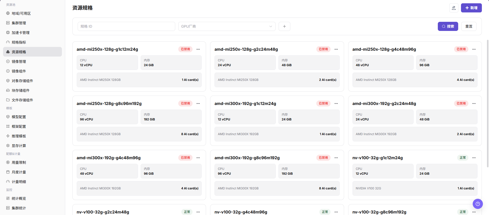
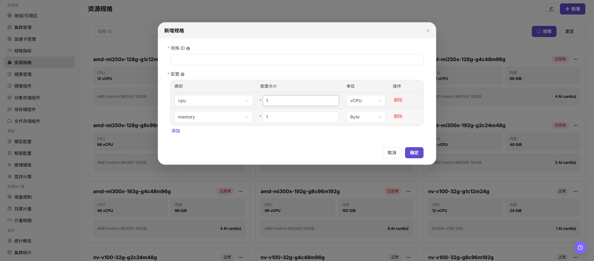

# 资源规格

::: info 文档信息
版本：v1.0
更新日期：2026-07-08
:::

## 功能概述

`资源规格` 用于维护用户创建在线 IDE、运行实例、训练任务或模型服务时可选择的资源套餐，组合 CPU、内存、AI 加速卡等规格指标，并在关联集群后开放给用户使用。

| 项目 | 内容 |
| --- | --- |
| 适用角色 | 运营方 |
| 导航路径 | AI基础设施 > On-Prem > 资源池 > 资源规格 |
| 页面路由 | `/powerone/resourcepool/flavor/list` |
| 管理对象 | 规格 ID、CPU、内存、加速卡、加速卡数量、规格指标、关联集群和启用状态 |
| 典型途径 | 定义作业资源套餐、限制用户资源申请范围、关联集群后开放给作业或模型服务使用 |

#### 新手理解

- **资源规格** 像资源套餐，用户创建作业或服务时选择它来申请资源。
- **规格指标** 像套餐里的资源项，先有 CPU、内存或加速卡指标，才能组合成规格。
- **关联集群** 决定规格在哪些集群可用；规格创建完成后还需要和集群资源能力匹配。

#### 配置流程

1. 准备 CPU、内存和加速卡等规格指标。
2. 新增规格，填写规格 ID，并组合规格指标数量。
3. 如规格包含加速卡，核对加速卡指标、k8s-key、selector-key 与集群实际上报资源。
4. 启用规格并关联到目标集群。
5. 提交测试作业或模型服务，确认规格可选且可调度。

#### 术语速查

| 术语 | 说明 |
| --- | --- |
| 规格 ID | 用户端或作业创建页展示的资源套餐名称。 |
| CPU | 规格包含的 CPU 核数或 CPU 指标数量。 |
| 内存 | 规格包含的内存容量。 |
| 加速卡 | 可选硬件资源，通常按加速卡指标和数量配置。 |
| 规格指标 | 资源规格引用的基础指标，如 CPU、内存或 AI 加速卡指标。 |
| 关联集群 | 规格可被调度到的集群范围。 |

## 前提条件

1. 当前账号具备运营方权限，并能进入 `AI Infra > On-Prem > 资源池管理 > 资源规格`。
2. 已完成规格指标配置，CPU、内存和加速卡指标处于可用状态。
3. 如规格包含加速卡，已确认加速卡型号、k8s-key、selector-key 与集群节点实际上报资源一致。
4. 已规划规格命名、资源档位、适用作业类型和后续关联集群范围。
5. 学习或截图场景只查看页面字段和弹窗，不提交真实规格配置。

## 页面说明

页面展示规格 ID、状态、CPU、内存、加速卡类型和数量，可按 GPU 厂商筛选。

下图展示资源规格列表，卡片中可查看 CPU、内存和加速卡数量。

## 主要操作

### 新增规格

#### 适用场景

当需要新增训练、推理、开发或模型服务资源档位，或需要按 CPU、内存、加速卡型号和卡数提供不同资源组合时，新增规格。

#### 操作步骤

1. 进入 `AI Infra > On-Prem > 资源池管理 > 资源规格`。
2. 点击 `新增` 或页面真实新增入口。
3. 填写规格 ID，建议体现 CPU、内存、加速卡型号、卡数和适用场景。
4. 选择 CPU、内存、加速卡等规格指标，并填写对应数量。
5. 如规格包含加速卡，核对加速卡指标、k8s-key、selector-key 与集群实际上报资源是否一致。
6. 点击最终 `保存`、`提交` 或 `确定` 前，再次核对规格资源组合、命名口径和后续集群关联影响。
7. 如仅学习或验证页面，只查看字段和弹窗，不提交真实规格配置。

下图展示新增规格弹窗，创建时应明确 CPU、内存和加速卡组合。

## 参数说明

| 参数 | 是否必填 | 说明 | 配置建议 |
| --- | --- | --- | --- |
| 规格 ID | 必填 | 用户创建在线 IDE、运行实例、训练任务或模型服务时选择的规格 ID。 | 规格 ID 应体现 CPU、内存、加速卡型号、卡数和适用场景。 |
| CPU | 条件必填 | 规格包含的 CPU 指标和数量。 | 与作业运行所需 CPU 资源匹配，避免过大或过小。 |
| 内存 | 条件必填 | 规格包含的内存指标和容量。 | 统一容量单位，避免展示口径与调度口径不一致。 |
| 加速卡 | 否 | 规格包含的 AI 加速卡类型或指标。 | 需与已维护的加速卡和规格指标保持一致。 |
| 加速卡数量 | 否 | 规格包含的加速卡卡数。 | 与集群节点实际上报资源和可调度容量匹配。 |
| 规格指标 | 必填 | 资源规格引用的 CPU、内存、加速卡等指标。 | 指标的 k8s-key、selector-key 和单位应已校准。 |
| 关联集群 | 条件必填 | 规格可用的集群范围。 | 关联前核对集群地域、可用区和实际资源能力。 |
| 启用状态 | 否 | 控制规格是否可被后续流程选择。 | 对用户开放前先完成关联和测试验证。 |
| 操作 | 否 | 支持新增、编辑、以此新增、启用、禁用或删除等操作。 | 高风险动作前确认影响范围和替代方案。 |

## 踩坑提示

- 新增规格会影响用户创建在线 IDE、运行实例、训练任务或模型服务时可选择的资源套餐。
- 规格过大可能导致排队时间增加；规格过小可能导致任务启动后资源不足。
- 规格指标、k8s-key、selector-key 错误可能导致规格不可选、调度失败或资源统计异常。
- `保存 / Save`、`提交 / Submit`、`确定 / OK` 属于高风险最终动作。
- 不写真实集群 ID、资源池 ID、节点标签、内部资源 key 映射、租户信息、账号、密钥、Token 或内部测试参数。

## 结果校验

| 检查项 | 成功表现 | 异常时处理 |
| --- | --- | --- |
| 页面可进入 | 能进入 `AI Infra > On-Prem > 资源池管理 > 资源规格`。 | 检查菜单配置和账号权限。 |
| 列表正常加载 | 规格卡片、状态、CPU、内存、加速卡类型和数量正常显示。 | 刷新页面并检查服务状态或浏览器控制台错误。 |
| 新增入口可见 | 页面显示 `新增` 或真实新增入口。 | 检查运营方权限和页面配置。 |
| 新增弹窗可打开 | 点击新增入口后可打开新增规格弹窗。 | 检查路由、权限和前端错误。 |
| 必填字段校验正常 | 未填写规格 ID、规格指标或数量时出现校验提示。 | 按页面提示补齐字段，不绕过校验。 |
| 仅学习时未提交 | 未触发真实保存、提交或确定动作。 | 若误提交，立即进入列表核对并按流程处理。 |
| 真实提交后记录可追踪 | 新规格出现在资源规格列表中，状态可见。 | 核对筛选条件、启用状态和提交结果。 |
| 集群关联可验证 | 目标集群详情中可关联或查看该规格。 | 检查规格启用状态、关联集群和集群资源能力。 |

## 配置规则与影响

- **先指标后规格**：规格依赖规格指标，缺少指标时无法准确配置 CPU、内存或加速卡。
- **再关联集群**：规格创建后还需关联到集群，用户才可能选到。
- **资源组合一致**：规格中的 CPU、内存、加速卡数量应与集群可调度资源匹配。
- **命名可读**：规格 ID 应便于容量排查、用户选择和后续模板引用。
- **启停谨慎**：禁用或修改已开放规格前，先确认模板、租户配额和运行中实例影响。

## 常见问题

#### 资源规格在用户创建实例时不可选

**问题现象：**

资源规格已创建，但用户创建在线 IDE、运行实例或模型服务时看不到该规格。

**可能原因：**

- 规格未启用或被筛选条件排除。
- 规格没有关联到目标集群。
- 规格中的加速卡指标与集群实际上报资源 key 不一致。
- 租户配额或模板可见范围没有覆盖该规格。

**处理方式：**

1. 确认规格状态和名称。
2. 进入集群详情检查已关联规格。
3. 核对规格指标中的 k8s-key 和 selector-key。
4. 检查租户配额、模板规格范围和用户所选地域。

#### 规格与集群未关联导致调度失败

**问题现象：**

用户能提交实例，但实例长时间排队或事件提示没有可用资源。

**可能原因：**

- 目标规格未关联到承载集群。
- 规格关联了集群，但集群资源余量不足。
- 用户选择的地域或可用区与关联集群不一致。

**处理方式：**

1. 在集群详情中为目标集群关联规格。
2. 查看集群、节点和设备监控确认余量。
3. 让用户重新选择正确地域或改用其他规格。

#### 规格配置后资源用量口径不一致

**问题现象：**

规格显示的 CPU、内存或加速卡数量与监控、计量或实例事件不一致。

**可能原因：**

- 规格指标单位或数量填写不一致。
- 指标 key 与 Kubernetes 上报资源 key 不一致。
- 计量规则和规格展示口径不同步。

**处理方式：**

1. 核对规格指标、资源规格和计量规则。
2. 用测试实例确认实际申请资源。
3. 必要时统一指标单位和展示名称。

## 后续操作

1. 进入 `AI Infra > On-Prem > 资源池管理 > 集群管理`，为目标集群关联规格。
2. 提交测试作业、在线 IDE 或模型服务验证规格调度结果。
3. 回到资源规格列表确认启用状态、筛选结果和关联关系符合预期。

## 注意事项

- 资源规格一旦开放给用户，会直接影响模型实例、在线 IDE、运行实例和训练任务的创建选择。
- 修改规格 ID、资源数量或启停状态前，先确认关联集群、模板、租户配额和运行中实例。
- 大规格可能导致排队时间增加，小规格可能导致任务启动后资源不足，应结合监控和失败案例校准。
- `保存 / Save`、`提交 / Submit`、`确定 / OK` 属于高风险最终动作，学习或截图时不要触发。
- 不写真实集群 ID、资源池 ID、节点标签、内部资源 key 映射、租户信息、账号、密钥、Token 或内部测试参数。
