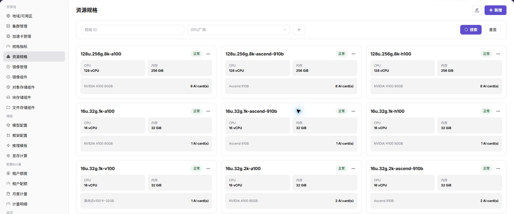
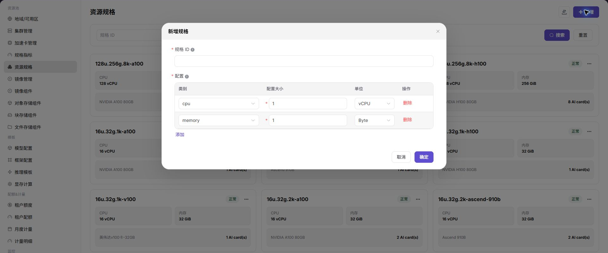

# 资源规格

::: info 文档信息
版本：v1.0
更新日期：2026-07-03
:::

::: warning 安全提示
文档、截图、工单和评论中不要写入真实账号、密码、token、AK/SK、私钥、证书、完整 kubeconfig、内部访问地址或业务敏感信息。
:::

## 功能概述

`资源规格` 用于维护用户创建作业时可选择的资源套餐，组合 CPU、内存和 AI 加速卡等指标。

| 项目 | 内容 |
| --- | --- |
| 适用角色 | 运营方 |
| 导航路径 | 资源池 > 资源规格 |
| 页面路由 | /powerone/resourcepool/flavor/list |
| 管理对象 | 规格名称、CPU、内存、加速卡指标、数量、状态和复制创建关系 |
| 典型用途 | 定义作业资源套餐、限制用户资源申请范围、与集群关联后开放给作业使用 |

### 新手理解

- **资源规格** 像资源套餐，用户创建作业时选择它来申请资源。
- **规格指标** 是套餐里的原料，先有指标，才能组合成规格。
- **以此新增** 用于复制已有规格快速创建相似规格。

### 配置流程

1. 准备 CPU、内存和加速卡指标。
2. 新增资源规格，填写规格名称和指标数量。
3. 启用规格并关联到目标集群。
4. 创建测试作业确认规格可选且可调度。

### 术语速查

| 术语 | 说明 |
| --- | --- |
| 规格名称 | 用户端或作业创建页展示的资源套餐名称。 |
| CPU/内存 | 作业基础资源申请量。 |
| AI 加速卡 | 可选硬件资源，按指标和数量配置。 |
| 状态 | 决定规格是否可被后续流程使用。 |

## 前提条件

1. 已完成规格指标配置。
2. 如规格包含加速卡，已完成加速卡型号和指标关联。
3. 已规划规格命名、资源档位和适用作业类型。

## 页面说明

页面展示规格名称、状态、CPU、内存、加速卡类型和数量，可按 GPU 厂商筛选。

下图展示资源规格列表，卡片中可看到 CPU、内存和加速卡数量。

## 新增资源规格

### 适用场景

- 新增训练、推理或开发作业资源档位。
- 需要按 GPU 型号提供不同规格组合。

### 操作前确认

1. 确认规格指标已存在且状态可用。
2. 确认规格名称能体现 CPU、内存、卡型和卡数。

### 操作步骤

1. 进入 `资源池 > 资源规格`。
2. 点击 `新增`。
3. 填写规格名称。
4. 选择 CPU、内存和加速卡指标，并填写数量。
5. 确认状态和适用范围。
6. 点击 `确定` 保存。

下图展示新增资源规格入口，创建时应明确 CPU、内存和加速卡组合。

### 参数说明

| 字段名称 | 是否必填 | 字段类型 | 示例 | 说明 |
| --- | --- | --- | --- | --- |
| 规格名称 | 是 | 文本 | `gpu-a100-1-16c-64g` | 用户创建实例时选择的规格。 |
| CPU | 是 | 数字 | `16` | 规格包含的 CPU 核数。 |
| 内存 | 是 | 文本 | `64GiB` | 规格包含的内存。 |
| 加速卡 | 否 | 文本 | `A100 x 1` | 规格包含的加速卡。 |
| 关联集群 | 条件必填 | 多选 | `cluster-a` | 该规格可用的集群。 |
### 踩坑提示

- 规格过大可能导致用户作业长时间等待资源。
- 规格名称创建后若被大量引用，不建议频繁修改展示口径。

### 结果校验

1. 规格出现在列表中。
2. 目标集群详情中可关联该规格。
3. 用户创建作业时能选择该规格。

## 配置规则与影响

- **先指标后规格**：规格依赖规格指标。
- **再关联集群**：规格创建后还需关联到集群，用户才可能选到。
- **命名可读**：规格名称应便于容量排查和用户选择。

## 常见问题

### 资源规格在用户创建实例时不可选

**问题现象：**

资源规格已创建，但用户创建在线 IDE、运行实例或模型服务时看不到该规格。

**可能原因：**

- 规格未启用或被筛选条件排除。
- 规格没有关联到目标集群。
- 规格中的加速卡指标与集群实际上报资源 key 不一致。
- 租户配额或模板可见范围没有覆盖该规格。

**处理方式：**

1. 确认规格状态和名称。
2. 进入集群详情检查“已关联规格”。
3. 核对规格指标中的 k8s-key 和 selector-key。
4. 检查租户配额、模板规格范围和用户所选地域。

### 规格与集群未关联导致调度失败

**问题现象：**

用户能提交实例，但实例长时间排队或事件提示没有可用资源。

**可能原因：**

- 目标规格未关联到承载集群。
- 规格关联了集群，但集群资源余量不足。
- 用户选择的地域或可用区与关联集群不一致。

**处理方式：**

1. 在集群详情中为目标集群关联规格。
2. 查看集群、节点和设备监控确认余量。
3. 让用户重新选择正确地域或改用其他规格。

### 规格配置后资源用量口径不一致

**问题现象：**

规格显示的 CPU、内存或加速卡数量与监控、计量或实例事件不一致。

**可能原因：**

- 规格指标单位或数量填写不一致。
- 指标 key 与 Kubernetes 上报资源 key 不一致。
- 计量规则和规格展示口径不同步。

**处理方式：**

1. 核对规格指标、资源规格和计量规则。
2. 用测试实例确认实际申请资源。
3. 必要时统一指标单位和展示名称。

## 后续操作

1. 进入 `资源池 > 集群管理`，为目标集群关联规格。
2. 提交测试作业验证规格调度结果。

## 注意事项

- 资源规格一旦开放给用户，会直接影响模型实例、在线 IDE 和运行实例的创建选择。
- 修改规格名称、资源数量或启停状态前，先确认关联集群、模板、租户配额和运行中实例。
- 大规格可能导致排队时间增加，小规格可能导致任务启动后资源不足，应结合监控和失败案例校准。
- 禁用规格前先准备替代规格，并通知受影响租户或业务。
