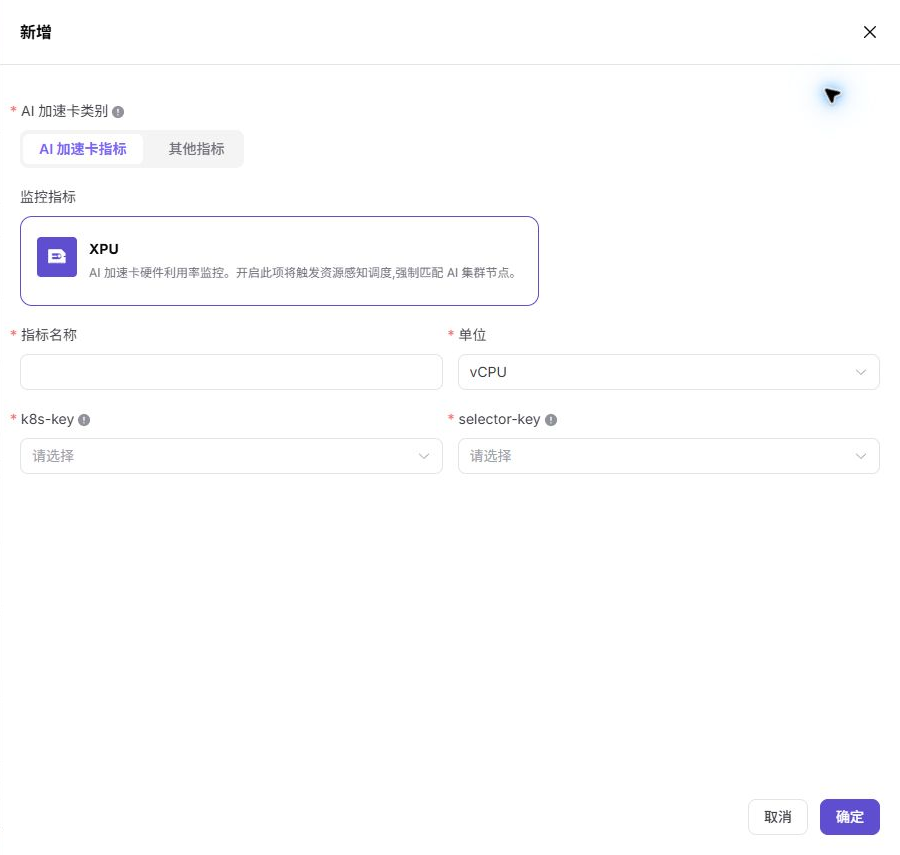

# 规格指标

::: info 文档信息
版本：v1.0
更新日期：2026-07-03
:::

::: warning 安全提示
文档、截图、工单和评论中不要写入真实账号、密码、token、AK/SK、私钥、证书、完整 kubeconfig、内部访问地址或业务敏感信息。
:::

## 功能概述

`规格指标` 用于维护资源规格可引用的基础指标，包括 CPU、内存和 AI 加速卡指标。指标决定资源规格如何映射到 Kubernetes 资源 key。

| 项目 | 内容 |
| --- | --- |
| 适用角色 | 运营方 |
| 导航路径 | 资源池 > 规格指标 |
| 页面路由 | /powerone/resourcepool/flavor/type |
| 管理对象 | CPU 指标、内存指标、AI 加速卡指标、k8s-key、selector-key 和单位 |
| 典型用途 | 定义资源规格字段、关联加速卡型号、支撑作业资源申请 |

### 新手理解

规格指标像规格表里的计量单位，决定 CPU、内存、GPU、显存等字段如何被识别、展示和统计。指标口径不统一时，用户看到的规格名称和实际调度资源就容易对不上。

### 配置流程

1. 确认集群上报的资源 key。
2. 创建 CPU、内存或加速卡指标。
3. 如为加速卡指标，关联对应加速卡型号。
4. 在资源规格中引用指标并验证作业调度。

### 术语速查

| 术语 | 说明 |
| --- | --- |
| 监控指标 | 平台资源监控中使用的指标类型。 |
| k8s-key | Kubernetes 调度资源 key，例如 `cpu`、`memory`、`nvidia.com/gpu`。 |
| selector-key | 加速卡型号筛选 key，用于区分同一 k8s-key 下的不同硬件。 |
| 单位 | 资源展示和计量单位，例如 vCPU、Byte、AI card(s)。 |

## 前提条件

1. 已确认目标集群资源上报口径。
2. 如需创建 AI 加速卡指标，已确认加速卡型号和 selector-key。
3. 当前账号具备规格指标维护权限。

## 页面说明

页面以卡片形式展示已配置指标，可按指标名称、AI 加速卡指标和其他指标筛选。

下图展示规格指标列表，可查看监控指标、k8s-key、selector-key 和单位。

## 新增规格指标

### 适用场景

- 新增硬件资源类型或需要把加速卡接入资源规格时。

### 操作前确认

1. 确认 k8s-key 与集群节点实际上报一致。
2. 确认单位和指标名称符合长期维护口径。

### 操作步骤

1. 进入 `资源池 > 规格指标`。
2. 点击 `新增`。
3. 选择 AI 加速卡指标或其他指标。
4. 填写指标名称、单位、k8s-key 和 selector-key。
5. 点击 `确定` 保存。

下图展示新增规格指标抽屉，AI 加速卡指标需要维护 k8s-key 和 selector-key。

### 参数说明

| 字段名称 | 是否必填 | 字段类型 | 示例 | 说明 |
| --- | --- | --- | --- | --- |
| 指标名称 | 是 | 文本 | `GPU` | 规格指标展示名称。 |
| 资源键 | 是 | 文本 | `nvidia.com/gpu` | 调度使用的资源键。 |
| 单位 | 是 | 文本 | `card` | 指标计量单位。 |
| 显示顺序 | 否 | 数字 | `10` | 页面展示顺序。 |
| 状态 | 是 | 枚举 | `启用` | 是否允许规格引用。 |
### 踩坑提示

- 不要为了展示方便随意修改 k8s-key。
- 已被资源规格引用的指标禁用前应确认影响范围。

### 结果校验

1. 指标出现在列表中。
2. 资源规格创建页可选择该指标。
3. 测试作业能按该指标申请资源。

## 配置规则与影响

- **指标先于规格**：资源规格必须引用已存在的规格指标。
- **禁用影响**：禁用指标可能影响资源规格和作业创建。
- **资源 key 优先级**：以集群实际上报的 key 为准，不以页面显示名为准。

## 常见问题

### 指标单位不一致

**问题现象：**

同一资源在规格、监控和计量页面中的单位或数量看起来不一致。

**可能原因：**

- 规格指标单位选择不正确。
- 内存、显存或磁盘使用了不同换算口径。
- 计量规则没有同步最新指标单位。

**处理方式：**

1. 确认指标单位，例如 vCPU、GiB、AI card(s)。
2. 对照集群资源上报和监控口径。
3. 同步调整资源规格和计量规则。

### k8s-key 填写后作业申请不到资源

**问题现象：**

指标已创建并被资源规格引用，但作业调度事件提示资源不存在或不足。

**可能原因：**

- k8s-key 与集群节点实际上报 key 不一致。
- selector-key 与加速卡型号标签不匹配。
- 目标节点没有上报该扩展资源。

**处理方式：**

1. 在集群节点资源中核对真实 key。
2. 检查设备插件和节点标签。
3. 修正指标后重新关联资源规格并提交测试作业。

### 已被引用的指标无法安全下线

**问题现象：**

准备禁用或删除指标时，不确定会影响哪些规格和作业。

**可能原因：**

- 指标已被多个资源规格引用。
- 规格已关联集群并被模板使用。
- 仍有运行中作业按该指标申请资源。

**处理方式：**

1. 先搜索引用该指标的资源规格。
2. 确认关联集群、模板和运行作业。
3. 在维护窗口内迁移规格后再禁用。

## 后续操作

1. 进入 `资源池 > 资源规格` 创建或调整规格。
2. 进入 `资源池 > 加速卡管理` 确认加速卡型号关联关系。

## 注意事项

- 指标单位、维度和 k8s-key 会影响资源规格、监控展示和计量口径，不能只按显示名称修改。
- 内存、显存、磁盘等容量类指标应统一 GiB、GB 或平台约定口径，避免计量偏差。
- 加速卡指标的 selector-key 应与节点实际上报标签一致。
- 已被规格引用的指标不要直接删除，先迁移规格并验证作业调度。
