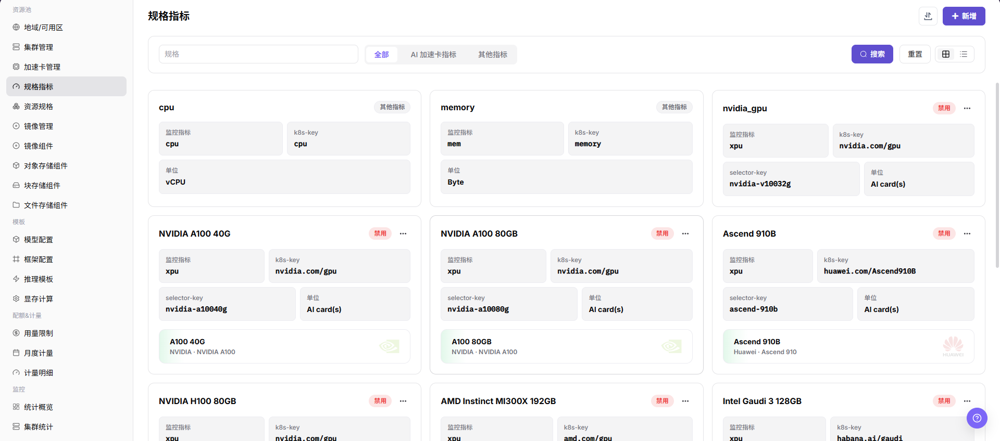
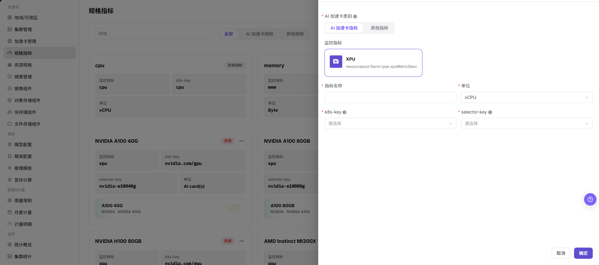

# 规格指标

::: info 文档信息
版本：v1.0
更新日期：2026-07-08
:::

## 功能概述

`规格指标` 用于维护资源规格可引用的基础指标，包括 CPU、内存、AI 加速卡指标和页面支持的其他资源指标。指标决定资源规格如何映射到 Kubernetes 资源 key，也会影响作业调度、监控展示和容量统计口径。

| 项目 | 内容 |
| --- | --- |
| 适用角色 | 运营方 |
| 导航路径 | AI Infra > On-Prem > 资源池管理 > 规格指标 |
| 页面路由 | /powerone/resourcepool/flavor/type |
| 管理对象 | 指标名称、指标类型、资源 key、单位、k8s-key、selector-key、监控指标和启用状态 |
| 典型用途 | 定义资源规格字段、关联加速卡型号、支撑作业资源申请和监控展示 |

#### 新手理解

规格指标像资源规格表里的计量单位。CPU、内存、GPU、显存等字段能否被正确识别、展示和统计，都依赖规格指标的定义。指标口径不统一时，用户看到的规格名称和实际调度资源就容易对不上。

#### 配置流程

1. 确认目标集群实际上报的资源 key、节点标签和监控指标口径。
2. 在 `规格指标` 中创建 CPU、内存、AI 加速卡指标或页面支持的其他指标。
3. 如为 AI 加速卡指标，核对加速卡型号、k8s-key 和 selector-key。
4. 在 `资源规格` 中引用该指标。
5. 使用测试作业验证资源申请、调度结果和监控展示。

#### 术语速查

| 术语 | 说明 |
| --- | --- |
| 指标名称 | 页面展示和资源规格引用的指标名称。 |
| 指标类型 | CPU、内存、AI 加速卡指标或页面提供的其他指标类型。 |
| 资源 key | 调度或计量时使用的资源标识。 |
| 单位 | 资源展示和计量单位，例如 vCPU、GiB、Byte、AI card(s)。 |
| k8s-key | Kubernetes 调度资源 key，例如 `cpu`、`memory`、`nvidia.com/gpu`。 |
| selector-key | 加速卡型号或节点标签筛选 key，用于区分同一 k8s-key 下的不同硬件。 |
| 监控指标 | 平台资源监控中使用的指标映射。 |
| 启用状态 | 指标是否可被资源规格、模板或作业流程引用。 |

## 前提条件

1. 当前账号具备运营方权限，并能进入 `AI Infra > On-Prem > 资源池管理 > 规格指标`。
2. 已确认目标集群资源上报口径，包括 k8s-key、selector-key、单位和监控指标映射。
3. 如需创建 AI 加速卡指标，已确认加速卡型号、节点标签和设备插件上报信息。
4. 已评估该指标是否会被资源规格、模板、作业调度或计量规则引用。
5. 学习或截图场景只查看页面字段和抽屉，不提交真实规格指标配置。

## 页面说明

页面以卡片形式展示已配置指标，可按指标名称、AI 加速卡指标和其他指标筛选。

下图展示规格指标列表，可查看监控指标、k8s-key、selector-key 和单位。

## 主要操作

### 新增规格指标

#### 适用场景

当需要新增硬件资源类型、维护 CPU/内存指标，或把 AI 加速卡接入资源规格和作业调度时，新增规格指标。

#### 操作步骤

1. 进入 `AI Infra > On-Prem > 资源池管理 > 规格指标`。
2. 点击 `新增` 或页面真实新增入口。
3. 选择指标类型，例如 CPU、内存、AI 加速卡指标或页面提供的其他指标类型。
4. 按页面字段填写指标名称、资源 key、单位、k8s-key、selector-key 或监控指标映射。
5. 如为 AI 加速卡指标，核对加速卡型号、selector-key 与集群节点实际上报标签是否一致。
6. 点击最终 `保存`、`提交` 或 `确定` 前，再次核对指标口径、单位和资源 key。
7. 如仅学习或验证页面，只查看字段和抽屉，不提交真实规格指标配置。

下图展示新增规格指标抽屉，AI 加速卡指标需要维护 k8s-key 和 selector-key。

## 参数说明

| 参数 | 是否必填 | 说明 | 配置要点 |
| --- | --- | --- | --- |
| 指标名称 | 必填 | 规格指标展示名称。 | 应体现资源类型和长期维护口径，避免临时命名。 |
| 指标类型 | 必填 | CPU、内存、AI 加速卡指标或页面支持的其他类型。 | 按真实资源类型选择，避免影响规格筛选和展示。 |
| 资源 key | 条件必填 | 调度或计量使用的资源标识。 | 与页面字段和平台口径保持一致。 |
| 单位 | 必填 | 指标计量单位。 | CPU、内存、显存、加速卡等单位需与监控和计量口径一致。 |
| k8s-key | 条件必填 | Kubernetes 调度资源 key。 | 必须与 Kubernetes 节点实际上报资源 key 一致。 |
| selector-key | 条件必填 | 加速卡型号、节点标签或设备筛选 key。 | 必须与加速卡型号或节点标签一致。 |
| 监控指标 | 条件必填 | 与资源监控对应的指标映射。 | 需与监控采集组件和展示口径一致。 |
| 加速卡型号 | 条件必填 | AI 加速卡指标关联的硬件型号。 | 与加速卡管理中的型号和节点上报标签保持一致。 |
| 启用状态 | 系统生成或可选 | 指标是否可被引用。 | 禁用前先确认资源规格、模板和运行作业引用情况。 |
| 操作 | 系统生成 | 页面提供的新增、编辑、启用、禁用等入口。 | 高风险动作前确认影响范围和回退方案。 |

## 踩坑提示

- 新增规格指标会影响资源规格、作业调度、监控展示和计量口径。
- k8s-key 必须与 Kubernetes 节点实际上报资源 key 一致，否则作业可能申请不到资源。
- selector-key 必须与加速卡型号或节点标签一致，否则 AI 加速卡指标可能无法正确匹配设备。
- 指标单位错误可能导致规格展示、容量统计或模板推荐偏差。
- 已被资源规格引用的指标禁用或删除前，应确认规格、模板和运行作业影响范围。
- `保存`、`提交`、`确定` 属于高风险最终动作，学习或截图时不要点击。

## 结果校验

| 检查项 | 成功表现 | 异常时处理 |
| --- | --- | --- |
| 页面可进入 | 能进入 `AI Infra > On-Prem > 资源池管理 > 规格指标`。 | 检查菜单配置和账号权限。 |
| 列表正常加载 | 指标卡片、筛选项、k8s-key、selector-key 和单位正常显示。 | 刷新页面并检查服务状态或浏览器控制台错误。 |
| 新增入口可见 | 页面显示 `新增` 或真实新增入口。 | 检查运营方权限和页面状态。 |
| 新增抽屉可打开 | 点击新增入口后可打开规格指标新增抽屉。 | 检查路由、权限和前端错误。 |
| 必填字段校验正常 | 缺少必填字段时页面显示校验提示。 | 按页面提示补齐字段，不使用真实内部参数做学习测试。 |
| 学习时未提交真实配置 | 仅查看字段和抽屉，没有点击最终 `保存`、`提交` 或 `确定`。 | 如误提交，立即通知平台管理员并按变更流程处理。 |
| 真实提交后记录可追踪 | 新指标出现在规格指标列表中。 | 核对筛选条件、启用状态和提交结果。 |
| 资源规格可引用 | 资源规格创建页可以选择该指标。 | 检查指标启用状态、k8s-key 和 selector-key。 |
| 测试作业可调度 | 测试作业能按该指标申请资源并正常调度。 | 核对 Kubernetes 节点上报、设备插件和资源规格配置。 |

## 配置规则与影响

- **指标先于规格**：资源规格必须引用已存在且可用的规格指标。
- **k8s-key 一致性**：以 Kubernetes 节点实际上报 key 为准，不以页面显示名称为准。
- **selector-key 一致性**：AI 加速卡指标的 selector-key 应与加速卡型号或节点标签一致。
- **单位一致性**：内存、显存、磁盘等容量类指标应统一 GiB、GB 或平台约定口径。
- **禁用影响**：禁用指标可能影响资源规格、模板推荐、作业创建和计量统计。
- **监控影响**：监控指标映射错误会导致资源监控展示异常或容量统计偏差。

## 常见问题

#### 指标单位不一致

**问题现象：**同一资源在规格、监控和计量页面中的单位或数量看起来不一致。

**处理方式：**

1. 确认指标单位，例如 vCPU、GiB、Byte、AI card(s)。
2. 对照集群资源上报和监控口径。
3. 同步调整资源规格、模板推荐和计量规则。
4. 使用测试作业确认展示与实际资源申请一致。

#### k8s-key 填写后作业申请不到资源

**问题现象：**指标已创建并被资源规格引用，但作业调度事件提示资源不存在或不足。

**处理方式：**

1. 在集群节点资源中核对真实 k8s-key。
2. 检查设备插件和节点标签是否正常上报。
3. 核对 selector-key 与加速卡型号或节点标签是否匹配。
4. 修正指标后重新关联资源规格并提交测试作业。

#### 已被引用的指标无法安全下线

**问题现象：**准备禁用或删除指标时，不确定会影响哪些规格和作业。

**处理方式：**

1. 先搜索引用该指标的资源规格。
2. 确认关联集群、模板和运行作业。
3. 在维护窗口内迁移规格后再禁用。
4. 禁用后使用测试作业确认新的指标和规格可正常调度。

## 后续操作

1. 进入 `资源池管理 > 资源规格` 创建或调整规格。
2. 进入 `资源池管理 > 加速卡管理` 确认加速卡型号关联关系。
3. 在测试作业中验证指标对应资源能被正常申请。
4. 回到规格指标列表确认启用状态、单位和筛选结果符合预期。

## 注意事项

- 新增规格指标会影响资源规格、作业调度、监控展示和计量口径。
- k8s-key、selector-key、单位和监控指标映射必须按真实集群和平台口径维护。
- 已被规格引用的指标不要直接删除，先迁移规格并验证作业调度。
- `保存`、`提交`、`确定` 属于高风险最终动作。
- 不写真实内部资源 key 映射、节点标签、集群 ID、资源池 ID、内网地址、账号、密钥、Token 或内部测试参数。
