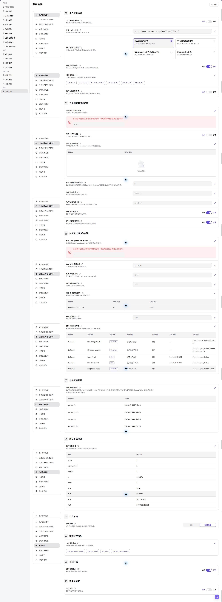
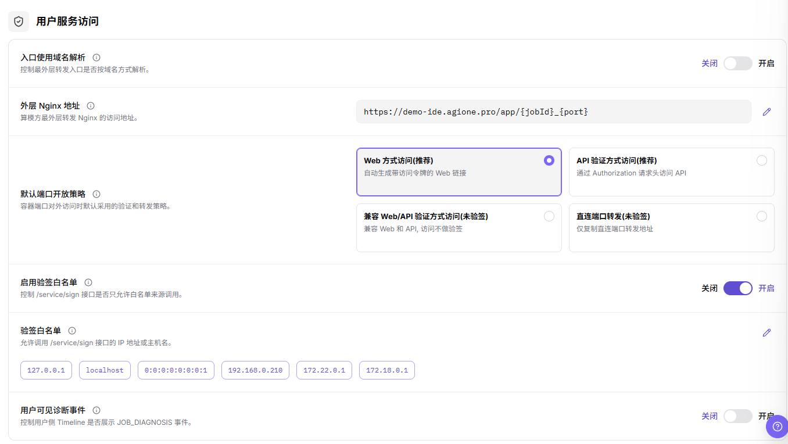
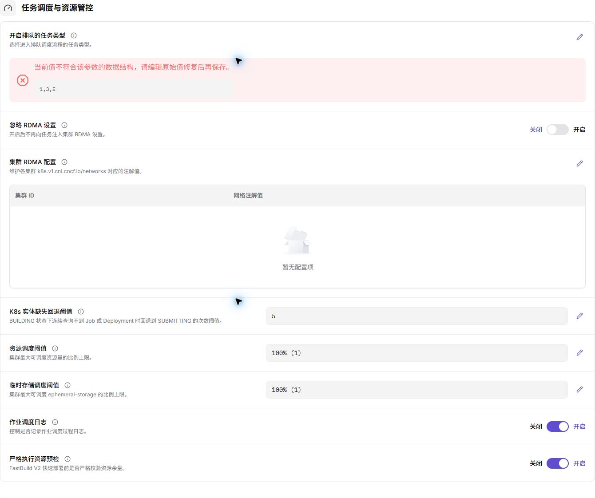
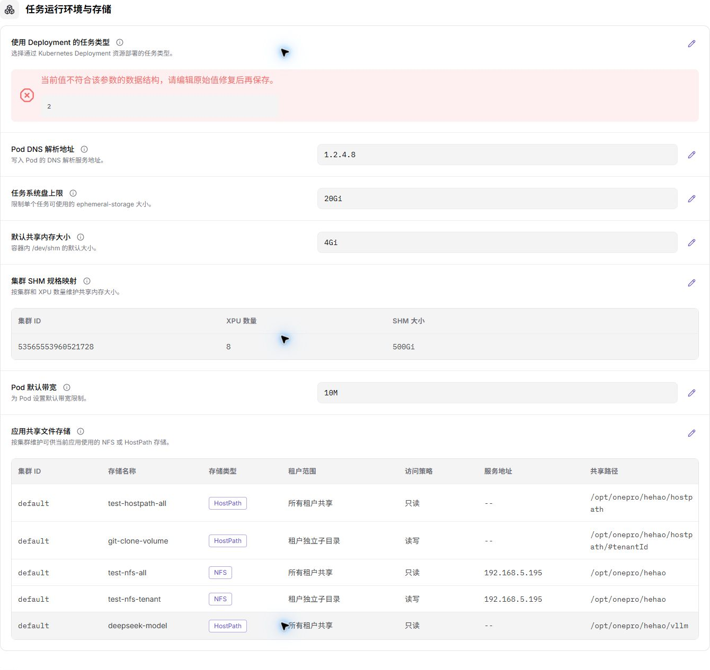
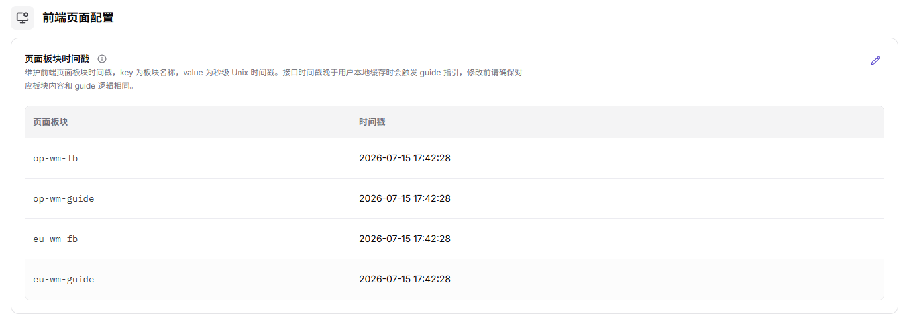
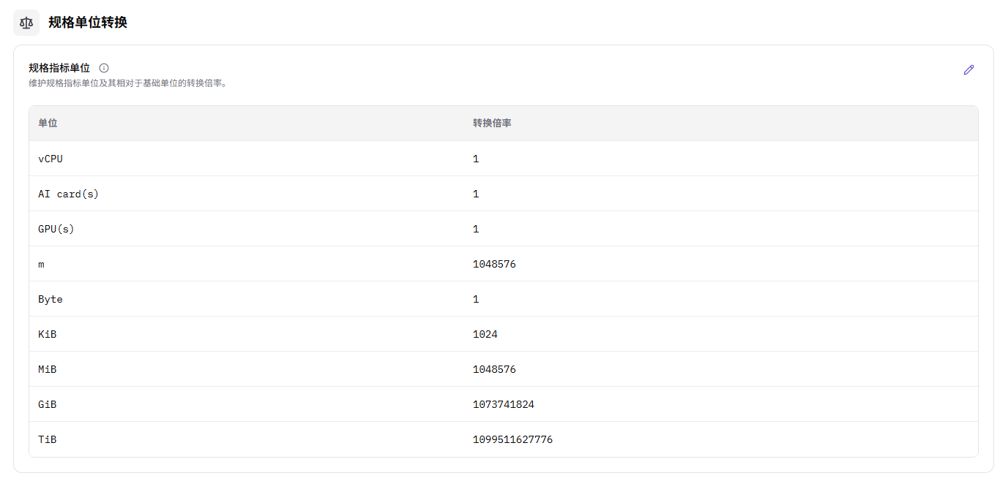

# 系统设置

::: info 文档信息
版本：v1.0
更新日期：2026-07-23
:::

## 功能概述

`系统设置` 用于查看系统级配置项及其当前状态。运营方可以通过该页面了解平台配置是否完整、是否启用，以及是否存在需要进一步确认的配置入口。

| 项目 | 内容 |
| --- | --- |
| 适用角色 | 运营方 |
| 导航路径 | AI基础设施 > On-Prem > 系统 > 系统设置 |
| 页面路由 | `/powerone/system/config-properties` |
| 管理对象 | 系统配置项、配置值、说明、状态和操作入口 |
| 典型途径 | 查看平台级配置、核对配置状态、定位系统配置入口 |

#### 新手理解

系统设置像平台的全局配置清单。这里的配置可能影响多个模块的默认行为、可用能力或展示逻辑，因此学习和截图时应以查看为主，不直接提交修改。

#### 术语速查

| 术语 | 说明 |
| --- | --- |
| 配置项 | 平台提供的系统级参数或开关。 |
| 配置值 | 当前配置项使用的值，可能包含开关、文本、枚举或数值。 |
| 状态 | 配置项当前是否启用、可用或生效。 |
| 操作入口 | 页面提供的查看、编辑或维护入口。 |

## 前提条件

1. 当前账号具备运营方权限。
2. 已进入正确的 On-Prem 环境和目标地域。
3. 已确认本次仅查看系统设置，或已具备对应变更审批。
4. 如仅学习或截图，只查看列表、字段和弹窗，不点击最终 `保存`、`提交` 或 `确定`。

## 页面说明

进入 `AI Infra > On-Prem > 系统 > 系统设置` 后，页面用于展示系统级配置项。列表通常用于查看配置项名称、配置值、说明、状态以及可能存在的操作入口。

如果页面提供 `编辑`、`保存`、`提交`、`确定` 等按钮，仅打开到字段查看层面，不执行最终动作。

## 主要操作

### 查看系统设置

#### 操作前确认

1. 确认当前环境、账号和地域符合查看目标。
2. 确认本次只查看配置，不修改真实配置值。
3. 如需要进入编辑弹窗或抽屉，只记录字段名称、按钮和提示信息，不记录真实配置值。

#### 操作步骤

1. 进入 `AI基础设施 > On-Prem > 系统 > 系统设置`。
2. 查看系统配置列表，确认页面路由为 `/powerone/system/config-properties`。
3. 查看配置项名称、配置值、说明、状态或操作入口。
4. 如页面提供搜索、筛选、刷新、展开、详情等查看类按钮，可用于缩小查看范围。
5. 如页面提供 `编辑` 或类似维护入口，只打开查看字段，不填写真实配置值。
6. 点击最终 `保存`、`提交` 或 `确定` 前必须停止，并再次确认变更审批、影响范围和回滚方案。
7. 如仅学习或截图，只查看列表、字段和弹窗，不提交真实系统配置。

##### 用户服务访问

1. 进入 `AI基础设施 > On-Prem > 系统 > 系统设置`。
2. 定位 `用户服务访问` 配置分组。
3. 查看配置项名称、配置值、说明、状态和操作入口。
4. 如需修改，只记录字段、行内编辑区域或弹窗，不在学习或截图场景点击最终 `保存`、`提交` 或 `确定`。

##### 任务调度与资源管控

::: details 补充截图文件

:::

1. 进入 `AI基础设施 > On-Prem > 系统 > 系统设置`。
2. 定位 `任务调度与资源管控` 配置分组。
3. 查看配置项名称、配置值、说明、状态和操作入口。
4. 如需修改，只记录字段、行内编辑区域或弹窗，不在学习或截图场景点击最终 `保存`、`提交` 或 `确定`。

##### 任务运行环境与存储

::: details 补充截图文件

:::

1. 进入 `AI基础设施 > On-Prem > 系统 > 系统设置`。
2. 定位 `任务运行环境与存储` 配置分组。
3. 查看配置项名称、配置值、说明、状态和操作入口。
4. 如需修改，只记录字段、行内编辑区域或弹窗，不在学习或截图场景点击最终 `保存`、`提交` 或 `确定`。

##### 前端页面配置

::: details 补充截图文件

:::

1. 进入 `AI基础设施 > On-Prem > 系统 > 系统设置`。
2. 定位 `前端页面配置` 配置分组。
3. 查看配置项名称、配置值、说明、状态和操作入口。
4. 如需修改，只记录字段、行内编辑区域或弹窗，不在学习或截图场景点击最终 `保存`、`提交` 或 `确定`。

##### 规格单位转换

::: details 补充截图文件

:::

1. 进入 `AI基础设施 > On-Prem > 系统 > 系统设置`。
2. 定位 `规格单位转换` 配置分组。
3. 查看配置项名称、配置值、说明、状态和操作入口。
4. 如需修改，只记录字段、行内编辑区域或弹窗，不在学习或截图场景点击最终 `保存`、`提交` 或 `确定`。

##### 计费策略

1. 进入 `AI基础设施 > On-Prem > 系统 > 系统设置`。
2. 定位 `计费策略` 配置分组。
3. 查看配置项名称、配置值、说明、状态和操作入口。
4. 如需修改，只记录字段、行内编辑区域或弹窗，不在学习或截图场景点击最终 `保存`、`提交` 或 `确定`。

##### 集群监控指标

1. 进入 `AI基础设施 > On-Prem > 系统 > 系统设置`。
2. 定位 `集群监控指标` 配置分组。
3. 查看配置项名称、配置值、说明、状态和操作入口。
4. 如需修改，只记录字段、行内编辑区域或弹窗，不在学习或截图场景点击最终 `保存`、`提交` 或 `确定`。

##### 功能开放

1. 进入 `AI基础设施 > On-Prem > 系统 > 系统设置`。
2. 定位 `功能开放` 配置分组。
3. 查看配置项名称、配置值、说明、状态和操作入口。
4. 如需修改，只记录字段、行内编辑区域或弹窗，不在学习或截图场景点击最终 `保存`、`提交` 或 `确定`。

##### 容灾与恢复

1. 进入 `AI基础设施 > On-Prem > 系统 > 系统设置`。
2. 定位 `容灾与恢复` 配置分组。
3. 查看配置项名称、配置值、说明、状态和操作入口。
4. 如需修改，只记录字段、行内编辑区域或弹窗，不在学习或截图场景点击最终 `保存`、`提交` 或 `确定`。

## 参数说明

| 字段名称 | 是否必填 | 字段类型 | 示例 | 说明 |
| --- | --- | --- | --- | --- |
| 配置项名称 | 视配置项而定 | 系统字段 | `示例名称` | 标识系统级配置项。 |
| 配置值 | 视配置项而定 | 文本 / 开关 / 枚举 / 数值 | `true` | 当前配置项使用的值，不应在文档或截图中写入真实敏感值。 |
| 说明 | 视配置项而定 | 文本 | `功能开关说明` | 描述配置项用途和影响范围。 |
| 状态 | 视配置项而定 | 状态 | `启用` | 展示配置项是否启用、可用或生效。 |
| 操作 | 视配置项而定 | 操作入口 | `编辑` | 查看、编辑或维护配置项的入口。 |

## 踩坑提示

- 系统设置可能影响全局平台行为，修改前必须确认影响范围。
- `保存`、`提交`、`确定` 属于高风险最终动作，学习或截图时不点击。
- 功能开放、计费策略、容灾恢复、调度与资源管控配置错误，可能影响用户访问、任务调度、计费结果和恢复能力。
- 不写真实配置值、Token、AK/SK、内部 Endpoint、租户信息、账号、密钥或测试参数。
- 如果配置项涉及认证、网络、计费、调度或资源治理，修改前需要通过内部变更流程确认。
- 只读学习时可以查看字段和弹窗，但不要输入真实值或触发最终提交。

## 结果校验

| 检查项 | 成功表现 | 异常时处理 |
| --- | --- | --- |
| 页面可进入 | `系统设置` 页面正常打开，路由为 `/powerone/system/config-properties` | 检查账号权限、环境入口和左侧菜单 |
| 列表可查看 | 页面展示系统配置列表或空状态 | 检查系统配置是否已初始化 |
| 字段可识别 | 可查看配置项名称、配置值、说明、状态或操作入口 | 对照真实 UI 字段补充文档 |
| 高风险动作未执行 | 学习或截图场景未点击 `保存`、`提交` 或 `确定` | 如误触发，按内部变更流程复核影响 |

## 常见问题

#### 页面列表为空

**问题现象：**

进入系统设置后，页面没有显示配置项。

**可能原因：**

- 当前账号没有查看系统配置的权限。
- 当前环境尚未初始化系统配置。
- 页面筛选条件过窄或数据加载失败。

**处理方式：**

1. 检查当前账号和环境是否正确。
2. 清空筛选条件后刷新页面。
3. 联系平台管理员确认系统配置是否已初始化。

## 后续操作

1. 如发现配置缺失，先记录配置项名称和页面位置，再走内部确认流程。
2. 如需要修改配置，先确认影响范围、审批记录和回滚方案。
3. 修改后应回到受影响模块验证页面、任务或服务行为是否符合预期。

## 注意事项

- 系统设置属于平台级配置入口，不应作为普通页面随意修改。
- 系统设置会影响平台全局行为，正式变更前应确认影响范围、审批记录和回滚方案。
- 文档、截图或工单中不要写入真实配置值、密钥、Token、内部 Endpoint、账号或租户信息。
- 对外传递页面信息前，应先对配置值和内部标识做脱敏处理。
