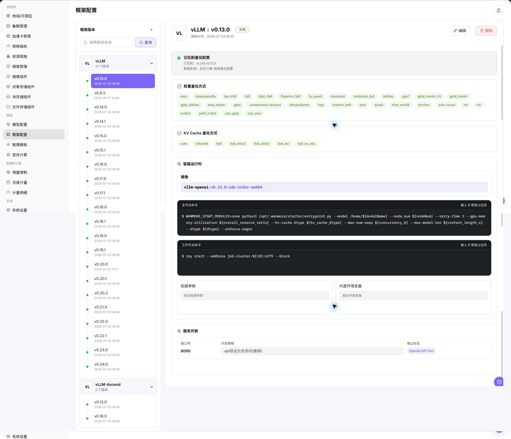
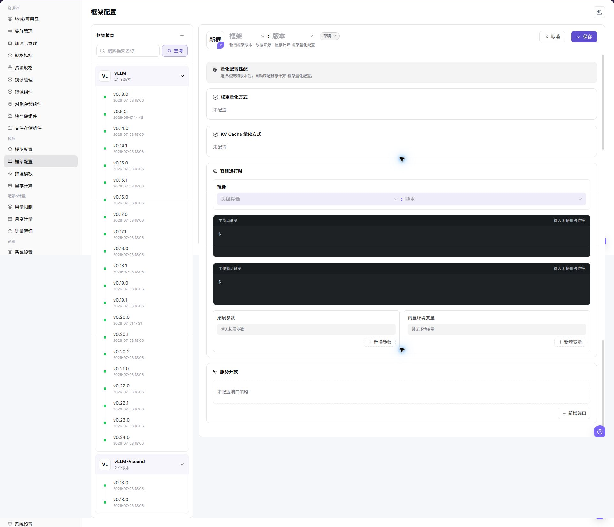

# 框架配置

::: info 文档信息
版本：v1.0
更新日期：2026-07-08
:::

## 功能概述

`框架配置` 通过预设容器镜像、启动命令、网络策略、环境变量等核心参数，为快速推理服务提供统一且可复用的部署环境模板。它用于简化推理任务的集群化部署流程，保证运行环境一致，并支持在不同资源基础设施之间灵活调度。

| 项目 | 内容 |
| --- | --- |
| 适用角色 | 运营方 |
| 导航路径 | AI基础设施 > On-Prem > 模板 > 框架配置 |
| 页面路由 | `/powerone/fast-build-v2/frameworks` |
| 管理对象 | 框架名称、版本名称、镜像、主节点启动命令、子节点启动命令、扩展参数、环境变量、端口开放策略、端口标签和成功创建提示 |
| 典型途径 | 为推理模板提供可复用的部署环境模板 |

#### 新手理解

框架配置像模型服务的标准启动手册：先写清使用哪个容器镜像、主节点和子节点分别执行什么启动命令、开放哪些端口、注入哪些环境变量，以及创建成功后给用户展示什么提示。后续用户通过推理模板部署模型时，平台会按这份配置自动组装运行环境。

#### 术语速查

| 术语 | 说明 |
| --- | --- |
| 框架配置 | 由容器镜像、启动命令、网络策略、环境变量等核心参数组成的可复用部署环境模板。 |
| 框架名称 | 底层使用的推理框架或引擎名称，建议采用官方框架命名，例如 `VLLM`、`TensorRT`、`Triton Inference Server`。 |
| 版本名称 | 框架配置的版本标识，用于跟踪迭代或兼容性管理，可与底层框架版本号对齐，也可使用内部场景命名。 |
| 镜像 | 运行推理任务所需的容器镜像，包含操作系统、依赖库及框架本身。 |
| 主节点启动命令 | 快速部署推理模型时任务集群中主节点的启动命令；单节点任务时直接作为该节点的启动命令。 |
| 子节点启动命令 | 推理任务集群中 Worker 节点的启动命令，适用于分布式推理场景。 |
| 扩展参数 | 用于动态补充或调整启动命令的键值对参数，可单独作为占位符，也可通过 `${extraParamString}` 或 `${prefixExtraParamString}` 拼接注入命令。 |
| 环境变量 | 容器启动时注入的预设键值配置，例如 `LOG_LEVEL=DEBUG`、`CUDA_VISIBLE_DEVICES=0`。 |
| 端口开放策略 | 推理服务部署成功后，网络端口的默认公开暴露方式及访问认证机制。 |
| 端口标签 | 为开放端口附加的语义化标签，用于标识协议类型或用途。 |
| 成功创建提示 | 任务集群创建完成后向用户展示的提示信息，支持 Markdown 和占位符。 |
| 参数占位符 | 在启动命令或成功创建提示中使用的变量，作业创建时由平台替换为实际参数。 |

#### 地域可用性说明

框架配置中的镜像通常托管于地域特定的镜像仓库，因此配置可用性受地域影响。快速部署选择框架时，平台会根据所选地域过滤可用框架配置；维护框架前应确认目标地域存在可用镜像仓库，且集群能够拉取对应镜像。

## 前提条件

1. 框架镜像已准备，并能被目标地域和目标集群拉取。
2. 已明确框架支持的模型类型、量化方式、端口、主节点启动命令和子节点启动命令。
3. 已规划扩展参数、环境变量、端口开放策略、端口标签和成功创建提示。
4. 已确认启动命令、环境变量、扩展参数和提示文本不会泄露真实密钥、token、AK/SK、私钥或内部下载地址。
5. 当前账号具备模板管理权限。

## 页面说明

页面展示框架配置列表，可维护框架基础信息、镜像版本、启动命令和配置参数。

## 主要操作

### 添加框架/版本

#### 操作前确认

1. 已确认框架所需容器镜像、基础依赖和镜像所在地域。
2. 已确认主节点启动命令、子节点启动命令和单节点场景下的启动方式。
3. 已确认服务端口、端口开放策略、端口标签和访问认证方式。
4. 已确认扩展参数、环境变量和占位符均使用脱敏值。
5. 已确认框架适配的模型类型、推理协议和资源规格。

#### 操作步骤

1. 进入 `AI Infra > On-Prem > 模板 > 框架配置`。
2. 点击 `新增`、`添加框架` 或页面真实新增入口。
3. 在基础信息区域填写框架名称、版本名称、描述和支持场景。
4. 选择或填写框架镜像，确认镜像所在地域、目标集群和镜像仓库拉取权限。
5. 配置主节点启动命令和子节点启动命令，确认命令以前台进程运行。
6. 按页面要求维护扩展参数、环境变量和占位符引用。
7. 配置服务端口、端口开放策略、端口标签和健康检查。
8. 配置成功创建提示，说明访问方式和后续操作，但不写真实凭据或内部地址。
9. 点击最终 `保存`、`提交` 或 `确定` 前，再次核对镜像、启动命令、端口、认证策略和地域可用性。
10. 如仅学习或截图，只查看字段和页面，不提交真实框架配置。

下图展示添加框架/版本页面，用于填写基础信息、运行配置、端口策略和提示信息。

## 参数说明

| 参数 | 是否必填 | 说明 | 配置建议 |
| --- | --- | --- | --- |
| 框架名称 | 必填 | 底层使用的推理框架或引擎名称。 | 建议采用官方框架命名，便于识别和技术对接。 |
| 版本名称 | 必填 | 框架配置的版本标识，用于跟踪迭代或兼容性管理。 | 可与底层框架版本号对齐，也可使用内部场景命名。 |
| 镜像 | 必填 | 运行推理任务所需的容器镜像。 | 使用占位说明即可，不写真实镜像仓库地址。 |
| 镜像地域 | 条件必填 | 镜像所在地域或可拉取范围。 | 与目标地域、集群网络和镜像仓库权限保持一致。 |
| 主节点启动命令 | 必填 | 任务集群中主节点的启动命令；单节点任务时直接作为该节点启动命令。 | 命令必须以前台进程运行，避免容器启动后立即退出。 |
| 子节点启动命令 | 分布式场景必填 | Worker 节点的启动命令，适用于分布式推理。 | 与主节点通信方式、调度拓扑和框架版本匹配。 |
| 扩展参数 | 否 | 动态补充或调整启动命令的参数，可通过占位符注入命令。 | 不写真实 Token、AK/SK、私钥、密码或内部地址。 |
| 环境变量 | 否 | 容器启动时注入的预设环境变量。 | 只填写非敏感变量，敏感值使用平台凭据或 Secret 机制。 |
| 服务端口 | 必填 | 平台探测、路由或暴露服务时使用的监听端口。 | 必须与框架实际监听端口一致。 |
| 端口开放策略 | 条件必填 | 端口的默认公开暴露方式及访问认证机制。 | 面向外部或跨租户访问时不要选择无认证策略。 |
| 端口标签 | 否 | 用于标识端口协议类型或用途。 | 系统预定义标签可生成对应访问帮助文档。 |
| 健康检查 | 条件必填 | 用于判断框架服务是否启动成功的路径或命令。 | 与实际服务路径、端口和启动时延匹配。 |
| 成功创建提示 | 否 | 任务集群创建完成后展示给用户的提示信息，支持 Markdown 和占位符。 | 可写访问方式和后续操作，不写真实凭据或内部 Endpoint。 |
| 参数占位符 | 否 | 启动命令、扩展参数和成功创建提示中可引用的变量。 | 使用平台支持的占位符名称，避免手写不存在的变量。 |
| 操作 | 系统生成 | 新增、编辑、保存、提交、确定等页面操作。 | `保存`、`提交`、`确定` 属于高风险最终动作。 |

#### 端口开放策略和端口标签

| 配置项 | 取值 | 说明 |
| --- | --- | --- |
| 端口开放策略 | `web方式访问` | 提供基于 Web 的访问入口，访问时携带时效性安全令牌 `wmtoken`。 |
| 端口开放策略 | `api验证方式访问` | 提供原生 API 访问端点，请求头 `Authorization` 需要携带有效签名信息。 |
| 端口开放策略 | `兼容web/api验证方式访问` | 端口不启用身份验证，应仅在可信网络或测试场景使用。 |
| 端口开放策略 | `直连端口转发` | 端口不启用身份验证，通过集群节点 IP 与映射端口访问，适合内部调试或特定网络架构。 |
| 端口标签 | `OpenAI API Port` | 标识兼容 OpenAI API 格式的推理服务，系统会生成对应 API 调用帮助文档。 |
| 端口标签 | `Ollama API Port` | 标识兼容 Ollama API 格式的推理服务，系统会生成对应 Ollama API 使用指南。 |
| 端口标签 | `自定义` | 用于内部备注或特殊协议标识，不触发系统自动文档生成。 |

#### 参数占位符说明

启动命令、扩展参数和成功创建提示可使用占位符。作业创建时，平台会把占位符替换为实际任务集群参数。

| 占位符 | 说明 |
| --- | --- |
| `${regionId}` | 任务集群被分配的地域 ID。 |
| `${zoneId}` | 任务集群被分配的可用区 ID。 |
| `${name}` | 任务集群名称。 |
| `${flavorId}` | 任务集群使用的规格 ID。 |
| `${image}` | 任务集群使用的镜像。 |
| `${envs}` | 环境变量。 |
| `${useRdma}` | 是否使用 RDMA 网络。 |
| `${openSsh}` | 是否开启 SSH。 |
| `${startCommand}` | 启动命令对象，包含主节点和子节点命令。 |
| `${clusterId}` | 任务被分配的集群 ID。 |
| `${portOpenPolicy}` | 端口开放策略。 |
| `${portTag}` | 开放端口的端口标签。 |
| `${jobType}` | 任务部署类型。 |
| `${modelName}` | 快速部署模型名称。 |
| `${frame}` | 快速部署框架名称。 |
| `${frameVersion}` | 快速部署框架版本。 |
| `${extraParamString}` | 扩展参数拼接字符串，参数名不添加 `--` 前缀。 |
| `${prefixExtraParamString}` | 扩展参数拼接字符串，参数名添加 `--` 前缀。 |
| `${vendor}` | 模型厂商。 |
| `${supportModelClusterIds}` | 支持当前模型的集群 ID 列表。 |

## 踩坑提示

- 启动命令必须能以前台进程运行，避免容器启动后立即退出。
- 服务端口要与框架实际监听端口一致，否则健康检查或访问入口会失败。
- 镜像必须包含框架依赖、模型加载依赖和必要系统库。
- 镜像地域、镜像仓库权限、目标集群网络不一致会导致镜像拉取失败。
- 无认证端口开放策略可能扩大真实服务暴露范围，面向外部或跨租户访问时不要选择无认证策略。
- 环境变量、扩展参数、成功创建提示不能包含真实 Token、AK/SK、私钥、密码或内部 Endpoint。
- `保存 / Save`、`提交 / Submit`、`确定 / OK` 属于高风险最终动作，学习或截图时不要点击。

## 结果校验

| 检查项 | 成功表现 | 异常时处理 |
| --- | --- | --- |
| 页面可进入 | 能进入 `AI Infra > On-Prem > 模板 > 框架配置`。 | 检查菜单配置、账号权限和前端路由。 |
| 框架/版本出现在列表中 | 新增或维护后的框架版本出现在列表中。 | 检查筛选条件、保存结果、启用状态和版本配置。 |
| 推理模板可以选择该框架 | 推理模板配置中可以选择该框架和版本。 | 检查框架状态、模型类型、镜像地域和模板筛选条件。 |
| 镜像可拉取 | 使用该框架创建服务时，目标集群能够拉取镜像。 | 检查镜像地域、仓库权限、网络连通性和镜像地址。 |
| 启动命令可执行 | 主节点或子节点启动命令能以前台进程正常运行。 | 检查命令、依赖、工作目录、环境变量和日志。 |
| 端口可访问或健康检查通过 | 服务端口可访问，或健康检查返回预期结果。 | 检查监听地址、端口开放策略、端口标签和健康检查路径。 |
| 成功创建提示占位符可替换 | 成功创建提示中的占位符能够被替换为实际任务参数。 | 检查占位符名称、支持范围和使用位置。 |
| 仅学习时未提交真实配置 | 学习或截图时未点击最终 `保存`、`提交` 或 `确定`。 | 如误提交，立即核对框架列表、模板引用和服务暴露范围。 |

## 常见问题

#### 推理模板中选不到框架

**问题现象：**

配置推理模板时，框架下拉列表没有目标框架。

**可能原因：**

- 框架未启用或版本不可用。
- 框架支持的模型类型与当前模型不匹配。
- 框架镜像所在地域与当前部署地域不匹配。
- 框架镜像或配置未通过校验。

**处理方式：**

1. 检查框架状态和版本。
2. 确认模型类型、量化方式和框架支持范围。
3. 核对目标地域是否存在可用镜像仓库和对应镜像。
4. 保存框架配置后重新进入推理模板。

#### 服务启动后端口不可访问

**问题现象：**

模型实例运行中，但访问服务端口失败。

**可能原因：**

- 框架监听端口与模板端口不一致。
- 启动命令没有绑定 `0.0.0.0`。
- 端口开放策略或端口标签配置不符合访问方式。
- 容器启动成功但服务进程异常退出。

**处理方式：**

1. 核对框架端口和推理模板端口。
2. 检查启动命令和日志。
3. 确认端口开放策略、端口标签和访问认证方式。
4. 确认服务监听地址和健康检查配置。

#### 占位符没有被正确替换

**问题现象：**

服务启动失败，或成功创建提示中仍显示 `${...}` 形式的变量。

**可能原因：**

- 占位符名称拼写错误。
- 占位符使用位置不支持该变量。
- 扩展参数没有按 `${extraParamString}` 或 `${prefixExtraParamString}` 注入启动命令。

**处理方式：**

1. 对照参数占位符说明检查变量名称。
2. 检查启动命令、扩展参数和成功创建提示中的占位符位置。
3. 用测试模型创建服务，验证实际替换结果。

## 后续操作

1. 在 [推理模板](../inference-templates/) 中引用框架。
2. 使用测试模型验证镜像、命令、端口、扩展参数和占位符。
3. 将框架变更纳入版本记录，避免影响已有模板。

## 注意事项

- 不要把密钥写入环境变量示例、扩展参数、成功创建提示或截图。
- 修改框架镜像、端口开放策略或启动命令前，先确认使用该框架的模板和实例影响范围。
- 镜像与地域存在关联，新增地域或迁移镜像后应重新验证框架可用性。
