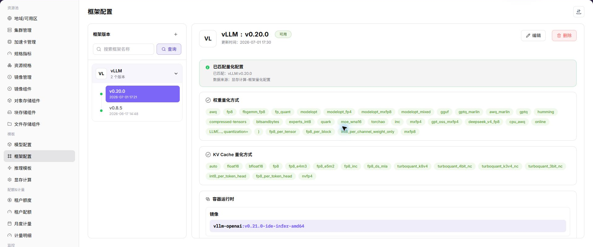

# 框架配置

::: info 文档信息
版本：v1.0
更新日期：2026-07-08
:::

## 功能概述

`框架配置` 通过预设容器镜像、启动命令、网络策略、环境变量等核心参数，为快速推理服务提供统一且可复用的部署环境模板。它用于简化推理任务的集群化部署流程，保证运行环境一致，并支持在不同资源基础设施之间灵活调度。

| 项目 | 内容 |
| --- | --- |
| 适用角色 | 运营方 |
| 导航路径 | 模板 > 框架配置 |
| 页面路由 | `/powerone/fast-build-v2/frameworks` |
| 管理对象 | 框架名称、版本名称、镜像、主节点启动命令、子节点启动命令、扩展参数、环境变量、端口开放策略、端口标签和成功创建提示 |
| 典型用途 | 为推理模板提供可复用的部署环境模板 |

### 新手理解

框架配置像模型服务的标准启动手册：先写清使用哪个容器镜像、主节点和子节点分别执行什么启动命令、开放哪些端口、注入哪些环境变量，以及创建成功后给用户展示什么提示。后续用户通过推理模板部署模型时，平台会按这份配置自动组装运行环境。

### 术语速查

| 术语 | 说明 |
| --- | --- |
| 框架配置 | 由容器镜像、启动命令、网络策略、环境变量等核心参数组成的可复用部署环境模板。 |
| 框架名称 | 底层使用的推理框架或引擎名称，建议采用官方框架命名，例如 `VLLM`、`TensorRT`、`Triton Inference Server`。 |
| 版本名称 | 框架配置的版本标识，用于跟踪迭代或兼容性管理，可与底层框架版本号对齐，也可使用内部场景命名。 |
| 镜像 | 运行推理任务所需的容器镜像，包含操作系统、依赖库及框架本身。 |
| 主节点启动命令 | 快速部署推理模型时任务集群中主节点的启动命令；单节点任务时直接作为该节点的启动命令。 |
| 子节点启动命令 | 推理任务集群中 Worker 节点的启动命令，适用于分布式推理场景。 |
| 扩展参数 | 用于动态补充或调整启动命令的键值对参数，可单独作为占位符，也可通过 `${extraParamString}` 或 `${prefixExtraParamString}` 拼接注入命令。 |
| 环境变量 | 容器启动时注入的预设键值配置，例如 `LOG_LEVEL=DEBUG`、`CUDA_VISIBLE_DEVICES=0`。 |
| 端口开放策略 | 推理服务部署成功后，网络端口的默认公开暴露方式及访问认证机制。 |
| 端口标签 | 为开放端口附加的语义化标签，用于标识协议类型或用途。 |
| 成功创建提示 | 任务集群创建完成后向用户展示的提示信息，支持 Markdown 和占位符。 |
| 参数占位符 | 在启动命令或成功创建提示中使用的变量，作业创建时由平台替换为实际参数。 |

### 地域可用性说明

框架配置中的镜像通常托管于地域特定的镜像仓库，因此配置可用性受地域影响。快速部署选择框架时，平台会根据所选地域过滤可用框架配置；维护框架前应确认目标地域存在可用镜像仓库，且集群能够拉取对应镜像。

## 前提条件

1. 框架镜像已准备，并能被目标地域和目标集群拉取。
2. 已明确框架支持的模型类型、量化方式、端口、主节点启动命令和子节点启动命令。
3. 已规划扩展参数、环境变量、端口开放策略、端口标签和成功创建提示。
4. 已确认启动命令、环境变量、扩展参数和提示文本不会泄露真实密钥、token、AK/SK、私钥或内部下载地址。
5. 当前账号具备模板管理权限。

## 页面说明

页面展示框架配置列表，可维护框架基础信息、镜像版本、启动命令和配置参数。

## 主要操作

### 添加或维护框架

#### 操作前确认

1. 已确认框架所需容器镜像、基础依赖和镜像所在地域。
2. 已确认主节点启动命令、子节点启动命令和单节点场景下的启动方式。
3. 已确认服务端口、端口开放策略、端口标签和访问认证方式。
4. 已确认扩展参数、环境变量和占位符均使用脱敏值。
5. 已确认框架适配的模型类型、推理协议和资源规格。

#### 操作步骤

1. 进入 `模板 > 框架配置`。
2. 点击新增、编辑或页面提供的维护入口。
3. 在基础信息 Tab 中填写框架名称、版本名称、描述和支持场景。
4. 在运行配置 Tab 中选择镜像，配置主节点启动命令、子节点启动命令、环境变量和扩展参数。
5. 在端口或网络配置区域维护服务端口、端口开放策略和端口标签。
6. 在提示信息区域维护成功创建提示，按需引用参数占位符。
7. 保存后在推理模板中引用该框架。

#### 参数说明

| 字段名称 | 是否必填 | 字段类型 | 示例 | 说明 |
| --- | --- | --- | --- | --- |
| 框架名称 | 必填 | 文本 | `VLLM` | 底层使用的推理框架或引擎名称，建议采用官方框架命名，便于识别和技术对接。 |
| 版本名称 | 必填 | 文本 | `v1.3.0` | 框架配置的版本标识，用于跟踪迭代或兼容性管理。 |
| 镜像 | 必填 | 镜像地址 | `registry.example.com/runtime/vllm:1.0` | 运行推理任务所需的容器镜像。镜像与地域存在关联，需确保目标地域可用。 |
| 主节点启动命令 | 必填 | 命令行 | `python -m vllm.entrypoints.openai.api_server` | 任务集群中主节点的启动命令；单节点任务时直接作为该节点启动命令。 |
| 子节点启动命令 | 分布式场景必填 | 命令行 | `ray start --address ... --block` | Worker 节点的启动命令，适用于分布式推理。 |
| 扩展参数 | 否 | 键值对 | `max_model_len=8192` | 动态补充或调整启动命令的参数，可通过占位符注入命令。 |
| 环境变量 | 否 | 键值对 | `HF_HOME=/models/cache` | 容器启动时注入的预设环境变量。 |
| 服务端口 | 必填 | 数字 | `8000` | 平台探测、路由或暴露服务时使用的监听端口。 |
| 端口开放策略 | 条件必填 | 枚举 | `api验证方式访问` | 端口的默认公开暴露方式及访问认证机制。 |
| 端口标签 | 否 | 枚举 / 文本 | `OpenAI API Port` | 用于标识端口协议类型或用途；系统预定义标签可生成对应访问帮助文档。 |
| 健康检查 | 条件必填 | 路径 / 命令 | `/health` | 用于判断框架服务是否启动成功。 |
| 成功创建提示 | 否 | Markdown 文本 | `服务已创建，可通过 ${modelName} 访问。` | 任务集群创建完成后展示给用户的提示信息，支持 Markdown 和占位符。 |

#### 端口开放策略和端口标签

| 配置项 | 取值 | 说明 |
| --- | --- | --- |
| 端口开放策略 | `web方式访问` | 提供基于 Web 的访问入口，访问时携带时效性安全令牌 `wmtoken`。 |
| 端口开放策略 | `api验证方式访问` | 提供原生 API 访问端点，请求头 `Authorization` 需要携带有效签名信息。 |
| 端口开放策略 | `兼容web/api验证方式访问` | 端口不启用身份验证，应仅在可信网络或测试场景使用。 |
| 端口开放策略 | `直连端口转发` | 端口不启用身份验证，通过集群节点 IP 与映射端口访问，适合内部调试或特定网络架构。 |
| 端口标签 | `OpenAI API Port` | 标识兼容 OpenAI API 格式的推理服务，系统会生成对应 API 调用帮助文档。 |
| 端口标签 | `Ollama API Port` | 标识兼容 Ollama API 格式的推理服务，系统会生成对应 Ollama API 使用指南。 |
| 端口标签 | `自定义` | 用于内部备注或特殊协议标识，不触发系统自动文档生成。 |

#### 参数占位符说明

启动命令、扩展参数和成功创建提示可使用占位符。作业创建时，平台会把占位符替换为实际任务集群参数。

| 占位符 | 说明 |
| --- | --- |
| `${regionId}` | 任务集群被分配的地域 ID。 |
| `${zoneId}` | 任务集群被分配的可用区 ID。 |
| `${name}` | 任务集群名称。 |
| `${flavorId}` | 任务集群使用的规格 ID。 |
| `${image}` | 任务集群使用的镜像。 |
| `${envs}` | 环境变量。 |
| `${useRdma}` | 是否使用 RDMA 网络。 |
| `${openSsh}` | 是否开启 SSH。 |
| `${startCommand}` | 启动命令对象，包含主节点和子节点命令。 |
| `${clusterId}` | 任务被分配的集群 ID。 |
| `${portOpenPolicy}` | 端口开放策略。 |
| `${portTag}` | 开放端口的端口标签。 |
| `${jobType}` | 任务部署类型。 |
| `${modelName}` | 快速部署模型名称。 |
| `${frame}` | 快速部署框架名称。 |
| `${frameVersion}` | 快速部署框架版本。 |
| `${extraParamString}` | 扩展参数拼接字符串，参数名不添加 `--` 前缀。 |
| `${prefixExtraParamString}` | 扩展参数拼接字符串，参数名添加 `--` 前缀。 |
| `${vendor}` | 模型厂商。 |
| `${supportModelClusterIds}` | 支持当前模型的集群 ID 列表。 |

#### 踩坑提示

- 启动命令必须能以前台进程运行，避免容器启动后立即退出。
- 服务端口要与框架实际监听端口一致，否则健康检查或访问入口会失败。
- 镜像必须包含框架依赖、模型加载依赖和必要系统库。
- 端口开放策略决定访问认证方式，面向外部或跨租户访问时不要选择无认证策略。
- 成功创建提示可以写访问方式和后续操作，但不要写真实 token、密码、AK/SK、私钥或内部 Endpoint。

#### 结果校验

| 检查项 | 成功表现 | 异常时处理 |
| --- | --- | --- |
| 框架出现在列表中 | 框架出现在列表中。 | 未达到时检查模板关联对象、启用状态、版本和表单配置 |
| 推理模板可以选择该框架 | 推理模板可以选择该框架。 | 未达到时检查模板关联对象、启用状态、版本和表单配置 |
| 使用该框架创建测试服务时 | 使用该框架创建测试服务时，镜像可拉取、命令可执行、端口可访问。 | 未达到时检查模板关联对象、启用状态、版本和表单配置 |
| 成功创建提示中的占位符能够被替换 | 成功创建提示中的占位符能够被替换为实际任务参数。 | 未达到时检查模板关联对象、启用状态、版本和表单配置 |

## 常见问题

### 推理模板中选不到框架

**问题现象：**

配置推理模板时，框架下拉列表没有目标框架。

**可能原因：**

- 框架未启用或版本不可用。
- 框架支持的模型类型与当前模型不匹配。
- 框架镜像所在地域与当前部署地域不匹配。
- 框架镜像或配置未通过校验。

**处理方式：**

1. 检查框架状态和版本。
2. 确认模型类型、量化方式和框架支持范围。
3. 核对目标地域是否存在可用镜像仓库和对应镜像。
4. 保存框架配置后重新进入推理模板。

### 服务启动后端口不可访问

**问题现象：**

模型实例运行中，但访问服务端口失败。

**可能原因：**

- 框架监听端口与模板端口不一致。
- 启动命令没有绑定 `0.0.0.0`。
- 端口开放策略或端口标签配置不符合访问方式。
- 容器启动成功但服务进程异常退出。

**处理方式：**

1. 核对框架端口和推理模板端口。
2. 检查启动命令和日志。
3. 确认端口开放策略、端口标签和访问认证方式。
4. 确认服务监听地址和健康检查配置。

### 占位符没有被正确替换

**问题现象：**

服务启动失败，或成功创建提示中仍显示 `${...}` 形式的变量。

**可能原因：**

- 占位符名称拼写错误。
- 占位符使用位置不支持该变量。
- 扩展参数没有按 `${extraParamString}` 或 `${prefixExtraParamString}` 注入启动命令。

**处理方式：**

1. 对照参数占位符说明检查变量名称。
2. 检查启动命令、扩展参数和成功创建提示中的占位符位置。
3. 用测试模型创建服务，验证实际替换结果。

## 后续操作

1. 在 [推理模板](../inference-templates/) 中引用框架。
2. 使用测试模型验证镜像、命令、端口、扩展参数和占位符。
3. 将框架变更纳入版本记录，避免影响已有模板。

## 注意事项

- 不要把密钥写入环境变量示例、扩展参数、成功创建提示或截图。
- 修改框架镜像、端口开放策略或启动命令前，先确认使用该框架的模板和实例影响范围。
- 镜像与地域存在关联，新增地域或迁移镜像后应重新验证框架可用性。
