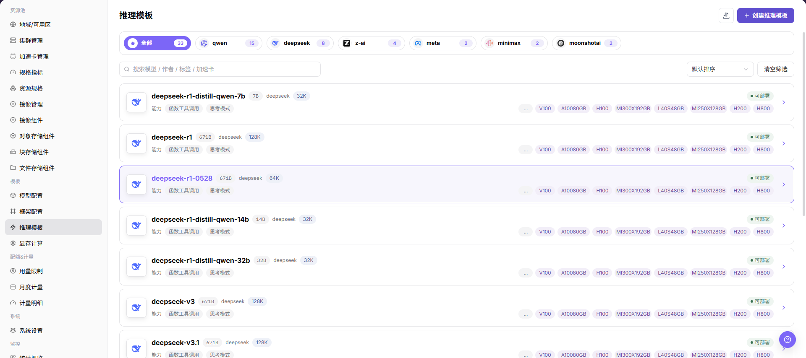
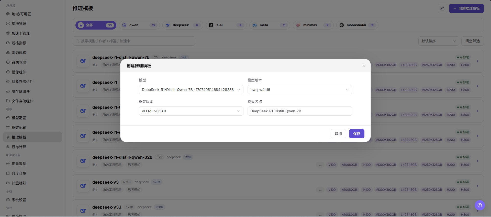

# 推理模板

::: info 文档信息
版本：v1.0
更新日期：2026-07-08
:::

## 功能概述

`推理模板` 用于把模型、框架、镜像、规格、显存测算、端口、变量和默认参数组合成普通用户可直接部署的模板。

| 项目 | 内容 |
| --- | --- |
| 适用角色 | 运营方 |
| 导航路径 | AI基础设施 > On-Prem > 模板 > 推理模板 |
| 页面路由 | `/powerone/fast-build-v2/inference-templates` |
| 管理对象 | 推理模板、模型范围、框架范围、规格推荐、表单参数和发布状态 |
| 典型途径 | 向普通用户发布可部署的模型服务方案 |

#### 新手理解

推理模板像模型服务的装配清单，把框架、规格、默认参数和可见范围组合好，用户部署时就能按模板快速创建服务。

#### 术语速查

| 术语 | 说明 |
| --- | --- |
| 模板 | 用户创建模型实例时选择的部署方案。 |
| 因子表单 | 用户创建实例时填写的参数集合。 |
| 动态表达式 | 根据用户输入、模型、精度或资源条件动态计算字段值或显示条件。 |
| VRAM 配置 | 显存推荐和校验规则，用于降低规格选择错误。 |
| 参数触发条件 | 控制字段在特定模型、框架或选项下展示。 |

## 前提条件

1. 模型配置、框架配置和显存测算已完成。
2. 可用资源规格已创建并关联到目标集群。
3. 镜像服务和必要存储能力已接入。
4. 已明确用户创建实例时需要填写哪些参数。

## 页面说明

页面展示推理模板列表，可查看模板名称、状态、模型范围、框架范围、更新时间和操作入口。

## 主要操作

### 创建推理模板

#### 操作前确认

1. 已准备可用框架、运行镜像和模型配置。
2. 已确认模板适配的资源规格、部署模式和可见范围。
3. 已确认默认参数不会暴露内部路径、凭据或测试 Endpoint。
4. 已明确模板变更会影响哪些用户部署入口。

#### 操作步骤

1. 进入 `AI Infra > On-Prem > 模板 > 推理模板`。
2. 点击 `新增`、`创建推理模板` 或页面真实创建入口。
3. 在基础信息区域填写模板名称、描述、适用场景、发布范围和可见范围。
4. 在模型配置区域选择模型、模型版本、模型来源或适用模型范围。
5. 在框架配置区域选择框架、框架版本、运行镜像和启动配置。
6. 在资源配置区域选择资源规格、部署模式、显存测算规则、地域或集群适用范围。
7. 在端口和网络区域配置服务端口、端口开放策略、端口标签和健康检查。
8. 在因子表单区域配置用户创建实例时需要填写的参数、默认值、校验规则、动态表达式和触发条件。
9. 点击最终 `保存`、`提交`、`发布` 或 `确定` 前，再次核对模型、框架、规格、参数、端口、可见范围和用户侧影响。
10. 如仅学习或截图，只查看字段和页面，不提交或发布真实推理模板。

下图展示创建推理模板页面，用于配置基础信息、资源规格和因子表单。

## 参数说明

| 参数 | 是否必填 | 说明 | 配置建议 |
| --- | --- | --- | --- |
| 模板名称 | 必填 | 用户创建推理服务时看到的模板名称。 | 使用可长期维护的名称，避免临时测试命名。 |
| 描述 | 否 | 模板用途、适配模型和使用边界说明。 | 只写非敏感说明，不写内部地址或测试参数。 |
| 适用场景 | 条件必填 | 模板面向的业务场景或模型服务类型。 | 与模型类型、框架能力和用户入口保持一致。 |
| 发布范围 | 条件必填 | 模板发布到用户侧的范围。 | 发布前确认影响的租户、区域和入口。 |
| 可见范围 | 必填 | 控制哪些用户或租户可以使用模板。 | 错误范围可能导致模板不可见或被非目标租户看到。 |
| 模型 | 条件必填 | 模板适用的模型或模型集合。 | 依赖对象必须可用且与框架匹配。 |
| 模型版本 | 条件必填 | 模板引用的模型版本。 | 与模型路径、量化方式和显存测算规则一致。 |
| 模型来源 | 条件必填 | 模型文件来源、仓库来源或对象存储来源。 | 不写真实模型仓库地址、Endpoint 或内部路径。 |
| 框架 | 必填 | 模板调用的框架配置。 | 框架应支持所选模型类型和运行方式。 |
| 框架版本 | 条件必填 | 模板引用的框架版本。 | 修改前确认已有模板和实例影响。 |
| 运行镜像 | 条件必填 | 框架运行时使用的容器镜像。 | 确认镜像地域、仓库权限和目标集群可拉取。 |
| 资源规格 | 必填 | 模板默认推荐或可选的算力规格。 | 与模型显存、并发、上下文长度和部署模式匹配。 |
| 部署模式 | 必填 | 决定服务副本、伸缩和调度方式。 | 与框架启动命令和资源规格匹配。 |
| 显存测算规则 | 条件必填 | 用于推荐或校验规格的显存规则。 | 与模型参数量、量化方式和上下文长度一致。 |
| 服务端口 | 条件必填 | 模型服务实际监听或暴露的端口。 | 与框架实际监听端口一致。 |
| 端口开放策略 | 条件必填 | 端口暴露方式和认证机制。 | 错误配置可能扩大服务暴露范围。 |
| 端口标签 | 否 | 标识端口协议类型或用途。 | 与 OpenAI API、Ollama API 或自定义协议保持一致。 |
| 健康检查 | 条件必填 | 用于判断服务是否启动成功的路径或命令。 | 与服务实际路径、端口和启动时延匹配。 |
| 因子表单 | 条件必填 | 用户创建实例时需要填写的参数表单。 | 字段、默认值和校验规则要逐项验证。 |
| 默认参数 | 否 | 创建服务时预填的模型或运行参数。 | 不写真实 Token、AK/SK、私钥、Endpoint 或测试值。 |
| 动态表达式 | 条件必填 | 根据模型、框架、规格或用户输入动态计算字段或显隐。 | 表达式错误会导致表单缺字段或启动命令异常。 |
| 触发条件 | 条件必填 | 控制字段在特定模型、框架或选项下展示。 | 与实际模型、框架和规格组合逐项验证。 |
| 操作 | 系统生成 | 新增、保存、提交、发布、确定等页面操作。 | `保存`、`提交`、`发布`、`确定` 属于高风险最终动作。 |

## 踩坑提示

- 推理模板发布会影响用户侧可选模板和真实服务创建范围。
- 可见范围配置错误可能导致模板不可见或被非目标租户看到。
- 模型、框架、镜像、规格或显存规则不匹配，会导致实例创建失败或启动失败。
- 默认参数、动态表达式和触发条件错误，会导致用户表单缺字段、参数错误或启动命令异常。
- 端口开放策略配置错误可能扩大服务暴露范围。
- 不写真实 Token、AK/SK、私钥、Endpoint、内部地址、模型仓库地址、租户 ID、集群 ID 或测试参数。
- `保存 / Save`、`提交 / Submit`、`发布 / Publish`、`确定 / OK` 属于高风险最终动作，学习或截图时不要点击。

## 结果校验

| 检查项 | 成功表现 | 异常时处理 |
| --- | --- | --- |
| 页面可进入 | 能进入 `AI Infra > On-Prem > 模板 > 推理模板`。 | 检查菜单配置、账号权限和前端路由。 |
| 创建入口可见 | 页面显示 `新增`、`创建推理模板` 或真实创建入口。 | 检查运营方权限、License 和页面配置。 |
| 创建页面可打开 | 点击入口后可查看基础信息、模型、框架、资源、端口和因子表单配置区。 | 检查路由、权限和浏览器控制台错误。 |
| 必填字段校验正常 | 模板名称、模型、框架、规格或可见范围为空时出现校验提示。 | 按页面提示补齐字段，不绕过校验。 |
| 模板出现在列表且状态符合预期 | 模板出现在列表中，状态、更新时间和发布状态符合预期。 | 检查保存结果、发布状态、筛选条件和后端处理状态。 |
| 用户侧部署模板可见性符合范围 | 目标用户或租户能看到模板，非目标范围不可见。 | 检查可见范围、发布范围、租户权限和模板状态。 |
| 使用模板创建测试实例时参数生效 | 模型、框架、规格、参数、端口按预期生效。 | 检查依赖对象、因子表单、动态表达式、端口策略和启动日志。 |
| 仅学习时未提交或发布真实模板 | 学习或截图时未点击最终 `保存`、`提交`、`发布` 或 `确定`。 | 如误操作，立即核对模板列表、用户侧可见范围和服务创建影响。 |

## 常见问题

#### 用户侧看不到模板

**问题现象：**

模板已保存，但普通用户部署模板列表中不可见。

**可能原因：**

- 模板未发布或状态不可用。
- 模板可见范围没有包含目标租户。
- 模型、框架或规格存在不可用依赖。

**处理方式：**

1. 检查模板状态和发布范围。
2. 核对租户权限和可见范围。
3. 检查模型、框架、规格和显存配置是否可用。

#### 创建实例时参数不符合预期

**问题现象：**

用户创建实例时，表单字段缺失、默认值错误或触发条件不生效。

**可能原因：**

- 因子表单配置不完整。
- 动态表达式条件错误。
- 模型、框架或规格触发条件与实际选择不匹配。

**处理方式：**

1. 检查因子表单字段、默认值和校验规则。
2. 逐项验证动态表达式。
3. 用不同模型、框架和规格组合测试表单显隐。

## 后续操作

1. 用测试租户创建模型实例验证模板。
2. 根据失败日志调整镜像、启动命令、端口和参数。
3. 模板发布后按模型版本、框架版本、资源规格和可见范围分别复核，避免用户创建实例时选到过期镜像或不匹配规格。
4. 按模型、框架、规格和因子表单组合回查失败日志，持续校准模板。

## 注意事项

- 模板参数不要包含真实 token、密钥或内部地址。
- 发布模板前必须确认依赖模型、框架、镜像、规格和存储均可用。
- 修改已发布模板前，先确认影响用户侧实例创建、模板可见范围和正在使用的部署入口。
- 学习或截图时不执行真实保存、提交、发布或确定动作。
