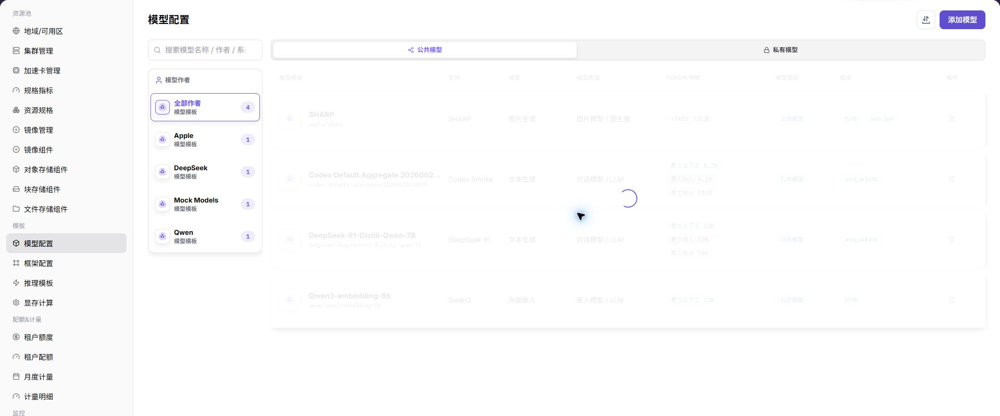
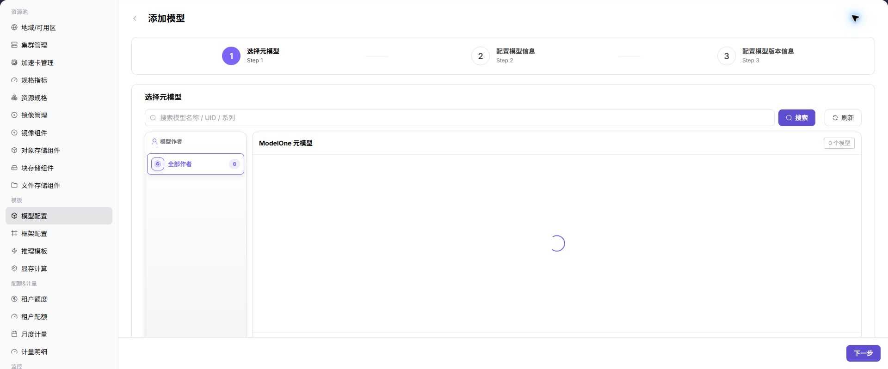

# 模型配置

::: info 文档信息
版本：v1.0
更新日期：2026-07-03
:::

::: warning 安全提示
模板文档、截图和示例中不要写入真实启动参数密钥、环境变量密钥、模型来源凭据、仓库访问 token 或内部下载地址。示例统一使用占位符。
:::

## 功能概述

`模型配置` 用于维护可被推理模板引用的模型资产，包括元模型、模型版本、来源、量化方式、Token 限制、标签和关联集群。

| 项目 | 内容 |
| --- | --- |
| 适用角色 | 运营方 |
| 导航路径 | 模板 > 模型配置 |
| 页面路由 | `/powerone/fast-build-v2/models` |
| 管理对象 | 元模型、模型版本、模型来源、量化方式、标签和关联集群 |
| 典型用途 | 创建可部署模型，维护模型版本，为推理模板提供模型选择范围 |

### 新手理解

模型配置像模型上架前的资料卡，把模型路径、参数来源、环境变量和启动参数整理清楚，框架才能正确加载模型。

### 术语速查

| 术语 | 说明 |
| --- | --- |
| 元模型 | 模型家族或基础模型抽象，例如同一模型系列的公共描述。 |
| 模型版本 | 具体权重、量化、来源和文件路径的版本记录。 |
| KV Token | 推理 KV Cache 相关 Token 数，会影响显存估算。 |
| 量化方式 | 权重压缩或推理优化方式，例如 FP16、INT8 等。 |
| 关联集群 | 模型文件可访问或可部署的集群范围。 |

## 前提条件

1. 已确认模型来源、授权、版本和参数量。
2. 模型文件可被目标集群下载或已在共享存储中准备。
3. 显存测算中已维护相关量化方式、KV Token 或计算因子。
4. 当前账号具备模板管理权限。

## 页面说明

页面按模型作者、模型类别和模型系列展示配置，可维护公共模型或私有模型。

## 添加模型

### 操作前确认

1. 已确认模型文件路径、格式、权限和来源凭据。
2. 已确认模型与运行框架、精度、上下文长度和资源规格匹配。
3. 已确认环境变量、启动参数和挂载路径不包含真实密钥。
4. 如模型来自外部仓库，已确认授权范围和网络连通性。

### 操作步骤

1. 进入 `模板 > 模型配置`。
2. 点击 `添加模型`。
3. 在元模型或基础信息 Tab 中选择模型系列、场景、类型和 Token 限制。
4. 在版本信息 Tab 中填写模型来源、版本、量化方式、文件路径或仓库标识。
5. 在关联配置 Tab 中选择标签、集群和可见范围。
6. 保存后返回列表检查模型状态。

### 参数说明

| 字段名称 | 是否必填 | 字段类型 | 示例 | 说明 |
| --- | --- | --- | --- | --- |
| 模型名称 | 是 | 文本 | `qwen2-72b` | 平台展示和模板引用的模型名称。 |
| 模型路径 | 是 | 路径 / URI | `s3://models/qwen2-72b` | 框架加载模型文件的位置。 |
| 参数来源 | 是 | 枚举 | `模板默认` | 说明参数来自模型配置、模板默认值还是用户输入。 |
| 环境变量 | 否 | 键值对 | `MODEL_PATH=/models/qwen2` | 传入容器运行环境的变量。 |
| 启动参数 | 否 | 命令参数 | `--max-model-len 8192` | 附加到框架启动命令的模型参数。 |
| 模型来源凭据 | 条件必填 | 凭据引用 | `secret-model-repo` | 访问私有模型仓库或对象存储时使用的凭据引用。 |

### 踩坑提示

- 模型路径要与挂载路径或对象存储路径一致，避免框架启动后找不到权重。
- 环境变量和启动参数不要混用真实凭据，敏感值应使用凭据引用。
- 参数来源要写清楚，避免模板默认值覆盖模型专属参数。

### 结果校验

1. 模型出现在列表中。
2. 模型版本状态符合预期。
3. 创建推理模板时可以选择该模型。
4. 用户侧部署模板中能看到与可见范围匹配的模型。

## 常见问题

### 创建模板时选不到模型

**问题现象：**

推理模板配置中没有目标模型。

**可能原因：**

- 模型未启用或版本不可用。
- 模型未关联目标集群。
- 模型可见范围、类别或标签与模板条件不匹配。

**处理方式：**

1. 检查模型状态和版本状态。
2. 确认模型已关联目标集群。
3. 核对模板筛选条件、可见范围和标签。

### 模型文件下载失败

**问题现象：**

部署实例时模型文件无法下载或加载。

**可能原因：**

- 模型来源地址不可达。
- 仓库认证或对象存储权限不足。
- 模型路径、版本或文件名填写错误。

**处理方式：**

1. 从目标集群验证来源地址可访问。
2. 核对认证信息和对象路径。
3. 修正模型版本、路径和文件名后重新验证。

## 后续操作

1. 进入 [框架配置](../frameworks/) 维护模型可用框架。
2. 进入 [推理模板](../inference-templates/) 建立模型、框架、规格和参数关系。
3. 进入 [显存测算配置](../vram-config/) 校准 KV Token、量化和动态表达式。

## 注意事项

- 模型来源和授权必须可追溯。
- 不要在模型路径、描述或截图中暴露访问密钥。
