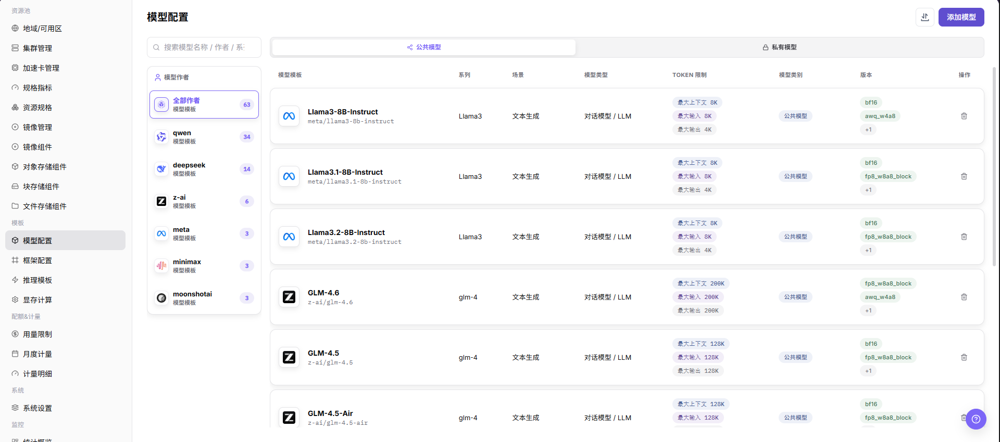
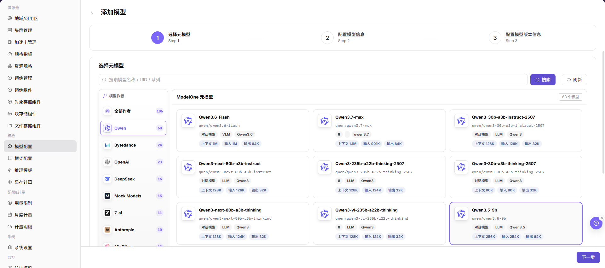
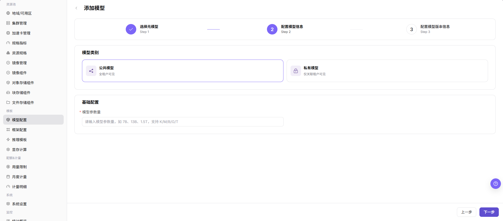
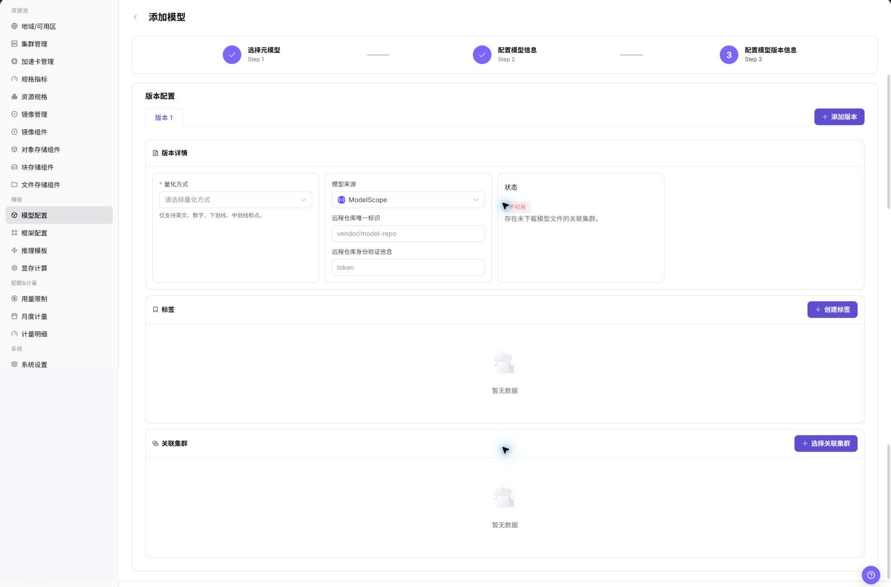
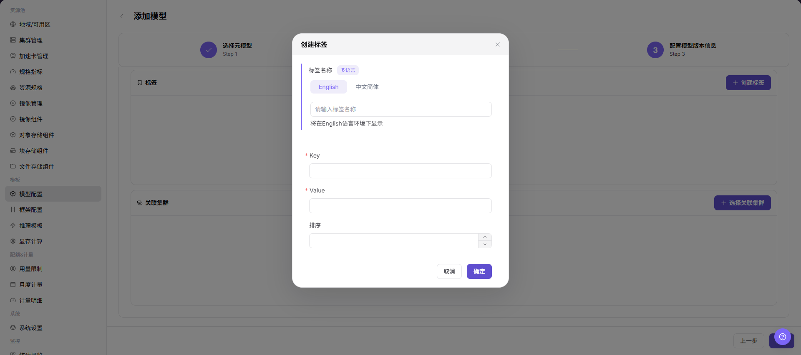
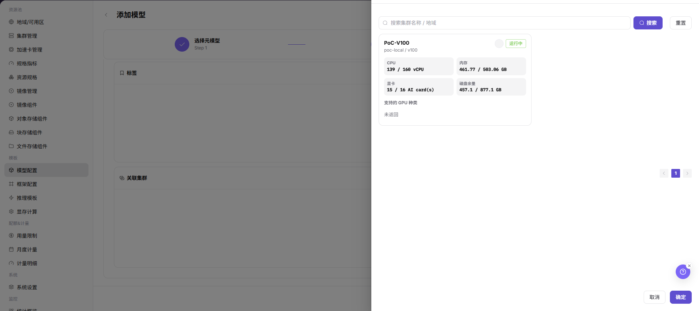

# 模型配置

::: info 文档信息
版本：v1.0
更新日期：2026-07-08
:::

## 功能概述

`模型配置` 用于维护可被推理模板引用的模型资产，包括元模型、模型版本、来源、量化方式、Token 限制、标签和关联集群。

| 项目 | 内容 |
| --- | --- |
| 适用角色 | 运营方 |
| 导航路径 | AI基础设施 > On-Prem > 模板 > 模型配置 |
| 页面路由 | `/powerone/fast-build-v2/models` |
| 管理对象 | 元模型、模型版本、模型来源、量化方式、标签和关联集群 |
| 典型途径 | 创建可部署模型，维护模型版本，为推理模板提供模型选择范围 |

#### 新手理解

模型配置像模型上架前的资料卡，把模型路径、参数来源、环境变量和启动参数整理清楚，框架才能正确加载模型。

#### 术语速查

| 术语 | 说明 |
| --- | --- |
| 元模型 | 模型家族或基础模型抽象，例如同一模型系列的公共描述。 |
| 模型版本 | 具体权重、量化、来源和文件路径的版本记录。 |
| KV Token | 推理 KV Cache 相关 Token 数，会影响显存估算。 |
| 量化方式 | 权重压缩或推理优化方式，例如 FP16、INT8 等。 |
| 关联集群 | 模型文件可访问或可部署的集群范围。 |

## 前提条件

1. 已确认模型来源、授权、版本和参数量。
2. 模型文件可被目标集群下载或已在共享存储中准备。
3. 显存测算中已维护相关量化方式、KV Token 或计算因子。
4. 当前账号具备模板管理权限。

## 页面说明

页面按模型作者、模型类别和模型系列展示配置，可维护公共模型或私有模型。

## 主要操作

### 添加模型

#### 操作前确认

1. 已确认模型文件路径、格式、权限和来源凭据。
2. 已确认模型与运行框架、精度、上下文长度和资源规格匹配。
3. 已确认环境变量、启动参数和挂载路径不包含真实密钥。
4. 如模型来自外部仓库，已确认授权范围和网络连通性。

#### 操作步骤

1. 进入 `AI基础设施 > On-Prem > 模板 > 模型配置`。
2. 点击 `添加模型` 或页面真实新增入口。

下图展示选择元模型页面，用于选择模型作者、模型系列和模型基础条目。

3. 在元模型或基础信息区域选择模型作者、模型系列、模型类型、场景和 Token 限制等信息。

下图展示模型信息配置页面，用于维护模型类型、场景、Token 限制和基础描述。

4. 在版本信息区域填写模型来源、版本号、量化方式、模型路径或仓库标识。

下图展示模型版本信息配置页面，用于维护模型来源、版本、量化方式和路径信息。

5. 按页面要求配置参数来源、环境变量、启动参数、挂载路径或模型来源凭据。
6. 在关联配置区域选择标签、可见范围、关联集群或可用模板范围。

下图展示创建标签和选择关联集群页面，用于维护模型分类和部署可用范围。

7. 点击最终 `保存`、`提交` 或 `确定` 前，再次核对模型路径、凭据引用、集群可访问性和可见范围。
8. 如仅学习或截图，只查看字段和页面，不提交真实模型配置。

## 参数说明

| 字段名称 | 是否必填 | 字段类型 | 示例 | 说明 |
| --- | --- | --- | --- | --- |
| 模型名称 | 必填 | 文本 | `示例名称` | 平台展示和模板引用的模型名称。 使用可长期维护的模型名称，不使用临时测试命名。 |
| 模型作者 | 条件必填 | 下拉 / 枚举 | `示例组织` | 模型所属作者、组织或来源方。 与页面筛选、模型系列和授权来源保持一致。 |
| 模型系列 | 条件必填 | 下拉 / 枚举 | `A100` | 同一模型家族或基础模型系列。 便于推理模板按系列筛选模型。 |
| 模型类型 | 条件必填 | 下拉 / 枚举 | `大语言模型` | 模型能力类型或业务分类。 与推理框架、模板类型和用户侧选择范围保持一致。 |
| 场景 | 条件必填 | 下拉 / 枚举 | `示例值` | 模型适用的业务场景。 避免把测试、训练或推理场景混用。 |
| Token 限制 | 条件必填 | 文本 | `8192` | 上下文长度、输入输出 Token 或 KV Cache 相关限制。 与模型能力、显存测算和模板参数保持一致。 |
| 模型来源 | 必填 | 地址 / 路径 | `对象存储` | 模型文件来源、仓库来源或对象存储来源。 外部来源需确认授权和网络可达性。 |
| 版本 | 必填 | 文本 | `v0.8.0` | 模型版本号或权重版本记录。 版本应可追溯，不用含糊的 `latest` 作为长期配置。 |
| 量化方式 | 条件必填 | 下拉 / 枚举 | `FP16` | 模型权重量化或精度方式。 与运行框架和显存测算配置保持一致。 |
| 模型路径 | 必填 | 地址 / 路径 | `s3://example-bucket/model` | 框架加载模型文件的路径、仓库标识或对象存储位置。 不写真实密钥、Token、账号密码或内网地址。 |
| 参数来源 | 条件必填 | 下拉 / 枚举 | `模板默认值` | 参数来自模型配置、模板默认值或用户输入。 避免模板默认值覆盖模型专属参数。 |
| 环境变量 | 否 | 配置文本 | `ENV=prod` | 传入容器运行环境的变量。 只填写非敏感变量，敏感值使用凭据引用。 |
| 启动参数 | 否 | 配置文本 | `--max-model-len 8192` | 附加到框架启动命令的模型参数。 与框架版本、Token 限制和资源规格匹配。 |
| 模型来源凭据 | 条件必填 | 凭据 / 敏感文本 | `对象存储` | 访问私有模型仓库或对象存储时使用的凭据引用。 只引用凭据对象，不在文档中写真实凭据。 |
| 关联集群 | 条件必填 | 文件 / 配置文本 | `cluster-a` | 模型文件可访问或可部署的集群范围。 提交前确认目标集群网络和存储可访问。 |
| 标签 | 否 | 文本 | `llm` | 用于筛选、分类或模板匹配的标签。 标签含义应稳定，避免使用临时标签。 |
| 可见范围 | 条件必填 | 下拉 / 枚举 | `示例租户 A` | 模型对模板、租户或用户侧的可见边界。 错误可见范围会影响用户侧可选模型。 |
| 操作 | 系统生成 | 操作入口 | `编辑` | 添加、编辑、保存、提交、确定等页面操作。 `保存`、`提交`、`确定` 属于高风险最终动作。 |

## 踩坑提示

- 模型路径、仓库地址、对象存储路径和凭据引用错误，会导致模板部署后模型加载失败。
- 环境变量、启动参数、模型路径中不能写真实密钥、Token、AK/SK、账号密码或内网地址。
- 错误的关联集群或可见范围会影响推理模板可选模型和用户侧可见范围。
- 参数来源要写清楚，避免模板默认值覆盖模型专属参数。
- `保存 / Save`、`提交 / Submit`、`确定 / OK` 属于高风险最终动作，学习或截图时不点击。

## 结果校验

| 检查项 | 成功表现 | 异常时处理 |
| --- | --- | --- |
| 模型出现在列表中 | 模型出现在列表中。 | 未达到时检查模板关联对象、启用状态、版本和表单配置 |
| 模型版本状态符合预期 | 模型版本状态符合预期。 | 未达到时检查模板关联对象、启用状态、版本和表单配置 |
| 创建推理模板时可以选择该模型 | 创建推理模板时可以选择该模型。 | 未达到时检查模板关联对象、启用状态、版本和表单配置 |
| 用户侧部署模板中能看到与可见范围匹配的模型 | 用户侧部署模板中能看到与可见范围匹配的模型。 | 未达到时检查可见范围、关联集群、模板条件和账号权限。 |
| 仅学习时未提交 | 学习或截图时未点击最终 `保存`、`提交` 或 `确定`。 | 如误提交，立即核对模型列表、关联集群和可见范围，并按变更流程处理。 |

## 常见问题

#### 创建模板时选不到模型

**问题现象：**

推理模板配置中没有目标模型。

**可能原因：**

- 模型未启用或版本不可用。
- 模型未关联目标集群。
- 模型可见范围、类别或标签与模板条件不匹配。

**处理方式：**

1. 检查模型状态和版本状态。
2. 确认模型已关联目标集群。
3. 核对模板筛选条件、可见范围和标签。

#### 模型文件下载失败

**问题现象：**

部署实例时模型文件无法下载或加载。

**可能原因：**

- 模型来源地址不可达。
- 仓库认证或对象存储权限不足。
- 模型路径、版本或文件名填写错误。

**处理方式：**

1. 从目标集群验证来源地址可访问。
2. 核对认证信息和对象路径。
3. 修正模型版本、路径和文件名后重新验证。

## 后续操作

1. 进入 [框架配置](../frames/) 维护模型可用框架。
2. 进入 [推理模板](../inference-templates/) 建立模型、框架、规格和参数关系。
3. 进入 [显存测算配置](../vram-config/) 校准 KV Token、量化和动态表达式。

## 注意事项

- 模型来源和授权必须可追溯。
- 不要在模型路径、描述或截图中暴露访问密钥。
- 不要在示例、截图或工单中写真实模型仓库地址、对象存储路径、AK/SK、Token、账号密码或内网地址。
- 修改关联集群、标签或可见范围前，先确认推理模板和用户侧部署入口影响。
