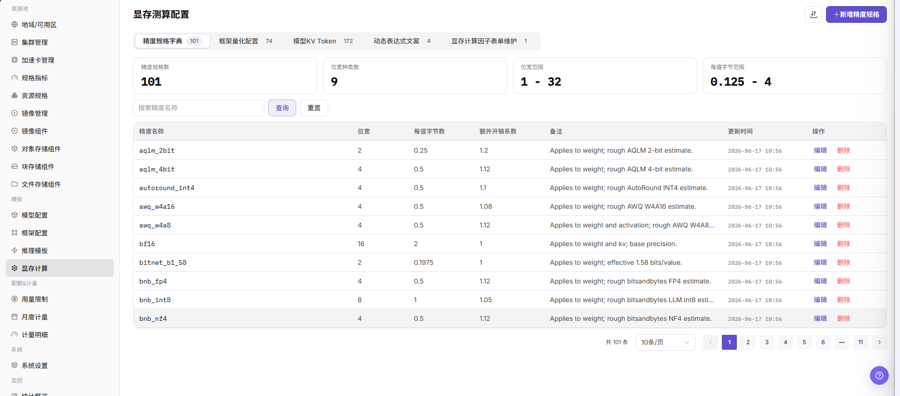
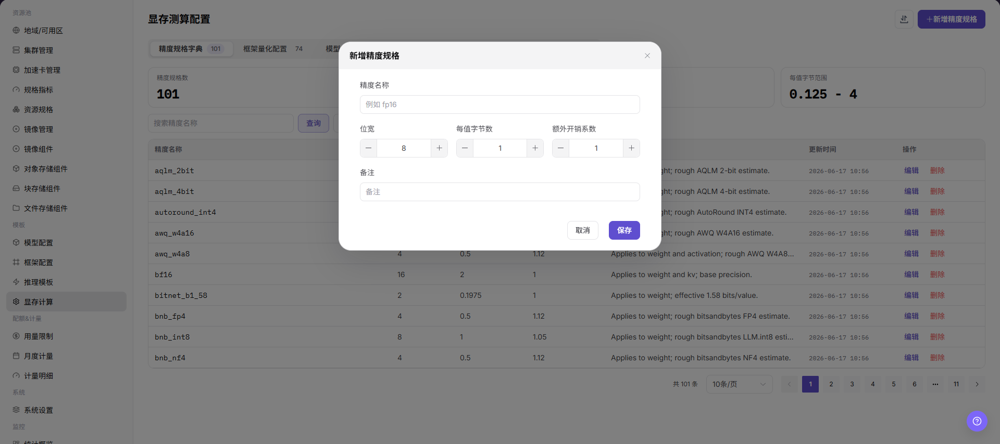

# 显存计算

::: info 文档信息
版本：v1.0
更新日期：2026-07-08
:::

## 功能概述

`显存计算` 用于维护模型部署时的显存估算规则，帮助推理模板根据模型、精度、KV Token、并发、上下文长度和动态表达式推荐资源规格。

| 项目 | 内容 |
| --- | --- |
| 适用角色 | 运营方 |
| 导航路径 | AI基础设施 > On-Prem > 模板 > 显存计算 |
| 页面路由 | `/powerone/fast-build-v2/vram-factor-forms` |
| 管理对象 | 显存公式、精度、KV Token、因子表单、动态表达式和推荐规格 |
| 典型途径 | 降低用户选择规格错误导致的部署失败 |

#### 新手理解

显存计算像部署前的容量估算器，用模型规模、精度、上下文长度和 KV Token 估算需要多少显存，避免服务启动后才发现放不下。

#### 术语速查

| 术语 | 说明 |
| --- | --- |
| VRAM | 加速卡显存，用于存放模型权重、KV Cache 和中间计算。 |
| KV Token | 推理上下文中 Key/Value Cache 相关 Token 数。 |
| 因子 | 参与显存计算的变量，例如参数量、精度、并发和上下文长度。 |
| 动态表达式 | 根据参数动态计算显存或控制表单显示的表达式。 |
| 触发条件 | 决定某个字段、规则或推荐值何时生效。 |

## 前提条件

1. 已明确模型参数量、精度、上下文长度、并发和框架显存开销。
2. 已准备可被推理模板引用的资源规格。
3. 已确认不同加速卡型号的显存容量和可用余量。
4. 当前账号具备模板管理权限。

## 页面说明

页面展示显存测算规则和精度配置，可维护不同模型、框架或精度组合的显存估算逻辑。

## 主要操作

### 配置显存规则

#### 操作前确认

1. 已确认模型参数规模、精度、量化方式和最大上下文长度。
2. 已确认目标 GPU/NPU 型号、单卡显存和并行策略。
3. 已确认 KV Token、批大小和并发设置的估算口径。
4. 显存估算结果应与实际压测或试运行结果交叉验证。

#### 操作步骤

1. 进入 `模板 > 显存测算`。
2. 点击新增或编辑入口。
3. 在基础信息 Tab 中填写规则名称、适用模型、框架和精度。
4. 在因子表单 Tab 中配置参数量、KV Token、并发、上下文长度等因子。
5. 在动态表达式 Tab 中配置显存计算公式、推荐规格和触发条件。
6. 保存后在推理模板中引用并验证。

下图展示显存测算配置页面，用于维护精度、因子和动态表达式。

## 参数说明

| 字段名称 | 是否必填 | 字段类型 | 示例 | 说明 |
| --- | --- | --- | --- | --- |
| 模型规模 | 必填 | 文本 / 数字 | `72B` | 模型参数规模，用于估算权重显存。 |
| 精度 | 必填 | 枚举 | `BF16` | 影响权重、激活和 KV Cache 的显存占用。 |
| KV Token | 必填 | 数字 | `32768` | 用于估算上下文和并发下的 KV Cache 占用。 |
| 上下文长度 | 必填 | 数字 | `8192` | 模型服务允许的最大输入输出上下文。 |
| 并发 / 批大小 | 否 | 数字 | `4` | 用于估算峰值请求下的显存压力。 |
| 显存估算结果 | 系统生成 | 容量 | `152 GB` | 平台根据配置计算出的建议显存需求。 |

## 踩坑提示

- KV Token、上下文长度和并发会显著影响显存估算，不能只看模型参数规模。
- 量化精度填写错误会导致推荐规格偏小或偏大。
- 显存估算结果应通过测试部署校验，不能替代实际压测。

## 结果校验

| 检查项 | 成功表现 | 异常时处理 |
| --- | --- | --- |
| 规则出现在列表中 | 规则出现在列表中。 | 未达到时检查模板关联对象、启用状态、版本和表单配置 |
| 推理模板可以引用该显存规则 | 推理模板可以引用该显存规则。 | 未达到时检查模板关联对象、启用状态、版本和表单配置 |
| 使用不同模型、精度、KV Tok | 使用不同模型、精度、KV Token 和并发组合时，推荐规格符合预期。 | 未达到时检查模板关联对象、启用状态、版本和表单配置 |
| 用户选择过小规格时 | 用户选择过小规格时，页面能给出限制或提示。 | 未达到时检查模板关联对象、启用状态、版本和表单配置 |

## 常见问题

#### 显存推荐明显偏小

**问题现象：**

用户按推荐规格创建实例后，服务启动时出现显存不足。

**可能原因：**

- 模型参数量、精度或 KV Token 配置偏小。
- 框架额外开销没有计入。
- 并发、上下文长度或动态表达式没有覆盖实际场景。

**处理方式：**

1. 复核参数量、精度、KV Token 和上下文长度。
2. 根据框架实测结果增加安全余量。
3. 用典型模型和并发场景回归验证。

#### 动态表达式不生效

**问题现象：**

表单参数变化后，显存估算或推荐规格没有变化。

**可能原因：**

- 表达式引用字段名错误。
- 触发条件没有覆盖当前模型或框架。
- 因子表单默认值为空或类型不匹配。

**处理方式：**

1. 检查表达式字段名和数据类型。
2. 调整触发条件并逐项测试。
3. 为因子表单设置合理默认值和校验规则。

## 后续操作

1. 在推理模板中引用显存测算规则。
2. 用小、中、大模型分别验证推荐规格。
3. 根据线上失败案例持续校准显存公式和安全余量。

## 注意事项

- 显存测算是推荐和校验依据，不替代真实压测。
- 修改规则前应确认使用该规则的模板和用户创建流程影响范围。
