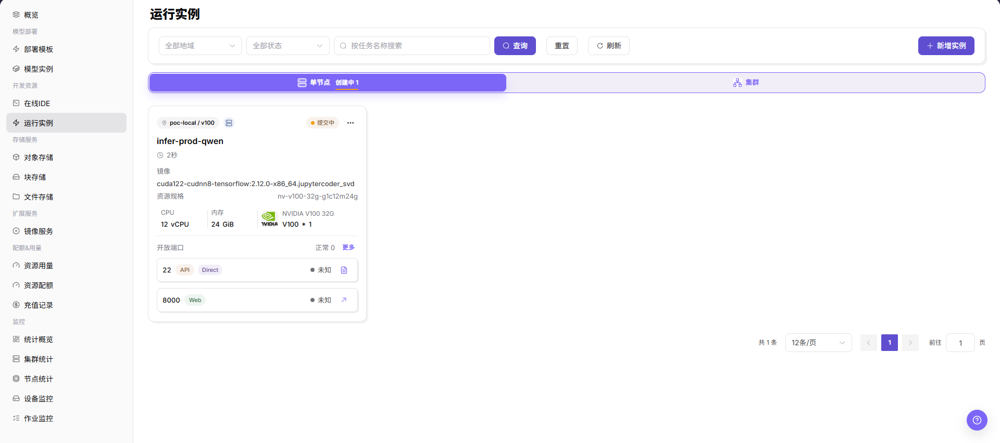
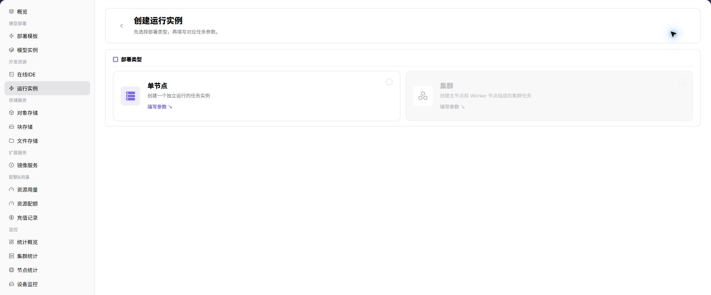
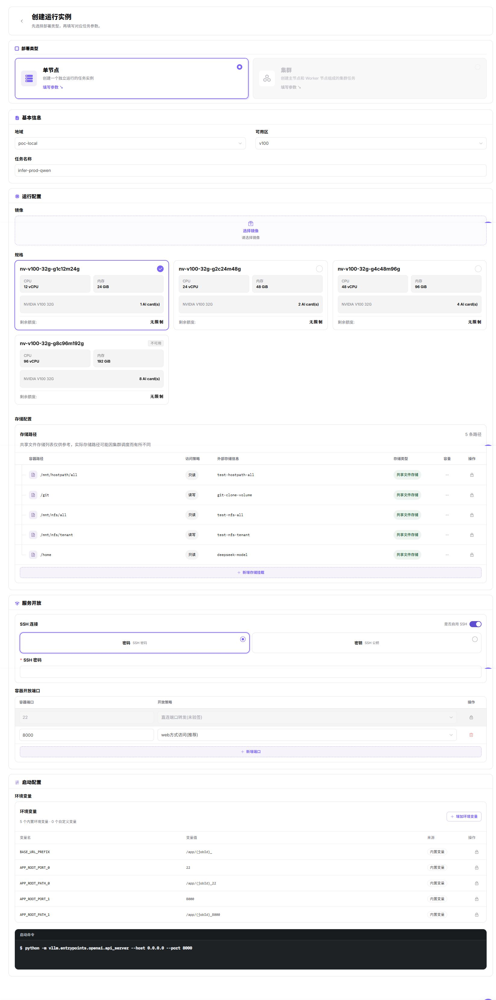

# 运行实例

::: info 文档信息
版本：v1.0
更新日期：2026-07-08
:::

## 功能概述

`运行实例` 用于创建和管理非模板化的运行任务。普通用户可选择单节点或集群形态，指定镜像、规格、启动命令、参数、环境变量和存储挂载，启动训练、批处理或自定义服务类实例。

| 项目 | 内容 |
| --- | --- |
| 适用角色 | 普通用户 |
| 导航路径 | AI基础设施 > On-Prem > 开发资源 > 运行实例 |
| 页面路由 | `/powerone/inference/online-inference` |
| 管理对象 | 运行实例、单节点任务、集群任务、镜像、规格、启动命令和运行状态 |
| 典型途径 | 创建训练、批处理、自定义服务或临时运行任务 |

#### 新手理解

运行实例像一台按需启动的任务机器：你准备好镜像、代码、数据和启动命令，平台按所选规格启动实例。它比在线 IDE 更偏任务执行，比模型实例更灵活。

#### 术语速查

| 术语 | 说明 |
| --- | --- |
| 镜像 | 实例运行环境。 |
| 启动命令 | 容器启动后执行的命令或脚本。 |
| 批处理 | 一次性或周期性处理数据、转换文件、生成结果的任务，通常运行完成后退出。 |
| 参数 | 传给脚本或服务的命令行参数。 |
| 环境变量 | 传给容器进程的键值配置。 |
| 存储挂载 | 把对象存储、文件存储或共享目录挂到容器内路径。 |

## 前提条件

1. 当前账号具备创建运行实例的权限。
2. 已有可用镜像和规格。
3. 训练脚本、模型文件或输入数据已准备。
4. 输出目录已规划到对象存储、文件存储或共享目录。
5. 启动命令不包含真实密钥、密码、token 或 AK/SK。

## 页面说明

列表页支持按地域和状态筛选，提供刷新和创建入口。创建页先选择单节点或集群部署类型。

## 主要操作

### 创建运行实例

#### 操作步骤

1. 进入 `AI基础设施 > On-Prem > 开发资源 > 运行实例`。
2. 点击 `创建实例`。
3. 在部署类型页面选择 `单节点` 或 `集群`。

4. 点击 `填写参数`，进入运行实例创建配置页面。
5. 按页面字段查看或填写实例名称、地域、镜像、资源规格、启动命令、参数、环境变量和存储挂载等配置。
6. 核对部署类型、镜像、规格、启动命令、参数传入方式和存储路径。
7. 如仅学习或截图，只查看字段和页面状态，不点击最终 `提交`、`确定` 或 `确认`。

#### 启动命令填写建议

#### Python 训练脚本

用于启动训练入口脚本。文档中只说明需要核对入口脚本、数据来源、输出位置和参数传入方式，不记录真实路径或测试参数。

#### Shell 脚本

用于执行批处理、数据准备或多步骤任务。创建前确认脚本存在于镜像或挂载目录中，并确认输出写入持久化路径。

#### 自定义服务

用于启动长运行服务类进程。创建前确认服务入口、监听方式、健康状态和资源释放方式。

#### 参数传入方式

| 方式 | 适用场景 | 说明 |
| --- | --- | --- |
| 命令行参数 | 脚本支持命令行参数。 | 通过页面参数字段传入，文档不记录真实参数。 |
| 环境变量 | 框架读取环境变量控制行为。 | 仅说明字段用途，不记录真实 Token、密码或 Endpoint。 |
| 配置文件 | 参数较多或需要复用配置。 | 确认配置文件来自已挂载目录或镜像内置路径。 |
| 挂载路径 | 输入数据、模型文件或输出结果。 | 确认输入和输出目录使用持久化存储。 |

## 参数说明

| 字段名称 | 是否必填 | 字段类型 | 说明 |
| --- | --- | --- | --- |
| 实例名称 | 必填 | 文本 | 运行实例展示名称。 |
| 部署类型 | 必填 | 单选 | 选择单节点或集群形态。 |
| 地域 | 必填 | 下拉选择 | 选择创建运行实例的目标地域。 |
| 镜像 | 必填 | 下拉选择 | 选择运行实例使用的镜像。 |
| 资源规格 | 必填 | 下拉选择 | 选择运行实例使用的算力规格。 |
| 启动命令 | 必填 | 文本 | 配置容器启动后执行的命令或脚本。 |
| 参数 | 否 | 文本 | 配置传给脚本或服务的参数。 |
| 环境变量 | 否 | 键值配置 | 配置容器进程读取的环境变量。 |
| 存储挂载 | 否 | 路径 | 配置输入数据、代码、模型文件或输出目录的挂载路径。 |
| 输出路径 | 否 | 文本 | 配置训练、批处理或服务输出的持久化位置。 |

## 踩坑提示

- 训练任务启动失败时先看镜像、启动命令、数据路径和资源规格，不要只重复提交任务。
- GPU/NPU 规格充足不代表依赖库匹配，框架版本、驱动和运行时也要一起核对。
- 训练日志、数据集路径和模型输出目录可能包含业务信息，截图和工单必须脱敏。
- `提交`、`确定`、`确认` 属于最终动作。
- 创建运行实例会占用配额、调度资源和存储资源。
- 启动命令、环境变量和挂载路径配置错误可能导致实例启动失败或输出丢失。
- 学习或截图时只查看页面、字段和状态，不提交真实创建任务。
- 不写真实租户、地域、镜像地址、资源规格 ID、数据路径、输出路径、Token、密码、Endpoint、启动参数、日志或测试数据。
## 结果校验

| 检查项 | 成功表现 | 异常时处理 |
| --- | --- | --- |
| 实例出现在列表中 | 实例出现在列表中。 | 未达到时检查镜像、规格、启动命令、挂载路径和实例事件 |
| 状态进入运行中、成功或符合任务类 | 状态进入运行中、成功或符合任务类型的状态。 | 未达到时检查镜像、规格、启动命令、挂载路径和实例事件 |
| 日志中没有镜像拉取、命令执行或挂载错误 | 日志中没有镜像拉取、命令执行或挂载错误。 | 未达到时检查镜像、规格、启动命令、挂载路径和实例事件 |
| 输出目录中产生预期文件 | 输出目录中产生预期文件。 | 未达到时检查镜像、规格、启动命令、挂载路径和实例事件 |

## 常见问题

#### 实例启动后立即失败

**问题现象：**

运行实例状态很快变为失败。

**可能原因：**

- 启动命令不存在、路径错误或返回非零。
- 镜像缺少依赖。
- 存储挂载路径错误。
- 脚本参数或环境变量不符合程序要求。

**处理方式：**

1. 查看实例日志和事件。
2. 在在线 IDE 中用同一镜像验证命令。
3. 检查镜像、工作目录、参数和挂载路径。
4. 把输出写入持久化目录后重试。

#### 实例一直排队或创建中

**问题现象：**

提交后长时间没有进入运行状态。

**可能原因：**

- 目标规格资源不足。
- 租户配额或额度不足。
- 集群调度异常。
- 镜像拉取或存储挂载前置条件未满足。

**处理方式：**

1. 检查资源配额和用量。
2. 换用较小规格或其他地域。
3. 联系运营方确认集群资源和调度状态。
4. 检查镜像和存储配置。

#### 任务完成后找不到输出

**问题现象：**

实例结束后，在预期目录没有结果文件。

**可能原因：**

- 输出写到了容器临时目录。
- 输出路径没有挂载持久化存储。
- 脚本参数中的输出目录填写错误。

**处理方式：**

1. 查看启动命令中的 `--output` 或配置文件。
2. 把输出目录设置为对象存储、文件存储或共享目录挂载路径。
3. 重新运行小样本任务验证输出。

## 后续操作

1. 进入实例详情查看日志和输出。
2. 根据用量页面评估资源消耗。
3. 完成任务后停止或释放实例。
4. 将稳定命令沉淀为团队脚本或推理模板参数。

## 注意事项

- 不要把密钥直接写入启动命令、环境变量或截图中。
- 输出数据建议写入持久化存储，避免实例释放后丢失。
- 学习或截图时只查看页面、字段和状态，不提交真实创建任务。
- 不写真实租户、地域、镜像地址、资源规格 ID、数据路径、输出路径、Token、密码、Endpoint、启动参数、日志或测试数据。
