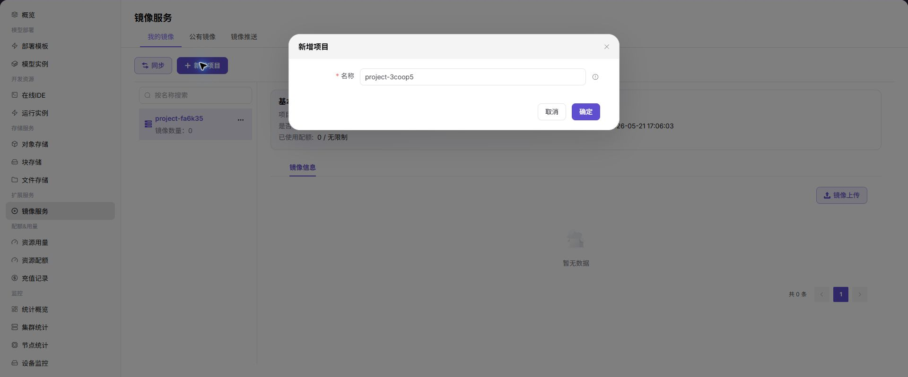

# 镜像服务

::: info 文档信息
版本：v1.0
更新日期：2026-07-03
:::

::: warning 安全提示
镜像文档和截图中不要暴露 robot 凭据、镜像仓库密码、Image Pull Secret、私有仓库 token 或内部仓库地址。命令示例使用占位符。
:::

## 功能概述

`镜像服务` 用于管理普通用户侧的镜像项目、自定义镜像、公共镜像和推送历史。用户可以创建镜像项目，把本地构建好的镜像推送到平台镜像仓库，再在在线 IDE、运行实例或模型服务中选择该镜像。

| 项目 | 内容 |
| --- | --- |
| 适用角色 | 普通用户 |
| 导航路径 | 扩展服务 > 镜像服务 |
| 页面路由 | `/powerone/expand-service/image-service/custom` |
| 管理对象 | 我的镜像项目、公共镜像、推送历史和镜像上传入口 |
| 典型用途 | 准备自定义运行环境，固定依赖版本，为作业和模型服务提供镜像 |

### 新手理解

镜像是作业的运行环境，包含系统、框架、Python 包、启动脚本和依赖。镜像项目像一个命名空间，用来组织同一团队或同一业务的镜像。推送镜像前需要确认仓库地址、项目名称、镜像标签和登录凭据。

### 术语速查

| 术语 | 说明 |
| --- | --- |
| 镜像 | 容器运行环境。 |
| 镜像项目 | 镜像仓库中的项目或命名空间。 |
| 镜像标签 | 镜像版本标识，例如 `v1.0.0`。 |
| docker login | 登录镜像仓库的命令。 |
| docker tag | 给本地镜像打远程仓库标签的命令。 |
| docker push | 将镜像推送到远程仓库的命令。 |
| robot 凭据 | 镜像仓库自动化账号和密码，属于敏感凭据。 |

## 前提条件

1. 目标地域已开放镜像服务。
2. 当前账号具备查看、创建镜像项目和推送镜像的权限。
3. 本地已安装 Docker 或兼容容器工具。
4. 已准备可构建的 Dockerfile 或本地镜像。
5. 不要在截图、文档或命令记录中暴露 robot 密码、仓库密码或访问 token。

## 页面说明

页面包含 `我的镜像（My Images）`、`公共镜像（Public Images）` 和 `推送历史（Push History）` 三个视图。截图中可见同步、添加项目、项目列表和镜像信息区域。


## 新增镜像项目

### 操作步骤

1. 进入 `扩展服务 > 镜像服务`。
2. 在 `我的镜像（My Images）` 页点击 `新增项目（Add Project）`。
3. 填写项目名称。
4. 点击 `确认（Confirm）`。



### 参数说明

| 字段名称 | 是否必填 | 字段类型 | 示例 | 说明 |
| --- | --- | --- | --- | --- |
| 项目名称 | 是 | 文本 | `team-a` | 镜像仓库项目名称。 |
| 镜像仓库 | 系统生成 | URL | `registry.example.com/team-a` | 推送镜像的仓库地址。 |
| Robot 凭据 | 条件必填 | 密文 | `<robot-token>` | 推送或拉取镜像使用的凭据。 |
| 镜像 Tag | 是 | 文本 | `app:v1` | 镜像版本标签。 |
| 同步状态 | 系统生成 | 枚举 | `已同步` | 镜像是否可被作业选择。 |
### 踩坑提示

- 镜像服务 的状态变化可能影响下游流程，提交前先确认影响范围。
- 涉及凭据、地址、客户信息或业务标识时先脱敏。
- 列表为空时优先检查筛选条件、地域和权限。

### 结果校验

1. 项目出现在 `我的镜像（My Images）` 列表中。
2. 项目下可查看镜像数量、配额使用和推送入口。

## 推送自定义镜像

### 操作前确认

1. 页面中已创建目标镜像项目。
2. 已从页面获取仓库地址和推送说明。
3. 如页面提供 robot 凭据，只在本地终端使用，不写入文档、脚本仓库或截图。
4. 镜像标签使用明确版本，不建议只使用 `latest`。

### 命令示例

以下示例使用占位符，执行时替换为页面提供的仓库地址、项目名和本地镜像名。

```bash
docker login <registry.example.local>
docker tag <local-image>:<local-tag> <registry.example.local>/<project>/<image>:<version>
docker push <registry.example.local>/<project>/<image>:<version>
```

如果需要在本地构建镜像，可先执行：

```bash
docker build -t <local-image>:<local-tag> .
```

### 结果校验

1. `docker push` 命令执行成功。
2. 返回镜像服务页面，点击 `同步（Sync）`。
3. 在项目下看到新镜像和标签。
4. 在创建在线 IDE、运行实例或模型服务时可以选择该镜像。

## 查看公共镜像和推送历史

1. 切换到 `公共镜像（Public Images）`，查看平台提供的基础镜像。
2. 切换到 `推送历史（Push History）`，查看镜像推送记录。
3. 推送失败时，根据历史记录和本地命令输出定位原因。

## 常见问题

### docker login 失败

**问题现象：**

执行登录命令时提示认证失败或无法连接仓库。

**可能原因：**

- 仓库地址填写错误。
- robot 凭据或密码错误。
- 本地网络无法访问镜像仓库。
- 私有证书未被本地 Docker 信任。

**处理方式：**

1. 复制页面提供的仓库地址重新登录。
2. 重新生成或复制 robot 凭据，避免多余空格。
3. 检查本地网络和 DNS。
4. 按企业证书策略配置 Docker 证书信任。

### 作业中看不到自定义镜像

**问题现象：**

镜像已推送，但创建 IDE、运行实例或模型服务时不可选。

**可能原因：**

- 镜像推送成功后没有点击同步，平台列表尚未刷新。
- 镜像项目与当前地域、租户或账号不匹配。
- 镜像标签格式不符合平台识别规则，或只使用了难以识别的临时标签。
- 当前账号没有该镜像项目的查看或使用权限。

**处理方式：**

1. 点击 `同步（Sync）` 同步镜像信息。
2. 确认创建作业时选择的地域与镜像项目一致。
3. 使用明确版本标签重新推送，例如 `v1.0.0`。
4. 联系项目管理员确认镜像项目权限和可见范围。


### docker push 失败

**问题现象：**

镜像推送过程中失败、卡住或提示无权限。

**可能原因：**

- 镜像项目不存在，或当前账号没有该项目的推送权限。
- `docker tag` 后的远程镜像名、项目名或标签格式不符合仓库要求。
- 镜像体积过大，推送过程中网络超时或连接中断。
- 本地 Docker 登录状态已过期，或登录到了错误仓库地址。

**处理方式：**

1. 确认镜像项目已创建，并且当前账号具备推送权限。
2. 检查 `docker tag` 后的完整镜像名，格式应包含仓库地址、项目名、镜像名和版本标签。
3. 重新执行 `docker login <registry>` 后再次推送。
4. 镜像体积过大时，清理缓存层、减少无用依赖或拆分镜像。

## 后续操作

1. 在在线 IDE 或运行实例中选择该镜像验证依赖。
2. 为生产镜像维护版本标签和变更记录。
3. 清理无用标签，降低镜像仓库存储占用。

## 注意事项

- 不要截图镜像上传页面中的 robot 凭据、仓库密码或 token。
- 生产镜像建议使用明确版本标签，避免只使用 `latest`。
- 推送失败时不要把完整仓库地址、用户名或 robot 密码粘贴到公开工单中。
