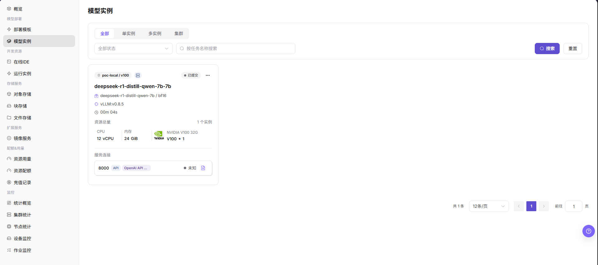

# 模型实例

::: info 文档信息
版本：v1.0
更新日期：2026-07-08
:::

## 功能概述

`模型实例` 用于查看通过部署模板创建的模型服务。普通用户可在这里按实例类型、状态和名称筛选实例，并进入后续详情、日志或访问排障流程。

| 项目 | 内容 |
| --- | --- |
| 适用角色 | 普通用户 |
| 导航路径 | AI基础设施 > On-Prem > 模型部署 > 模型实例 |
| 页面路由 | `/powerone/quickstart/model-service` |
| 管理对象 | 通过部署模板创建的模型服务实例 |
| 典型途径 | 查看模型实例列表、按类型和状态筛选实例、定位实例运行状态 |

#### 新手理解

模型实例像已经点单并启动的模型服务。部署模板负责创建，模型实例页面负责查看它有没有创建成功、是否还在运行、是否需要进一步排查。

#### 首次使用流程

1. 先在 `模型部署 > 模板` 创建模型实例。
2. 进入 `AI Infra > On-Prem > 模型部署 > 模型实例`。
3. 按实例类型或状态筛选列表。
4. 使用搜索条件定位目标实例。
5. 查看实例状态，必要时进入详情或日志页面。

#### 术语速查

| 术语 | 说明 |
| --- | --- |
| 实例 | 平台创建并调度到集群中的运行对象，例如模型服务、在线 IDE 或运行实例。 |
| 规格 | 作业可申请的资源套餐，例如 CPU、内存、GPU 型号和卡数。 |
| 单实例 | 一个模型服务实例独立运行，适合测试或小流量场景。 |
| 多实例 | 同一模型服务拥有多个副本，适合更高可用或更高并发。 |
| 集群实例 | 以集群形态运行的模型服务，通常用于更复杂的部署需求。 |

## 前提条件

1. 已至少创建过一个模型实例，或准备查看当前空列表状态。
2. 当前账号具备查看模型实例的权限。
3. 如需排障，需能进入实例详情、日志或监控页面。

## 页面说明

页面提供实例类型、状态、搜索和重置入口。当前环境截图中列表为空，表示该租户在当前条件下暂无模型服务实例。

#### 页面区域

| 字段/区域 | 说明 |
| --- | --- |
| 实例类型筛选 | 按全部（All）、单实例（Single Instance）、多实例（Multi-instance）、集群（Cluster）等类型缩小范围。 |
| 状态筛选 | 按全部状态或具体运行状态查看实例。 |
| 搜索区 | 输入条件后点击 `搜索（Search）` 定位目标实例。 |
| 列表区 | 展示模型实例及其状态；无数据时显示 No model services。 |
| 分页区 | 实例较多时按页查看。 |

## 主要操作

### 查看模型实例

#### 适用场景

当需要确认模型服务是否创建成功、是否仍在运行或是否存在异常时，查看模型实例列表。

#### 操作前确认

1. 已完成模型实例创建，或明确要确认当前没有实例。
2. 筛选条件不要过窄，避免误判为空。

#### 操作步骤

1. 进入 `AI Infra > On-Prem > 模型部署 > 模型实例`。
2. 查看实例列表，确认实例名称、实例类型、运行状态、所属模型、规格、地域和创建时间。
3. 按页面提供的 `实例类型`、`状态` 或搜索框筛选目标实例。
4. 点击 `搜索` 后确认筛选条件已生效。
5. 如需重新查看全量数据，点击 `重置` 清空筛选条件。
6. 如列表为空，先确认是否存在筛选条件、实例是否刚创建、当前租户或地域是否正确。
7. 如仅学习或截图，只查看列表、筛选字段和空状态，不执行停止、重启、删除等高风险动作。

## 参数说明

| 字段名称 | 说明 |
| --- | --- |
| 实例名称 | 模型服务实例名称。 |
| 实例类型 | 实例形态，例如单实例、多实例或集群实例。 |
| 状态 | 实例当前运行或生命周期状态。 |
| 模型 | 实例关联的模型。 |
| 规格 | 实例使用的资源规格。 |
| 地域 | 实例所在地域或资源池。 |
| 创建时间 | 实例创建时间。 |
| 搜索条件 | 用于缩小实例列表范围的筛选条件或关键字。 |
| 操作 | 行内可用操作，例如查看详情或实例生命周期操作。 |

## 踩坑提示

- 实例列表可能存在刷新延迟，刚创建的实例不会立即出现。
- 空列表不一定代表没有实例，先检查筛选条件、租户、地域和权限。
- `停止`、`重启`、`删除` 属于高风险动作。
- 学习或截图时只查看页面，不执行实例生命周期操作。
- 不写真实实例 ID、实例名称、租户信息、地域、节点、Endpoint、日志、错误详情或测试参数。

## 结果校验

| 检查项 | 成功表现 | 异常时处理 |
| --- | --- | --- |
| 筛选结果 | 实例列表与选择的 `实例类型`、`状态` 或搜索条件一致。 | 点击 `重置`，确认租户和地域后重新搜索。 |
| 目标实例可见 | 创建并刷新后，目标实例出现在列表中。 | 检查实例是否刚创建、创建流程是否成功以及权限是否足够。 |
| 状态检查 | 实例状态符合预期运行状态。 | 进入详情、日志、事件或监控页面继续排查。 |
| 学习边界 | 学习或截图过程中未执行 `停止`、`重启` 或 `删除`。 | 如误触发，立即检查实例状态、访问影响和操作记录。 |

## 常见问题

#### 创建后列表看不到实例

**问题现象：**部署模板提交后，模型实例列表仍为空。

**可能原因：**

- 当前筛选条件过滤了实例。
- 实例仍在创建中，列表尚未刷新。
- 创建流程提交失败。

**处理方式：**

1. 点击 `重置（Reset）` 后重新搜索。
2. 刷新页面再查看。
3. 回到部署模板或操作记录确认提交是否成功。

#### 实例状态异常

**问题现象：**实例显示失败、不可用或长时间创建中。

**可能原因：**

- 镜像拉取失败。
- 资源不足或规格不可调度。
- 启动参数或模型文件异常。

**处理方式：**

1. 进入实例详情查看日志。
2. 确认配额和目标规格。
3. 联系运营方检查镜像、集群和模板配置。

## 后续操作

1. 查看实例详情和日志。
2. 确认服务访问地址和调用方式。
3. 在 `资源用量` 中跟踪运行成本。

## 注意事项

- 排障时不要在截图中暴露内部访问凭据或接口密钥。
- 对外提供服务前，确认访问控制、实例规格和运行周期。
- `停止`、`重启`、`删除` 可能中断服务、释放资源或移除实例记录，执行前必须确认业务影响。
- 实例状态以列表页和详情页为准，概览页只提供入口和汇总。
