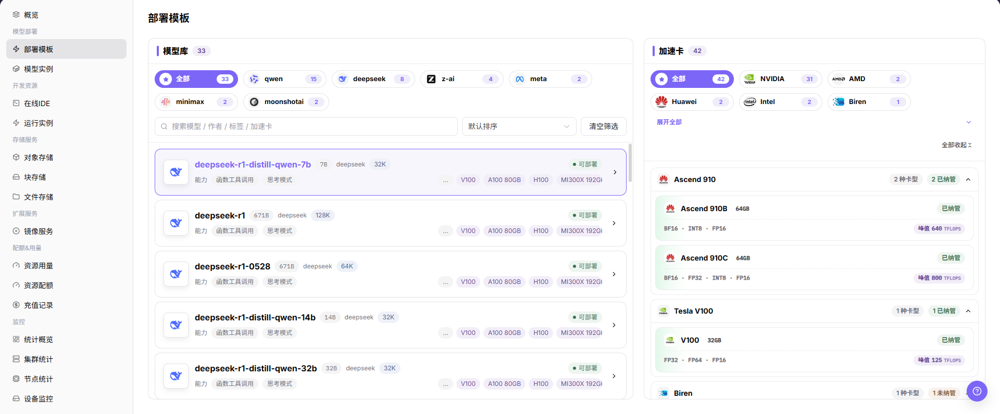
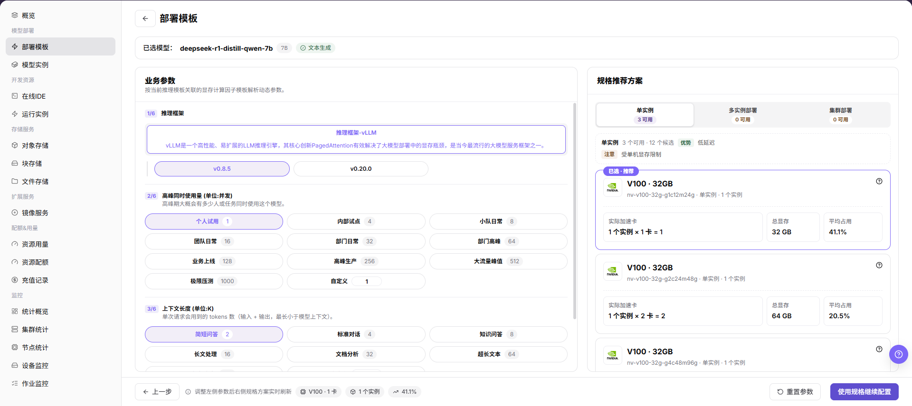
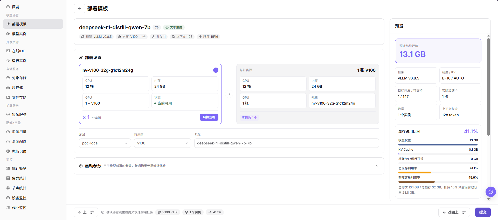

# 部署模板

::: info 文档信息
版本：v1.0
更新日期：2026-07-23
:::

## 功能概述

`部署模板` 用于普通用户查看运营方发布的部署模板，通过向导选择模型、加速卡、业务参数和推荐规格，并在确认影响后准备模型服务部署配置。

| 项目 | 内容 |
| --- | --- |
| 适用角色 | 普通用户 |
| 导航路径 | AI基础设施 > On-Prem > 模型部署 > 部署模板 |
| 页面路由 | `/powerone/quickstart/inference-template` |
| 管理对象 | 模型库、加速卡、业务参数、推荐规格、部署设置和预览信息 |
| 典型途径 | 查看运营方发布的部署模板，并在确认配额、规格和部署影响后创建模型服务实例 |

#### 新手理解

模板可以理解为模型服务的点单页。用户先选模型，再查看可用加速卡和推荐规格；确实需要创建实例时，再填写部署设置，并在预览页核对后提交。

#### 术语速查

| 术语 | 说明 |
| --- | --- |
| 模板 | 运营方维护的可部署方案，通常组合了模型、框架、镜像、规格、启动参数和可见范围。 |
| 模型库 | 展示当前用户或租户可使用模型的区域。 |
| 加速卡 | 用于运行所选模型的 GPU、NPU 等硬件选项。 |
| 推荐规格 | 平台根据模型和加速卡组合推荐的资源规格。 |
| 部署设置 | 创建实例前填写的实例名称、地域、规格、启动参数等配置。 |
| 预览 | 提交前展示的最终配置汇总。 |

## 前提条件

1. 运营方已发布至少一个当前租户可见的模板。
2. 当前租户在目标地域下有可用配额。
3. 模板依赖的镜像、加速卡、规格和框架参数已由运营方配置完成。
4. 如果部署会暴露服务，创建实例前应确认访问范围和安全策略。

## 页面说明

页面按向导展示模型库、加速卡、业务参数、推荐规格、部署设置和预览信息。截图中展示了部署模板列表区域。

#### 页面区域

| 字段/区域 | 说明 |
| --- | --- |
| 模型库 | 按模型厂商和模型名称展示可部署模型。 |
| 加速卡 | 展示加速卡厂商、型号、显存、适配状态和峰值能力。 |
| 业务参数 | 展示模型能力、上下文、启动或运行参数等需要确认的信息。 |
| 推荐规格 | 展示可选实例形态和推荐资源规格。 |
| 部署设置 | 用于填写实例名称、地域、规格、启动参数等部署信息。 |
| 预览 | 提交前汇总本次选择的部署配置。 |

## 主要操作

### 部署模板

#### 操作前确认

1. 确认当前账号可以进入 `AI Infra > On-Prem > 模型部署 > 部署模板`。
2. 如果页面提供全局租户或地域选择器，确认当前上下文正确。
3. 如仅学习或截图，提前明确不点击最终提交或确认动作。

#### 操作步骤

1. 进入 `AI Infra > On-Prem > 模型部署 > 部署模板`。
2. 在 `模型库` 查看可部署模型。
3. 选择目标模型，查看 `加速卡`、`业务参数` 和 `推荐规格`。
4. 核对 `业务参数` 中的模型能力、上下文、启动或运行参数。

5. 进入 `部署设置`，查看实例名称、地域、规格、启动参数等字段。

6. 在 `预览` 页面核对最终配置。
7. 如仅学习或截图，不点击最终 `提交`、`确定` 或 `确认` 动作。

## 参数说明

| 字段名称 | 是否必填 | 字段类型 | 说明 |
| --- | --- | --- | --- |
| 模板名称 | 系统生成 | 文本 | 平台展示的可部署模板名称。 |
| 模型 | 必填 | 选择项 | 从模型库中选择的目标模型。 |
| 加速卡 | 必填 | 选择项 | 本次部署使用的加速卡厂商和型号。 |
| 业务参数 | 取决于模板 | 表单字段 | 模板维护的模型能力、上下文、启动或运行参数。 |
| 推荐规格 | 必填 | 选择项 | 模板推荐或允许选择的资源规格。 |
| 地域 | 创建实例时必填 | 选择项 | 模型实例将要创建到的地域或资源池。 |
| 实例名称 | 创建实例时必填 | 文本 | 将要创建的模型实例名称。文档中不要使用真实客户或敏感名称。 |
| 启动参数 | 取决于模板 | 文本或表单字段 | 模板带出的启动参数，只有在明确业务需要时才调整。 |
| 状态 | 系统生成 | 枚举 | 模板或当前选择项是否可用于创建实例。 |

## 踩坑提示

- 加速卡显示 `未适配` 或 `未纳管` 时，可能无法直接部署。
- 推荐规格为空时，优先检查加速卡适配、资源规格、配额和地域。
- 模板参数由运营方维护，不要随意修改启动参数，错误参数可能导致模型服务启动失败。
- `提交`、`确定`、`确认` 属于高风险最终动作。
- 通过模板部署可能创建真实模型实例、占用资源并产生用量。
- 文档中不要写真实租户名、地域名、模型 ID、资源 ID、内部镜像地址、Endpoint、启动参数、日志或测试数据。

## 结果校验

| 检查项 | 预期结果 | 异常时处理 |
| --- | --- | --- |
| 页面可进入 | 可以从 `模型部署 > 部署模板` 进入页面。 | 检查账号权限、侧边栏路由和当前语言。 |
| 模板可见 | 模型库中展示可部署模板。 | 请运营方检查模板发布状态、租户可见范围和模型来源配置。 |
| 推荐规格出现 | 选择模型和加速卡后展示推荐规格。 | 检查加速卡适配、资源规格绑定、配额和地域。 |
| 学习边界 | 学习或截图过程中未提交最终创建动作。 | 如误提交，立即核对模型实例列表、配额用量和操作记录。 |

## 常见问题

#### 部署模板列表为空

**问题现象：**页面没有展示可部署模板。

**可能原因：**

- 运营方未发布模板。
- 当前租户不在模板可见范围内。
- 相关模型、框架、镜像、规格或加速卡配置未完成。

**处理方式：**

1. 确认当前租户和地域。
2. 请运营方检查模板状态和可见范围。
3. 检查相关规格、镜像和加速卡是否可用。

#### 继续按钮不可用

**问题现象：**选择模型后无法进入下一步，或推荐规格为空。

**可能原因：**

- 未选择加速卡。
- 模型与加速卡未适配。
- 当前租户没有对应规格配额。

**处理方式：**

1. 确认模型和加速卡都已选中。
2. 切换其他加速卡或实例类型。
3. 到 `资源配额` 或 `资源用量` 页面检查可用配额和用量。

#### 提交后模型实例启动失败

**问题现象：**实例创建后状态异常或无法提供服务。

**可能原因：**

- 镜像拉取失败。
- 启动参数不正确。
- 目标集群资源不足。

**处理方式：**

1. 进入模型实例详情查看状态、日志和事件。
2. 只在已批准的测试场景中使用模板默认参数重新创建测试实例。
3. 联系运营方检查镜像、规格、框架和集群资源。

## 后续操作

1. 进入 [模型实例](../instances/) 查看实例状态。
2. 进入 [资源用量](../../quotas-usage/usage/) 或 [资源配额](../../quotas-usage/quotas/) 复核配额和用量变化。
3. 进入 [统计概览](../../monitoring/overview/) 观察部署后的运行状态。

## 注意事项

- 通过模板部署可能创建真实模型实例、占用资源并产生用量，提交前必须确认实例名称、地域、规格和运行周期。
- 截图或工单中不要包含内部服务地址、访问密钥、Endpoint、敏感启动参数、日志或客户信息。
- 模板、规格和加速卡由运营方维护。用户侧无法选择目标项时，应联合运营方核对发布范围、租户可见性、配额和资源池状态。
