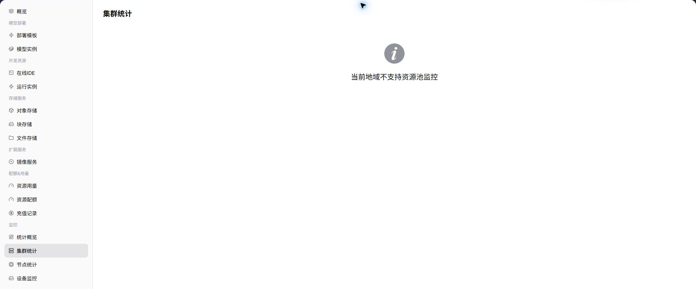

# 集群统计

::: info 文档信息
版本：v1.0
更新日期：2026-07-08
:::

## 功能概述

`集群统计` 用于在普通用户视角查看 用户可见范围内的集群资源趋势、容量和健康状态。当运营方已开放用户侧监控并且采集数据正常时，页面会展示对应图表、列表或统计指标；若能力未向所选地域开放，用户应结合实例状态、日志和事件进行排障，并联系运营方确认监控开放条件。

| 项目 | 内容 |
| --- | --- |
| 适用角色 | 普通用户 |
| 导航路径 | 监控 > 集群统计 |
| 页面路由 | `/powerone/user-monitor/clusters` |
| 管理对象 | 用户可见范围内的集群资源趋势、容量和健康状态 |
| 典型用途 | 判断任务所在集群是否资源紧张或状态异常 |

### 新手理解

集群统计像用户可见资源池的产能表，用来判断当前地域还有多少集群容量、节点规模和加速卡资源可承接任务。

### 术语速查表

| 术语 | 说明 |
| --- | --- |
| 集群名 | 承载实例、作业和资源调度的 Kubernetes 集群标识。 |
| 健康状态 | 集群整体可用性，通常由采集、节点和调度状态共同决定。 |
| GPU 总数 | 当前集群可见或纳入统计的加速卡数量。 |
| 节点数 | 集群中纳入监控统计的节点数量。 |

## 前提条件

1. 当前账号可查看目标地域的集群统计。
2. 运营方已将相关集群纳入用户侧监控范围。
3. 集群监控数据已同步到用户侧页面。
4. 当前账号具备查看资源水位或健康状态的权限。

## 页面说明

页面展示所选地域的集群统计能力。能力开放时，用户可以查看指标趋势、列表数据或关键状态；能力未开放时，页面会显示能力提示。

### 能力开放时页面预期

| 页面元素 | 示例 | 说明 |
| --- | --- | --- |
| 集群列表 | `prod-wuhan-gpu-1` | 展示用户可见范围内的集群。 |
| 集群水位 | `GPU 12/32、CPU 60%` | 判断容量是否紧张。 |
| 可用容量 | `A100 剩余 4 卡` | 判断是否适合继续提交作业。 |
| 健康状态 | `可用 / 异常 / 维护中` | 判断集群是否适合新建实例。 |
| 容量趋势 | `近 24 小时资源使用率` | 判断短期资源压力。 |

## 主要操作

### 查看集群统计

#### 操作步骤

1. 进入 `监控 > 集群统计`。
2. 确认右上角地域。
3. 按页面提供的时间、状态或关键字筛选。
4. 查看图表、列表或提示信息。
5. 如监控能力未开放，回到实例详情查看日志、事件和状态。

#### 能力开放时重点查看

- 集群健康状态是否正常。
- 节点数、GPU 总数和 CPU 总数是否符合预期。
- 资源水位有没有接近影响新任务创建的阈值。

#### 参数说明

| 字段名称 | 是否必填 | 字段类型 | 示例 | 说明 |
| --- | --- | --- | --- | --- |
| 集群名 | 必填 | 文本 | `cluster-a` | 定位用户可见的集群对象。 |
| 地域 | 条件必填 | 下拉选择 | `华中一区` | 限定集群所属地域。 |
| 节点数 | 系统生成 | 数字 | `24` | 集群中纳入统计的节点数量。 |
| GPU 总数 | 系统生成 | 数字 | `96` | 集群可见加速卡总量。 |
| CPU 总数 | 系统生成 | 数字 | `1536 Core` | 集群 CPU 总容量。 |
| 健康状态 | 系统生成 | 状态 | `健康` | 展示集群是否可用、告警或采集异常。 |

#### 踩坑提示

- 集群水位高不一定表示自己的任务会失败，还要看目标规格和配额。
- 集群健康异常时，不要反复提交相同作业，应先确认平台事件。
- 不同地域的集群资源不能混在一起判断。

#### 结果校验

| 检查项 | 成功表现 | 异常时处理 |
| --- | --- | --- |
| 列表展示集群名、地域、节点数和健 | 列表展示集群名、地域、节点数和健康状态。 | 未达到时回到对应页面核对权限、筛选条件和配置状态 |
| 资源容量与当前地域和可见范围一致 | 资源容量与当前地域和可见范围一致。 | 未达到时回到对应页面核对权限、筛选条件和配置状态 |
| 点击或下钻后能看到对应节点、设备 | 点击或下钻后能看到对应节点、设备或作业信息。 | 未达到时回到对应页面核对权限、筛选条件和配置状态 |

## 排障信息准备

集群页异常时，先准备以下信息，便于判断是集群接入、资源水位还是采集问题：

| 信息 | 示例 | 作用 |
| --- | --- | --- |
| 集群名 | `cluster-prod-a` | 定位目标集群。 |
| 地域 / 可用区 | `武汉 / wuhan-1` | 判断资源归属范围。 |
| 节点数 | `32` | 判断集群容量是否符合预期。 |
| 健康状态 | `异常 / 高水位 / 无数据` | 区分容量问题和采集问题。 |
| 关联作业时间 | `2026-07-13 10:00` | 对齐作业提交和监控曲线。 |

## 常见问题

### 集群水位高

**问题现象：**

集群 GPU、CPU 或内存水位长期接近上限。

**可能原因：**

- 同一地域有大量训练或推理任务运行。
- 目标规格绑定的集群容量不足。
- 部分节点不可用导致可调度容量下降。

**处理方式：**

1. 查看作业监控确认是否存在长时间运行任务。
2. 切换可用地域或规格后重试创建。
3. 联系运营方评估扩容、迁移或调整规格关联。

### 集群状态异常

**问题现象：**

集群列表显示异常、不可用或数据长时间不更新。

**可能原因：**

- 集群采集组件异常。
- 节点状态异常影响集群健康。
- 当前账号无法查看完整监控数据。

**处理方式：**

1. 记录集群名、地域和页面更新时间。
2. 查看节点统计是否存在 NotReady 节点。
3. 联系运营方检查集群接入和采集链路。

## 后续操作

1. 进入节点统计查看是否由少数节点导致集群异常。
2. 进入设备监控确认 GPU/NPU 资源是否充足。
3. 创建任务前结合资源配额和规格可用性一起判断。

## 注意事项

- 不要在截图中暴露真实集群名、内部域名或节点 IP。
- 集群健康状态和单个实例状态可能不同步，需要结合日志和事件判断。
- 容量不足时优先确认目标规格，而不是只看总集群水位。
