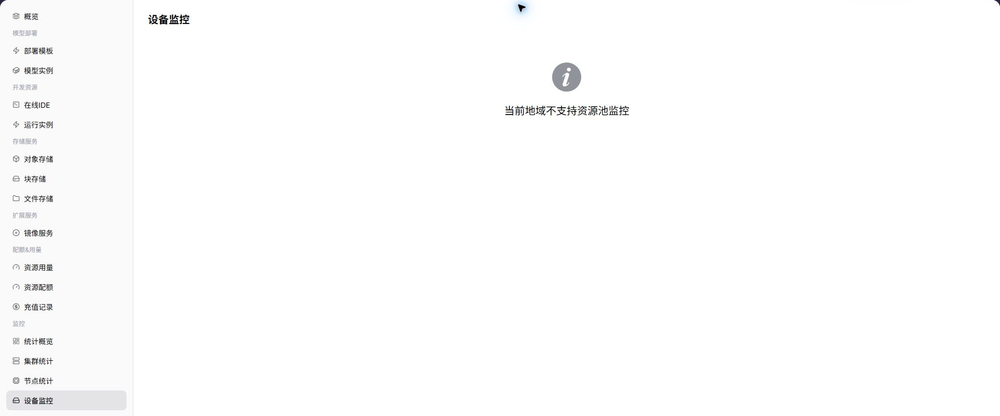

# 设备监控

::: info 文档信息
版本：v1.0
更新日期：2026-07-08
:::

## 功能概述

`设备监控` 用于在普通用户视角查看 用户可见范围内的 GPU/NPU 等设备利用率、显存和健康状态。当运营方已开放用户侧监控并且采集数据正常时，页面会展示对应图表、列表或统计指标；若能力未向所选地域开放，用户应结合实例状态、日志和事件进行排障，并联系运营方确认监控开放条件。

| 项目 | 内容 |
| --- | --- |
| 适用角色 | 普通用户 |
| 导航路径 | 监控 > 设备监控 |
| 页面路由 | `/powerone/user-monitor/devices` |
| 管理对象 | 用户可见范围内的 GPU/NPU 等设备利用率、显存和健康状态 |
| 典型用途 | 判断模型实例或训练任务是否受加速卡资源影响 |

### 新手理解

设备监控像每张 GPU/NPU 的体检表，用来查看设备类型、健康状态、温度和显存使用率，判断加速卡是否影响任务运行。

### 术语速查表

| 术语 | 说明 |
| --- | --- |
| 设备名 | 单张 GPU/NPU 或加速设备的标识。 |
| 设备类型 | 加速卡型号或厂商类型，例如 GPU、NPU。 |
| 显存使用率 | 设备显存占用比例，影响模型是否能启动。 |
| 健康状态 | 设备是否可用、告警或离线。 |

## 前提条件

1. 当前账号具备设备监控查看权限。
2. 目标地域存在可见 GPU/NPU 资源。
3. 设备插件和监控采集数据正常上报。
4. 需要排查的任务已明确使用的设备类型或规格。

## 页面说明

页面展示所选地域的设备监控能力。能力开放时，用户可以查看指标趋势、列表数据或关键状态；能力未开放时，页面会显示能力提示。

### 能力开放时页面预期

| 页面元素 | 示例 | 说明 |
| --- | --- | --- |
| 设备列表 | `GPU 0 / NPU 0` | 展示用户可见范围内的加速卡设备。 |
| 利用率图表 | `GPU Util 85%` | 判断设备是否忙碌或长期空闲。 |
| 显存指标 | `60GiB / 80GiB` | 判断模型或训练任务是否接近显存上限。 |
| 温度与健康状态 | `72C / Healthy` | 判断硬件健康、散热或驱动异常风险。 |
| 更新时间 | `2026-07-03 10:00` | 判断采集是否延迟。 |

## 主要操作

### 查看设备监控

#### 操作步骤

1. 进入 `监控 > 设备监控`。
2. 确认右上角地域。
3. 按页面提供的时间、状态或关键字筛选。
4. 查看图表、列表或提示信息。
5. 如监控能力未开放，回到实例详情查看日志、事件和状态。

#### 能力开放时重点查看

- GPU/NPU 利用率是否为空或持续异常。
- 显存使用率是否接近上限。
- 温度和健康状态是否存在告警。

#### 参数说明

| 字段名称 | 是否必填 | 字段类型 | 示例 | 说明 |
| --- | --- | --- | --- | --- |
| 设备名 | 必填 | 文本 | `GPU-0` | 定位单张设备。 |
| 设备类型 | 必填 | 枚举 | `NVIDIA A800` | 展示加速卡型号或类型。 |
| 节点 IP | 条件必填 | 文本 | `10.0.0.*` | 定位设备所在节点，文档和截图应脱敏。 |
| 健康状态 | 系统生成 | 状态 | `正常` | 展示设备是否可用或异常。 |
| 温度 | 系统生成 | 数值 | `71°C` | 辅助判断硬件健康和散热。 |
| 显存使用率 | 系统生成 | 百分比 | `78%` | 判断模型或作业显存压力。 |
| GPU/NPU 利用率 | 系统生成 | 百分比 | `63%` | 判断计算单元负载。 |

#### 踩坑提示

- 利用率为空可能是未采集、无任务或设备插件异常，不能直接判断为空闲。
- 显存高位会直接影响模型启动，即使集群总容量看起来充足。
- 温度异常应按硬件健康处理，不建议只通过重试任务规避。

#### 结果校验

| 检查项 | 成功表现 | 异常时处理 |
| --- | --- | --- |
| 设备列表展示设备名、类型、健康状 | 设备列表展示设备名、类型、健康状态、温度和显存使用率。 | 未达到时检查时间范围、集群、节点、设备、作业筛选条件和监控采集状态 |
| 设备指标能对应到节点和时间范围 | 设备指标能对应到节点和时间范围。 | 未达到时检查时间范围、集群、节点、设备、作业筛选条件和监控采集状态 |
| 异常设备与受影响实例、作业或规格 | 异常设备与受影响实例、作业或规格之间能建立排查关系。 | 未达到时检查时间范围、集群、节点、设备、作业筛选条件和监控采集状态 |

## 排障信息准备

设备页异常时，先准备以下信息，便于判断是设备采集、显存压力还是硬件健康问题：

| 信息 | 示例 | 作用 |
| --- | --- | --- |
| 设备名 / 编号 | `GPU-0` | 定位单张 GPU/NPU。 |
| 节点 IP / 节点名 | `node-gpu-01` | 找到设备所在节点。 |
| 利用率 | `GPU 95%` | 判断计算单元是否高负载。 |
| 显存 | `76 GB / 80 GB` | 判断是否显存不足。 |
| 温度 / 健康状态 | `78°C / 告警` | 判断是否需要硬件运维介入。 |

## 常见问题

### GPU/NPU 利用率为空

**问题现象：**

设备列表存在设备，但利用率或显存曲线为空。

**可能原因：**

- 当前时间范围没有运行任务。
- 设备采集组件或驱动上报异常。
- 当前账号无权查看完整设备指标。

**处理方式：**

1. 切换到任务运行时间范围查看。
2. 对比节点统计和作业监控确认是否有任务占用。
3. 联系运营方检查设备插件、驱动和监控采集。

### 温度或显存异常

**问题现象：**

设备温度持续偏高，或显存使用率接近上限导致实例启动失败。

**可能原因：**

- 高负载任务集中运行。
- 模型显存需求超过规格能力。
- 设备散热、驱动或硬件状态异常。

**处理方式：**

1. 确认受影响作业的模型规模和资源规格。
2. 降低并发、切换规格或等待资源释放后重试。
3. 向运营方反馈设备名、节点和异常时间段。

## 后续操作

1. 显存不足时，回到实例或作业配置降低模型规模、并发或上下文长度。
2. 设备健康异常时，避免继续选择同一设备类型提交高优先级任务。
3. 需要运营方处理时提供设备类型、节点、时间范围和错误现象。

## 注意事项

- 节点 IP、设备编号和硬件状态截图应脱敏。
- 设备监控只能说明硬件侧情况，模型参数错误仍需看实例日志。
- 不要把单卡利用率低直接等同为资源浪费，可能是采样窗口或任务类型导致。
