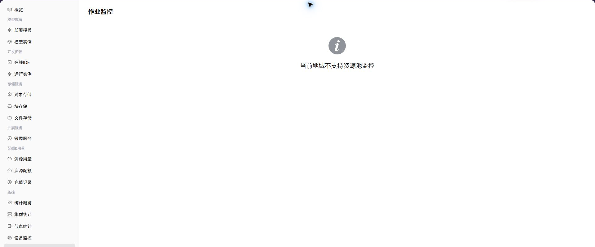

# 作业监控

::: info 文档信息
版本：v1.0
更新日期：2026-07-08
:::

## 功能概述

`作业监控` 用于在普通用户视角查看 用户可见范围内的模型实例、在线 IDE、运行实例和历史作业。当运营方已开放用户侧监控并且采集数据正常时，页面会展示对应图表、列表或统计指标；若能力未向所选地域开放，用户应结合实例状态、日志和事件进行排障，并联系运营方确认监控开放条件。

| 项目 | 内容 |
| --- | --- |
| 适用角色 | 普通用户 |
| 导航路径 | AI基础设施 > On-Prem > 监控 > 作业监控 |
| 页面路由 | `/powerone/user-monitor/work` |
| 管理对象 | 用户可见范围内的模型实例、在线 IDE、运行实例和历史作业 |
| 典型途径 | 定位排队、失败、长时间运行和资源消耗异常的作业 |

#### 新手理解

作业监控像个人任务排队清单，用来查看作业 ID、状态、排队时长、运行时长、GPU 占用和失败原因。

#### 术语速查表

| 术语 | 说明 |
| --- | --- |
| 作业 ID | 定位单个训练、推理或运行任务的编号。 |
| 排队时长 | 作业等待资源或调度条件满足的时间。 |
| 运行时长 | 作业开始运行后的持续时间。 |
| 失败原因 | 平台返回的调度、镜像、启动或资源错误摘要。 |

## 前提条件

1. 当前账号具备作业监控查看权限。
2. 目标作业属于当前账号或当前租户可见范围。
3. 作业已经提交并产生状态、事件或监控数据。
4. 已明确要排查的作业 ID 或提交时间。

## 页面说明

页面展示所选地域的作业监控能力。能力开放时，用户可以查看指标趋势、列表数据或关键状态；能力未开放时，页面会显示能力提示。

#### 能力开放时页面预期

| 页面元素 | 示例 | 说明 |
| --- | --- | --- |
| 作业列表 | `train-job-001` | 展示模型实例、在线 IDE 或运行实例关联作业。 |
| 作业状态 | `运行中 / 排队 / 失败` | 判断任务生命周期和当前处理阶段。 |
| 排队原因 | `资源不足 / 镜像拉取中` | 帮助定位创建慢或无法启动的原因。 |
| 运行时长 | `2h 13m` | 判断任务是否超出预期运行周期。 |
| 失败信息 | `ImagePullBackOff` | 判断是否需要查看日志、事件或联系运营方。 |

## 主要操作

### 查看作业监控

#### 操作步骤

1. 进入 `AI基础设施 > On-Prem > 监控 > 作业监控`。
2. 确认右上角地域。
3. 按页面提供的时间、状态或关键字筛选。
4. 查看图表、列表或提示信息。
5. 如监控能力未开放，回到实例详情查看日志、事件和状态。

#### 能力开放时重点查看

- 作业是否长时间排队。
- 失败原因是否指向配额、镜像、启动命令或资源不足。
- GPU 占用和运行时长是否符合预期。

## 参数说明

| 字段名称 | 是否必填 | 字段类型 | 示例 | 说明 |
| --- | --- | --- | --- | --- |
| 作业 ID | 必填 | 文本 | `job-20260706-001` | 定位单个作业。 |
| 状态 | 系统生成 | 状态 | `Running` | 展示排队、运行、成功或失败。 |
| 排队时长 | 系统生成 | 时长 | `18 分钟` | 判断是否存在调度等待。 |
| 运行时长 | 系统生成 | 时长 | `2 小时 15 分钟` | 判断任务是否超出预期。 |
| GPU 占用 | 系统生成 | 数字 / 规格 | `2 * A800` | 展示作业占用的加速卡资源。 |
| 失败原因 | 系统生成 | 文本 | `ImagePullBackOff` | 辅助定位失败方向。 |
| 提交时间 | 系统生成 | 日期时间 | `2026-07-06 09:30` | 用于和日志、事件、用量对齐。 |

## 踩坑提示

- 作业排队通常与配额、规格、容量或调度条件有关，不要只刷新页面。
- 失败原因为空时，优先查看实例事件和日志。
- GPU 占用正常但结果异常时，需要回到训练脚本或模型参数排查。

## 结果校验

| 检查项 | 成功表现 | 异常时处理 |
| --- | --- | --- |
| 作业列表展示 ID、状态、排队时 | 作业列表展示 ID、状态、排队时长、运行时长和资源占用。 | 未达到时检查时间范围、集群、节点、设备、作业筛选条件和监控采集状态 |
| 筛选条件变化后 | 筛选条件变化后，列表和统计结果同步变化。 | 未达到时检查时间范围、集群、节点、设备、作业筛选条件和监控采集状态 |
| 失败作业能下钻到错误摘要、事件或 | 失败作业能下钻到错误摘要、事件或日志入口。 | 未达到时检查时间范围、集群、节点、设备、作业筛选条件和监控采集状态 |

## 排障信息准备

作业页异常时，先准备以下信息，便于判断是排队、失败、资源不足还是历史数据保留问题：

| 信息 | 示例 | 作用 |
| --- | --- | --- |
| 作业 ID | `job-20260713001` | 精确定位任务记录。 |
| 作业状态 | `Queued / Failed / Running` | 判断处理方向。 |
| 排队时长 | `25 分钟` | 判断调度和资源等待问题。 |
| 失败时间 | `2026-07-13 10:15` | 对齐事件、日志和监控曲线。 |
| 规格 / 队列 | `2 * A800 / gpu-prod` | 判断资源池和配额是否匹配。 |

## 常见问题

#### 作业长时间排队

**问题现象：**

作业一直处于 Pending、Queued 或等待资源状态。

**可能原因：**

- 目标规格或 GPU 型号资源不足。
- 当前租户配额不足。
- 调度条件、节点标签或存储挂载条件不满足。

**处理方式：**

1. 核对资源配额和目标规格是否可用。
2. 查看集群、节点和设备监控确认容量。
3. 必要时切换规格、地域或联系运营方调整资源。

#### 作业失败但日志为空

**问题现象：**

作业状态为失败，但日志页面没有应用输出。

**可能原因：**

- 容器未成功启动，日志还未产生。
- 镜像拉取、启动命令或挂载失败发生在应用启动前。
- 日志采集存在延迟或权限限制。

**处理方式：**

1. 查看事件和失败原因字段。
2. 检查镜像地址、启动命令、环境变量和挂载路径。
3. 提供作业 ID、提交时间和错误摘要给运营方排查。

## 后续操作

1. 排队问题先核对配额、规格和设备容量。
2. 失败问题先查看事件、镜像、启动命令和挂载路径。
3. 高耗时作业应结合用量页面评估资源消耗。

## 注意事项

- 作业 ID、镜像地址、数据路径和日志内容可能包含敏感信息。
- 停止作业前确认输出文件和日志是否需要保留。
- 同一错误反复出现时，应先调整配置再重试，避免持续消耗额度。
