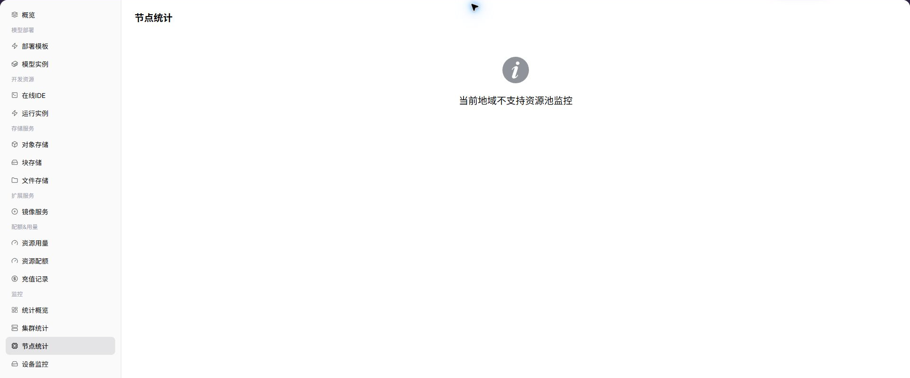

# 节点统计

::: info 文档信息
版本：v1.0
更新日期：2026-07-08
:::

## 功能概述

`节点统计` 用于在普通用户视角查看 用户可见范围内的节点资源趋势和状态。当运营方已开放用户侧监控并且采集数据正常时，页面会展示对应图表、列表或统计指标；若能力未向所选地域开放，用户应结合实例状态、日志和事件进行排障，并联系运营方确认监控开放条件。

| 项目 | 内容 |
| --- | --- |
| 适用角色 | 普通用户 |
| 导航路径 | AI基础设施 > On-Prem > 监控 > 节点统计 |
| 页面路由 | `/powerone/user-monitor/node` |
| 管理对象 | 用户可见范围内的节点资源趋势和状态 |
| 典型途径 | 判断实例是否受到节点资源或节点状态影响 |

#### 新手理解

节点统计像每台服务器的仪表盘，用来观察节点 CPU、内存、GPU 和状态，判断任务慢或失败是不是落在某个节点上。

#### 术语速查表

| 术语 | 说明 |
| --- | --- |
| 节点名 | 集群内承载实例或作业的服务器节点标识。 |
| CPU 使用率 | 节点计算资源使用比例。 |
| 内存使用率 | 节点内存占用比例。 |
| GPU 使用率 | 节点加速卡计算资源使用比例。 |

## 前提条件

1. 当前账号具备节点监控查看权限。
2. 运营方已开放目标地域或集群的节点指标。
3. 节点采集数据已正常上报。
4. 需要排查的实例或作业能对应到时间范围。

## 页面说明

页面展示所选地域的节点统计能力。能力开放时，用户可以查看指标趋势、列表数据或关键状态；能力未开放时，页面会显示能力提示。

#### 能力开放时页面预期

| 页面元素 | 示例 | 说明 |
| --- | --- | --- |
| 节点列表 | `node-a-01` | 展示用户可见范围内的节点。 |
| CPU 指标 | `CPU 使用率 65%` | 判断节点计算资源压力。 |
| 内存指标 | `128GiB / 256GiB` | 判断实例是否受内存资源影响。 |
| 磁盘指标 | `Disk 70%` | 判断日志、缓存或数据目录是否接近上限。 |
| 节点状态 | `Ready / NotReady` | 判断节点是否可承载作业。 |

## 主要操作

### 查看节点统计

#### 操作步骤

1. 进入 `监控 > 节点统计`。
2. 确认右上角地域。
3. 按页面提供的时间、状态或关键字筛选。
4. 查看图表、列表或提示信息。
5. 如监控能力未开放，回到实例详情查看日志、事件和状态。

#### 能力开放时重点查看

- 节点是否 Ready 或可调度。
- CPU、内存、GPU 曲线是否持续高位。
- 曲线是否中断或更新时间明显滞后。

## 参数说明

| 字段名称 | 是否必填 | 字段类型 | 示例 | 说明 |
| --- | --- | --- | --- | --- |
| 节点名 | 必填 | 文本 | `node-gpu-01` | 定位具体节点。 |
| 地域 | 条件必填 | 下拉选择 | `华中一区` | 限定节点所属地域。 |
| 集群 | 条件必填 | 下拉选择 | `cluster-a` | 限定节点所属集群。 |
| CPU 使用率 | 系统生成 | 百分比 | `72%` | 判断节点 CPU 压力。 |
| 内存使用率 | 系统生成 | 百分比 | `81%` | 判断节点内存压力。 |
| GPU 使用率 | 系统生成 | 百分比 | `65%` | 判断节点加速卡计算压力。 |
| 节点状态 | 系统生成 | 状态 | `Ready` | 展示节点是否可用或异常。 |

## 踩坑提示

- CPU 或内存曲线短暂升高不一定是故障，要结合任务运行窗口。
- 曲线中断可能是采集延迟，也可能是节点不可用。
- 用户侧通常不能直接维护节点，排障时应准备时间范围和实例信息给运营方。

## 结果校验

| 检查项 | 成功表现 | 异常时处理 |
| --- | --- | --- |
| 节点列表展示节点名、所属集群、状 | 节点列表展示节点名、所属集群、状态和关键指标。 | 未达到时检查时间范围、集群、节点、设备、作业筛选条件和监控采集状态 |
| 指标曲线与选择的时间范围一致 | 指标曲线与选择的时间范围一致。 | 未达到时检查时间范围、集群、节点、设备、作业筛选条件和监控采集状态 |
| 异常节点能与受影响实例或作业时间 | 异常节点能与受影响实例或作业时间段对应。 | 未达到时检查时间范围、集群、节点、设备、作业筛选条件和监控采集状态 |

## 排障信息准备

节点页异常时，先准备以下信息，便于判断是单节点故障、资源耗尽还是采集延迟：

| 信息 | 示例 | 作用 |
| --- | --- | --- |
| 节点名 | `node-gpu-01` | 定位具体机器。 |
| 所属集群 | `cluster-prod-a` | 判断节点归属和影响范围。 |
| CPU / 内存曲线 | `CPU 92% / 内存 85%` | 判断是否资源高水位。 |
| 磁盘曲线 | `磁盘 90%` | 判断镜像拉取、日志写入和临时文件风险。 |
| 节点状态时间 | `NotReady 10 分钟` | 判断异常持续时间。 |

## 常见问题

#### 节点不可用

**问题现象：**

节点状态显示异常，相关实例或作业创建失败、重启或迁移。

**可能原因：**

- 节点 NotReady、不可调度或维护中。
- 节点资源耗尽或设备异常。
- 监控采集延迟导致状态未及时恢复。

**处理方式：**

1. 记录节点名、地域、集群和异常时间。
2. 查看作业或实例事件确认是否调度到该节点。
3. 联系运营方处理节点状态或迁移资源。

#### CPU/内存曲线中断

**问题现象：**

节点指标曲线中间断开或长时间没有新数据。

**可能原因：**

- 监控采集组件异常。
- 节点网络或系统状态异常。
- 所选时间范围没有覆盖采集数据。

**处理方式：**

1. 调整时间范围确认是否仅为短时缺口。
2. 对比集群统计和作业监控判断影响范围。
3. 向运营方提供脱敏节点名和时间段。

## 后续操作

1. 节点指标异常时，查看受影响作业或实例是否集中在该节点。
2. GPU 相关问题继续进入设备监控。
3. 如果节点持续异常，避免在同一规格上反复重试。

## 注意事项

- 节点名、IP 和标签属于运维敏感信息，截图前需脱敏。
- 节点指标仅说明资源状态，业务失败还需要结合日志和事件。
- 用户侧不能直接修复节点，应把证据交给运营方。
