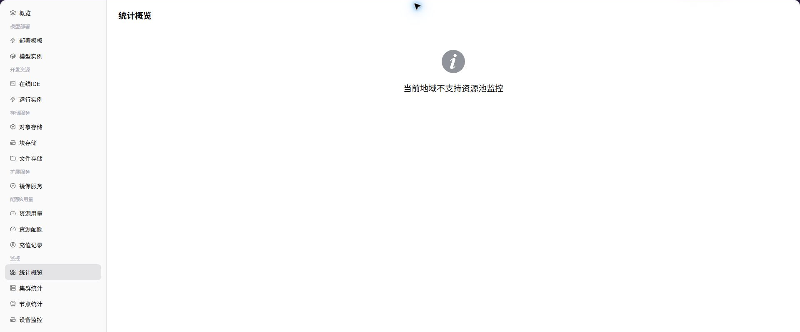

# 统计概览

::: info 文档信息
版本：v1.0
更新日期：2026-07-03
:::

::: warning 安全提示
监控截图和说明中不要暴露真实节点名、节点 IP、租户名称、业务标识、内部域名或告警细节。对外沟通时优先使用脱敏后的资源编号、时间范围和现象描述。
:::

## 功能概述

`统计概览` 用于在普通用户视角查看 资源池监控概况、实例运行状态和关键资源趋势。当运营方已开放用户侧监控并且采集数据正常时，页面会展示对应图表、列表或统计指标；若能力未向所选地域开放，用户应结合实例状态、日志和事件进行排障，并联系运营方确认监控开放条件。

| 项目 | 内容 |
| --- | --- |
| 适用角色 | 普通用户 |
| 导航路径 | 监控 > 统计概览 |
| 页面路由 | `/powerone/user-monitor/overview` |
| 管理对象 | 资源池监控概况、实例运行状态和关键资源趋势 |
| 典型用途 | 快速判断所选地域是否有可见监控数据，并进入下钻页面 |

### 新手理解

统计概览像普通用户的资源天气图，用一屏查看当前地域的集群数量、节点状态、异常数量和更新时间，先判断是否需要继续下钻。

### 术语速查表

| 术语 | 说明 |
| --- | --- |
| 时间范围 | 限制总览卡片、趋势和异常统计的查询窗口。 |
| 地域 | 当前用户可见的资源范围，切换后总览数据会变化。 |
| 异常数量 | 当前时间范围内失败作业、高水位资源或离线对象的汇总。 |
| 更新时间 | 判断监控数据是否延迟的时间点。 |

## 前提条件

1. 当前账号具备用户侧监控查看权限。
2. 目标地域已经由运营方开放监控能力。
3. 当前账号在该地域有可见实例、作业或资源。
4. 监控采集数据已完成同步，页面更新时间不应明显滞后。

## 页面说明

页面展示所选地域的统计概览能力。能力开放时，用户可以查看指标趋势、列表数据或关键状态；能力未开放时，页面会显示能力提示。

### 能力开放时页面预期

| 页面元素 | 示例 | 说明 |
| --- | --- | --- |
| 总览卡片 | `集群数 / 节点数 / 作业数 / 告警数` | 快速判断资源池整体状态。 |
| 趋势入口 | `资源趋势 / 作业趋势` | 从总览跳转到集群、节点、设备或作业维度。 |
| 异常聚合 | `失败作业 / 高水位资源 / 离线节点` | 帮助用户优先处理影响当前实例的问题。 |
| 更新时间 | `2026-07-03 10:00` | 判断数据是否存在采集延迟。 |
## 查看统计概览

### 操作步骤

1. 进入 `监控 > 统计概览`。
2. 确认右上角地域。
3. 按页面提供的时间、状态或关键字筛选。
4. 查看图表、列表或提示信息。
5. 如监控能力未开放，回到实例详情查看日志、事件和状态。

### 能力开放时重点查看

- 总览卡片中的集群数、节点状态和异常数量。
- 资源趋势是否与近期实例创建、训练任务或部署变更一致。
- 更新时间是否晚于最近一次操作。

### 参数说明

| 字段名称 | 是否必填 | 字段类型 | 示例 | 说明 |
| --- | --- | --- | --- | --- |
| 时间范围 | 是 | 日期范围 | `近 1 小时` | 控制总览统计和趋势查询窗口。 |
| 地域 | 条件必填 | 下拉选择 | `华中一区` | 限定当前用户可见的资源范围。 |
| 集群数 | 系统生成 | 数字 | `3` | 当前地域可见或关联的集群数量。 |
| 节点状态 | 系统生成 | 状态 / 数字 | `Ready 12 / NotReady 1` | 汇总节点可用性。 |
| 异常数量 | 系统生成 | 数字 | `2` | 聚合失败作业、离线节点或高水位资源。 |
| 更新时间 | 系统生成 | 日期时间 | `2026-07-06 10:00` | 判断监控数据是否及时刷新。 |

### 踩坑提示

- 总览适合判断方向，不适合作为单个实例失败的唯一依据。
- 异常数量与详情页不一致时，先固定地域和时间范围。
- 如果页面只显示能力提示，优先查看实例日志、事件和用量，再联系运营方确认开放条件。

### 结果校验

1. 总览卡片显示时间范围、地域、集群数和异常数量。
2. 切换时间范围后，趋势图或异常数量同步变化。
3. 下钻到集群、节点、设备或作业页后，对象范围与总览一致。

## 联系运营方前准备

当页面能力未开放、数据为空或挂载失败时，联系运营方前建议准备以下信息：

| 信息 | 示例 | 作用 |
| --- | --- | --- |
| 当前地域 | `武汉` | 判断能力是否在该地域开放。 |
| 当前账号 / 租户 | `tenant-a` | 判断菜单、资源和监控权限。 |
| 目标实例或作业 | `train-job-001` | 便于定位日志、事件和计量记录。 |
| 目标规格或资源 | `gpu-a100-1-16c-64g` | 判断配额、规格和集群能力。 |
| 页面现象 | `无数据 / 挂载失败 / 图表为空` | 帮助运营方判断入口、采集或底层资源问题。 |

替代排障路径：

1. 先查看实例详情、日志和事件。
2. 查看资源用量和资源配额，确认是否存在配额或额度限制。
3. 存储能力不可用时，优先使用对象存储保存模型、数据集和输出产物。
4. 监控能力未开放时，以实例状态、日志、事件和用量作为短期排障依据。

## 常见问题

### 总览数据延迟

**问题现象：**

实例已经创建或作业已经结束，但总览卡片仍未更新。

**可能原因：**

- 监控采集链路存在同步延迟。
- 页面时间范围没有覆盖最新操作时间。
- 当前地域的用户侧监控能力尚未完全开放。

**处理方式：**

1. 确认页面更新时间和当前时间差距。
2. 切换到覆盖操作时间的时间范围。
3. 使用实例详情、事件和日志交叉确认状态后再联系运营方。

### 异常数与详情页不一致

**问题现象：**

总览显示有异常，但进入详情页后数量或对象对不上。

**可能原因：**

- 总览和详情页使用了不同时间范围或地域。
- 异常对象在刷新期间恢复或被清理。
- 部分对象因权限限制没有在详情页展示。

**处理方式：**

1. 统一地域、时间范围和筛选条件。
2. 刷新页面后查看更新时间是否一致。
3. 向运营方提供脱敏的时间范围、地域和异常类型。

## 后续操作

1. 根据异常类型进入集群、节点、设备或作业页面继续定位。
2. 如果只影响自己的实例，优先查看实例详情、日志和事件。
3. 如果多类指标同时异常，记录时间范围和资源对象后联系运营方。

## 注意事项

- 截图前遮挡租户名称、节点名、节点 IP 和业务标识。
- 不要把总览中的瞬时高水位直接等同于故障。
- 对外反馈时使用脱敏资源编号和时间范围。
