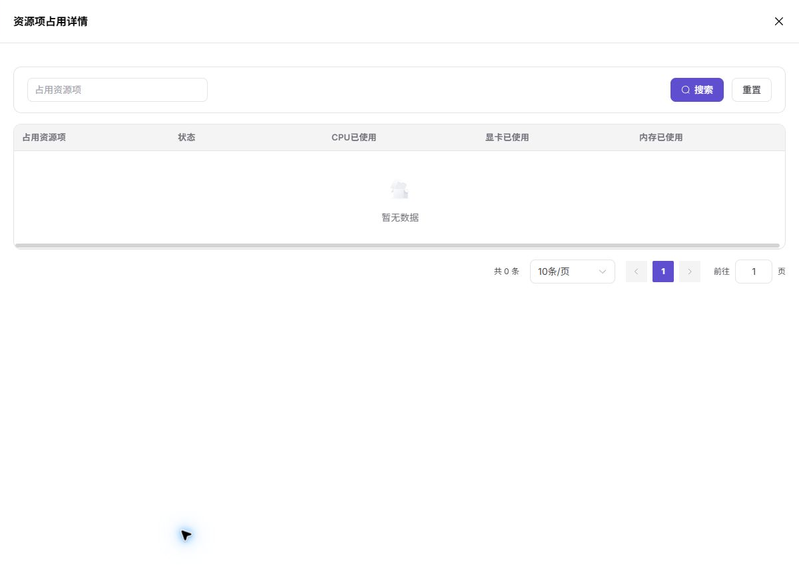

# 资源配额

::: info 文档信息
版本：v1.0
更新日期：2026-07-08
:::

## 功能概述

`资源配额` 用于展示当前租户在 AI 卡、CPU、内存以及不同实例类型上的总量、已用量和可用情况。普通用户创建实例前应先确认配额是否满足需求。

| 项目 | 内容 |
| --- | --- |
| 适用角色 | 普通用户 |
| 导航路径 | 配额&用量 > 资源配额 |
| 页面路由 | `/powerone/quota-usage/quota` |
| 管理对象 | AI 卡、CPU、内存、在线 IDE 和运行实例配额 |
| 典型用途 | 查看当前租户资源上限和已用量，判断能否创建实例 |

### 新手理解

我的额度像个人资源余额表，用来查看当前还能创建多少实例、使用多少算力和存储。

### 首次使用流程

1. 进入 `配额&用量 > 资源配额`。
2. 查看 AI card、CPU、Memory 总量和已用量。
3. 查看 Runtime Instance 和 Online IDE 的资源占用。
4. 点击 `View Resource Usage` 查看占用详情。
5. 配额不足时释放闲置实例或联系运营方调整。

### 术语速查

| 术语 | 说明 |
| --- | --- |
| 配额 | 租户可使用的资源上限，常见维度包括 GPU、CPU、内存和规格。 |
| AI card | AI 加速卡配额，可能包含 GPU、NPU 或其他卡。 |
| Used | 已使用资源量。 |
| Total | 总配额。 |

## 前提条件

1. 当前账号具备查看配额的权限。
2. 运营方已为租户分配资源配额。
3. 如需申请调整配额，需明确目标规格和业务需求。

## 页面说明

页面按资源类型展示 Total、Unused 和 Used，并分别展示运行实例与在线 IDE 的资源占用。截图中 GPU、CPU 和 Memory 均为 Unlimited 或 0 Used。

### 页面区域

| 字段/区域 | 说明 |
| --- | --- |
| AI card | 展示 AI 加速卡总量、未用量和已用量。 |
| CPU | 展示 CPU 总配额和已使用 vCPU。 |
| Memory | 展示内存总配额和已使用 GiB。 |
| Runtime Instance | 展示运行实例占用。 |
| Online IDE | 展示在线 IDE 占用。 |
| View Resource Usage | 查看对应类型的资源占用详情。 |

## 主要操作

### 查看资源占用

#### 适用场景

当创建失败提示配额不足，或需要确认资源被哪些实例占用时，查看资源占用详情。

#### 操作前确认

1. 已确认目标资源类型，例如 GPU、CPU 或 Memory。
2. 已确认需要查看运行实例还是在线 IDE 占用。

#### 操作步骤

1. 进入 `配额&用量 > 资源配额`。
2. 找到 `Runtime Instance` 或 `Online IDE` 区域。
3. 点击 `View Resource Usage`。
4. 在弹窗中查看资源占用项。
5. 定位占用实例后进入对应实例列表处理。

下图展示资源占用详情弹窗，用于查看实例维度的资源使用情况。

#### 参数说明

| 字段名称 | 是否必填 | 字段类型 | 示例 | 说明 |
| --- | --- | --- | --- | --- |
| 资源类型 | 必填 | 枚举 | `GPU` | 查看 CPU、GPU/NPU、内存、存储或实例数等额度。 |
| 总额度 | 系统生成 | 数字 / 容量 | `4 卡` | 当前账号或租户可使用的资源上限。 |
| 已用额度 | 系统生成 | 数字 / 容量 | `2 卡` | 已经被运行中资源占用的额度。 |
| 剩余额度 | 系统生成 | 数字 / 容量 | `2 卡` | 仍可用于创建资源的额度。 |
| 地域 | 条件必填 | 下拉选择 | `华中一区` | 限定额度所属地域或资源池。 |
| 更新时间 | 系统生成 | 日期时间 | `2026-07-06 10:00` | 判断额度数据是否及时刷新。 |

#### 踩坑提示

- 配额充足但创建失败时，可能是实际集群资源不足。
- 占用详情为空但 Used 不为 0 时，可能存在统计延迟。

#### 结果校验

| 检查项 | 成功表现 | 异常时处理 |
| --- | --- | --- |
| 资源占用弹窗能打开 | 资源占用弹窗能打开。 | 未达到时回到对应页面核对权限、筛选条件和配置状态 |
| 占用项与实例类型一致 | 占用项与实例类型一致。 | 未达到时回到对应页面核对权限、筛选条件和配置状态 |
| 可定位到需要释放或保留的实例 | 可定位到需要释放或保留的实例。 | 未达到时回到对应页面核对权限、筛选条件和配置状态 |

## 结果校验

- 当前页面的目标记录、状态、关联对象或统计结果与本次查看范围一致。
- 完成配置或查看后，返回列表确认页面能正常加载，筛选条件和目标对象仍可定位。
- 涉及资源、配额、监控或存储影响时，继续结合“配置规则与影响”和“注意事项”核对。

## 配置规则与影响

- 配额控制租户可用上限，不等同于底层集群实时空闲量。
- 在线 IDE 和运行实例可能分别统计占用。
- 释放实例后配额回收可能存在短暂延迟。

## 常见问题

### 显示 Unlimited 还会创建失败吗

**问题现象：**配额显示 Unlimited，但实例创建失败。

**可能原因：**

- 底层集群没有空闲资源。
- 规格不可调度。
- 镜像或存储配置失败。

**处理方式：**

1. 查看实例创建错误。
2. 切换规格或地域。
3. 联系运营方确认集群容量。

### 释放实例后配额没有立刻恢复

**问题现象：**实例停止或删除后 Used 仍显示占用。

**可能原因：**

- 统计延迟。
- 实例仍在释放中。
- 还有其他实例占用同类资源。

**处理方式：**

1. 等待页面刷新。
2. 查看资源占用详情。
3. 确认实例生命周期已结束。

## 后续操作

1. 剩余额度不足时，释放不再使用的实例、作业或存储资源。
2. 确认业务确需扩容后，联系运营方申请调整额度。
3. 创建实例失败时，同时核对额度、规格可用性和集群容量。
4. 定期查看额度变化，避免长期运行资源占满配额。

## 注意事项

- 剩余额度充足不代表一定能创建成功，还需满足地域、规格、镜像、存储和集群能力。
- 截图时不要暴露租户名称、业务项目名或内部资源编号。
- 额度刷新可能存在延迟，释放资源后可等待页面更新时间更新。
