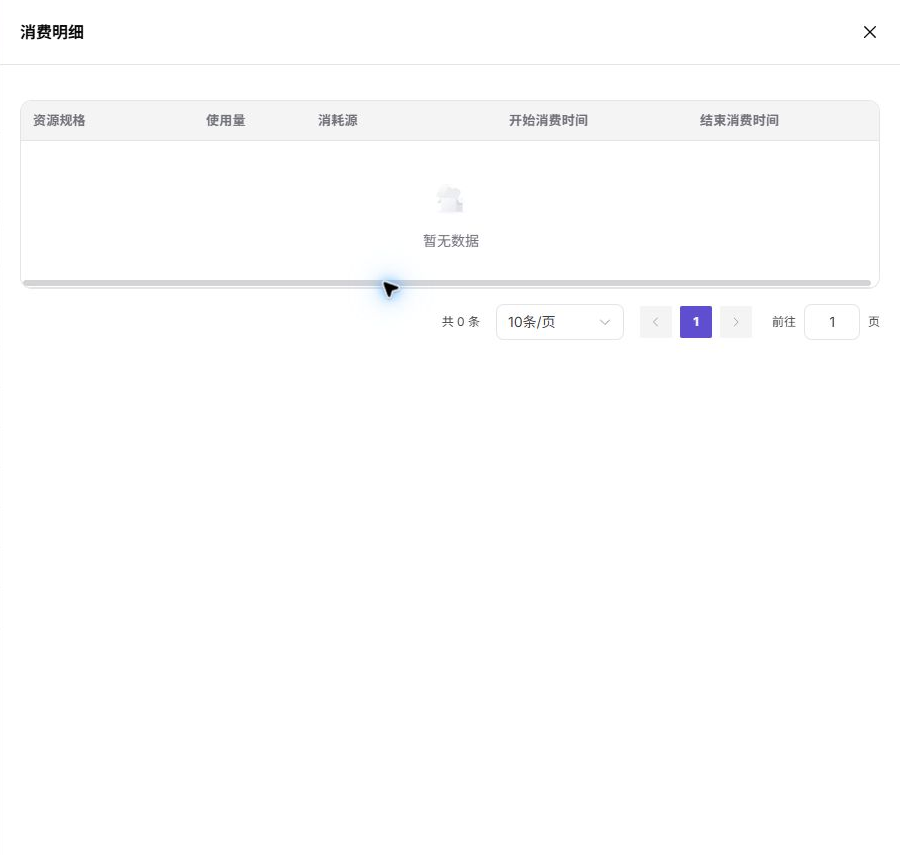

# 资源用量

::: info 文档信息
版本：v1.0
更新日期：2026-07-08
:::

## 功能概述

`资源用量` 用于查看当前租户在不同资源规格上的用量和消费明细。普通用户可以按规格查看配额，并进入消费明细确认资源消耗来源。

| 项目 | 内容 |
| --- | --- |
| 适用角色 | 普通用户 |
| 导航路径 | AI基础设施 > On-Prem > 配额&用量 > 资源用量 |
| 页面路由 | `/powerone/quota-usage/usage` |
| 管理对象 | 资源规格用量、配额占用、消费明细 |
| 典型途径 | 查看各规格的额度、占用和消费明细，辅助判断资源消耗来源 |

#### 新手理解

我的用量像个人资源消费记录，用来查看一段时间内用了多少算力、存储和服务资源。

#### 首次使用流程

1. 进入 `配额&用量 > 资源用量`。
2. 按条件搜索目标规格。
3. 查看规格配额。
4. 点击 `Consumption Details` 查看该规格的消费明细。
5. 结合实例列表定位消耗来源。

#### 术语速查

| 术语 | 说明 |
| --- | --- |
| 配额 | 租户可使用的资源上限，常见维度包括 GPU、CPU、内存和规格。 |
| 规格 | 作业可申请的资源套餐，例如 CPU、内存、GPU 型号和卡数。 |
| 消费明细 | 某个规格下的具体资源消耗记录。 |
| 额度 | 资源或余额的可用上限。 |

## 前提条件

1. 当前账号具备查看资源用量的权限。
2. 平台已有配额或用量统计数据。
3. 如需定位具体实例，需具备对应实例查看权限。

## 页面说明

页面以表格展示资源规格、配额和操作入口。截图中可看到多个规格的额度为 Unlimited，并提供 `Consumption Details`。

#### 页面区域

| 字段/区域 | 说明 |
| --- | --- |
| 搜索区 | 按条件筛选资源规格。 |
| Resource Specification | 规格名称。 |
| Quota | 该规格的配额上限。 |
| Consumption Details | 打开该规格的消费明细。 |
| 分页区 | 用量记录较多时分页查看。 |

## 主要操作

### 查看消费明细

#### 适用场景

当需要确认某个规格的资源消耗来自哪些实例或任务时，查看消费明细。

#### 操作前确认

1. 已定位到目标资源规格。
2. 确认筛选条件没有过滤掉目标记录。

#### 操作步骤

1. 进入 `AI基础设施 > On-Prem > 配额&用量 > 资源用量`。
2. 找到目标规格。
3. 点击该行 `Consumption Details`。
4. 在明细弹窗或抽屉中查看消费记录。
5. 根据实例名称、时间和资源类型继续排查。

下图展示消费明细入口打开后的页面状态，可用于查看规格用量来源。

## 参数说明

| 字段名称 | 是否必填 | 字段类型 | 示例 | 说明 |
| --- | --- | --- | --- | --- |
| 时间范围 | 必填 | 日期范围 | `近 7 天` | 限定用量查询窗口。 |
| 资源类型 | 条件必填 | 枚举 | `GPU` | 按算力、存储或实例类别查看使用情况。 |
| 资源名称 | 否 | 文本 | `train-job-001` | 定位产生用量的具体资源。 |
| 累计用量 | 系统生成 | 数字 / 时长 | `48 卡时` | 所选范围内的资源使用量。 |
| 消耗额度 | 系统生成 | 数字 | `1440 Credits` | 按平台规则折算后的消耗额度。 |
| 统计更新时间 | 系统生成 | 日期时间 | `2026-07-06 10:00` | 判断用量数据是否完成同步。 |

## 踩坑提示

- 如果明细为空，可能是该规格当前没有消费记录。
- 统计数据可能有延迟，不适合替代实时实例状态。

## 结果校验

| 检查项 | 成功表现 | 异常时处理 |
| --- | --- | --- |
| 明细页面或抽屉能打开 | 明细页面或抽屉能打开。 | 未达到时检查资源类型、时间范围、额度余额和消费明细 |
| 记录中的规格与点击行一致 | 记录中的规格与点击行一致。 | 未达到时检查资源类型、时间范围、额度余额和消费明细 |
| 消耗来源可与实例或作业对应 | 消耗来源可与实例或作业对应。 | 未达到时检查资源类型、时间范围、额度余额和消费明细 |

## 配置规则与影响

- 资源用量用于统计和核对，不直接创建或释放资源。
- Unlimited 表示没有固定上限，但仍受底层资源和调度条件影响。
- 消费明细可能存在延迟，应结合实例详情判断实时状态。

## 常见问题

#### 用量列表为空

**问题现象：**资源用量页面没有规格或记录。

**可能原因：**

- 当前租户没有分配规格。
- 筛选条件过窄。
- 统计服务暂无数据。

**处理方式：**

1. 点击 `重置（Reset）`。
2. 确认资源配额页面是否有规格。
3. 联系运营方检查配额分配。

#### 明细和实例状态对不上

**问题现象：**消费明细显示用量，但实例列表看不到对应运行对象。

**可能原因：**

- 统计存在延迟。
- 实例已结束或被删除。
- 筛选条件或时间范围不同。

**处理方式：**

1. 扩大时间范围查看。
2. 查看历史实例或作业记录。
3. 联系运营方核对计量数据。

## 后续操作

1. 用量异常增长时，按资源名称或时间范围定位高消耗实例和作业。
2. 与额度变化不一致时，等待计量同步后再次核对，必要时联系运营方。
3. 需要成本复盘时，导出或记录用量趋势、资源类型和业务用途。
4. 对长期运行资源设置停用或清理计划，避免持续消耗额度。

## 注意事项

- 用量统计可能晚于资源状态变化，短时间内出现差异属于常见现象。
- 用量数据可能包含业务资源名称，对外沟通前应脱敏。
- 费用或 Credits 解释应以平台计量规则为准，不要用单次截图作为最终结算依据。
