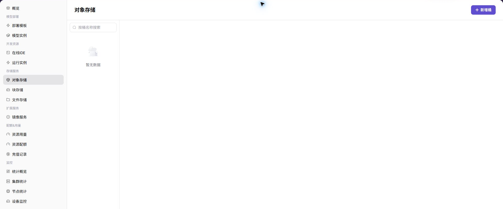
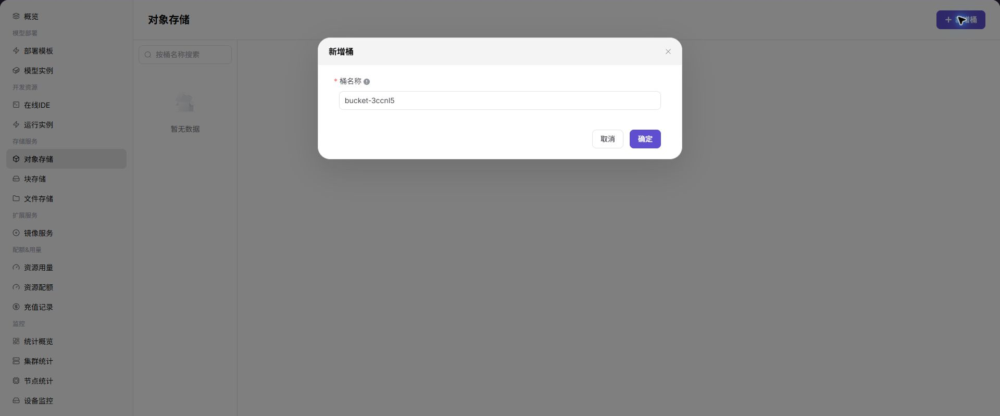

# 对象存储

::: info 文档信息
版本：v1.0
更新日期：2026-07-08
:::

## 功能概述

`对象存储` 用于管理当前租户在异构卡纳管资源池中的桶和对象。对象存储适合保存模型权重、数据集、压缩包、日志归档和运行产物。

| 项目 | 内容 |
| --- | --- |
| 适用角色 | 普通用户 |
| 导航路径 | 存储服务 > 对象存储 |
| 页面路由 | `/powerone/storage-service/object` |
| 管理对象 | 对象存储桶、对象文件、对象路径和地域内对象存储能力 |
| 典型用途 | 创建桶，上传、下载和删除对象，为 IDE、运行实例和模型服务提供数据路径 |

### 新手理解

对象存储像模型和数据的云盘，用桶和对象保存文件、数据集、模型包和输出结果。它适合按路径上传、下载和共享文件，但不等同于可直接挂载的 POSIX 共享目录。

### 术语速查

| 术语 | 说明 |
| --- | --- |
| 桶 | 对象存储中的顶层容器。 |
| 对象 | 桶中的单个文件或数据项。 |
| 对象路径 | 桶内文件路径，用于在作业中定位数据。 |
| POSIX 共享目录语义 | 类似本地文件系统的目录、权限、随机读写和文件锁语义；对象存储通常不提供完整 POSIX 语义，需要共享目录时优先评估文件存储。 |
| 地域 | 资源所在的大范围边界，影响对象存储可见性和作业访问范围。 |

## 前提条件

1. 目标地域已由运营方开放对象存储能力。
2. 当前账号具备查看、创建桶和管理对象的权限。
3. 桶名称、对象路径和数据保留策略已规划。
4. 如用于作业，作业所在地域应能访问该对象存储。

## 页面说明

页面左侧提供桶搜索和桶列表，右上角提供新增桶入口。进入桶后，可按页面提供的对象列表入口上传、下载或删除对象。

## 主要操作

### 新增桶

#### 操作步骤

1. 进入 `存储服务 > 对象存储`。
2. 确认右上角地域。
3. 点击 `新增桶（Add Bucket）`。
4. 填写 Bucket Name。
5. 点击 `确认（Confirm）` 提交。

下图展示新增桶弹窗，用于填写 Bucket Name 并提交创建。

#### 参数说明

| 字段名称 | 是否必填 | 字段类型 | 示例 | 说明 |
| --- | --- | --- | --- | --- |
| 资源名称 | 必填 | 文本 | `storage-a` | 存储资源展示名称。 |
| 地域 | 必填 | 下拉选择 | `武汉` | 存储能力所在地域。 |
| 容量 / 配额 | 条件必填 | 数字 | `100GiB` | 存储容量或额度。 |
| 访问路径 | 条件必填 | 文本 | `/mnt/data` | 作业或实例使用的挂载路径。 |
| 状态 | 系统生成 | 枚举 | `可用` | 存储资源当前状态。 |

#### 踩坑提示

- 存储路径、桶名、AK/SK 和 NFS 路径截图前必须脱敏。
- 挂载失败时先确认地域、权限和存储组件状态。
- 删除存储资源前确认没有实例、任务或输出产物依赖。

#### 结果校验

| 检查项 | 成功表现 | 异常时处理 |
| --- | --- | --- |
| 新增桶出现在桶列表中 | 新增桶出现在桶列表中。 | 未达到时检查 Bucket、路径、权限、挂载或访问凭据 |
| 搜索桶名能够定位到该桶 | 搜索桶名能够定位到该桶。 | 未达到时检查 Bucket、路径、权限、挂载或访问凭据 |
| 进入桶详情后可以查看对象列表或上 | 进入桶详情后可以查看对象列表或上传入口。 | 未达到时检查 Bucket、路径、权限、挂载或访问凭据 |

### 上传对象

#### 操作步骤

1. 在桶列表中打开目标桶。
2. 点击页面提供的上传入口。
3. 选择本地文件或目录，确认对象路径。
4. 提交上传并等待完成。
5. 刷新对象列表，确认文件大小、更新时间和路径正确。

#### 命名建议

| 类型 | 示例路径 | 说明 |
| --- | --- | --- |
| 模型文件 | `models/qwen/version-1/model.safetensors` | 按模型和版本组织。 |
| 数据集 | `datasets/train/train.jsonl` | 按用途和批次组织。 |
| 输出结果 | `outputs/job-20260703/result.json` | 按任务或日期组织。 |

### 下载对象

#### 操作步骤

1. 打开目标桶。
2. 在对象列表中找到目标文件。
3. 点击下载入口。
4. 下载完成后校验文件大小、格式和内容。

### 删除对象或桶

#### 删除对象

1. 打开目标桶。
2. 勾选或定位目标对象。
3. 点击删除入口。
4. 阅读确认提示后提交。
5. 刷新列表确认对象已移除。

#### 删除桶

删除桶前应确认桶内对象已备份或不再使用。若平台要求空桶才能删除，先清理对象，再删除桶。

## 配置规则与影响

- 桶属于地域内存储资源，跨地域访问能力以运营方配置为准。
- 对象存储适合非结构化文件，不适合需要 POSIX 共享目录语义的场景。
- 删除桶或对象前必须确认没有实例、模型、脚本或作业依赖。
- 对象路径可以进入启动命令或参数，但不要把访问密钥写进命令。

## 常见问题

### 对象存储列表为空

**问题现象：**

页面显示没有桶或对象数据。

**可能原因：**

- 当前租户尚未创建桶。
- 目标地域对象存储能力未向当前租户开放。
- 账号没有查看权限。
- 筛选条件限制了结果。

**处理方式：**

1. 确认右上角地域。
2. 点击新增桶入口创建桶。
3. 联系运营方确认对象存储组件和账号权限。
4. 清空筛选条件后刷新。

### 上传对象失败

**问题现象：**

选择文件并提交后，上传失败或对象没有出现在列表中。

**可能原因：**

- 文件过大或格式不符合平台限制。
- 桶权限不足。
- 对象存储组件不可用或网络异常。
- 对象路径包含不建议使用的特殊字符。

**处理方式：**

1. 检查页面错误提示和文件大小。
2. 更换规范对象路径后重试。
3. 确认桶权限和地域选择。
4. 联系运营方检查对象存储组件状态。

### 作业读取不到对象

**问题现象：**

运行实例或模型服务启动后，日志提示找不到对象路径。

**可能原因：**

- 启动命令中的桶名或对象路径错误。
- 作业所在地域无法访问该桶。
- 对象权限或挂载配置不匹配。

**处理方式：**

1. 复制对象列表中的完整路径重新配置。
2. 确认作业和对象存储在可访问的地域范围内。
3. 查看实例日志并联系运营方核对权限。

## 后续操作

1. 在运行实例、在线 IDE 或模型服务中引用对象路径。
2. 定期清理无用对象，控制存储占用。
3. 对重要模型和数据集建立备份或版本归档规则。

## 注意事项

- 不要在对象路径或文件名中写入密钥、账号、token 或客户敏感信息。
- 重要数据删除前先确认备份和依赖关系。
