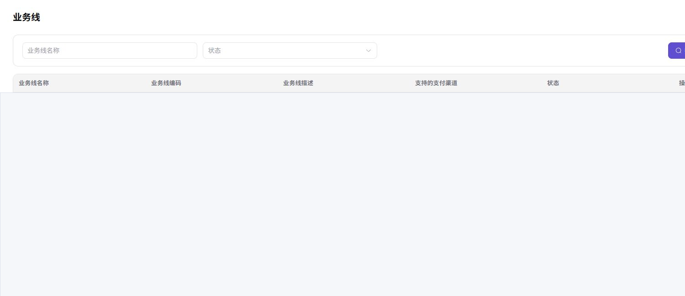
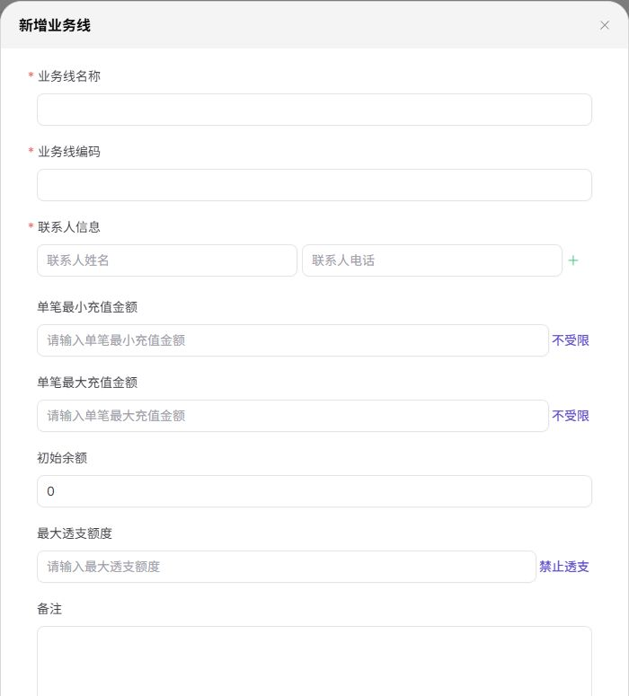

# 业务线

::: info 文档信息
版本：v1.0
更新日期：2026-07-10
:::

## 功能概述

`业务线` 用于维护平台侧的业务线和可用支付渠道。不同业务线对应不同充值渠道、计费模型和客户范围，运营方通过该页面新增、编辑、启用或停用业务线。业务线属于客户充值、客户余额计费的重要前置配置。

| 项目 | 内容 |
| --- | --- |
| 适用角色 | 运营方 |
| 菜单入口 | 客户账务 > 业务线 |
| 页面路径 | `/billing/customers/business-units` |
| 典型用途 | 维护业务线和支付渠道；控制单笔充值范围；配置透支额度 |
| 管理对象 | 业务线、支付渠道、单笔充值范围、初始余额、透支额度 |

### 新手理解

`业务线` 像平台的收银台配置：每个业务线决定客户充值可以使用哪些支付渠道、单笔金额限制，以及能否透支。客户充值时会落在某个业务线下，因此调整业务线会影响所有该业务线下的客户。

### 术语速查

| 术语 | 含义 | 处理建议 |
| --- | --- | --- |
| 业务线 | 控制客户充值渠道、金额限制和透支规则的配置对象 | 修改前先确认影响客户范围 |
| 业务线编码 | 系统识别业务线的唯一编码 | 建议稳定命名，避免频繁变化 |
| 负责人 | 业务线联系人或运营责任人 | 截图和工单中需要脱敏 |
| 额度归属 | 充值、余额和透支额度所属业务范围 | 排查余额时确认业务线一致 |
| 启停状态 | 业务线是否可继续被客户使用 | 停用前评估线上充值影响 |

## 前提条件

1. 当前账号具备业务线管理权限。
2. 至少存在一个业务线后，相关模块（充值、客户概览）的下拉才有可选值。
3. 浏览器已登录平台运营方账号且会话未过期。

## 页面说明

页面顶部按钮 `新增业务线` 用于打开新增业务线弹窗。筛选区包含：

| 字段 | 说明 |
| --- | --- |
| 业务线名称 | 按业务线名称筛选。 |
| 状态 | 下拉选择业务线状态，例如 `启用`、`停用`。 |

业务线表格列：

| 字段 | 说明 |
| --- | --- |
| 业务线名称 | 业务线显示名。 |
| 业务线编码 | 系统识别业务线的编码。 |
| 业务线描述 | 业务线说明。 |
| 支持的支付渠道 | 已绑定的支付渠道，例如 `Stripe`、`支付宝`。 |
| 状态 | 当前状态。 |
| 操作 | 行内操作，通常包含 `编辑业务线`。 |

下图展示业务线列表的筛选区和表格字段。列表数据已遮挡，避免暴露业务配置细节。

## 主要操作

### 新增业务线

1. 进入 `客户账务 > 业务线`。
2. 点击 `新增业务线` 打开弹窗。
3. 填写业务线基础信息和充值规则，点击 `确定` 保存。

> ⚠️ 风险提示：新增业务线会影响后续充值流程的可用支付渠道和单笔限额。保存前应再次确认业务线编码、支付渠道、初始余额和透支额度。

下图展示新增业务线弹窗的基础字段和充值限制配置。

### 编辑业务线

1. 在列表中点击 `编辑业务线`。
2. 调整字段，点击 `确定` 保存。

> ⚠️ 风险提示：编辑业务线会立即影响已有客户的充值选项。修改前请评估对线上充值的影响。

## 参数说明

新增/编辑业务线弹窗字段：

| 字段名称 | 是否必填 | 字段类型 | 示例 | 说明 |
| --- | --- | --- | --- | --- |
| 业务线名称 | 必填 | 文本 | 示例业务线 | 业务线显示名，建议简洁可识别。 |
| 业务线编码 | 必填 | 文本 | demo-cn | 业务线唯一标识，建议稳定命名。 |
| 联系人姓名 | 否 | 文本 | 示例负责人 | 业务线负责人姓名。 |
| 联系人电话 | 否 | 文本 | 138****0000 | 业务线负责人电话，截图时注意脱敏。 |
| 单笔最小充值金额 | 必填 | 金额 | ¥100.00 | 单笔最小充值金额，可点击 `不受限` 取消限制。 |
| 单笔最大充值金额 | 必填 | 金额 | ¥50,000.00 | 单笔最大充值金额，可点击 `不受限` 取消限制。 |
| 初始余额 | 否 | Credits | 1,000 Credits | 新增业务线时为客户预设的初始余额。 |
| 最大透支额度 | 否 | Credits | 5,000 Credits | 允许客户透支的最大额度，可点击 `禁止透支` 设为 0。 |
| 备注 | 否 | 文本 | 仅用于示例客户充值 | 业务线补充说明。 |
| 支付渠道 | 必填 | 多选 | Stripe | 至少选择一种支付渠道。 |

## 踩坑提示

- 联系人姓名和电话属于敏感信息，截图时务必脱敏。
- 单笔最小充值金额和单笔最大充值金额要合理设置，建议先确认客户群体充值习惯。
- `禁止透支` 等同于把透支额度设为 0，业务线可独立控制。
- 业务线编码建议使用稳定可识别的命名，例如 `prod-cn`、`test-cn`；避免使用纯数字编码。

## 结果校验

| 检查项 | 成功表现 | 异常时处理 |
| --- | --- | --- |
| 业务线记录 | 列表出现新增或编辑后的业务线记录 | 清空筛选条件后重新查询 |
| 启停状态 | 状态列显示为预期值（启用或停用） | 刷新页面并检查启停权限 |
| 支付渠道 | 新业务线下的支付渠道与预期一致 | 进入编辑页复核渠道配置 |

## 常见问题

### 状态切换无效

**问题现象：**

将业务线切换为停用后状态没有变化。

**可能原因：**

- 当前账号没有业务线启停权限。
- 业务线被下游模块引用，不允许直接停用。

**处理方式：**

1. 刷新页面后再次尝试。
2. 联系平台管理员确认权限。
3. 检查是否有客户或订单依赖该业务线，必要时先迁移。

### 支付渠道不可选

**问题现象：**

新增或编辑业务线时支付渠道下拉为空。

**可能原因：**

- 当前平台未接入对应支付渠道。
- 渠道被禁用或下线。

**处理方式：**

1. 前往支付渠道相关模块确认渠道状态。
2. 联系平台管理员接入渠道。

### 保存失败

**问题现象：**

点击 `确定` 后弹出校验提示或保存失败。

**可能原因：**

- 必填字段未填写完整。
- 业务线编码重复。
- 单笔金额区间设置不合法（例如最大金额小于最小金额）。

**处理方式：**

1. 核对必填项和字段格式。
2. 修改业务线编码后再次保存。
3. 调整金额区间并再次保存。

## 后续操作

- 配置完成后，可在 [客户充值单](../top-up-orders/) 验证业务线是否影响充值订单筛选和入账核对。
- 检查客户充值流程是否引用该业务线。

## 注意事项

- 业务线配置影响充值入口、单笔限额和透支额度，属于关键配置。
- 联系人信息属于敏感字段，禁止外传。
- 当前版本页面未发现 `删除业务线` 入口，禁止直接在文档中虚构删除流程；如需下线业务线，请通过停用状态实现。
