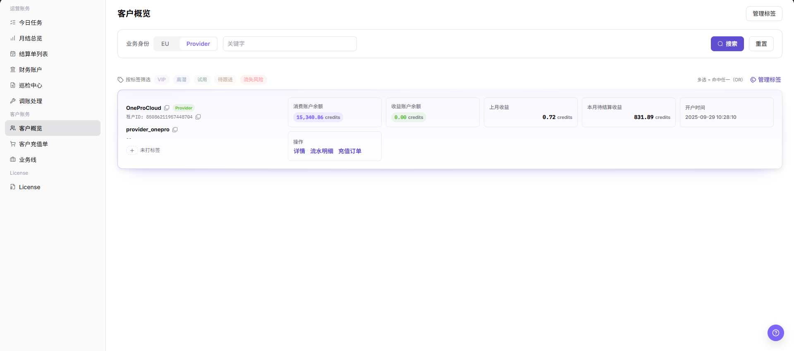
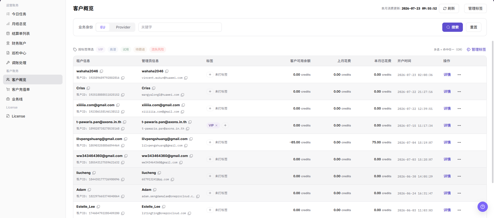

# 客户概览

::: info 文档信息
版本：v1.0
更新日期：2026-07-10
:::

## 功能概述

`客户概览` 用于在客户账务下查看所有客户档案、标签和消费信息。运营方可以通过该页面快速定位客户、给客户打标签、查看客户余额和消费情况，并为充值订单核对或投诉处理提供客户身份信息。

| 项目 | 内容 |
| --- | --- |
| 适用角色 | 运营方 |
| 导航路径 | 账务 > 客户账务 > 客户概览 |
| 页面路由 | `/billing/customers/overview` |
| 管理对象 | 客户档案、客户标签、客户余额 |
| 典型途径 | 查找客户；维护客户标签；核对余额和消费 |

#### 新手理解

`客户概览` 像平台运营侧的 CRM 列表：它把客户组织、管理员、标签和消费情况汇总在一张表里，运营方可以按客户类型或标签筛选客户，并跳转到充值单等下游模块继续处理。

#### 术语速查

| 术语 | 含义 | 处理建议 |
| --- | --- | --- |
| 客户账户 | 平台中记录客户组织、管理员和余额的账户对象 | 排查前先确认客户身份 |
| 业务线 | 客户所属的计费或充值业务范围 | 余额异常时确认业务线是否一致 |
| Credits | 平台内用于余额和消费展示的单位 | 与充值单和月账单一起核对 |
| 透支额度 | 允许客户余额不足时继续消费的额度 | 额度异常时联系运营确认规则 |
| 账户状态 | 客户账户是否可正常使用 | 状态异常时先排查权限和业务线 |

## 前提条件

1. 当前账号具备客户账务查看权限。
2. 至少存在一个客户组织（已开户的客户）后列表才有数据。
3. 浏览器已登录平台运营方账号且会话未过期。

## 页面说明

页面顶部展示本月消费的更新时间，并提供刷新按钮。顶部右侧有 `管理标签` 按钮，点击后弹出 `标签管理` 弹窗。

页面中部为筛选区，包含：

- 业务身份：下拉选择，通常包含 `EU`、`Provider` 等客户类型。
- 关键字：搜索客户名称、组织 ID、管理员账号等。
- 标签筛选：多选标签按钮组，包含平台内置标签 `VIP`、`高潜`、`试用`、`待跟进`、`流失风险`，多选命中任一即匹配（OR 关系）。

页面主体为客户列表，列包括：

| 字段 | 说明 |
| --- | --- |
| 组织信息 | 客户组织名称及 `Org ID`。 |
| 管理员信息 | 客户管理员账号、邮箱。 |
| 标签 | 已应用的客户标签。 |
| 客户可用余额 | 当前客户账户剩余 credits。 |
| 上月花费 | 上一个自然月累计消费 credits。 |
| 本月已花费 | 当前自然月累计消费 credits。 |
| 开户时间 | 客户组织创建时间。 |
| 操作 | 行内操作，通常包含 `详情`。 |

客户概览列表按业务身份区分展示。EU 和 Provider 列表截图放在对应操作步骤下，截图数据已遮挡，避免暴露客户信息。

## 主要操作

### 查看客户概览-EU

1. 进入 `账务 > 客户账务 > 客户概览`。
2. 在 `业务身份` 中选择 `EU`。
3. 按需输入客户名称、客户 ID、管理员邮箱或标签等筛选条件。
4. 点击 `搜索`，查看 EU 客户列表。
5. 核对客户名称、管理员、业务身份、标签、账户余额、消费情况和最近更新时间。
6. 如仅学习或截图，只查看筛选条件和列表字段，不导出真实客户数据，不记录客户敏感信息。

### 查看客户概览-Provider

1. 进入 `账务 > 客户账务 > 客户概览`。
2. 在 `业务身份` 中选择 `Provider`。
3. 按需输入客户名称、客户 ID、管理员邮箱或标签等筛选条件。
4. 点击 `搜索`，查看 Provider 客户列表。
5. 核对客户名称、管理员、业务身份、标签、账户余额、收益或消费相关信息和最近更新时间。
6. 如仅学习或截图，只查看筛选条件和列表字段，不导出真实客户数据，不记录客户敏感信息。

### 管理标签

1. 点击页面顶部 `管理标签` 按钮，打开 `标签管理` 弹窗。
2. 查看 `平台内置` 标签（`VIP`、`高潜`、`试用`、`待跟进`、`流失风险`），这类标签由平台锁定，不允许编辑。
3. 在 `自定义标签` 区域输入新标签名并点击 `新建标签`。
4. 点击 `关闭` 退出弹窗。

如仅学习或截图，只查看标签名称、数量和权限提示，不记录真实客户标签策略或内部运营备注。

## 参数说明

| 字段名称 | 是否必填 | 字段类型 | 示例 | 说明 |
| --- | --- | --- | --- | --- |
| 业务身份 | 否 | 枚举 | `EU` | 选择客户业务身份过滤条件。 |
| EU | 系统枚举 | 枚举值 | `EU` | 表示 End User 客户视图，用于查看消费相关客户信息。 |
| Provider | 系统枚举 | 枚举值 | `Provider` | 表示服务提供方客户视图，用于查看收益或消费相关客户信息。 |
| 客户名称 | 否 | 文本 | `示例客户` | 用于按客户名称定位目标客户。 |
| 客户 ID | 否 | 文本 | `customer-xxxx` | 用于按客户唯一标识定位目标客户，文档中只使用占位符。 |
| 管理员邮箱 | 否 | 文本 | `user@example.com` | 用于按客户管理员邮箱定位目标客户，截图或工单中必须脱敏。 |
| 标签 | 否 | 多选 | `VIP` | 多选标签按钮，命中任一即匹配。 |
| 账户余额 | 系统生成 | Credits | `10,000 Credits` | 当前客户账户剩余 credits。 |
| 消费情况 | 系统生成 | Credits | `2,500 Credits` | 展示上月或本月消费相关金额。 |
| 收益信息 | 系统生成 | Credits | `1,000 Credits` | Provider 视图下的收益或结算相关信息。 |
| 最近更新时间 | 系统生成 | 时间 | `2026-07-10 12:00:00` | 客户概览数据最近更新的时间。 |
| 搜索 | 否 | 按钮 | `搜索` | 按当前筛选条件刷新客户列表。 |
| 重置 | 否 | 按钮 | `重置` | 清空筛选条件并恢复默认列表。 |
| 操作 | 系统生成 | 按钮 / 链接 | `详情` | 提供行内查看或后续处理入口。 |

## 踩坑提示

- 平台内置标签由平台锁定，不允许编辑或删除。
- 自定义标签名称建议稳定命名，避免频繁修改。
- 业务身份下拉为空通常表示当前账号没有该客户类型的权限。
- 关键字搜索默认匹配组织信息和管理员信息，不匹配备注字段。
- 客户名称、管理员邮箱、客户 ID、账户余额、消费金额、收益金额属于敏感信息，截图、导出文件、工单和评论必须脱敏。
- 学习或截图时只查看筛选条件和列表字段，不导出真实客户数据。

## 结果校验

| 检查项 | 成功表现 | 异常时处理 |
| --- | --- | --- |
| 筛选生效 | 列表按筛选条件刷新 | 清空筛选条件后重新查询 |
| 详情可达 | 点击 `详情` 可以进入客户下钻信息 | 检查客户权限和详情入口 |
| 标签可见 | 打开 `管理标签` 弹窗后可以看到平台内置标签和已有自定义标签 | 检查标签管理权限 |

## 常见问题

#### 列表为空

**问题现象：**

进入页面后客户列表为空。

**可能原因：**

- 客户尚未开户。
- 当前账号没有该业务身份的查看权限。
- 筛选条件过窄。

**处理方式：**

1. 清空筛选条件后刷新。
2. 切换 `业务身份` 或切换账号确认权限。
3. 如确认无客户，前往其他模块核对开户流程。

#### 标签管理打不开

**问题现象：**

点击 `管理标签` 没有弹出弹窗。

**可能原因：**

- 当前账号缺少标签管理权限。
- 浏览器拦截了弹窗。

**处理方式：**

1. 刷新页面后再次点击。
2. 检查浏览器是否禁用弹窗或脚本。
3. 联系平台管理员确认账号权限。

#### 自定义标签保存失败

**问题现象：**

新建标签时输入名称后保存不生效。

**可能原因：**

- 标签名称超过 16 字限制。
- 该客户已存在 5 个标签，达到上限。
- 标签名称与内置标签重名。

**处理方式：**

1. 缩短标签名称，建议使用稳定可识别的命名。
2. 检查该客户当前标签数量，删除冗余标签后再试。
3. 改名后再次新建。

## 后续操作

- 处理充值相关任务，跳转到 [客户充值单](../top-up-orders/)。
- 维护客户业务线配置，跳转到 [业务线](../business-units/)。

## 注意事项

- 客户列表包含客户邮箱、组织 ID 等敏感信息，禁止截图外传。
- 标签会影响客户后续充值核对与统计口径，调整前应确认影响范围。
- 修改或删除标签前，请先确认是否需要保留历史统计。
- 不记录真实客户名、组织名、客户 ID、邮箱、手机号、账户余额、消费金额、收益金额、订单号、Token 或 Key。
- 学习或截图时只查看筛选条件和列表字段，不导出真实客户数据。
