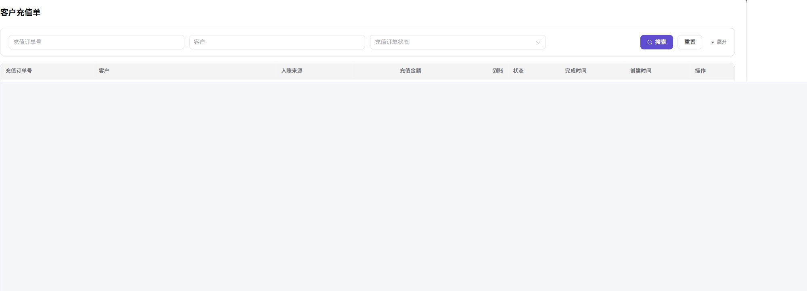

# 客户充值单

::: info 文档信息
版本：v1.0
更新日期：2026-07-10
:::

## 功能概述

`客户充值单` 汇总客户充值订单列表。运营方可以在该页面按订单号、客户和状态筛选充值记录，核对入账来源、充值金额、到账 credits、订单状态和创建时间，并通过 `详情` 入口查看单笔充值单。

| 项目 | 内容 |
| --- | --- |
| 适用角色 | 运营方 |
| 菜单入口 | 客户账务 > 客户充值单 |
| 页面路径 | `/billing/customers/top-ups/orders` |
| 典型用途 | 查看充值订单；核对入账金额；追踪订单状态 |
| 管理对象 | 充值订单、支付渠道、客户余额变动 |

### 新手理解

`客户充值单` 像平台的充值流水台账：客户完成充值后，订单会出现在该页面。运营方通过筛选和详情入口核对充值来源、金额、到账 credits 和状态，用于客户余额问题排查和资金流水核对。

### 术语速查

| 术语 | 含义 | 处理建议 |
| --- | --- | --- |
| 充值单 | 客户充值产生的订单记录 | 用订单号定位问题 |
| 支付渠道 | 充值使用的第三方或平台渠道 | 渠道异常时核对上游状态 |
| 入账来源 | 订单资金进入平台的来源 | 与财务账户流水一起核对 |
| 审批状态 | 充值单是否已完成审核或处理 | 状态异常时不要直接修改余额 |
| 币种 | 充值金额使用的货币类型 | 与到账 credits 分开核对 |

## 前提条件

1. 当前账号具备客户充值单查看权限。
2. 至少存在一个客户或充值订单后，列表才会有数据。
3. 浏览器已登录平台运营方账号且会话未过期。

## 页面说明

筛选区位于表格上方：

| 字段 | 说明 |
| --- | --- |
| 充值订单号 | 支持按订单号搜索。 |
| 客户 | 支持按客户名称搜索。 |
| 充值订单状态 | 下拉选择订单状态。 |

订单表格列：

| 字段 | 说明 |
| --- | --- |
| 充值订单号 | 系统生成的订单号。 |
| 客户 | 客户组织和管理员账号。 |
| 入账来源 | 充值渠道，例如 `新用户注册`、`Stripe`、`KooGallery`。 |
| 充值金额 | 按订单原币种显示。 |
| 到账 | 实际到账 credits。 |
| 状态 | 订单状态，常见值包括 `成功`、`已取消`。 |
| 完成时间 | 订单完成时间。 |
| 创建时间 | 订单创建时间。 |
| 操作 | 行内操作，通常包含 `详情`。 |

下图展示客户充值单列表的筛选区和表格字段。列表数据已遮挡，避免暴露客户和订单信息。

## 主要操作

### 查看充值订单

1. 进入 `客户账务 > 客户充值单`。
2. 按订单号、客户或状态筛选。
3. 在列表中定位订单，点击 `详情` 查看充值单明细。

## 参数说明

| 字段名称 | 是否必填 | 字段类型 | 示例 | 说明 |
| --- | --- | --- | --- | --- |
| 充值订单号 | 否 | 文本 | TOPUP-202607080001 | 精确匹配订单号。 |
| 客户 | 否 | 文本 | 示例组织 A | 模糊匹配客户名称。 |
| 充值订单状态 | 否 | 枚举 | 成功 | 下拉选择订单状态。 |
| 入账来源 | 系统生成 | 枚举 | Stripe | 展示充值资金来源或支付渠道。 |
| 充值金额 | 系统生成 | 金额 | USD 100.00 | 按订单原币种显示充值金额。 |
| 到账 | 系统生成 | Credits | 1,000 Credits | 实际到账 credits。 |

## 踩坑提示

- `已取消` 订单不会到账，需要联系客户或上游渠道核对。
- 入账来源为 Stripe 等第三方渠道时，金额按订单原币种展示，平台换算为 credits；币种与到账 credits 不一致属于正常情况。
- 充值订单号不要与支付流水号混淆，二者属于不同对象。

## 结果校验

| 检查项 | 成功表现 | 异常时处理 |
| --- | --- | --- |
| 筛选生效 | 列表按筛选条件刷新 | 清空筛选条件后重新查询 |
| 详情完整 | 订单详情展示订单金额、状态、支付渠道和关联客户 | 检查订单权限和详情入口 |
| 入账一致 | 订单状态、完成时间和到账 Credits 与上游支付或客户余额变化一致 | 核对支付渠道和客户余额记录 |

## 常见问题

### 订单列表为空

**问题现象：**

进入充值订单列表后没有任何记录。

**可能原因：**

- 当前账期或时间范围内没有充值订单。
- 筛选条件过窄。

**处理方式：**

1. 清空筛选条件后刷新。
2. 确认客户是否完成过充值。
3. 前往 `客户概览` 核对客户档案。

### 审核或资金状态与预期不一致

**问题现象：**

充值订单状态、到账 credits 或完成时间与客户反馈不一致。

**可能原因：**

- 上游支付渠道同步延迟。
- 订单被取消或未完成支付。
- 客户可能在查看其他业务线或其他账号下的充值记录。

**处理方式：**

1. 使用充值订单号重新搜索。
2. 进入 `运营财务 > 财务账户` 核对入账流水。
3. 与客户确认充值账号、业务线和支付渠道。

### 客户余额未更新

**问题现象：**

订单显示成功后客户账户余额没有变化。

**可能原因：**

- 订单仍在处理中，平台尚未完成入账。
- 订单所属业务线被禁用或额度受限。

**处理方式：**

1. 等待片刻后刷新页面。
2. 进入 `运营财务 > 财务账户` 核对入账流水。
3. 检查业务线状态，必要时联系平台管理员。

## 后续操作

- 核对充值到账情况，可前往 [客户概览](../customer-overview/) 查看客户余额。
- 处理与充值相关的资金流水，可前往 `运营财务 > 财务账户`。

## 注意事项

- 充值订单包含买家姓名、订单号、金额等敏感信息，截图和工单应按最小必要原则脱敏。
- 处理退款、冲正或人工调整时，应通过平台官方流程，不要直接修改后台数据。
