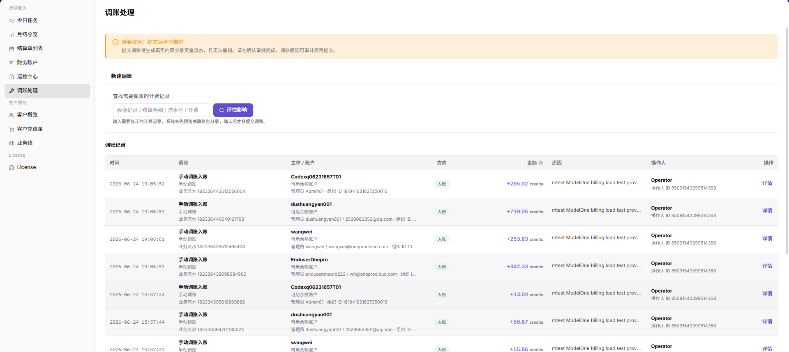

# 调账处理

::: info 文档信息
版本：v1.0
更新日期：2026-07-10
:::

## 功能概述

`调账处理` 用于在账务记录需要人工修正时，查找目标计费记录、评估调账影响，并查看已提交的调账记录。页面明确提示提交后不可撤销，因此调账前必须完成审批、原因确认和影响评估。

| 项目 | 内容 |
| --- | --- |
| 适用角色 | 平台运营、账务运营 |
| 导航路径 | 账务 > 运营账务 > 调账处理 |
| 页面路由 | `/billing/admin/account-adjustments` |
| 管理对象 | 计费记录、调账影响评估、调账记录 |
| 典型途径 | 查找需要修正的记录、评估调账影响、查看调账历史 |

#### 新手理解

调账处理像银行的冲正凭证，属于审批后才能执行的资金修正动作，不适合作为日常查询手段。普通查询可以反复筛选，但调账提交会生成真实资金流水，通常不可撤销。新手操作时应先查找记录，再评估影响，最后在审批和原因都明确后提交。

#### 术语速查

| 术语 | 含义 | 处理建议 |
| --- | --- | --- |
| 调账 | 对异常账务记录进行审批后的资金修正动作 | 提交前必须确认影响范围 |
| 冲正 | 对错误资金方向或金额进行反向修正 | 需要保留审批和原因 |
| 审批状态 | 调账能否继续处理的流程状态 | 未审批不要提交 |
| 关联单据 | 调账关联的结算单、流水或计费事实 | 用于事后追溯 |
| 影响账期 | 调账会影响的账务周期 | 避免调错账期 |

## 前提条件

1. 当前账号具备调账查看或处理权限。
2. 已获得调账审批或业务确认。
3. 已准备需要修正的会话记录、结算明细、流水号或计费事实 ID。
4. 已确认调账原因、金额方向和影响范围。

## 页面说明

页面由风险提示、新建调账区和调账记录列表组成。

下图展示调账处理页面的风险提示和新建调账区域。截图已避开调账记录中的账号和联系信息。

| 区域 | 说明 |
| --- | --- |
| 风险提示 | 提醒提交调账后不可撤销，需先完成审批和原因确认。 |
| 新建调账 | 输入计费记录线索，并评估调账影响。 |
| 查找输入框 | 支持输入会话记录、结算明细、流水号或计费事实 ID。 |
| 评估影响 | 预览关联账务分录，确认后才继续调账。 |
| 调账记录 | 展示时间、调账类型、主体/账户、方向、金额、原因、操作人和详情入口。 |

## 主要操作

### 查看调账处理

1. 进入 `账务 > 运营账务 > 调账处理`。
2. 查看页面顶部风险提示，确认调账提交后可能生成真实资金流水且通常不可撤销。
3. 查看 `新建调账` 区域，确认可通过计费记录、结算明细、流水号或计费事实 ID 查找目标记录。
4. 查看 `调账记录` 列表，核对时间、调账类型、主体 / 账户、方向、金额、原因、操作人和详情入口。
5. 如仅学习或截图，只查看页面结构、字段和记录列表，不点击提交、确认或真实调账类高风险按钮。

### 评估调账影响

1. 进入 `账务 > 运营账务 > 调账处理`。
2. 在 `新建调账` 区域输入需要调账的计费记录线索。
3. 点击 `评估影响` 前，确认记录来源、账期、组织、金额方向和审批依据。
4. 查看评估结果中的影响账户、方向、金额、关联单据和原因。
5. 如评估结果与预期不一致，停止后续提交，返回财务账户、结算单列表或巡检中心继续核对。
6. 如仅学习或截图，只查看评估入口和字段，不提交真实调账。

### 查看调账记录

1. 进入 `账务 > 运营账务 > 调账处理`。
2. 在 `调账记录` 列表中查看已有调账记录。
3. 按时间、主体 / 账户、方向、金额、原因或操作人定位目标记录。
4. 点击 `详情` 查看单条调账记录的更多信息。
5. 核对该记录是否与审批依据、关联单据和账户流水一致。
6. 对外沟通或截图时，隐藏真实账号、组织名、流水号、金额和审批信息。

## 参数说明

| 字段名称 | 是否必填 | 字段类型 | 示例 | 说明 |
| --- | --- | --- | --- | --- |
| 新建调账 | 否 | 页面区域 | 新建调账 | 用于输入计费记录线索并发起影响评估。 |
| 查找需要调账的计费记录 | 必填 | 文本 | FACT-202607080001 | 输入会话记录、结算明细、流水号或计费事实 ID。 |
| 评估影响 | 否 | 操作按钮 | 评估影响 | 预览调账可能影响的账户、方向、金额和关联单据。 |
| 调账记录 | 系统生成 | 列表 | 调账记录 | 展示历史调账记录和详情入口。 |
| 时间 | 系统生成 | 时间 | 2026-07-08 10:00 | 调账记录产生时间。 |
| 调账类型 | 系统生成 | 枚举 / 文本 | 冲正 | 调账类型或业务流水信息。 |
| 主体 / 账户 | 系统生成 | 文本 | 示例组织 A / 平台清算账户 | 调账影响的主体和账户。 |
| 方向 | 系统生成 | 枚举 | 入账 | 入账或出账方向。 |
| 金额 | 系统生成 | 金额 | ¥1,000.00 | 调账金额。 |
| 原因 | 必填 | 文本 | 结算流水重复入账冲正 | 调账原因或备注。 |
| 操作人 | 系统生成 | 文本 | operator | 发起或处理调账的操作人。 |
| 详情 | 系统生成 | 操作入口 | 详情 | 查看单条调账记录的更多信息。 |
| 审批依据 | 必填 | 文本 / 附件 | 脱敏审批说明 | 说明调账依据，支持后续审计追溯。 |
| 关联单据 | 必填 | 文本 | 脱敏结算单号 | 记录关联结算单、流水或计费事实。 |

## 踩坑提示

- 调账前必须确认审批、账期、关联单据、影响账户和金额方向。
- 评估影响结果不符合预期时不要继续提交，应先回到财务账户和结算单核对。
- 调账原因不能只写“修复”“测试”，需要能支撑后续审计追溯。
- 调账记录生成后通常不可撤销，不要用调账替代正常结算或补偿流程。
- 调账提交后可能生成真实资金流水，通常不可撤销。
- 调账不能替代正常结算、补偿或对账流程。
- 学习或截图时只查看页面、字段和记录，不执行真实提交。
- 不记录真实账号、账户 ID、客户名、组织名、账期金额、交易流水号、内部流水号、审批信息、Token 或 Key。

## 结果校验

| 检查项 | 成功表现 | 异常时处理 |
| --- | --- | --- |
| 影响评估 | 输入记录线索并点击评估后，页面能返回影响评估结果 | 核对线索类型和记录权限 |
| 范围确认 | 确认影响范围后才继续提交调账 | 暂停提交并补充审批依据 |
| 调账记录 | 调账完成后，调账记录列表中出现对应记录 | 检查提交结果和操作日志 |
| 账户流水 | 相关财务账户流水同步出现对应资金变动 | 进入财务账户核对流水方向 |

## 常见问题

#### 找不到需要调账的记录

**问题现象：**

输入会话记录、结算明细、流水号或计费事实 ID 后，没有找到目标记录。

**可能原因：**

- 输入的记录线索不完整或类型不匹配。
- 目标记录尚未进入账务流水。
- 当前账号没有查看目标记录的权限。

**处理方式：**

1. 核对输入的记录线索。
2. 先在财务账户或结算单中确认目标记录是否存在。
3. 确认权限范围后重新评估。

#### 调账提交前需要确认什么

**问题现象：**

页面提示提交后不可撤销，操作者不确定是否可以继续。

**可能原因：**

- 调账会生成真实资金流水。
- 调账原因、金额方向或影响范围还没有完成确认。
- 审批或审计材料不完整。

**处理方式：**

1. 暂停提交，先完成审批确认。
2. 核对调账方向、金额、主体和账户。
3. 保存原因说明和影响评估结果。
4. 确认无误后再提交。

#### 评估影响后金额不符合预期

**问题现象：**

点击 `评估影响` 后，系统展示的调账方向、金额或影响账户与预期不一致。

**可能原因：**

- 输入的计费记录线索不对应目标业务。
- 目标记录跨账期或涉及多条流水。
- 当前理解的金额口径与系统调账口径不同。

**处理方式：**

1. 暂停提交调账。
2. 回到财务账户、结算单列表或巡检中心核对关联流水。
3. 与账务负责人确认方向、金额和影响账期后再重新评估。

#### 调账记录中看不到已处理结果

**问题现象：**

调账处理完成后，调账记录列表没有出现对应记录。

**可能原因：**

- 调账任务仍在处理中。
- 筛选条件限制了时间、主体或账户。
- 当前账号没有查看目标调账记录的权限。

**处理方式：**

1. 清空筛选条件并刷新页面。
2. 确认调账是否已经完成审批和提交。
3. 如仍不可见，联系管理员确认权限和后台处理状态。

## 后续操作

1. 调账后进入 [财务账户](../financial-accounts/) 核对账户流水。
2. 如调账与结算单相关，进入 [结算单列表](../settlement-list/) 查看状态。
3. 如调账源于巡检异常，回到 [巡检中心](../reconciliation-center/) 检查异常是否解除。

## 注意事项

> ⚠️ 风险提示
> 调账提交后可能生成真实资金流水，通常不可撤销。提交前必须确认审批、原因、方向、金额、主体和影响范围。

- 不要在截图、备注或文档中写入账号、邮箱、API Key、token、AK/SK、私钥或完整凭据。
- 调账记录应保留可审计原因，避免只写“修复”“测试”等无法追溯的说明。
- 发现不确定影响范围时，应先联系账务负责人确认，不要直接提交。
- 调账前必须确认审批、账期、组织、关联单据、金额方向和影响账户。
- 不记录真实账号、账户 ID、客户名、组织名、账期金额、交易流水号、内部流水号、审批信息、Token 或 Key。
