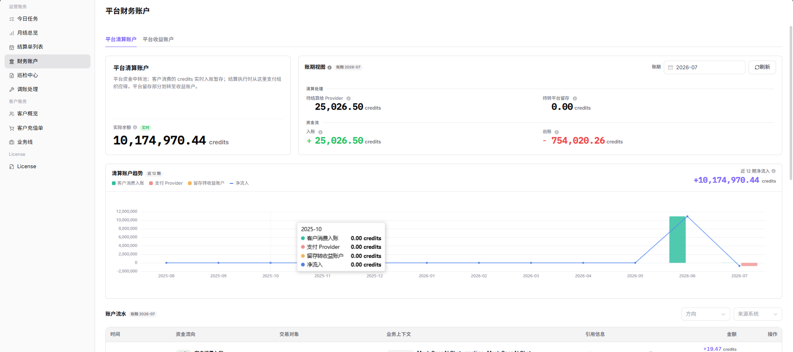
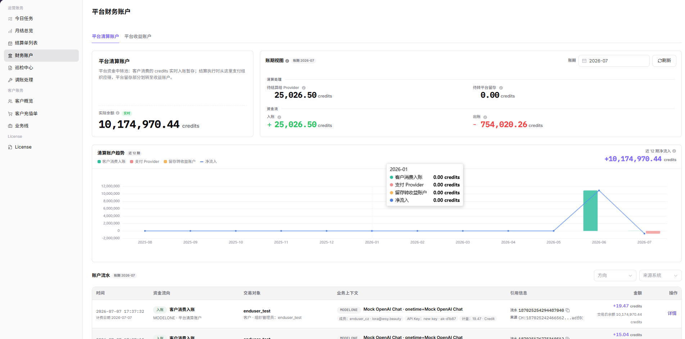
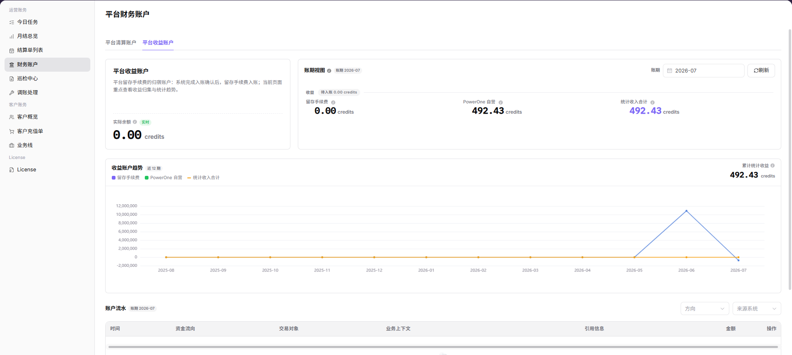
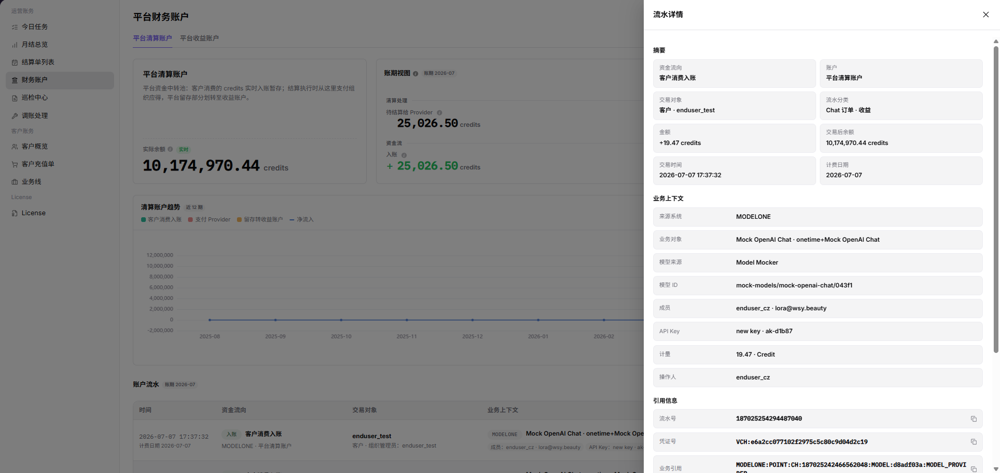

# 财务账户

::: info 文档信息
版本：v1.0
更新日期：2026-07-10
:::

## 功能概述

`财务账户` 用于查看平台清分账户、平台收益账户等账务账户的余额、收入、支出、可用金额和交易流水。账务运营人员可以通过该页面确认资金是否进入正确账户，并继续跳转到结算单、月度账单或对账中心排查差异。

| 项目 | 内容 |
| --- | --- |
| 适用角色 | 平台运营、账务运营、财务对账人员 |
| 导航路径 | 运营财务 > 财务账户 |
| 管理对象 | 平台清分账户、平台收益账户、账户余额、账户流水、交易明细 |
| 典型用途 | 核对账户余额、查看资金变化、定位交易流水、辅助结算和对账 |

### 新手理解

账务账户像平台里的资金账本，用来查看平台清分账户、平台收益账户等账户的余额、收入、支出和交易流水。运营人员可以通过它确认资金是否进入正确账户，并继续跳转到结算单、月度账单或对账中心排查差异。

结算单列表像单据池，关注某个组织、某个账期有没有生成结算记录；财务账户像资金账本，关注账户里的钱从哪里来、往哪里去、当前还剩多少。

### 术语速查

| 术语 | 含义 | 处理建议 |
| --- | --- | --- |
| 平台清分账户 | 临时归集和清分交易资金的账户。 | 核对交易进入和清分前状态。 |
| 平台收益账户 | 平台留存收益、服务费或抽佣相关账户。 | 与月结总览和结算单一起核对。 |
| 账户余额 | 当前账户展示的资金或额度余额。 | 与收入、支出和流水变化交叉验证。 |
| 交易流水 | 账户每一笔收入、支出、退款或结算变化。 | 定位金额差异时优先查看。 |
| 最近更新时间 | 账户数据最后刷新的时间。 | 避免用未刷新的数据做结论。 |

### 账户关系说明

| 账户类型 | 小白理解 | 主要用途 |
| --- | --- | --- |
| 平台清分账户 | 临时归集资金的中转账本 | 查看交易资金进入、清分和结算前状态 |
| 平台收益账户 | 平台最终收益账本 | 查看平台抽佣、服务费或收入汇总 |
| 交易流水 | 每一笔资金变化记录 | 排查收入、支出、退款、结算差异 |

## 我该看哪里

| 你的目标 | 先看哪里 | 下一步 |
| --- | --- | --- |
| 确认账户余额是否正确 | 账户列表 | 查看账户收入、支出和余额 |
| 排查某笔资金变化 | 交易流水详情 | 按交易时间、类型或流水号定位 |
| 核对结算金额 | 结算单列表 | 对比结算单金额和账户流水 |
| 核对月度收入 | 月度账单概览 | 对比账期汇总和账户变化 |
| 查找账务差异 | 对账中心 | 按账期、组织或交易类型排查 |

## 前提条件

1. 当前账号具备账务账户查看权限。
2. 已确认需要查看的平台账户类型，例如平台清分账户或平台收益账户。
3. 查看交易流水前，已明确目标账期、组织、交易类型或流水号。
4. 核对结算差异前，已确认结算单、月度账单或对账任务的统计口径。

## 页面说明

财务账户页面通常展示账户名称、账户类型、账户余额、总收入、总支出、可用金额、最近更新时间和交易流水入口。账务运营人员可以先查看账户列表和账户卡片，再进入账户详情核对余额变化和交易流水。

下图展示财务账户列表。页面中可查看平台清分账户、平台收益账户等账户的余额、收入、支出和最近更新时间。

| 区域 | 说明 |
| --- | --- |
| 账户列表 | 展示平台清分账户、平台收益账户等账务账户。 |
| 账户余额 | 展示当前账户余额、可用金额、收入和支出。 |
| 账户详情入口 | 进入目标账户详情，查看账户基础信息和余额变化。 |
| 交易流水入口 | 查看指定账户下的收入、支出、退款、结算等流水。 |
| 最近更新时间 | 判断账户金额和流水数据是否已经刷新。 |

## 主要操作

### 查看账户列表

1. 进入 `运营财务 > 财务账户`。
2. 查看平台清分账户、平台收益账户等账户。
3. 核对账户余额、总收入、总支出、可用金额和最近更新时间。
4. 如列表为空，先清空筛选条件，再确认当前账号是否具备账务账户查看权限。

### 查看平台清分账户

1. 在账户列表中选择 `平台清分账户`。
2. 查看账户余额、收入、支出和账期视图。
3. 结合交易流水确认资金进入、清分和结算前状态。
4. 如果清分账户余额长时间未变化，继续进入对账中心确认是否存在未处理流水。

下图展示平台清分账户区域，用于核对待清分资金和账户余额变化。

### 查看平台收益账户

1. 在账户列表中选择 `平台收益账户`。
2. 查看平台留存收益、服务费或抽佣相关收入。
3. 对比月度账单概览中的账期汇总，确认统计口径是否一致。
4. 如金额不一致，继续查看交易流水和结算单。

下图展示平台收益账户区域，用于核对收益金额和账期汇总口径。

### 查看账户详情

1. 在账户列表中选择目标账户。
2. 进入账户详情页。
3. 查看账户基础信息、余额变化、收入支出汇总和交易流水。
4. 记录最近更新时间，避免使用尚未刷新的数据进行对账。

### 查看交易流水

1. 进入目标账户详情。
2. 按交易时间、交易类型或流水号筛选。
3. 打开流水详情。
4. 核对交易金额、资金方向、关联结算单、关联订单或业务来源。
5. 如流水详情需要外发到工单或评论中，请先脱敏金额、组织名称、流水号和账号信息。

下图展示交易流水详情，用于核对金额、方向、关联结算单和业务来源。

### 跳转排查

| 异常场景 | 建议入口 | 处理方向 |
| --- | --- | --- |
| 金额和结算单不一致 | [结算单列表](../settlement-list/) | 对比结算单金额、组织、账期和入账状态 |
| 月度汇总异常 | [月结总览](../monthly-overview/) | 对比账期汇总、账户收入和账户支出 |
| 账务差异无法解释 | [对账中心](../reconciliation-center/) | 按账期、组织或交易类型排查差异 |

## 参数说明

| 字段名称 | 是否必填 | 字段类型 | 示例 | 说明 |
| --- | --- | --- | --- | --- |
| 账户名称 | 否 | 文本 | 平台清分账户 | 用于按账户名称筛选目标账务账户 |
| 账户类型 | 否 | 枚举 | 平台收益账户 | 用于区分清分账户、收益账户等账户类型 |
| 交易时间 | 否 | 时间范围 | 2026-07-01 至 2026-07-31 | 用于筛选指定时间范围内的账户流水 |
| 交易类型 | 否 | 枚举 | 收入 | 用于区分收入、支出、退款、结算等流水 |
| 流水号 | 否 | 文本 | TXN-202607080001 | 用于精确定位单笔交易记录 |
| 组织 | 否 | 文本 | 示例组织 A | 用于按组织定位相关账户流水或结算差异 |
| 账户状态 | 否 | 枚举 | 正常 | 用于判断账户是否可查看、可入账或可继续对账 |

## 结果校验

| 检查项 | 成功表现 | 异常时处理 |
| --- | --- | --- |
| 账户可见 | 列表中能看到目标账务账户 | 检查权限、组织范围和账户状态 |
| 金额一致 | 账户余额等于期初余额加收入减支出 | 对比交易流水和结算单 |
| 流水完整 | 指定账期内流水能按时间连续展示 | 检查筛选条件和账期范围 |
| 跳转可用 | 能进入结算单、月度概览或对账中心 | 检查菜单权限和链接配置 |

## 踩坑提示

- 不要只看账户余额，要结合交易流水确认资金变化来源。
- 如果结算金额和账户余额不一致，先确认账期、组织和交易类型是否一致。
- 截图中金额、流水号、组织名称、账户编号必须脱敏。
- 交易流水可能存在统计延迟，排查时要确认最近更新时间。
- 账户列表为空不一定是无数据，也可能是当前账号没有账务查看权限。

## 常见问题

### 账户列表为空怎么办？

**问题现象：**
进入账务账户页面后，没有看到平台清分账户或平台收益账户。

**可能原因：**
当前账号没有账务账户查看权限，或筛选条件限制了账户范围，也可能是目标组织尚未生成账务账户。

**处理方式：**
清空筛选条件后重新查询；确认当前账号是否具备账务运营权限；如仍为空，联系平台管理员确认组织、账户和权限配置。

### 账户余额和结算单金额不一致怎么办？

**问题现象：**
财务账户中的余额、收入或支出与结算单列表中的结算金额不一致。

**可能原因：**
两边选择的账期、组织或交易类型不同；结算单按单据口径展示，财务账户按账户流水口径展示；也可能存在退款、调账、清分延迟或入账确认中的记录。

**处理方式：**
先确认账期、组织和统计口径一致；再打开交易流水核对收入、支出、退款和结算记录；仍不一致时，进入结算单列表和对账中心继续排查。

### 交易流水找不到目标记录怎么办？

**问题现象：**
在账户详情或交易流水中没有找到目标交易记录。

**可能原因：**
筛选的交易时间、交易类型、流水号或组织不匹配；目标交易尚未生成账户流水；也可能是流水存在同步延迟。

**处理方式：**
放宽筛选条件后重新查询；使用流水号或关联订单号精确定位；如仍无法找到，查看月结总览、结算单列表或对账中心确认该笔交易是否已进入账务处理链路。

### 账户金额长时间没有更新怎么办？

**问题现象：**
账户余额、收入、支出或最近更新时间长时间未变化。

**可能原因：**
当前账期没有新增交易，或账户数据同步存在延迟，也可能是上游清分、结算或对账任务异常。

**处理方式：**
先查看最近更新时间和交易流水；确认上游交易是否已完成；如交易已完成但账户未变化，进入对账中心检查是否存在未配对流水或处理失败任务。

## 后续操作

1. 需要核对结算单据时，进入 [结算单列表](../settlement-list/)。
2. 需要查看账期整体收入、支出和汇总时，进入 [月结总览](../monthly-overview/)。
3. 需要排查账务差异、未配对流水或异常任务时，进入 [对账中心](../reconciliation-center/)。
4. 已确认金额无误后，可将脱敏后的账户信息、流水范围和处理结论交付财务确认或归档。

## 注意事项

- 生成对账结论前，必须确认账户类型、账期、组织和交易类型一致。
- 账户余额、交易流水和结算金额属于敏感财务信息，截图、导出文件、工单和评论需要脱敏。
- 不要在备注或工单中写入真实银行账号、合同编号、税务信息、客户敏感信息或内部处理意见。
- 账户余额异常时，不要只依据单个页面判断，应结合交易流水、结算单、月结总览和对账中心综合确认。
- 交易流水可能晚于业务订单或结算单生成，排查时需要关注最近更新时间和处理状态。
