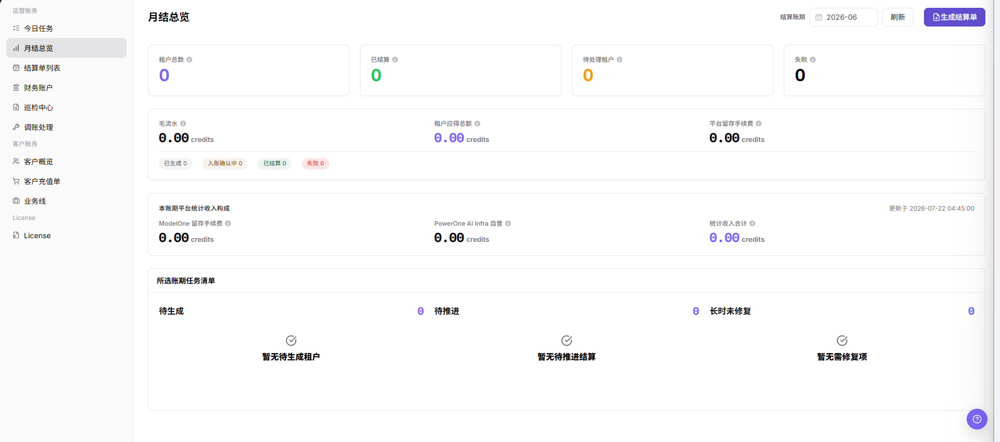

# 月结总览

::: info 文档信息
版本：v1.0
更新日期：2026-07-10
:::

## 功能概述

`月结总览` 用于按结算账期查看组织结算状态、月度流水、组织应得金额、平台留存手续费、收入构成和待处理任务。运营人员可以在该页面刷新账期数据，并从总览判断是否需要生成结算单或推进异常处理。

| 项目 | 内容 |
| --- | --- |
| 适用角色 | 平台运营、账务运营 |
| 导航路径 | 账务 > 运营账务 > 月结总览 |
| 页面路由 | `/billing/admin/provider-settlements/monthly-overview` |
| 管理对象 | 结算账期、组织结算状态、月度收入构成、待处理任务 |
| 典型途径 | 查看月结进度、判断待生成结算单、核对收入构成 |

#### 新手理解

月结总览像账期月报：先选账期，再看有多少组织已结算、多少组织待处理，以及平台收入由哪些部分构成。若待生成或待推进数量不为 0，需要进入结算单列表或相关处理页继续推进。

#### 术语速查

| 术语 | 含义 | 处理建议 |
| --- | --- | --- |
| 账期 | 月结统计对应的月份或账务周期 | 先确认账期，再比较金额 |
| 月结周期 | 月度结算的处理窗口 | 避免跨周期比较数据 |
| 期初余额 | 账期开始时的账户余额 | 与账户流水一起核对 |
| 期末余额 | 账期结束时的账户余额 | 与收入、支出和调账记录一起确认 |
| 月结状态 | 组织结算推进状态 | 待生成或失败时进入结算单列表 |

## 前提条件

1. 当前账号具备运营账务查看权限。
2. 已明确需要查看的账期。
3. 如需生成结算单，已确认该账期数据可以进入结算流程。

## 页面说明

页面由账期选择、刷新和生成结算单按钮、账期统计卡片、收入构成卡片和任务清单组成。

下图展示月结总览页面，顶部可选择结算账期，页面中部展示账期统计和任务清单。

| 区域 | 说明 |
| --- | --- |
| 结算账期 | 选择需要查看的月份账期。 |
| 刷新 | 重新加载当前账期统计数据。 |
| 生成结算单 | 对满足条件的账期生成结算单。 |
| 组织总数 | 当前账期涉及的组织数量。 |
| 已结算 | 当前账期已完成结算的组织数量。 |
| 待处理组织 | 当前账期仍需处理的组织数量。 |
| 失败 | 当前账期处理失败的组织数量。 |
| 收入构成 | 展示平台留存手续费、自营收入和统计收入合计。 |
| 任务清单 | 展示待生成、待推进和长时未修复任务。 |

## 主要操作

### 查看月结总览

1. 进入 `运营账务 > 月结总览`。
2. 在 `结算账期` 中选择目标月份，确认当前查看的账期范围。
3. 点击 `刷新`，等待页面统计数据和任务清单更新。
4. 查看账期统计卡片，重点核对 `组织总数`、`已结算`、`待处理组织` 和 `失败`。
5. 查看收入构成区域，核对 `平台留存手续费`、`自营收入` 和统计收入合计。
6. 查看任务清单中的 `待生成`、`待推进` 和 `长时未修复` 数量。
7. 如仅学习或截图，只查看账期、统计卡片和任务清单，不点击 `生成结算单`。

### 生成结算单

1. 确认账期选择正确。
2. 查看任务清单中的待生成组织数量。
3. 点击 `生成结算单`。
4. 进入 [结算单列表](../settlement-list/) 生成结算单页面。

## 参数说明

| 字段名称 | 是否必填 | 字段类型 | 示例 | 说明 |
| --- | --- | --- | --- | --- |
| 结算账期 | 必填 | 月份 / 账务周期 | 2026-07 | 用于切换当前查看的月结周期。 |
| 组织总数 | 系统生成 | 数值 | 28 | 当前账期纳入结算统计的组织数量。 |
| 已结算 | 系统生成 | 数值 | 21 | 已完成结算的组织数量。 |
| 待处理组织 | 系统生成 | 数值 | 5 | 尚需运营处理或推进的组织数量。 |
| 失败 | 系统生成 | 数值 | 2 | 结算生成或处理失败的数量。 |
| 毛流水 | 系统生成 | 金额 | ¥560,000.00 | 当前账期统计的流水总额。 |
| 组织应得总额 | 系统生成 | 金额 | ¥420,000.00 | 当前账期服务提供方或组织应得金额合计。 |
| 平台留存手续费 | 系统生成 | 金额 | ¥35,000.00 | 当前账期平台留存部分。 |
| 自营收入 | 系统生成 | 金额 | ¥0.00 | 平台自营业务在当前账期中的收入。 |
| 统计收入合计 | 系统生成 | 金额 | ¥35,000.00 | 平台留存手续费、自营收入等收入统计的合计值。 |
| 待生成 | 系统生成 | 数值 | 4 | 尚未生成结算单的任务数量。 |
| 待推进 | 系统生成 | 数值 | 3 | 已生成但需要继续处理的任务数量。 |
| 长时未修复 | 系统生成 | 数值 | 1 | 长时间未处理或未修复的异常数量。 |
| 生成结算单 | 操作入口 | 按钮 | 生成结算单 | 为满足条件的组织生成当前账期结算单。 |

## 踩坑提示

- 账期结束前数据可能变化，不要把月结总览中的过程数据当最终结论。
- 生成结算单前先确认待生成、待推进和失败任务，否则后续结算状态可能反复。
- 收入构成是汇总口径，金额异常时必须下钻结算单和财务账户流水。
- 月结总览和结算单列表要使用同一账期，否则数量和金额会看起来不一致。
- `生成结算单 / Generate Settlement` 会影响真实账期结算流程。
- 点击 `生成结算单` 前必须确认账期、组织范围、待生成数量、失败任务和巡检状态。
- 不要重复点击生成动作；失败时先进入结算单列表或巡检中心查看状态。

## 结果校验

| 检查项 | 成功表现 | 异常时处理 |
| --- | --- | --- |
| 账期切换 | 账期切换后，统计卡片和任务清单随之更新 | 重新选择账期并刷新 |
| 页面刷新 | 点击刷新后，页面不再显示加载状态 | 检查网络、权限和后台任务状态 |
| 结算生成 | 生成结算单后，可在结算单列表中看到对应账期记录或状态变化 | 进入结算单列表查看生成结果 |

## 常见问题

#### 待生成数量不为 0

**问题现象：**

任务清单中显示仍有待生成任务。

**可能原因：**

- 当前账期还有组织未生成结算单。
- 结算数据尚未完成汇总。
- 前序账务巡检存在异常。

**处理方式：**

1. 确认账期选择正确。
2. 点击 `生成结算单` 前检查账期统计。
3. 生成后进入结算单列表跟踪结算状态。

#### 收入构成与预期不一致

**问题现象：**

平台留存手续费、自营收入或统计收入合计与预期不同。

**可能原因：**

- 选择的账期不正确。
- 账期流水尚未完全汇总。
- 存在调账或巡检异常影响统计口径。

**处理方式：**

1. 核对结算账期。
2. 进入财务账户查看账户流水和趋势。
3. 进入巡检中心检查是否存在异常项。

#### 生成结算单按钮不可用

**问题现象：**

选择账期后，`生成结算单` 按钮不可点击或点击后没有进入下一步。

**可能原因：**

- 当前账期尚未完成统计。
- 当前账号没有生成结算单权限。
- 账期存在巡检异常或待处理任务。

**处理方式：**

1. 确认账期是否已完成统计。
2. 查看任务清单中的待处理和失败数量。
3. 如权限不足，联系平台管理员补充运营财务权限。

#### 任务清单数量和结算单列表不一致

**问题现象：**

月结总览中的待生成、待推进或长时未修复数量，与结算单列表筛选结果不一致。

**可能原因：**

- 两个页面选择的账期或状态不同。
- 月结总览存在统计延迟。
- 部分结算单已更新但总览尚未刷新。

**处理方式：**

1. 统一两个页面的账期和状态筛选。
2. 在月结总览点击 `刷新`。
3. 仍不一致时，进入巡检中心检查后台任务或异常项。

## 后续操作

1. 生成结算单后进入 [结算单列表](../settlement-list/)。
2. 如发现账务异常，进入 [巡检中心](../reconciliation-center/)。
3. 如需要人工修正，按流程进入 [调账处理](../account-adjustment/)。

## 注意事项

- 生成结算单前应确认账期、组织和账务数据范围。
- 不要仅依据总览金额完成结算判断，应结合结算单详情和账户流水核对。
- 涉及资金影响的操作应保留审批和审计依据。
- 不记录真实账期金额、租户、组织、客户名、结算单号、内部流水号或审批信息。
