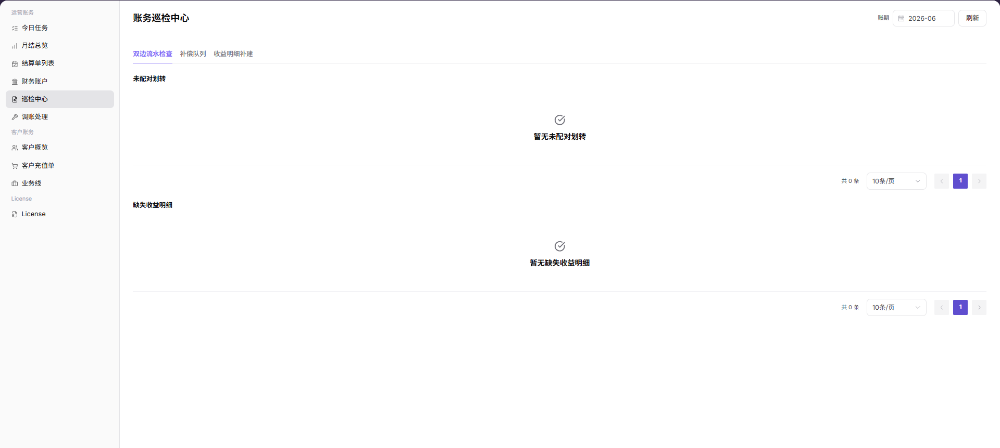

# 巡检中心

::: info 文档信息
版本：v1.0
更新日期：2026-07-10
:::

## 功能概述

`巡检中心` 用于检查运营账务中的双边流水、补偿队列、收益明细补建和异常记录。运营人员可以按账期刷新巡检结果，定位未配对划转、缺失收益明细、补偿任务积压等问题，并跳转到财务账户、结算单列表或调账处理继续排查。

| 项目 | 内容 |
| --- | --- |
| 适用角色 | 平台运营、账务运营、财务对账人员 |
| 导航路径 | 运营财务 > 巡检中心 |
| 管理对象 | 双边流水检查、补偿队列、收益明细补建、未配对划转、缺失收益明细 |
| 典型用途 | 发现账务异常、定位流水差异、检查补偿任务、补建缺失收益明细 |

### 新手理解

巡检中心像账务体检页，用来先发现账务数据里可能不匹配、不完整或需要重试的地方。它不会直接替你完成结算，也不应单独作为调账依据；运营人员需要结合财务账户、结算单和业务记录确认异常来源。

### 术语速查

| 术语 | 含义 | 处理建议 |
| --- | --- | --- |
| 双边流水检查 | 检查资金相关流水是否能成对匹配。 | 发现异常后进入财务账户核对。 |
| 补偿队列 | 等待重试、补偿或人工处理的账务任务队列。 | 先看失败原因，再判断是否重试。 |
| 收益明细补建 | 对缺失的收益明细重新生成。 | 执行前确认账期和影响范围。 |
| 未配对划转 | 有划转记录但暂时找不到对应关系。 | 核对账户流水和业务记录。 |
| 缺失收益明细 | 有消费或结算线索，但收益明细未生成。 | 补建后再次刷新巡检结果。 |

### 巡检对象速查

| 巡检对象 | 小白理解 | 发现异常后看哪里 |
| --- | --- | --- |
| 双边流水检查 | 检查资金相关流水是否能一进一出配上对 | 财务账户、结算单列表 |
| 补偿队列 | 查看需要重试、补偿或人工处理的账务任务 | 补偿队列详情、调账处理 |
| 收益明细补建 | 对缺失的收益明细重新生成 | 收益明细列表、结算单列表 |
| 未配对划转 | 有划转记录找不到对应关系 | 财务账户流水、业务记录 |
| 缺失收益明细 | 有消费或结算线索，但收益明细没有生成 | 收益明细补建、结算单列表 |

### 我该先看哪里

| 你看到的问题 | 先检查 | 下一步 |
| --- | --- | --- |
| 未配对划转有数据 | 双边流水检查结果 | 跳转财务账户核对流水 |
| 缺失收益明细有数据 | 收益明细补建结果 | 跳转结算单列表核对账期 |
| 补偿队列有积压 | 补偿队列状态和失败原因 | 判断是否需要重试或人工处理 |
| 金额和预期不一致 | 账期、组织、流水方向 | 进入结算单列表或调账处理 |

## 前提条件

1. 当前账号具备运营账务查看权限。
2. 已明确本次需要巡检的账期。
3. 已准备关联结算单、财务账户流水或业务记录作为核对依据。
4. 执行补建、补偿前，已确认影响范围和是否存在同类任务正在运行。
5. 如涉及人工调账，应遵循平台审批流程或财务处理流程。

## 页面说明

页面由账期选择、刷新按钮、巡检操作按钮和异常列表组成。运营人员先选择账期并刷新结果，再分别查看未配对划转、缺失收益明细和补偿队列；如发现异常，应记录账期、异常类型、数量和关联流水，再跳转到对应页面继续核对。

下图展示巡检中心。顶部可选择账期并触发巡检，页面中部展示未配对划转和缺失收益明细等异常结果。

| 区域 | 说明 |
| --- | --- |
| 账期 | 选择需要巡检的账务周期。 |
| 刷新 | 重新加载当前账期巡检结果。 |
| 双边流水检查 | 触发资金相关流水匹配检查。 |
| 补偿队列 | 查看或处理需要补偿、重试或人工介入的任务。 |
| 收益明细补建 | 针对缺失收益明细执行补建处理。 |
| 未配对划转 | 展示未能匹配到对应关系的划转记录。 |
| 缺失收益明细 | 展示缺少收益明细的记录。 |

## 主要操作

### 查看巡检结果

1. 进入 `运营财务 > 巡检中心`。
2. 选择目标账期。
3. 点击 `刷新`。
4. 查看结果更新时间或异常列表数量变化。
5. 分别检查未配对划转、缺失收益明细和补偿队列。
6. 根据异常类型跳转到财务账户、结算单列表或调账处理继续排查。

### 操作前确认

1. 确认账期和本次需要排查的账务周期一致。
2. 确认当前页面展示目标组织或目标业务范围数据。
3. 如准备执行补偿或补建，先确认是否已有同类任务正在运行。
4. 对异常金额、流水号或结算单号做好脱敏记录，避免截图外发时泄露敏感信息。

### 执行巡检操作

1. 确认账期和组织范围。
2. 按需要点击 `双边流水检查`、`补偿队列` 或 `收益明细补建`。
3. 等待巡检结果刷新。
4. 记录异常类型、数量、账期和关联流水。
5. 进入财务账户、结算单列表或调账处理继续排查。

下图展示双边流水检查结果，用于定位账务两侧流水是否一致。

下图展示补偿队列，用于查看需要补偿处理的异常任务。

下图展示收益明细补建入口，用于处理收益明细缺失或需要重建的场景。

### 按钮影响说明

| 按钮或入口 | 影响范围 | 使用建议 |
| --- | --- | --- |
| 刷新 | 只重新加载当前账期结果 | 用于确认最新异常数量和列表状态 |
| 双边流水检查 | 触发流水匹配检查 | 用于排查资金流水是否能成对匹配 |
| 补偿队列 | 查看或处理补偿任务 | 用于确认是否存在待重试、失败或人工处理项 |
| 收益明细补建 | 可能触发缺失明细补建 | 执行前确认账期、组织范围和同类任务状态 |

## 参数说明

| 字段名称 | 是否必填 | 字段类型 | 示例 | 说明 |
| --- | --- | --- | --- | --- |
| 账期 | 必填 | 月份 / 账务周期 | 2026-07 | 选择需要巡检的账务周期 |
| 刷新 | 否 | 操作按钮 | 刷新 | 重新加载当前账期巡检结果 |
| 双边流水检查 | 否 | 操作按钮 | 双边流水检查 | 检查资金相关流水是否能匹配 |
| 补偿队列 | 否 | 操作入口 | 补偿队列 | 查看需要补偿、重试或人工处理的队列项 |
| 收益明细补建 | 否 | 操作入口 | 收益明细补建 | 针对缺失收益明细进行补建处理 |
| 未配对划转 | 系统生成 | 异常列表 | 未配对划转 3 条 | 展示未找到对应关系的划转记录 |
| 缺失收益明细 | 系统生成 | 异常列表 | 缺失收益明细 2 条 | 展示缺少收益明细的记录 |
| 巡检结果 | 系统生成 | 结果状态 | 已完成 / 有异常 | 页面根据账期和巡检动作生成的检查结果 |

## 踩坑提示

- 巡检结果只是排查入口，不是调账依据，必须结合财务账户和结算单确认。
- 补建或补偿前先确认账期、组织范围和是否已有同类任务运行。
- 未配对划转不一定代表资金丢失，也可能是同步延迟或匹配关系未生成。
- 记录异常时只保留脱敏后的账期、异常类型、数量和流水线索。

## 结果校验

| 检查项 | 成功表现 | 异常时处理 |
| --- | --- | --- |
| 账期正确 | 页面展示目标账期数据 | 重新选择账期后刷新 |
| 巡检结果已刷新 | 异常列表更新时间或数量发生变化 | 检查权限、网络或后台任务状态 |
| 未配对划转为空 | 当前账期没有单边流水异常 | 如仍有数据，进入财务账户核对流水 |
| 缺失收益明细为空 | 收益明细生成完整 | 执行收益明细补建后再次刷新 |
| 补偿队列无积压 | 队列无待处理或失败项 | 查看失败原因并按流程处理 |

## 常见问题

### 未配对划转列表有数据怎么办？

**问题现象：**
未配对划转区域出现异常记录。

**可能原因：**
资金流水只有单边记录，对应业务记录尚未同步完成，或账期选择、流水方向、清分处理存在延迟。

**处理方式：**
记录异常项的账期、组织和脱敏流水线索；进入 [财务账户](../financial-accounts/) 查看对应资金流水；再进入 [结算单列表](../settlement-list/) 核对结算状态；如确认需要人工修正，按审批流程进入调账处理。

### 缺失收益明细列表有数据怎么办？

**问题现象：**
缺失收益明细区域出现记录。

**可能原因：**
业务消费已产生，但收益明细尚未生成；上游数据同步延迟；收益明细补建任务未执行、执行失败或仍在处理中。

**处理方式：**
确认目标账期和组织范围；执行 `收益明细补建` 后刷新页面；如缺失记录仍存在，结合财务账户流水和结算单继续排查。

### 点击刷新后结果没有变化怎么办？

**问题现象：**
点击 `刷新` 后，异常列表数量、更新时间或状态没有变化。

**可能原因：**
当前账期没有新数据，后台巡检任务尚未完成，或当前账号没有查看目标范围数据的权限。

**处理方式：**
确认账期选择是否正确；等待后台任务完成后再次刷新；如长期没有变化，检查权限、组织范围和后台任务状态。

### 补偿队列一直有待处理项怎么办？

**问题现象：**
补偿队列中持续存在待处理、重试中或失败项。

**可能原因：**
补偿任务依赖的上游流水、结算单或收益明细尚未准备好；任务重试失败；或需要人工确认后才能继续处理。

**处理方式：**
查看补偿队列详情和失败原因；确认同账期是否存在未配对划转或缺失收益明细；如需要人工介入，按平台流程提交调账或处理申请。

### 收益明细补建后仍然有缺失记录怎么办？

**问题现象：**
执行 `收益明细补建` 并刷新后，缺失收益明细列表仍有记录。

**可能原因：**
补建任务仍在处理中；目标账期、组织或业务记录不完整；也可能是上游消费记录与收益口径不一致。

**处理方式：**
等待补建任务完成后再次刷新；核对账期、组织和业务记录；如仍无法清空，进入结算单列表、财务账户和调账处理链路继续排查。

## 后续操作

| 异常类型 | 下一步页面 | 处理目标 |
| --- | --- | --- |
| 未配对划转 | [财务账户](../financial-accounts/) | 核对账户流水和资金方向 |
| 结算金额不一致 | [结算单列表](../settlement-list/) | 核对结算单状态和金额 |
| 需要人工修正 | [调账处理](../account-adjustment/) | 按审批流程提交或处理调账 |
| 账期汇总异常 | [月度账单概览](../monthly-overview/) | 核对账期汇总和统计口径 |

## 注意事项

- 巡检结果是排查入口，不是最终账务结论。
- 补建、补偿前必须确认账期和影响范围。
- 不要在截图中暴露流水号、客户名称、金额明细、组织名称、账号或内部地址。
- 巡检结果可能受上游同步、后台任务延迟影响，排查时应关注更新时间和任务状态。
- 涉及调账时必须走审批或平台规定流程，不能只依据巡检结果直接修改账务数据。
