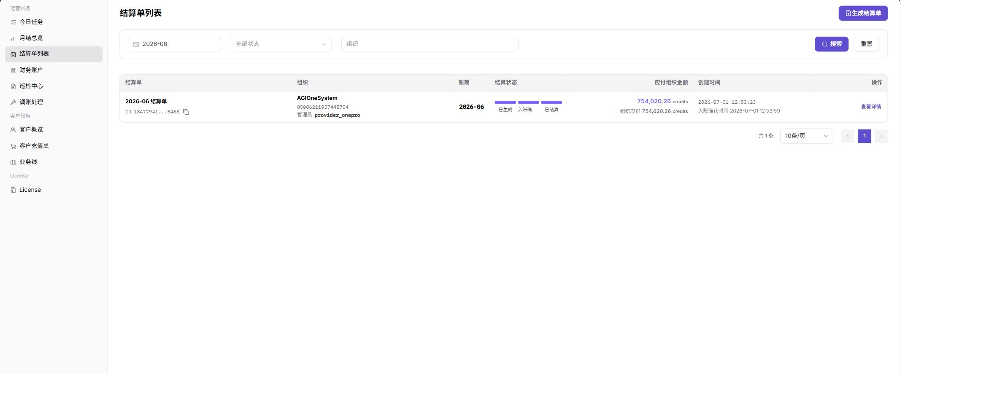
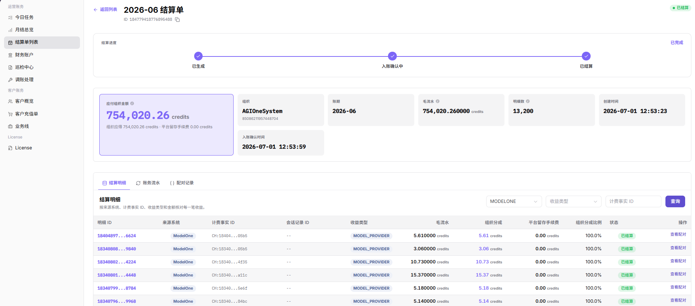
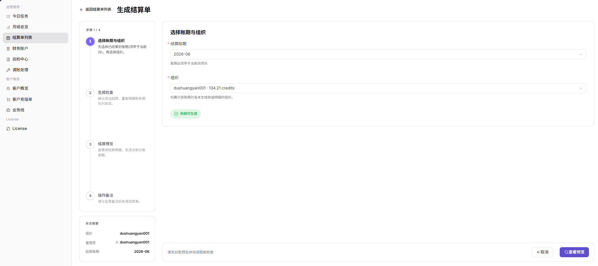
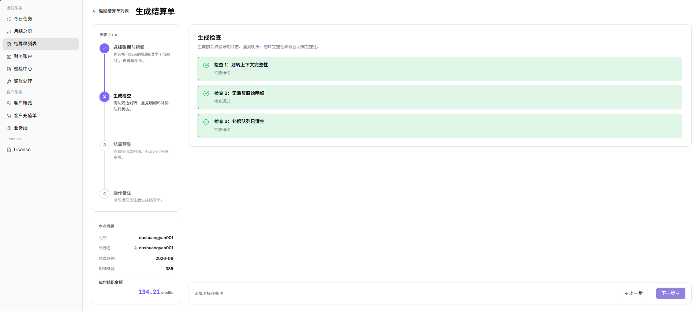
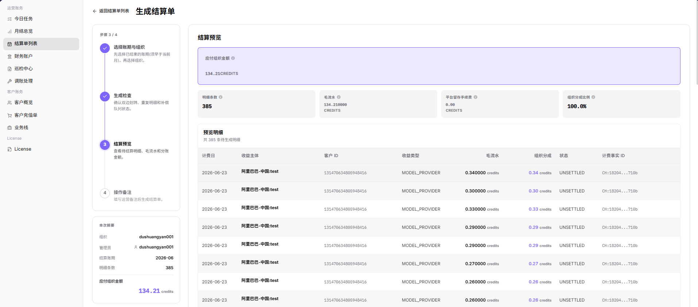
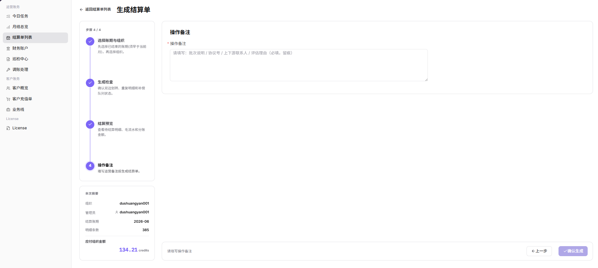

# 结算单列表

::: info 文档信息
版本：v1.0
更新日期：2026-07-10
:::

## 功能概述

`结算单列表` 用于查看、筛选、生成和跟踪组织结算单。账务运营人员可以按账期、状态和组织搜索结算单，进入详情核对金额、状态和入账确认信息，也可以从页面发起生成结算单。

| 项目 | 内容 |
| --- | --- |
| 适用角色 | 平台运营、账务运营 |
| 导航路径 | 账务 > 运营账务 > 结算单列表 |
| 页面路由 | `/billing/admin/provider-settlements` |
| 管理对象 | 结算单、组织、账期、结算状态、应付组织金额 |
| 典型途径 | 查询结算单、查看结算状态、进入结算详情、生成结算单 |

#### 新手理解

结算单列表像结算工单池。每条结算单对应“某组织 + 某账期”的结算记录，运营人员可以通过状态判断它处于已生成、入账确认中、已结算或失败等阶段。

结算单列表不承担完整财务后台职责，只提供查看、生成、跟踪结算单的入口。金额、状态和入账确认应结合 [月结总览](../monthly-overview/)、[财务账户](../financial-accounts/) 和 [巡检中心](../reconciliation-center/) 一起核对。

#### 术语速查

| 术语 | 含义 | 处理建议 |
| --- | --- | --- |
| 结算单 | 某组织在某账期下的结算记录。 | 进入详情核对金额和状态。 |
| 账期 | 结算单对应的月份或账务周期。 | 与月结总览保持一致。 |
| 入账确认 | 财务确认资金有没有完成入账的处理状态。 | 长时间未变化时核对财务账户。 |
| 应付组织金额 | 当前结算单中应支付给组织的金额。 | 与月结总览和流水一起核对。 |
| 结算状态 | 结算单当前处理阶段。 | 按状态决定下一步操作。 |
| 生成检查 | 生成结算单前的前置校验。 | 检查失败时不要反复提交。 |
| 结算预览 | 提交前展示的结算范围和金额摘要。 | 提交前再次核对组织和账期。 |

## 我该先看哪里

| 你的目标 | 先看哪个入口 | 下一步 |
| --- | --- | --- |
| 看账期整体结算情况 | [月结总览](../monthly-overview/) | 确认账期是否完成统计 |
| 查某个组织的结算单 | 结算单列表 | 按账期、状态、组织搜索 |
| 核对资金流水 | [财务账户](../financial-accounts/) | 对照账户流水和入账状态 |
| 排查结算异常 | [巡检中心](../reconciliation-center/) | 查看未配对划转或缺失收益明细 |
| 查看单据明细 | 结算单详情 | 核对金额、状态和入账确认信息 |

## 前提条件

1. 当前账号具备运营账务查看权限。
2. 已明确要查询的账期、组织或结算状态。
3. 生成结算单前，目标账期的数据已经完成统计。
4. 需要生成结算单时，当前账号具备生成结算单权限。
5. 涉及异常排查时，可以访问月结总览、财务账户和巡检中心。

## 页面说明

页面由生成结算单按钮、筛选区、结算单表格和分页区组成。

下图展示结算单列表，筛选区位于页面上方，结算单表格位于页面中部。

| 区域 | 说明 |
| --- | --- |
| 生成结算单 | 为满足条件的账期和组织生成结算单。 |
| 账期筛选 | 按月度账期筛选结算单。 |
| 状态筛选 | 按全部状态或指定结算状态筛选。 |
| 组织筛选 | 按组织关键字查找结算单。 |
| 结算单表格 | 展示结算单、组织、账期、结算状态、应付组织金额、创建时间和操作。 |
| 查看详情 | 打开对应结算单详情，核对状态、金额和入账确认信息。 |

## 状态速查表

| 状态 | 含义 | 下一步 |
| --- | --- | --- |
| 已生成 | 系统已生成结算单 | 进入详情核对金额 |
| 入账确认中 | 结算单正在等待入账或财务确认 | 查看财务账户和巡检中心 |
| 已结算 | 结算流程已完成 | 归档或进入后续对账 |
| 失败 | 生成、入账或结算过程异常 | 查看详情并进入巡检中心排查 |

## 主要操作

### 查看结算单详情

1. 在表格中找到目标结算单。
2. 点击该行的 `查看详情`。
3. 核对结算单、组织、账期、状态、金额和入账确认信息。
4. 如状态或金额异常，返回列表记录账期、组织和结算单编号，再进入巡检中心排查。

下图展示结算单详情，用于核对账期、组织、状态、金额和入账信息。

### 生成结算单

#### 操作前确认

生成结算单前，请确认：

1. 目标账期的数据已经完成统计。
2. 目标组织范围已经确认。
3. 月结总览中不存在明显异常。
4. 财务账户流水和巡检中心没有阻塞性异常。
5. 当前账号具备生成结算单权限。

#### 操作步骤

1. 进入 `运营账务 > 结算单列表`。
2. 点击页面上的 `生成结算单`。
3. 在生成流程中选择目标 `账期` 和 `组织`。

   下图展示选择账期与组织步骤，用于指定生成结算单的统计范围。

   

4. 查看 `生成检查` 结果，确认没有阻塞性异常。

   下图展示生成检查步骤，用于确认结算单生成前的校验结果。

   

5. 核对 `结算预览` 中的组织、账期、应付组织金额和结算状态。

   下图展示结算预览步骤，用于核对生成前的金额和明细摘要。

   

6. 在 `备注` 中填写脱敏后的处理说明，不写真实银行账号、合同编号、客户敏感信息或内部处理意见。

   下图展示填写备注步骤，用于补充本次结算生成说明。

   

7. 提交生成后，返回结算单列表，按账期和组织搜索目标结算单。
8. 点击 `查看详情`，确认结算单状态、金额和入账确认信息。

#### 风险提示

- 不要在账期数据未核对完成前生成结算单。
- 不要重复生成同一组织、同一账期的结算单。
- 生成失败时不要反复点击，先查看生成检查、结算单详情或巡检中心。
- `提交 / Submit` 是高风险最终动作。
- 不记录真实银行账号、合同编号、客户名称、结算单号、内部流水号、审批意见、账号、Token 或 Key。

## 参数说明

| 字段名称 | 是否必填 | 字段类型 | 示例 | 说明 |
| --- | --- | --- | --- | --- |
| 结算单 | 系统生成 | 文本 | `SETTLE-202606-ORG001` | 结算单名称或标识，用于定位具体结算记录。 |
| 组织 | 系统生成 | 文本 | `示例组织 A` | 结算单归属组织。 |
| 账期 | 系统生成 | 月份 | `2026-06` | 结算所属月份。 |
| 结算状态 | 系统生成 | 枚举 | `入账确认中` | 展示结算单当前所处阶段。 |
| 应付组织金额 | 系统生成 | 金额 | `¥12,345.67` | 当前结算单应结算给组织的金额。 |
| 创建时间 | 系统生成 | 日期时间 | `2026-07-08 10:00` | 结算单生成时间。 |
| 生成结算单 | 否 | 操作入口 | `生成结算单` | 打开结算单生成流程。 |
| 生成检查 | 系统生成 | 校验结果 | `通过` | 展示账期、组织和数据完整性等前置校验结果。 |
| 结算预览 | 系统生成 | 预览信息 | `应付组织金额 ¥12,345.67` | 提交前展示组织、账期、金额和结算状态摘要。 |
| 备注 | 否 | 文本 | `示例处理说明` | 记录脱敏后的处理说明，不写敏感财务或客户信息。 |
| 提交 | 否 | 高风险按钮 | `提交` | 确认生成当前账期和组织范围内的结算单。 |
| 查看详情 | 系统生成 | 操作入口 | `查看详情` | 打开目标结算单详情，核对状态、金额和入账确认信息。 |

## 踩坑提示

- 结算单列表只能说明单据状态，不能单独证明资金已经完成入账。
- 生成结算单前必须确认账期、组织、月结总览、财务账户和巡检结果一致。
- 同一组织、同一账期不要重复生成结算单；失败时先看生成检查和详情原因。
- 备注和工单中不要写入真实银行账号、合同编号、客户敏感信息或内部处理意见。
- `生成结算单 / Generate Settlement` 会影响真实账期结算流程。
- `提交 / Submit` 是高风险最终动作。
- 生成失败时先排查生成检查、结算单详情或巡检中心，不重复提交。
- 不记录真实银行账号、合同编号、客户名称、结算单号、内部流水号、审批意见、账号、Token 或 Key。

## 结果校验

| 检查项 | 成功表现 | 异常时处理 |
| --- | --- | --- |
| 筛选生效 | 搜索后列表只展示符合账期、状态或组织条件的结算单 | 清空条件后重新筛选 |
| 状态完整 | 结算状态、金额和创建时间可见 | 进入详情核对单据数据 |
| 详情可达 | 点击 `查看详情` 后能进入目标结算单详情 | 检查结算单权限和路由 |
| 生成可查 | 生成结算单后，能在列表中按账期和组织搜索到目标记录 | 查看生成检查和失败原因 |
| 信息一致 | 详情页中的组织、账期、金额和入账确认信息与预期一致 | 回到月结总览、财务账户和巡检中心交叉核对 |

## 完成后检查

| 检查项 | 成功表现 | 异常时处理 |
| --- | --- | --- |
| 列表可见 | 能按账期、状态或组织搜索到目标结算单 | 打开详情 |
| 金额可核对 | 应付组织金额与月结总览一致 | 进入财务账户核对流水 |
| 状态可跟踪 | 状态展示为已生成、入账确认中、已结算或失败 | 按状态继续处理 |
| 详情可打开 | 查看详情能展示金额、组织和入账确认信息 | 继续对账或归档 |
| 异常可排查 | 失败或长期未变化状态有排查路径 | 进入巡检中心 |

## 常见问题

#### 搜索不到目标结算单

**问题现象：**

按账期或组织搜索后，列表中没有目标结算单。

**可能原因：**

- 账期选择不正确。
- 状态筛选过窄。
- 该组织尚未生成结算单。

**处理方式：**

1. 点击 `重置` 清空筛选条件。
2. 重新选择账期后搜索。
3. 回到月结总览查看目标账期是否已经完成统计。
4. 确认确实需要生成时，再按操作前确认清单生成结算单。

#### 结算状态长期未变化

**问题现象：**

结算单长时间停留在处理中或入账确认中。

**可能原因：**

- 入账确认流程尚未完成。
- 下游账户或流水处理存在延迟。
- 结算单存在异常，需要运营介入。

**处理方式：**

1. 打开结算单详情查看状态信息。
2. 进入财务账户核对账户流水和入账状态。
3. 进入巡检中心检查是否存在未配对划转或缺失收益明细。

#### 生成结算单按钮不可用

**问题现象：**

页面上的 `生成结算单` 按钮不可点击，或点击后没有进入生成流程。

**可能原因：**

- 当前账号没有生成结算单权限。
- 目标账期尚未完成统计。
- 当前筛选条件或页面状态不满足生成条件。

**处理方式：**

1. 确认当前账号是否具备运营账务生成权限。
2. 回到月结总览确认账期统计状态。
3. 清空筛选条件后刷新页面，再尝试进入生成流程。

#### 结算金额和预期不一致

**问题现象：**

结算单中的应付组织金额与预期金额或月结总览金额不一致。

**可能原因：**

- 账期、组织或结算口径选择不一致。
- 月结统计数据尚未完全更新。
- 存在未配对划转、缺失收益明细或账户流水异常。

**处理方式：**

1. 确认结算单账期和组织与月结总览一致。
2. 进入财务账户核对账户流水。
3. 进入巡检中心查看异常项。
4. 在问题确认前不要归档或交付财务确认。

#### 生成结算单失败

**问题现象：**

生成流程提交后失败，或结算单状态显示失败。

**可能原因：**

- 生成检查发现阻塞性异常。
- 账期数据、组织范围或账户流水不完整。
- 同一组织、同一账期已存在结算单。

**处理方式：**

1. 查看生成检查结果和失败提示。
2. 进入巡检中心排查未配对划转、缺失收益明细或其他异常。
3. 确认不存在重复生成后，再重新发起生成。
4. 不要连续重复点击生成按钮。

#### 结算单是否可以重复生成

**问题现象：**

同一组织、同一账期已经有结算单，运营人员不确定是否还能再次生成。

**可能原因：**

- 对结算单生成规则不了解。
- 旧结算单状态异常或金额需要修正。
- 需要重新生成但没有完成前置核对。

**处理方式：**

1. 先在列表中按账期和组织搜索现有结算单。
2. 打开详情确认当前状态和金额。
3. 如需调整，先核对月结总览、财务账户和巡检中心。
4. 规则明确前，不要重复生成同一组织、同一账期的结算单。

## 后续操作

1. 需要查看账期整体情况时，进入 [月结总览](../monthly-overview/)。
2. 需要核对资金流水时，进入 [财务账户](../financial-accounts/)。
3. 发现财务异常时，进入 [巡检中心](../reconciliation-center/)。
4. 已结算单据可按内部流程归档，或交付财务继续确认。
5. 对失败、长期未变化或金额异常的结算单，应先排查再进入后续处理。

## 注意事项

- 生成结算单前必须确认账期和组织范围。
- 结算金额和状态属于敏感财务信息。
- 截图、导出文件、工单和评论需要脱敏。
- 失败状态不要反复生成，应先进入详情、财务账户或巡检中心排查。
- 结算单状态应结合财务账户和巡检中心判断，不要只凭列表状态完成财务确认。
- 不记录真实银行账号、合同编号、客户名称、结算单号、内部流水号、审批意见、账号、Token 或 Key。
