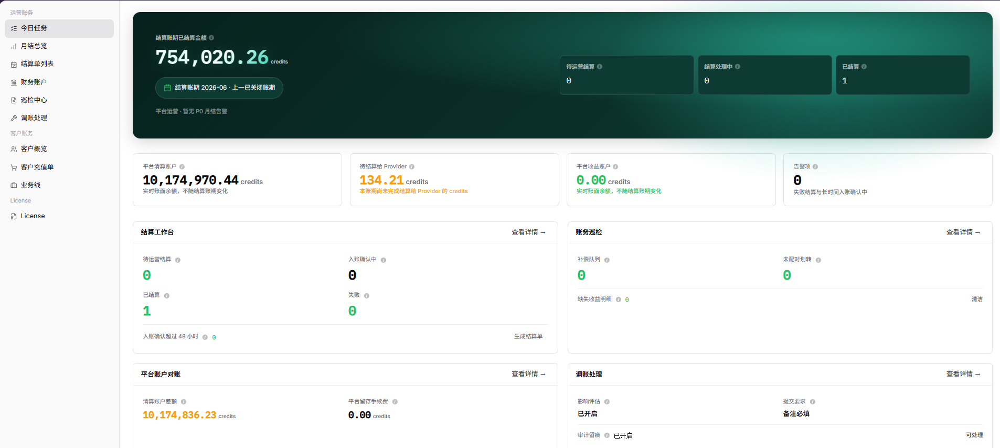

# 今日任务

::: info 文档信息
版本：v1.0
更新日期：2026-07-10
:::

## 功能概述

`今日任务` 作为运营账务工作台，用于集中查看当前账期的结算金额、结算进度、平台账户概况、告警项和待处理入口。运营人员可以从该页面快速进入结算、巡检、账户对账和调账处理。

| 项目 | 内容 |
| --- | --- |
| 适用角色 | 平台运营、账务运营 |
| 导航路径 | 运营财务 > 今日任务 |
| 管理对象 | 结算账期、结算任务、平台账户、告警项、快捷处理入口 |
| 典型用途 | 每日检查账务状态、识别待处理事项、进入对应处理页面 |

### 新手理解

今日任务像账务值班台：先看顶部指标判断账期和账户状态，再看下面四个卡片确定今天要做什么。卡片中的 `查看详情` 会把你带到对应页面，`结算单列表`、`巡检中心`、`财务账户` 和 `调账处理` 都应在确认数据范围后再操作。

### 术语速查

| 术语 | 含义 | 处理建议 |
| --- | --- | --- |
| 今日任务 | 当前账期需要关注的账务事项汇总 | 先看数量，再进入对应详情页 |
| 任务类型 | 结算、巡检、账户对账、调账等任务分类 | 按类型判断后续入口 |
| 处理状态 | 待运营结算、处理中、已结算等状态 | 状态异常时进入结算单或巡检中心 |
| 告警项 | 失败结算、长时间入账确认等风险提示 | 优先排查，不要只看金额 |
| 超时任务 | 超过预期处理时长的任务 | 进入详情页查看原因和责任环节 |

## 前提条件

1. 当前账号具备运营账务查看权限。
2. 已确认需要查看的结算账期和运营范围。
3. 如需继续生成结算单、调账或处理异常，已准备对应审批或操作依据。

## 页面说明

页面主要由账期指标、平台账户指标、告警项和快捷任务卡片组成。

下图展示今日任务工作台，左侧为运营账务导航，右侧展示账期指标和快捷处理卡片。

| 区域 | 说明 |
| --- | --- |
| 结算账期已结算金额 | 展示当前关注账期内已结算金额。 |
| 结算进度指标 | 展示待运营结算、结算处理中、已结算等状态数量。 |
| 平台账户指标 | 展示平台清算账户、待结算给服务提供方、平台收益账户等金额。 |
| 告警项 | 展示失败结算、长时间入账确认中等需要关注的问题数量。 |
| 结算工作台 | 快速进入结算单处理，并可触发生成结算单入口。 |
| 账务巡检 | 快速查看补偿队列、未配对划转和缺失收益明细。 |
| 平台账户对账 | 查看清算账户差额和平台留存手续费。 |
| 调账处理 | 查看调账能力状态和处理入口。 |

## 主要操作

### 查看今日账务概况

1. 进入 `运营财务 > 今日任务`。
2. 查看顶部结算账期和平台运营提示，确认当前账期是否有高优先级告警。
3. 查看结算进度、平台清算账户、待结算给服务提供方、平台收益账户和告警项。
4. 如果发现待处理数量不为 0，继续查看对应卡片中的处理入口。

### 进入后续处理页面

1. 在 `结算工作台`、`账务巡检`、`平台账户对账` 或 `调账处理` 卡片中点击 `查看详情`。
2. 根据进入页面继续筛选、查看详情或处理异常。
3. 如需生成结算单或调账，先确认账期、组织、金额和审批依据。

## 参数说明

| 字段名称 | 是否必填 | 字段类型 | 示例 | 说明 |
| --- | --- | --- | --- | --- |
| 结算账期已结算金额 | 系统生成 | 金额 | ¥120,000.00 | 当前账期内已完成结算的金额汇总。 |
| 待运营结算 | 系统生成 | 数值 | 3 | 需要运营继续处理的结算任务数量。 |
| 结算处理中 | 系统生成 | 数值 | 5 | 已进入处理流程但尚未完成的结算任务数量。 |
| 已结算 | 系统生成 | 数值 | 18 | 已完成结算的任务数量。 |
| 平台清算账户 | 系统生成 | 金额 | ¥80,000.00 | 平台资金中转账户的实时账面余额。 |
| 待结算给服务提供方 | 系统生成 | 金额 | ¥45,000.00 | 当前账期尚未完成结算给服务提供方的金额。 |
| 平台收益账户 | 系统生成 | 金额 | ¥12,500.00 | 平台留存收益对应账户余额。 |
| 告警项 | 系统生成 | 数值 | 2 | 失败结算、长时间入账确认等异常项数量。 |

## 踩坑提示

- 不要只按数量判断优先级，金额相关、超时和失败任务应优先处理。
- 今日任务是汇总入口，不能替代结算单详情、财务账户流水和巡检结果。
- 点击快捷入口前先确认当前账期，避免跳转后在不同账期下排查。
- 告警项清零不代表账务已完成，还需要核对结算状态和账户流水。

## 结果校验

| 检查项 | 成功表现 | 异常时处理 |
| --- | --- | --- |
| 账期指标 | 页面能正常展示当前账期和各类账务指标 | 刷新页面并确认账期权限 |
| 任务卡片 | 各任务卡片的状态数量和说明可见 | 进入对应功能页查看明细 |
| 快捷入口 | 点击卡片入口后能进入对应的结算、巡检、账户或调账页面 | 检查菜单权限和链接配置 |

## 常见问题

### 今日任务中出现待处理数量

**问题现象：**

待运营结算、补偿队列、未配对划转或告警项数量不为 0。

**可能原因：**

- 当前账期存在尚未推进的结算任务。
- 账务巡检发现异常。
- 入账确认或结算处理超过预期时长。

**处理方式：**

1. 点击对应卡片的 `查看详情`。
2. 进入目标页面后按账期、组织或状态筛选。
3. 根据页面提示继续处理，涉及资金变更时先确认审批依据。

### 指标金额和预期不一致

**问题现象：**

平台清算账户、待结算给服务提供方或收益账户金额与预期不一致。

**可能原因：**

- 选择的账期不是目标账期。
- 新流水或结算任务尚未完成处理。
- 巡检项或调账记录影响了余额。

**处理方式：**

1. 进入月结总览核对账期。
2. 进入财务账户查看账户趋势和流水。
3. 如存在异常，进入巡检中心或调账处理进一步核对。

### 快捷入口点击后没有跳转

**问题现象：**

点击 `查看详情` 后没有进入结算单、巡检中心、财务账户或调账处理页面。

**可能原因：**

- 当前账号没有目标页面权限。
- 页面会话过期。
- 浏览器拦截了跳转或页面加载失败。

**处理方式：**

1. 刷新页面后重新点击。
2. 确认当前账号是否具备目标页面权限。
3. 如仍无法跳转，记录入口名称和账期后联系管理员排查菜单配置。

### 告警项数量持续不下降

**问题现象：**

今日任务中的失败结算、长时间入账确认或巡检异常数量长时间保持不变。

**可能原因：**

- 异常任务尚未被处理。
- 后台巡检或结算任务仍在运行。
- 处理后没有刷新当前账期数据。

**处理方式：**

1. 进入对应详情页查看异常类型和处理状态。
2. 确认是否需要结算、补偿、补建或调账。
3. 处理完成后返回今日任务并刷新数据。

## 后续操作

1. 若需要推进月结，进入 [月结总览](../monthly-overview/)。
2. 若需要查看结算单状态，进入 [结算单列表](../settlement-list/)。
3. 若需要核对平台账户，进入 [财务账户](../financial-accounts/)。
4. 若需要排查异常，进入 [巡检中心](../reconciliation-center/)。

## 注意事项

- 今日任务只做汇总入口，不替代结算单、账户流水和巡检详情的最终核对。
- 涉及生成结算单、清算处理或调账时，应先确认账期、组织和金额。
- 不要在截图或备注中暴露账号、邮箱、API Key、token 或其他凭据。
