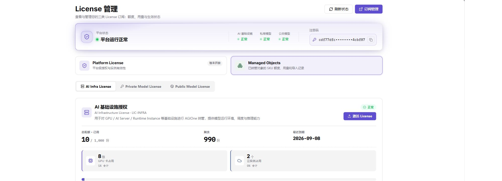
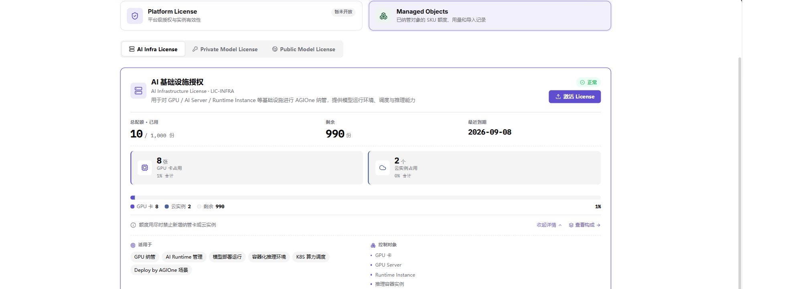
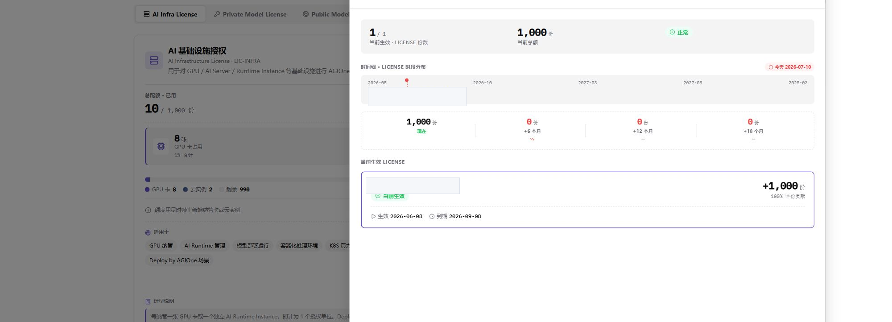

# License 管理

::: info 文档信息
版本：v1.0
更新日期：2026-07-10
:::

## 功能概述

`License 管理` 作为 AGIOne 平台 License 模块的默认入口，集中展示 Platform License、Managed Objects（含 AI Infra License、Private Model License、Public Model License）等 License 类型的当前状态、导入记录和额度构成。运营方通过该页面查看 License 总额度、剩余额度、到期时间和生效情况，并按需激活新 License。

| 项目 | 内容 |
| --- | --- |
| 适用角色 | 运营方；管理员负责激活 License |
| 菜单入口 | License > License |
| 页面路径 | `/user/usercenter/license/managed-objects` |
| 典型用途 | 查看 License 状态；激活新 License；查看额度构成；跟踪到期时间 |
| 管理对象 | License 类型、导入记录、当前生效 License、额度构成 |

### 新手理解

`License 管理` 像平台的资源许可证中心：每一类 License 控制不同对象的可用额度，运营方在这里查看哪些 License 生效、哪些过期、哪些快用完。激活 License 会改变平台运行底座，属于高风险动作。

### 术语速查

| 术语 | 含义 | 处理建议 |
| --- | --- | --- |
| License | 控制平台模块可用范围、额度和有效期的授权 | 先确认类型再判断影响范围 |
| 授权额度 | License 允许使用或纳管的资源数量 | 关注总额度、已用和剩余 |
| 有效期 | License 生效和到期时间范围 | 到期前联系管理员续期 |
| 资源许可 | AI Infra、Private Model、Public Model 等授权对象 | 与业务模块对应排查 |
| 激活状态 | License 是否生效、过期或未生效 | 激活后刷新状态确认 |

## 前提条件

1. 当前账号具备 License 查看或激活权限。
2. 已获取有效的 License 文件或激活凭据（仅在需要激活新 License 时）。
3. 浏览器已登录平台账号且会话未过期。

## 页面说明

页面顶部按钮 `刷新状态` 用于重新拉取 License 状态；`订阅管理` 用于跳转到订阅相关模块。

License 类型：

| License 类型 | 标识 | 用途 |
| --- | --- | --- |
| Platform License | - | 平台级授权与实例有效性，当前版本页面显示 `暂未开放`。 |
| AI Infra License | `LIC-INFRA` | 用于对 GPU、AI Server、Runtime Instance 等基础设施进行 AGIOne 纳管，提供模型运行环境、调度与推理能力。 |
| Private Model License | `LIC-PRIVATE` | 用于将 BYOK（Bring Your Own Key）模型注册到 AGIOne 私有模型区，供企业内部调用、测试、开发与 Agent 编排等业务使用。 |
| Public Model License | `LIC-PUBLIC` | 用于将模型发布到 AGIOne 平台公共模型区，形成对外可调用的模型服务。 |

每类 License 默认展示卡片信息：

- 当前生效 · 总额度 · 配额 · 已用 · 剩余。
- 卡片底部有 `查看详情`、`查看构成`、`激活 License` 等操作按钮。

下图展示 License 主页的 Managed Objects 页签、License 类型切换和 AI Infra License 额度概览。

### 导入记录

每类 License 下方的 `导入记录` 表格展示该类型 License 的所有导入记录，列包括：

| 字段 | 说明 |
| --- | --- |
| 记录 ID | 系统生成的 License 记录标识。 |
| 额度 | 该 License 提供的额度。 |
| 生效时间 | License 生效起点。 |
| 到期时间 | License 失效时间。 |
| 状态 | License 当前状态，例如 `生效`、`已到期`。 |
| 当前生效 | 是否处于当前生效状态。 |

### 查看详情

点击 `查看详情` 展开三类说明：

- 适用于：该 License 类型适用对象。
- 控制对象：该 License 类型控制的资源。
- 计量说明：额度计量方式。

### 查看构成

点击 `查看构成` 后，页面展示 `AI 基础设施授权 · 额度构成` 区域，包含：

- 当前维度总额度由哪些 License 文件叠加而来。
- 时间线分布：按时间段展示每个 License 的贡献。
- 当前生效 License 列表。

> 推荐使用全小写英文文件名保存截图，例如 `license-managed-objects.png`、`license-detail.png`、`license-composition.png`。

## 主要操作

### 查看 License 状态

1. 进入 License 主页。
2. 通过 License 类型页签切换不同 License。
3. 在卡片或导入记录中查看当前生效、总额度、剩余、到期时间。

### 激活 License

1. 在对应 License 类型卡片底部点击 `激活 License`。
2. 按页面提示上传 License 文件或填写激活信息。
3. 提交后等待平台校验并刷新状态。

> ⚠️ 风险提示：激活 License 会改变平台可用资源上限。请在确认 License 来源有效、内容完整且已获得管理员授权后再执行；激活过程中禁止在文档、截图、工单中泄露 License 文件内容或激活码。

### 查看详情

1. 在对应 License 类型卡片底部点击 `查看详情`。
2. 阅读 `适用于`、`控制对象`、`计量说明`，确认该 License 类型与业务匹配。

下图展示 AI Infra License 的详情展开状态。

### 查看构成

1. 在对应 License 类型卡片底部点击 `查看构成`。
2. 在构成区域中查看当前维度的总额度构成。
3. 阅读时间线分布和当前生效 License。
4. 点击 `关闭` 退出。

下图展示 License 额度构成区域。License 记录 ID 已遮挡，避免暴露内部记录标识。

## 参数说明

| 字段名称 | 是否必填 | 字段类型 | 示例 | 说明 |
| --- | --- | --- | --- | --- |
| 刷新状态 | 否 | 操作按钮 | 刷新状态 | 重新拉取平台 License 状态。 |
| 激活 License | 必填 | 操作按钮 / 文件上传 | 激活 License | 按平台提示上传或填写激活信息。 |
| 查看详情 | 否 | 操作入口 | 查看详情 | 展示 License 类型说明。 |
| 查看构成 | 否 | 操作入口 | 查看构成 | 展示额度构成和时间线。 |
| 当前生效 | 系统生成 | 状态 | 生效 | 展示当前 License 是否处于生效状态。 |
| 到期时间 | 系统生成 | 时间 | 2027-07-08 | 展示 License 失效时间。 |
| 剩余额度 | 系统生成 | 数值 | 120 | 展示当前 License 可继续使用的额度。 |

## 踩坑提示

- 不同 License 类型额度独立，AI Infra License 不会用于 Private Model，反之亦然。
- `激活 License` 是覆盖式变更，建议在管理员授权和确认 License 来源后再执行。
- License 文件、激活码属于高敏感凭据，禁止截图外传。
- 当前页面未提供 `删除 License` 入口；如需停用某 License，请联系管理员处理。

## 结果校验

| 检查项 | 成功表现 | 异常时处理 |
| --- | --- | --- |
| 导入记录 | 导入记录数量与激活记录一致 | 核对 License 文件和激活时间 |
| 额度信息 | 当前生效、总额度、剩余额度数值符合预期 | 重新查看 License 类型和额度构成 |
| 构成明细 | `查看构成` 区域中可见至少一个当前生效 License | 检查当前 License 类型和权限 |
| 页签刷新 | 切换 License 类型页签后导入记录同步刷新 | 刷新页面后重新选择 License 类型 |

## 常见问题

### 导入记录为空

**问题现象：**

License 卡片下方的导入记录为空。

**可能原因：**

- 当前账号尚未激活任何 License。
- License 类型与当前账号无关联。

**处理方式：**

1. 联系管理员确认 License 是否已下发。
2. 在管理员授权后激活 License。

### 查看构成区域为空

**问题现象：**

打开 `查看构成` 后没有任何数据。

**可能原因：**

- 当前账号下没有当前生效的 License。
- 平台数据同步延迟。

**处理方式：**

1. 等待片刻后重新打开。
2. 联系管理员确认 License 是否已生效。

### 激活 License 后未生效

**问题现象：**

激活操作完成后导入记录未出现新条目。

**可能原因：**

- License 文件内容或格式不符合要求。
- 平台处于灰度或停用状态。

**处理方式：**

1. 核对 License 文件是否完整。
2. 联系管理员确认平台是否允许激活。

### License 状态显示为已到期

**问题现象：**

导入记录中的状态显示为 `已到期`，且当前生效记录消失。

**可能原因：**

- License 超过到期时间。
- 系统时钟异常。

**处理方式：**

1. 联系管理员激活新 License。
2. 确认系统时间是否正常。

## 后续操作

- License 状态确认后，可在 `AI Infra` 或 `模型及 AI 服务` 等模块继续验证资源可用性。
- 处理 License 异常时可联系平台管理员。

## 注意事项

- License 文件、激活码、注册码属于敏感凭据，禁止写入文档、截图或工单。
- 激活 License 属于高风险操作，操作前必须确认 License 来源并获得管理员授权。
- 当前页面未提供 `删除 License` 入口，禁止虚构删除流程。
- 若 License 已到期或额度耗尽，应及时联系管理员续期，不要等待资源完全不可用后再处理。
