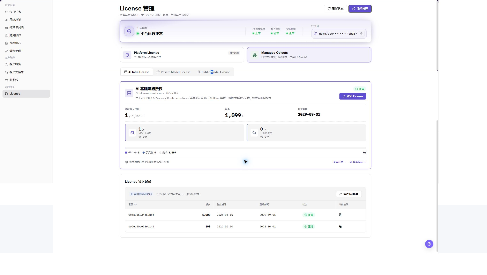

# License 管理

::: info 文档信息
版本：v1.0
更新日期：2026-07-10
:::

## 功能概述

`License 管理` 用于查看当前实例的 License 状态、注册码、License 分类、AI 基础设施授权、授权额度和有效期，并支持通过激活码完成授权激活。运营方可以在该页面确认平台授权是否有效、额度是否充足，以及当前实例是否具备继续使用 AI 基础设施能力的授权条件。

| 项目 | 内容 |
| --- | --- |
| 适用角色 | 运营方；管理员负责激活 License |
| 导航路径 | 账务 > License > License |
| 页面路由 | `/user/usercenter/license/managed-objects` |
| 管理对象 | 注册码、激活码、AI 基础设施授权、授权额度、有效期 |
| 典型途径 | 获取注册码；获取激活码；激活 AI 基础设施授权；核对授权额度和有效期 |

#### 新手理解

`License 管理` 像平台实例的授权中心：注册码用于标识当前实例，激活码用于给当前实例写入授权。激活完成后，页面会展示授权状态、有效期、总额度、已用额度和剩余额度。

#### 术语速查

| 术语 | 含义 | 处理建议 |
| --- | --- | --- |
| 注册码 | 当前平台实例生成的授权识别码 | 复制时确认完整性，不在公开材料中暴露 |
| 激活码（Activation Code） | License 支持人员基于注册码返回的授权激活凭据 | 通常与当前实例绑定，不跨环境复用 |
| AI 基础设施授权 | 面向 AI Infra 能力的 License 授权区域 | 激活前确认当前页面属于目标环境和实例 |
| 授权额度 | License 允许使用或纳管的资源数量 | 关注总额度、已用额度和剩余额度 |
| 有效期 | License 生效和到期时间范围 | 到期前联系管理员续期 |

## 适用场景

- 首次部署平台后，需要获取注册码并申请激活码。
- AI 基础设施授权未激活、已过期或额度不足，需要重新激活或续期。
- 需要核对当前实例的授权状态、有效期、总额度、已用额度和剩余额度。
- 需要向 License 支持人员提交脱敏后的激活申请材料。

## 前提条件

1. 当前账号具备 `账务 > License > License` 页面查看权限。
2. 当前页面属于目标环境和目标实例。
3. 如需激活，已按内部流程获得申请 License 的审批授权。
4. 浏览器已登录平台账号且会话未过期。

::: warning 安全提醒
注册码和激活码属于敏感凭据。不要在公开文档、截图、工单、群聊或评论中暴露完整注册码、激活码、License 文件内容、登录凭据、Token 或 Key。
:::

## 流程总览

| 步骤 | 说明 |
| --- | --- |
| 获取注册码 | 在 `License 管理` 页面复制当前实例注册码。 |
| 发送注册码并获取激活码 | 将注册码和必要申请信息发送给 License 支持人员。 |
| 激活 AI 基础设施授权 | 在 `AI 基础设施授权` 区域输入激活码并点击 `激活`。 |
| 核对激活结果 | 刷新页面并核对授权状态、有效期和额度。 |

## 页面说明

页面展示平台状态、License 分类、已纳管对象授权信息、注册码和激活入口。License 分类通常包含 AI 基础设施授权、私有模型授权、公共模型授权等，具体以当前页面真实显示为准。

#### 导入记录

`导入记录` 用于查看 License 激活或导入历史，通常包含记录标识、额度、生效时间、到期时间、状态和当前生效标记。排查授权异常时，可先查看导入记录是否出现对应激活结果。

#### 查看详情

`查看详情` 用于查看 License 类型说明、适用对象、控制对象和计量说明。确认激活范围前，先核对详情是否与目标授权类型一致。

#### 查看构成

`查看构成` 用于查看授权额度构成、当前生效 License 和额度来源。额度异常时，先核对构成区域，再联系管理员或 License 支持人员。

## 主要操作

### License 管理

#### 获取注册码

1. 登录平台。
2. 进入 `账务 > License > License`。
3. 查看平台状态、License 分类和已纳管对象授权信息。
4. 在 `License 管理` 页面找到 `注册码`。
5. 复制完整注册码。
6. 检查注册码是否完整，确认没有遗漏字符、空格或换行截断。
7. 不在文档、截图、工单或群聊中暴露注册码。

#### 发送注册码并获取激活码

1. 按内部流程通过线下渠道或邮件发送注册码给 License 支持人员。
2. 邮箱示例：`Ecosys@oneprocloud.com`。
3. 邮件建议包含注册码、公司或组织名称、联系人、联系方式和激活场景。
4. 发送前确认收件人、环境、实例和申请场景无误。
5. 收到 `激活码（Activation Code）` 后，不写入公开文档或截图。
6. 如仅学习或截图，只查看字段和流程说明，不发送真实注册码。

#### 激活 AI 基础设施授权

1. 回到 `账务 > License > License`。
2. 找到 `AI 基础设施授权` 区域。
3. 点击 `激活 License`。
4. 在激活窗口中找到 `激活码（Activation Code）` 输入框。
5. 粘贴激活码。
6. 核对激活码完整性，确认没有遗漏字符、空格或换行截断。
7. 点击最终 `激活`。
8. 等待页面返回激活结果。

#### 核对激活结果

1. 刷新 `账务 > License > License` 页面。
2. 确认 `AI 基础设施授权` 是否已激活或有效。
3. 核对是否显示到期时间或有效期。
4. 核对是否显示总额度、已用额度和剩余额度。
5. 确认页面没有错误提示。
6. 如状态未更新，先刷新页面并查看导入记录，不要重复提交同一激活码。

## 参数说明

| 字段名称 | 是否必填 | 字段类型 | 示例 | 说明 |
| --- | --- | --- | --- | --- |
| 注册码 | 系统生成 | 文本 | 不展示真实值 | 当前实例的授权识别码，不能公开记录完整内容。 |
| 激活码（Activation Code） | 激活时必填 | 文本 | 不展示真实值 | License 支持人员基于注册码返回的激活凭据。 |
| AI 基础设施授权 | 系统生成 | 授权区域 | `AI 基础设施授权` | 面向 AI Infra 能力的授权区域。 |
| 激活 License | 否 | 按钮 | `激活 License` | 打开 License 激活窗口。 |
| 激活 | 激活时必填 | 最终动作按钮 | `激活` | 提交激活码并影响当前实例授权状态。 |
| 有效期 | 系统生成 | 时间范围 | `2026-07-10 至 2027-07-10` | License 生效和到期时间范围。 |
| 授权额度 | 系统生成 | 数值 | `100` | 当前 License 授予的资源额度。 |
| 总额度 | 系统生成 | 数值 | `100` | 当前授权维度的总可用额度。 |
| 已用额度 | 系统生成 | 数值 | `20` | 当前已占用额度。 |
| 剩余额度 | 系统生成 | 数值 | `80` | 当前剩余可用额度。 |

## 踩坑提示

- 注册码和激活码属于敏感凭据，不能写入公开文档、截图、工单或群聊。
- 激活码通常与当前实例注册码绑定，不能跨环境复用。
- 点击 `激活` 会影响当前实例授权状态。
- 激活前必须确认当前页面属于目标环境和目标实例。
- 状态未更新时先刷新页面并查看导入记录，不要重复提交同一激活码。
- 不记录完整注册码、激活码、License 文件内容、登录凭据、Token 或 Key。

## 结果校验

| 检查项 | 成功表现 | 异常时处理 |
| --- | --- | --- |
| 授权状态 | `AI 基础设施授权` 显示已激活或有效 | 刷新页面并查看导入记录 |
| 有效期 | 页面显示正确到期时间或有效期 | 核对激活码是否对应当前实例 |
| 额度信息 | 总额度、已用额度和剩余额度可见且符合预期 | 查看授权构成并联系管理员 |
| 错误提示 | 页面无激活错误提示 | 记录脱敏后的错误信息并联系 License 支持人员 |

## 常见问题

#### 找不到注册码

**问题现象：**

进入页面后没有看到 `注册码`。

**处理方式：**

1. 确认当前账号具备 License 查看权限。
2. 刷新页面后重新进入 `账务 > License > License`。
3. 确认当前环境和实例是否正确。

#### 激活码无效

**问题现象：**

点击 `激活` 后页面提示激活码无效或校验失败。

**处理方式：**

1. 确认激活码是否完整复制。
2. 确认激活码是否与当前实例注册码匹配。
3. 不要重复尝试未知激活码，联系 License 支持人员核对。

#### 激活后状态未更新

**问题现象：**

激活完成后授权状态、有效期或额度未变化。

**处理方式：**

1. 刷新页面并查看导入记录。
2. 确认当前页面是否属于目标环境和目标实例。
3. 如仍未更新，携带脱敏后的时间、页面路径和错误提示联系管理员。

#### License 状态显示为已到期

**问题现象：**

授权状态显示已到期，或剩余额度不可用。

**处理方式：**

1. 联系管理员确认续期或扩容计划。
2. 获取新的激活码后重新激活。
3. 在业务受影响前完成续期处理。

## 后续操作

- License 状态确认后，可在 `AI Infra` 或 `模型及 AI 服务` 等模块继续验证资源可用性。
- 处理 License 异常时，向管理员或 License 支持人员提供脱敏后的页面路径、时间和错误提示。

## 注意事项

- 注册码、激活码、License 文件内容、登录凭据、Token 和 Key 都不能写入文档、截图、工单或群聊。
- `激活` 属于高风险最终动作，点击前必须确认环境、实例、注册码和激活码来源。
- 当前页面未提供 `删除 License` 入口，禁止虚构删除流程。
- 若 License 已到期或额度耗尽，应及时联系管理员续期，不要等待资源完全不可用后再处理。
