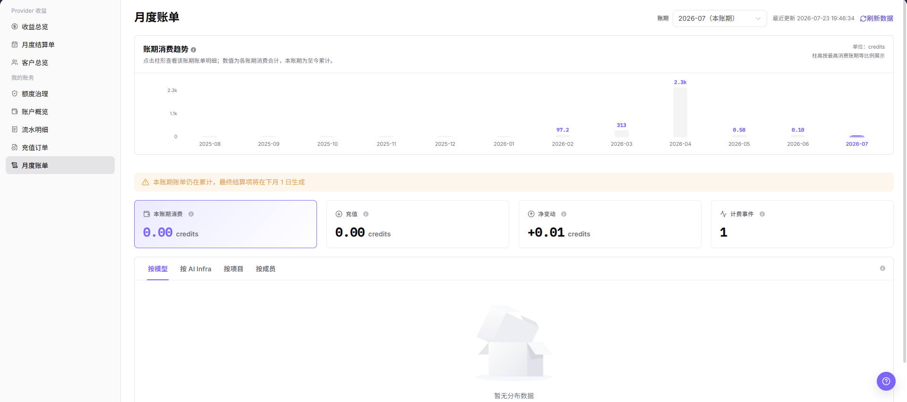

# 月度账单

::: info 文档信息
版本：v1.0
更新日期：2026-07-23
:::

## 功能概述

`月度账单` 用于按账期查看当前账号的消费趋势和账务汇总。用户可以选择账期，查看本账期消费、充值、净变动、计费事件，并按模型、AI Infra、项目和成员等视角核对费用来源。

| 项目 | 内容 |
| --- | --- |
| 适用角色 | 用户侧账号、业务管理员、账务查看人员 |
| 导航路径 | 账务 > 用户账务 > 月度账单 |
| 页面路由 | `/billing/my/account/transactions/monthly-summary` |
| 管理对象 | 账期消费趋势、账期汇总、计费事件、分组账单 |
| 典型途径 | 月度对账、确认消费来源、核对充值和净变动 |

#### 新手理解

月度账单像信用卡月结单，用来按账期核对本月消费、额度变化和明细来源。它不是只看一笔流水，而是按账期汇总消费、充值和净变动。做月度核对时，应先确认账期，再按模型、AI Infra、项目或成员视角拆分查看。

#### 术语速查

| 术语 | 含义 | 处理建议 |
| --- | --- | --- |
| 月度账单 | 按月汇总的账务对账页面。 | 适合做账期级核对。 |
| 本账期消费 | 当前账期内累计产生的消费。 | 与流水明细按时间范围核对。 |
| 净变动 | 充值、消费和调整后的额度变化。 | 不等同于单项消费。 |
| 分组视角 | 按模型、AI Infra、项目或成员拆分账单。 | 用于定位费用来源。 |
| 计费事件 | 产生费用或额度变化的事件数量。 | 事件异常时下钻流水。 |

## 前提条件

1. 当前账号具备用户侧账务查看权限。
2. 已进入 `我的账务 > 月度账单`。
3. 已确认需要核对的账期。
4. 如需解释单笔差异，应进入 `流水明细` 查看来源记录。

## 页面说明

页面提供账期选择和 `刷新数据` 入口，并展示 `账期消费趋势`、本账期累计提示、本账期消费、充值、净变动和计费事件。下方可通过 `按模型`、`按 AI Infra`、`按项目`、`按成员` 切换统计视角。

下图展示月度账单页面，截图中的金额和趋势数值必须脱敏处理。

| 区域 | 说明 |
| --- | --- |
| 账期 | 选择需要查看的月度账期。 |
| 刷新数据 | 刷新所选账期的统计数据。 |
| 账期消费趋势 | 展示所选账期内消费趋势。 |
| 本账期消费 | 展示当前账期累计消费。 |
| 充值 | 展示当前账期充值汇总。 |
| 净变动 | 展示充值、消费和调整后的余额变化。 |
| 计费事件 | 展示当前账期计费相关事件数量。 |
| 分组视角 | 通过 `按模型`、`按 AI Infra`、`按项目`、`按成员` 切换统计维度。 |
| 明细列表 | 展示所选维度下的消费来源和汇总结果。 |

## 主要操作

### 查看月度账单

1. 进入 `我的账务 > 月度账单`。
2. 在 `账期` 中选择目标月份。
3. 点击 `刷新数据` 更新当前账期统计。
4. 查看 `账期消费趋势`、`本账期消费`、`充值`、`净变动` 和 `计费事件`。
5. 如仅学习或截图，只查看账期统计和明细列表，不导出真实账单数据。

### 按维度核对消费来源

1. 进入 `我的账务 > 月度账单`。
2. 确认当前 `账期` 与需要核对的月份一致。
3. 在账单明细区域选择 `按模型`、`按 AI Infra`、`按项目` 或 `按成员`。
4. 查看对应维度下的消费汇总和明细列表。
5. 对费用较高或异常的维度，进入 `流水明细` 按同一账期继续核对。
6. 对外沟通时只记录脱敏后的维度名称、时间范围和异常现象。

## 参数说明

| 字段名称 | 是否必填 | 字段类型 | 示例 | 说明 |
| --- | --- | --- | --- | --- |
| 账期 | 必填 | 月份 | 2026-07 | 用于选择需要查看的月度账单。 |
| 刷新数据 | 否 | 按钮 | 刷新数据 | 按所选账期重新加载统计。 |
| 账期消费趋势 | 系统生成 | 图表 | 脱敏趋势 | 展示所选账期消费趋势。 |
| 本账期消费 | 系统生成 | Credits | 脱敏金额 | 当前账期已累计消费。 |
| 充值 | 系统生成 | Credits | 脱敏金额 | 当前账期充值汇总。 |
| 净变动 | 系统生成 | Credits | 脱敏金额 | 当前账期余额净变化。 |
| 计费事件 | 系统生成 | 数值 | 脱敏数量 | 当前账期计费相关事件数量。 |
| 按模型 | 否 | 分组视角 | 按模型 | 按模型维度拆分账单。 |
| 按 AI Infra | 否 | 分组视角 | 按 AI Infra | 按 AI Infra 维度拆分账单。 |
| 按项目 | 否 | 分组视角 | 按项目 | 按项目维度拆分账单。 |
| 按成员 | 否 | 分组视角 | 按成员 | 按成员维度拆分账单。 |
| 明细列表 | 系统生成 | 表格 | 脱敏明细 | 展示所选维度下的消费来源。 |

## 踩坑提示

- 月度账单与实时流水可能存在统计延迟，账期未结束时不要作为最终结论。
- 分组视角只是拆分维度，不同视角之间不要直接累加比较。
- 净变动包含充值、消费和调整，不能只按消费金额解释。
- 月度账单发现异常后，应进入流水明细按同一账期继续核对。
- 不记录真实账号、邮箱、订单号、流水号、金额、客户名、组织名、Token 或 Key。
- 截图、导出、工单和评论必须脱敏。

## 结果校验

| 检查项 | 成功表现 | 异常时处理 |
| --- | --- | --- |
| 页面加载 | 账期、账期消费趋势、汇总指标和明细列表正常显示。 | 刷新页面，或检查用户侧账务权限。 |
| 账期可切换 | 选择账期后页面展示对应数据。 | 重新选择账期并点击 `刷新数据`。 |
| 汇总可见 | 本账期消费、充值、净变动和计费事件可见。 | 等待加载完成后刷新。 |
| 维度可切换 | 可按模型、AI Infra、项目、成员查看。 | 检查权限或页面加载状态。 |
| 高风险动作未误触 | 学习或截图时未导出真实账单数据。 | 如误触，立即记录时间和范围并通知负责人复核。 |

## 常见问题

#### 本账期账单仍在累计

**问题现象：**

页面提示本账期账单仍在累计，最终结算项将在下月生成。

**可能原因：**

当前账期尚未结束，账单仍会随新的消费、充值或计费事件变化。

**处理方式：**

将本账期数据作为过程参考；最终对账应在账期结束并刷新数据后进行。

#### 月度账单和流水明细金额不一致

**问题现象：**

月度账单汇总与流水明细筛选结果不同。

**可能原因：**

账期、时间范围、交易类型或统计维度不同。

**处理方式：**

统一账期和时间范围；在流水明细中按收支类型和交易类型核对；再返回月度账单刷新。

#### 某个维度消费偏高

**问题现象：**

按模型、AI Infra、项目或成员查看时，某一项消费明显偏高。

**可能原因：**

该维度近期任务量增加，或存在高成本调用、训练、部署等行为。

**处理方式：**

记录脱敏后的维度名称和账期；进入流水明细查看对应时间段的交易记录；必要时结合业务使用记录排查。

## 后续操作

1. 追踪单笔来源，进入 [流水明细](../transactions/)。
2. 查看当前余额，进入 [账户概览](../overview/)。
3. 查看额度风险，进入 [额度治理](../quota-governance/)。

## 注意事项

- 本账期数据在账期结束前可能变化，月度结算前不要作为最终口径。
- 对外沟通账单差异时，应脱敏金额、账号、订单号和流水号。
- 月度账单用于汇总核对，单笔来源仍应以流水明细为准。
- 学习或截图时只查看账期、统计卡片和明细列表，不导出真实账单数据。
