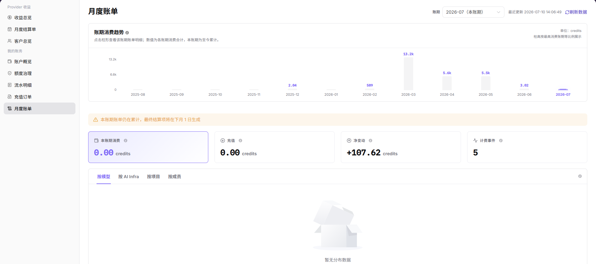

# 月度账单

::: info 文档信息
版本：v1.0
更新日期：2026-07-10
:::

## 功能概述

`月度账单` 用于按账期查看当前账号的消费趋势和账务汇总。用户可以选择账期，查看本账期消费、充值、净变动、计费事件，并按模型、AI Infra、项目和成员等视角核对费用来源。

| 项目 | 内容 |
| --- | --- |
| 适用角色 | 用户侧账号、业务管理员、账务查看人员 |
| 导航路径 | 我的账务 > 月度账单 |
| 管理对象 | 账期消费趋势、账期汇总、计费事件、分组账单 |
| 典型用途 | 月度对账、确认消费来源、核对充值和净变动 |

### 新手理解

月度账单像信用卡月结单，用来按账期核对本月消费、额度变化和明细来源。它不是只看一笔流水，而是按账期汇总消费、充值和净变动。做月度核对时，应先确认账期，再按模型、AI Infra、项目或成员视角拆分查看。

### 术语速查

| 术语 | 含义 | 处理建议 |
| --- | --- | --- |
| 月度账单 | 按月汇总的账务对账页面。 | 适合做账期级核对。 |
| 账期消费 | 当前账期内累计产生的消费。 | 与流水明细按时间范围核对。 |
| 净变动 | 充值、消费和调整后的额度变化。 | 不等同于单项消费。 |
| 分组视角 | 按模型、AI Infra、项目或成员拆分账单。 | 用于定位费用来源。 |
| 计费事件 | 产生费用或额度变化的事件数量。 | 事件异常时下钻流水。 |

## 前提条件

1. 当前账号具备用户侧账务查看权限。
2. 已进入 `我的账务 > 月度账单`。
3. 已确认需要核对的账期。
4. 如需解释单笔差异，应进入 `流水明细` 查看来源记录。

## 页面说明

页面提供账期选择和 `刷新数据` 入口，并展示 `账期消费趋势`、本账期累计提示、本账期消费、充值、净变动和计费事件。下方可通过 `按模型`、`按 AI Infra`、`按项目`、`按成员` 切换统计视角。

下图展示月度账单页面，截图中的金额和趋势数值已做脱敏处理。

## 主要操作

### 查看指定账期账单

1. 进入 `我的账务 > 月度账单`。
2. 在账期选择器中选择目标月份。
3. 点击 `刷新数据` 更新当前账期统计。
4. 查看账期消费趋势、本账期消费、充值、净变动和计费事件。

### 按维度核对消费来源

1. 在账单明细区域选择 `按模型`、`按 AI Infra`、`按项目` 或 `按成员`。
2. 查看对应维度下的消费汇总。
3. 对费用较高或异常的维度，进入流水明细继续核对。

## 参数说明

| 字段名称 | 是否必填 | 字段类型 | 示例 | 说明 |
| --- | --- | --- | --- | --- |
| 账期 | 必填 | 月份 | 2026-07 | 用于选择需要查看的月度账单。 |
| 本账期消费 | 系统生成 | Credits | `2,500 Credits` | 当前账期已累计消费。 |
| 充值 | 系统生成 | Credits | `5,000 Credits` | 当前账期充值汇总。 |
| 净变动 | 系统生成 | Credits | `+2,500 Credits` | 当前账期余额净变化。 |
| 计费事件 | 系统生成 | 数值 | `128` | 当前账期计费相关事件数量。 |
| 分组视角 | 可选 | 枚举 | 按项目 | 用于切换账单拆分维度。 |

## 踩坑提示

- 月度账单与实时流水可能存在统计延迟，账期未结束时不要作为最终结论。
- 分组视角只是拆分维度，不同视角之间不要直接累加比较。
- 净变动包含充值、消费和调整，不能只按消费金额解释。
- 月度账单发现异常后，应进入流水明细按同一账期继续核对。

## 结果校验

| 检查项 | 成功表现 | 异常时处理 |
| --- | --- | --- |
| 账期可切换 | 选择账期后页面展示对应数据 | 重新选择账期并刷新数据 |
| 汇总可见 | 本账期消费、充值和净变动可见 | 等待加载完成后刷新 |
| 维度可切换 | 可按模型、AI Infra、项目、成员查看 | 检查权限或页面加载状态 |
| 差异可追踪 | 异常金额可回到流水明细核对 | 统一账期和时间范围后重新查询 |

## 常见问题

### 本账期账单仍在累计

**问题现象：**

页面提示本账期账单仍在累计，最终结算项将在下月生成。

**可能原因：**

当前账期尚未结束，账单仍会随新的消费、充值或计费事件变化。

**处理方式：**

将本账期数据作为过程参考；最终对账应在账期结束并刷新数据后进行。

### 月度账单和流水明细金额不一致

**问题现象：**

月度账单汇总与流水明细筛选结果不同。

**可能原因：**

账期、时间范围、交易类型或统计维度不同。

**处理方式：**

统一账期和时间范围；在流水明细中按收支类型和交易类型核对；再返回月度账单刷新。

### 某个维度消费偏高

**问题现象：**

按模型、AI Infra、项目或成员查看时，某一项消费明显偏高。

**可能原因：**

该维度近期任务量增加，或存在高成本调用、训练、部署等行为。

**处理方式：**

记录该维度名称和账期；进入流水明细查看对应时间段的交易记录；必要时结合业务使用记录排查。

## 后续操作

1. 追踪单笔来源，进入 [流水明细](../transactions/)。
2. 查看当前余额，进入 [账户概览](../overview/)。
3. 查看额度风险，进入 [额度治理](../quota-governance/)。

## 注意事项

- 本账期数据在账期结束前可能变化，月度结算前不要作为最终口径。
- 对外沟通账单差异时，应脱敏金额、账号、订单号和流水号。
- 月度账单用于汇总核对，单笔来源仍应以流水明细为准。
