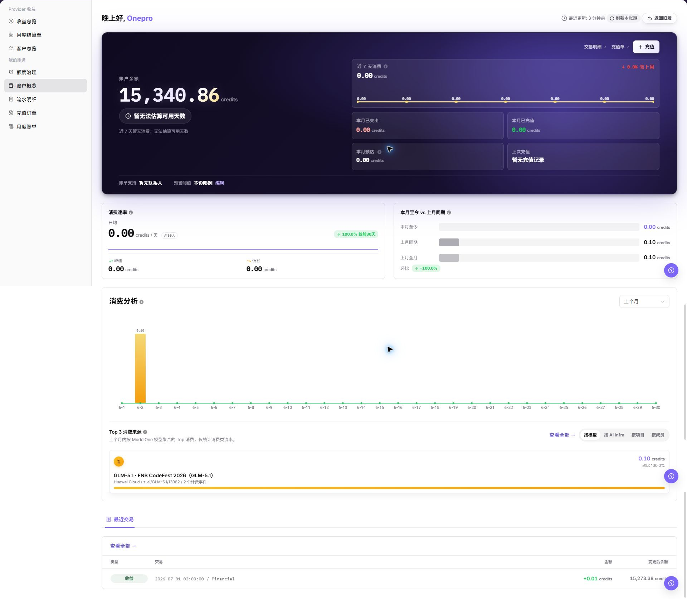

# 账户概览

::: info 文档信息
版本：v1.0
更新日期：2026-07-23
:::

## 功能概述

`账户概览` 用于查看当前账号的账务总览，包括账户余额、预计可用天数、近 7 天消费、本月已支出、本月已充值、本月预估、上次充值、账单支持、预警阈值、消费分析、Top 3 消费来源和最近交易。用户可先在该页面判断账户状态，再进入流水明细、充值订单、月度账单或额度治理核对明细。

| 项目 | 内容 |
| --- | --- |
| 适用角色 | 用户侧账号、业务管理员、账务查看人员 |
| 导航路径 | 账务 > 用户账务 > 账户概览 |
| 页面路由 | `/billing/my/account` |
| 管理对象 | 账户余额、消费趋势、充值入口、预警阈值、最近交易 |
| 典型途径 | 快速判断余额是否充足、查看消费趋势、进入交易明细或充值订单 |

#### 新手理解

账户概览像账务首页：先告诉你当前余额和预计还能使用多久，再展示近期消费、本月变化、消费来源和最近交易。如果余额、消费趋势或最近交易不符合预期，应继续进入 `流水明细`、`充值订单` 或 `月度账单` 核对。

#### 术语速查

| 术语 | 含义 | 处理建议 |
| --- | --- | --- |
| 账户余额 | 当前账号可继续使用的 Credits。 | 与流水明细中的变更后额度核对。 |
| 预计可用天数 | 根据近期消费速度估算的剩余可用时间。 | 只做趋势参考，不作为最终承诺。 |
| 本月预估 | 基于当前消费速度推算的月度消费。 | 账期结束前可能变化。 |
| Top 3 消费来源 | 当前消费占比较高的来源。 | 异常偏高时进入流水明细核对。 |
| 预警阈值 | 余额低于阈值时用于提醒的配置。 | 修改前确认团队消耗节奏。 |
| 最近交易 | 近期账务变化记录。 | 只能用于快速判断，完整核对进入流水明细。 |

## 前提条件

1. 当前账号具备用户侧账务查看权限。
2. 已进入 `我的账务 > 账户概览`。
3. 查看余额、消费趋势或最近交易前，确认页面加载完成。

::: warning 高风险操作边界
充值、预警阈值修改、导出账务数据等动作可能影响真实账户或暴露敏感信息。学习或截图时只查看页面、入口和字段，不执行最终提交。
:::

## 页面说明

下图展示账户概览页面，截图中的金额、账号和联系方式必须脱敏处理。

| 区域 | 说明 |
| --- | --- |
| 账户余额 | 展示当前可用余额。 |
| 预计可用天数 | 根据近 7 天消费速度估算余额可支撑的天数。 |
| 近 7 天消费 | 展示近期消费趋势。 |
| 本月已支出 | 展示当前自然月已消耗额度。 |
| 本月已充值 | 展示当前自然月已充值额度。 |
| 本月预估 | 展示当前趋势下的本月预估消费。 |
| 上次充值 | 展示最近一次充值相关信息。 |
| 账单支持 | 展示账单问题的联系入口。 |
| 预警阈值 | 展示余额提醒阈值，并提供编辑入口。 |
| 消费分析 | 展示本月至今与上月同期对比。 |
| Top 3 消费来源 | 展示主要消费来源。 |
| 最近交易 | 展示近期账务变化和 `查看全部` 入口。 |
| 交易明细 | 跳转到流水明细页面。 |
| 充值单 | 跳转到充值订单页面。 |

## 主要操作

### 查看账户概览

1. 进入 `账务 > 用户账务 > 账户概览`。
2. 查看 `账户余额` 和 `预计可用天数`，判断当前余额是否充足。
3. 查看 `近 7 天消费`、`本月已支出`、`本月已充值` 和 `本月预估`。
4. 查看 `消费分析` 和 `Top 3 消费来源`，识别是否存在异常消费来源。
5. 如仅学习或截图，只查看余额、趋势和入口，不点击充值或预警阈值最终保存类动作。

### 查看最近交易

1. 进入 `账务 > 用户账务 > 账户概览`。
2. 在 `最近交易` 区域查看近期账务变化。
3. 核对交易时间、交易类型、金额方向和说明。
4. 如最近交易不足以解释余额变化，点击 `查看全部` 或进入 `流水明细` 继续核对。
5. 对外沟通时隐藏真实金额、账号、订单号、流水号和业务上下文。

### 进入充值订单

1. 进入 `账务 > 用户账务 > 账户概览`。
2. 点击 `充值单` 入口进入充值订单页面。
3. 按订单号、订单状态或入账来源定位目标充值订单。
4. 核对充值状态、到账金额、创建时间和完成时间。
5. 如仅学习或截图，只查看入口和列表字段，不发起真实充值，不导出真实订单数据。

## 参数说明

| 字段名称 | 是否必填 | 字段类型 | 示例 | 说明 |
| --- | --- | --- | --- | --- |
| 账户余额 | 系统生成 | Credits | 脱敏金额 | 当前可用余额。 |
| 预计可用天数 | 系统生成 | 数值 | 脱敏天数 | 根据近 7 天消费速度估算。 |
| 近 7 天消费 | 系统生成 | Credits | 脱敏金额 | 最近 7 天累计消费。 |
| 本月已支出 | 系统生成 | Credits | 脱敏金额 | 当前自然月已消费额度。 |
| 本月已充值 | 系统生成 | Credits | 脱敏金额 | 当前自然月已充值额度。 |
| 本月预估 | 系统生成 | Credits | 脱敏金额 | 基于当前消费速度的月度预估。 |
| 上次充值 | 系统生成 | 信息区 | 脱敏金额 | 展示最近一次充值信息。 |
| 账单支持 | 系统生成 | 入口 | 脱敏联系方式 | 展示账单问题支持入口。 |
| 预警阈值 | 可编辑 | 数值 | 脱敏阈值 | 用于触发余额提醒的阈值。 |
| 消费分析 | 系统生成 | 图表 / 指标 | 脱敏比例 | 展示消费趋势和对比。 |
| Top 3 消费来源 | 系统生成 | 排名 | 脱敏来源 | 展示主要消费来源。 |
| 最近交易 | 系统生成 | 列表 | 脱敏流水 | 展示近期账务变化。 |
| 交易明细 | 否 | 入口 | 交易明细 | 跳转到流水明细页面。 |
| 充值单 | 否 | 入口 | 充值单 | 跳转到充值订单页面。 |
| 充值 | 否 | 高风险入口 | 充值 | 可能发起真实充值流程，仅说明入口边界。 |
| 编辑 | 否 | 高风险入口 | 编辑 | 可能修改预警阈值，保存前需确认影响范围。 |

## 踩坑提示

- 预计可用天数是基于近期消费估算，突发大任务会让天数快速下降。
- 概览只展示汇总和部分最近交易，不能替代完整流水明细。
- 本月预估不是最终账单，账期结束前充值、退款和消费都会改变结果。
- 调整预警阈值前应确认团队消耗节奏，阈值过低容易错过补充额度窗口。
- 不记录真实账号、邮箱、订单号、流水号、金额、客户名、组织名、Token 或 Key。
- 截图、导出、工单和评论必须脱敏。

## 结果校验

| 检查项 | 成功表现 | 异常时处理 |
| --- | --- | --- |
| 页面加载 | 账户余额、消费指标、最近交易和快捷入口正常显示。 | 刷新页面，或检查用户侧账务权限。 |
| 指标可见 | 近 7 天消费、本月已支出、本月已充值和本月预估可见。 | 等待数据加载完成后刷新。 |
| 入口可用 | `交易明细`、`充值单`、`查看全部` 等入口可跳转。 | 检查菜单权限或重新进入页面。 |
| 最近交易可核对 | 最近交易展示时间、类型、金额方向和说明。 | 进入流水明细按时间范围继续核对。 |
| 高风险动作未误触 | 学习或截图时未发起充值、未保存预警阈值、未导出真实数据。 | 如误触，立即记录时间和范围并通知负责人复核。 |

## 常见问题

#### 账户余额为空或显示异常

**问题现象：**

进入账户概览后没有看到余额，或余额与预期不一致。

**可能原因：**

账号没有对应账务权限、页面数据尚未加载完成，或余额口径与查看的账期不同。

**处理方式：**

刷新本账期数据；确认账号和菜单权限；再进入 `流水明细` 核对最近收入和支出。

#### 预计可用天数不符合预期

**问题现象：**

预计可用天数过低、过高或显示为 0。

**可能原因：**

近 7 天消费速度变化较大，或近期没有稳定消费数据。

**处理方式：**

结合近 7 天消费、本月已支出和本月预估一起判断，不要只看预计天数。

#### 最近交易无法解释余额变化

**问题现象：**

概览中的最近交易不足以解释余额变化。

**可能原因：**

最近交易只展示部分记录，完整流水需要进入明细页查看。

**处理方式：**

点击 `查看全部` 或进入 `流水明细`，按时间范围和交易类型重新筛选。

## 后续操作

1. 单笔余额变化，进入 [流水明细](../transactions/)。
2. 充值状态核对，进入 [充值订单](../top-up-orders/)。
3. 月度对账，进入 [月度账单](../monthly-bill/)。
4. 额度风险判断，进入 [额度治理](../quota-governance/)。

## 注意事项

- 不要把完整账号、邮箱、订单号、流水号或余额截图直接粘贴到外部沟通渠道。
- 账户概览是汇总入口，最终核对仍应以流水明细和月度账单为准。
- 涉及充值、退款、扣款、阈值修改或导出数据时，应先确认操作权限和审批依据。
- 学习或截图时只查看页面、入口和字段，不执行最终提交动作。
