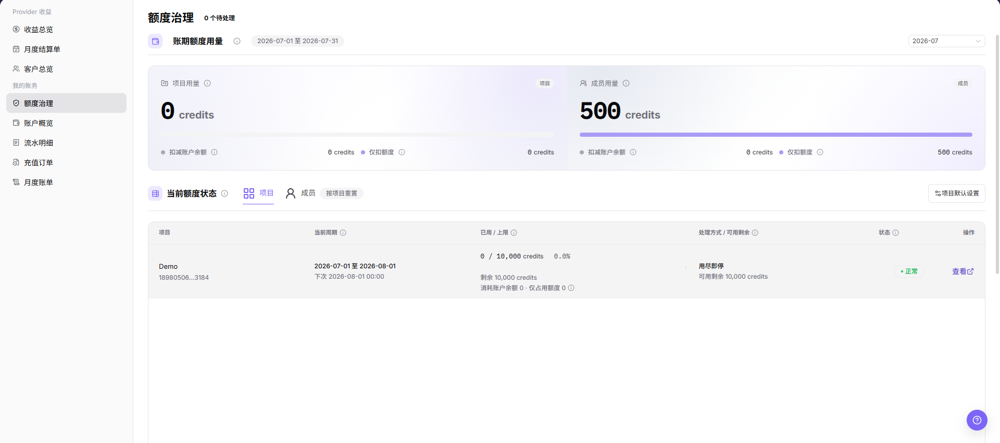

# 额度治理

::: info 文档信息
版本：v1.0
更新日期：2026-07-23
:::

## 功能概述

`额度治理` 用于查看当前账期内项目和成员维度的额度用量、可用剩余和风险状态。用户可通过该页面识别哪些项目或成员接近额度上限，并在影响业务前调整使用计划。

| 项目 | 内容 |
| --- | --- |
| 适用角色 | 用户侧账号、业务管理员、账务查看人员 |
| 导航路径 | 账务 > 用户账务 > 额度治理 |
| 页面路由 | `/billing/my/quota-governance` |
| 管理对象 | 项目额度、成员额度、账期额度用量、风险动作队列 |
| 典型途径 | 查看额度水位、识别超额风险、进入项目或成员明细 |

#### 新手理解

额度治理像账务的用量仪表盘：余额告诉你账户还有多少可用额度，额度治理告诉你额度被哪些项目或成员使用、是否接近上限，以及需要先处理哪些风险。

#### 术语速查

| 术语 | 含义 | 处理建议 |
| --- | --- | --- |
| 账期额度 | 当前账期内可使用的额度上限。 | 排查前先确认账期范围。 |
| 用量比例 | 已用额度占额度上限的比例。 | 接近上限时优先处理。 |
| 风险队列 | 需要关注的超额、接近上限或待处理事项。 | 按影响业务程度排序处理。 |
| 处理动作 | 针对风险项建议执行的操作。 | 涉及规则变更时先确认权限。 |
| 可用剩余 | 当前维度还可继续使用的额度。 | 不能直接等同于账户余额。 |

## 前提条件

1. 当前账号具备用户侧账务查看权限。
2. 已进入 `我的账务 > 额度治理`。
3. 已确认当前账期范围。
4. 如需调整额度规则，应具备对应管理权限。

::: warning 高风险操作边界
额度调整、按项目重置、项目默认设置或预警阈值修改可能影响项目和成员的真实可用额度。本文只说明查看和确认边界，不指导最终提交。
:::

## 页面说明

页面包含 `账期额度用量`、`当前额度状态` 和 `风险与动作队列`。当前额度状态支持在 `项目` 和 `成员` 视角之间切换，并提供 `按项目重置`、`项目默认设置` 和行内 `查看` 等入口。

下图展示额度治理页面，截图中的项目、成员、额度和用量数据必须脱敏处理。

| 区域 | 说明 |
| --- | --- |
| 账期额度用量 | 展示当前账期项目和成员维度的额度用量。 |
| 当前额度状态 | 展示项目或成员的当前周期、已用与上限、处理方式、可用剩余和状态。 |
| 项目 | 切换到项目维度查看额度。 |
| 成员 | 切换到成员维度查看额度。 |
| 按项目重置 | 按项目维度重置或调整额度策略的入口。 |
| 项目默认设置 | 进入项目额度默认规则设置入口。 |
| 风险与动作队列 | 展示需要关注的额度风险和处理动作。 |
| 查看 | 查看项目或成员额度详情。 |

## 主要操作

### 查看项目额度

1. 进入 `账务 > 用户账务 > 额度治理`。
2. 在 `当前额度状态` 区域选择 `项目`。
3. 查看项目、当前周期、已用与上限、处理方式、可用剩余、状态和操作列。
4. 如需查看项目详情，点击行内 `查看`。
5. 如仅学习或截图，只查看额度水位和详情入口，不执行按项目重置或默认设置修改。

### 查看成员额度

1. 进入 `账务 > 用户账务 > 额度治理`。
2. 在 `当前额度状态` 区域选择 `成员`。
3. 查看成员维度的当前周期、已用与上限、处理方式、可用剩余和状态。
4. 对接近上限的成员，结合业务使用情况调整任务计划。
5. 对外沟通时隐藏真实成员邮箱、项目名称、额度上限和消费明细。

### 查看风险与动作队列

1. 进入 `账务 > 用户账务 > 额度治理`。
2. 查看页面下方的 `风险与动作队列`。
3. 优先关注接近上限、超额或影响业务继续使用的事项。
4. 涉及额度规则变更时，先确认变更范围、影响对象和审批依据。
5. 如仅学习或截图，只查看风险项和建议动作，不提交真实额度调整。

## 参数说明

| 字段名称 | 是否必填 | 字段类型 | 示例 | 说明 |
| --- | --- | --- | --- | --- |
| 账期额度用量 | 系统生成 | 指标 | 脱敏金额 | 展示当前账期额度使用情况。 |
| 当前额度状态 | 系统生成 | 区域 | 项目 | 展示项目或成员维度额度状态。 |
| 项目 | 否 | 页签 / 表格列 | 脱敏项目 | 切换或展示项目额度。 |
| 成员 | 否 | 页签 / 表格列 | 脱敏邮箱 | 切换或展示成员额度。 |
| 当前周期 | 系统生成 | 时间范围 | 脱敏账期 | 当前额度统计周期。 |
| 已用 / 上限 | 系统生成 | 数值 | 脱敏额度 | 已使用额度与额度上限。 |
| 处理方式 | 系统生成 | 文本 | 限制新增任务 | 超额或接近上限时的处理口径。 |
| 可用剩余 | 系统生成 | 数值 | 脱敏额度 | 当前维度剩余可用额度。 |
| 状态 | 系统生成 | 枚举 | 正常、风险 | 展示当前额度状态。 |
| 查看 | 否 | 入口 | 查看 | 查看项目或成员额度详情。 |
| 按项目重置 | 否 | 高风险入口 | 按项目重置 | 可能调整项目额度策略，提交前需确认影响范围。 |
| 项目默认设置 | 否 | 高风险入口 | 项目默认设置 | 可能修改项目额度默认规则。 |
| 风险与动作队列 | 系统生成 | 列表 | 脱敏风险项 | 展示需要关注的额度风险和建议动作。 |

## 踩坑提示

- 项目维度和成员维度属于不同统计视角，不要直接把两个视角的数值相加。
- 额度治理展示的是限制和水位，不代表充值、扣款或结算已经发生。
- 风险队列处理后可能存在刷新延迟，应回到当前账期重新确认。
- 调整额度规则前要确认影响对象，避免影响正在运行的任务或团队成员。
- 不记录真实账号、邮箱、订单号、流水号、金额、客户名、组织名、Token 或 Key。
- 截图、导出、工单和评论必须脱敏。

## 结果校验

| 检查项 | 成功表现 | 异常时处理 |
| --- | --- | --- |
| 页面加载 | 账期额度用量、当前额度状态、风险与动作队列正常显示。 | 刷新页面，或检查用户侧账务权限。 |
| 维度可切换 | `项目` 与 `成员` 视角可切换。 | 检查页面权限和加载状态。 |
| 列表字段可见 | 当前周期、已用与上限、处理方式、可用剩余和状态可见。 | 联系运营方确认额度规则。 |
| 详情入口可用 | 行内 `查看` 可打开项目或成员额度详情。 | 检查账号权限或页面加载状态。 |
| 高风险动作未误触 | 学习或截图时未执行按项目重置、默认设置修改或额度调整。 | 如误触，立即记录时间和范围并通知负责人复核。 |

## 常见问题

#### 项目额度接近上限

**问题现象：**

项目维度显示已用额度接近或达到上限。

**可能原因：**

项目近期任务量增加，或额度上限低于当前业务需求。

**处理方式：**

先查看该项目的消费来源；暂停非必要任务；如需调整额度，按组织流程联系运营方处理。

#### 成员额度和项目额度看起来不一致

**问题现象：**

成员视角和项目视角的额度水位不完全一致。

**可能原因：**

两个视角的统计对象不同，一个按项目聚合，一个按成员聚合。

**处理方式：**

先确认当前查看维度，再结合对应页面的已用与上限判断，不要直接把两个视角的数字相加。

#### 风险队列没有自动消失

**问题现象：**

处理后风险与动作队列仍显示相关项。

**可能原因：**

数据刷新存在延迟，或处理动作没有覆盖全部对象。

**处理方式：**

刷新页面并重新查看当前账期；如风险仍存在，进入对应项目或成员明细继续核对。

## 后续操作

1. 需要核对费用来源，进入 [流水明细](../transactions/)。
2. 需要查看账户余额，进入 [账户概览](../overview/)。
3. 需要按月核对额度影响，进入 [月度账单](../monthly-bill/)。

## 注意事项

- 额度治理用于风险判断，不等同于充值或扣款页面。
- 调整额度规则前，应确认影响范围、账期和业务优先级。
- 不要在沟通中暴露成员、项目、额度上限或消费明细的完整敏感信息。
- 学习或截图时只查看额度水位、风险项和详情入口，不提交真实额度调整。
