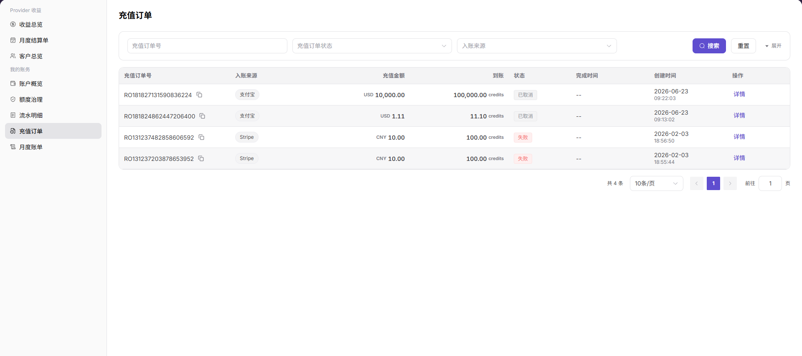

# 充值订单

::: info 文档信息
版本：v1.0
更新日期：2026-07-10
:::

## 功能概述

`充值订单` 用于查看当前账号发起或关联的充值记录，包括充值订单号、入账来源、充值金额、到账金额、订单状态、完成时间、创建时间和详情入口。用户可通过订单号、状态和入账来源定位充值是否处理完成。

| 项目 | 内容 |
| --- | --- |
| 适用角色 | 用户侧账号、业务管理员、账务查看人员 |
| 导航路径 | 我的账务 > 充值订单 |
| 管理对象 | 充值订单、入账来源、充值金额、到账金额、订单状态 |
| 典型用途 | 查询充值结果、核对到账额度、排查失败或取消订单 |

### 新手理解

充值订单像超市购物小票，用来确认哪笔充值已提交、是否到账、失败时去哪排查。余额未变化时，应先看订单是否成功，再看到账金额是否生成对应收入流水。

### 术语速查

| 术语 | 含义 | 处理建议 |
| --- | --- | --- |
| 充值订单 | 用户发起充值后形成的订单记录。 | 用订单号精确定位。 |
| 入账来源 | 充值资金来源或支付渠道。 | 与流水明细一起核对。 |
| 到账金额 | 充值完成后进入账户的额度或金额。 | 成功后仍可能有同步延迟。 |
| 订单状态 | 订单成功、失败、取消或处理中状态。 | 异常状态先看详情。 |

## 前提条件

1. 当前账号具备用户侧账务查看权限。
2. 已进入 `我的账务 > 充值订单`。
3. 查询订单前准备充值订单号、订单状态或入账来源。
4. 涉及重新充值、退款或异常处理时，应先确认订单状态和支付结果。

## 页面说明

页面包含筛选区和订单列表。筛选区支持 `充值订单号`、`充值订单状态`、`入账来源` 等条件，并提供 `搜索`、`重置` 和 `展开`。表格展示 `充值订单号`、`入账来源`、`充值金额`、`到账`、`状态`、`完成时间`、`创建时间` 和 `操作`，行内操作包含 `详情`。

下图展示充值订单列表，截图中的订单号和金额已做脱敏处理。

## 主要操作

### 查询充值订单

1. 进入 `我的账务 > 充值订单`。
2. 输入充值订单号，或选择充值订单状态、入账来源。
3. 点击 `搜索`。
4. 查看订单列表中的充值金额、到账金额和状态。
5. 如需清空条件，点击 `重置`。

### 查看订单详情

1. 在目标订单行点击 `详情`。
2. 查看订单状态、入账来源、金额、到账信息和时间。
3. 如订单失败或取消，保留脱敏订单号并联系运营方核对。

## 参数说明

| 字段名称 | 是否必填 | 字段类型 | 示例 | 说明 |
| --- | --- | --- | --- | --- |
| 充值订单号 | 否 | 文本 | `TOPUP-202607080001` | 用于精确定位单笔充值订单。 |
| 充值订单状态 | 否 | 枚举 | 已取消、失败 | 用于按处理状态筛选订单。 |
| 入账来源 | 否 | 枚举 | 支付宝、Stripe | 展示或筛选充值来源。 |
| 充值金额 | 系统生成 | 金额 | `¥1,000.00` | 用户发起充值的支付金额。 |
| 到账 | 系统生成 | Credits / 金额 | `1,000 Credits` | 充值完成后到账额度。 |
| 完成时间 | 系统生成 | 时间 | `2026-07-08 10:00` | 订单完成或结束时间。 |
| 创建时间 | 系统生成 | 时间 | `2026-07-08 09:55` | 订单创建时间。 |

## 踩坑提示

- 充值成功不等于额度立即到账，余额和流水可能存在短暂同步延迟。
- 订单号、支付流水号和账务流水号是不同对象，排查时不要混用。
- 订单失败或取消后不要立刻重复充值，应先确认是否实际扣款。
- 入账来源不同，到账时间和对账口径可能不同。

## 结果校验

| 检查项 | 成功表现 | 异常时处理 |
| --- | --- | --- |
| 订单可查询 | 输入订单号或筛选条件后列表展示结果 | 清空条件或核对订单号 |
| 状态可判断 | 列表展示订单状态 | 查看详情或联系运营方 |
| 到账可核对 | 到账金额与账户收入流水可对应 | 进入流水明细核对 |
| 详情可进入 | 行内 `详情` 可打开订单信息 | 检查权限或页面加载状态 |

## 常见问题

### 找不到充值订单

**问题现象：**

输入充值订单号后列表为空。

**可能原因：**

订单号输入错误、筛选条件过多，或当前账号不是该订单归属账号。

**处理方式：**

清空筛选条件后重新查询；核对订单号；仍无法找到时使用脱敏订单号联系运营方。

### 订单失败或已取消

**问题现象：**

订单状态显示失败或已取消。

**可能原因：**

支付未完成、支付渠道返回失败、订单超时或被取消。

**处理方式：**

先确认是否实际扣款；不要重复提交相同订单；如已扣款但订单异常，联系运营方处理。

### 充值成功但余额没有变化

**问题现象：**

订单看起来已完成，但账户概览余额没有变化。

**可能原因：**

到账处理存在延迟，或当前查看的账户、账期、流水口径不一致。

**处理方式：**

刷新账户概览；进入 `流水明细` 查看是否有收入记录；仍不一致时联系运营方核对。

## 后续操作

1. 核对到账流水，进入 [流水明细](../transactions/)。
2. 查看余额变化，进入 [账户概览](../overview/)。
3. 做月度对账，进入 [月度账单](../monthly-bill/)。

## 注意事项

- 充值订单号、支付来源、金额和到账信息属于敏感账务数据，截图和沟通时应脱敏。
- 不要在不确认支付结果的情况下重复发起充值。
- 涉及退款或异常入账时，应按平台流程由有权限人员处理。
