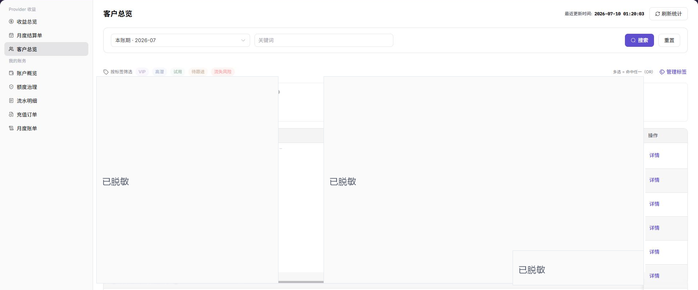

# 客户总览

::: info 文档信息
版本：v1.0
更新日期：2026-07-23
:::

## 功能概述

客户总览用于按客户维度查看 Provider 收益情况，重点核对账期、关键词和标签筛选、客户统计卡片、本账期收益、收益占比、客户加入时间、账期最近收益和详情入口。服务商可通过该页面定位重点客户，并进入客户详情核对客户维度收益明细。

| 项目 | 内容 |
| --- | --- |
| 适用角色 | Provider 账号、客户运营人员、收益分析人员 |
| 导航路径 | 账务 > Provider 收益 > 客户总览 |
| 页面路由 | `/billing/provider/customers` |
| 管理对象 | 客户收益、账期、客户标签、本账期收益、收益占比、加入时间、最近收益和详情入口 |
| 典型途径 | 查看客户维度收益、定位重点客户、核对客户收益明细 |

#### 新手理解

客户总览像 Provider 的客户收益看板。先选择账期，再通过关键词或标签缩小客户范围，查看客户总数、新增客户、Top 客户和收益占比。需要进一步核对客户贡献时，进入行内 `详情` 查看客户维度收益明细。

#### 术语速查

| 术语 | 含义 | 处理建议 |
| --- | --- | --- |
| 客户收益 | 某客户在指定账期贡献的收益金额。 | 与收益总览、月度结算单和收益账户出账交叉核对。 |
| 客户标签 | 用于标记 VIP、高潜、试用、待跟进等客户分类。 | 筛选前确认标签含义，修改前确认影响范围。 |
| Top 1 客户 | 当前账期收益贡献最高的客户。 | 不要只凭排名判断客户长期价值。 |
| Top 5 占比 | Top 5 客户收益在当前统计范围内的占比。 | 标签或关键词筛选会改变统计口径。 |
| 本账期收益 | 客户在所选账期内产生的收益。 | 比较前先统一账期。 |
| 账期最近收益 | 客户在所选账期内最近一次收益或最近收益表现。 | 与客户详情中的收益明细一起核对。 |

## 前提条件

1. 当前账号具备查看 `Provider 收益 > 客户总览` 的权限。
2. 已确认需要查看的 Provider 收益账期。
3. 查看客户详情前，已确认当前账号可查看目标客户范围。

::: warning 高风险操作边界
客户总览包含客户组织、管理员信息、客户标签、收益金额和占比。学习或截图时只查看列表字段和详情入口，不修改标签，不导出真实客户收益数据。
:::

## 页面说明

下图展示客户总览页面。截图、导出文件、工单和评论中的客户名称、组织、管理员信息、收益金额和客户明细必须脱敏。

| 区域 | 说明 |
| --- | --- |
| 账期 | 按账期查看客户收益统计。 |
| 关键词 | 按客户相关关键词筛选。 |
| 搜索 | 按当前筛选条件查询客户列表。 |
| 重置 | 清空筛选条件并恢复默认列表。 |
| 标签筛选 | 按客户标签筛选客户列表。 |
| 刷新统计 | 刷新客户收益统计数据。 |
| 统计卡片 | 展示客户总数、账期新增、Top 1 客户和 Top 5 占比。 |
| 客户列表 | 展示组织信息、管理员信息、标签、本账期收益、占比、客户加入时间、账期最近收益和操作。 |
| 详情 | 查看客户维度收益明细。 |
| 管理标签 | 维护标签分类或标签配置；该入口不作为本文主要操作。 |

## 主要操作

### 查看客户详情

1. 进入 `账务 > Provider 收益 > 客户总览`。
2. 查看客户统计卡片，包括客户总数、账期新增、Top 1 客户和 Top 5 占比。
3. 按需选择 `账期`，或使用关键词、标签筛选定位目标客户。
4. 在客户列表中核对组织信息、管理员信息、标签、本账期收益、占比、客户加入时间和账期最近收益。
5. 点击目标客户行内 `详情`。
6. 在详情页或详情区域查看客户维度收益明细，并与收益总览、月度结算单或出账流水交叉核对。
7. 如仅学习或截图，只查看列表字段和详情入口，不修改标签，不导出真实客户收益数据。

## 参数说明

| 字段名称 | 是否必填 | 字段类型 | 示例 | 说明 |
| --- | --- | --- | --- | --- |
| 账期 | 否 | 筛选项 | 2026-07 | 选择客户收益统计所属账期。 |
| 关键词 | 否 | 筛选项 | 脱敏关键词 | 按客户名称、组织或其他客户相关关键词搜索。 |
| 搜索 | 否 | 按钮 | 搜索 | 按筛选条件刷新客户列表。 |
| 重置 | 否 | 按钮 | 重置 | 清空筛选条件并恢复默认列表。 |
| 标签筛选 | 否 | 筛选项 | VIP | 按客户标签过滤列表。 |
| 刷新统计 | 否 | 按钮 | 刷新统计 | 刷新客户收益统计结果。 |
| 客户总数 | 系统生成 | 统计卡片 | 脱敏数量 | 展示当前统计范围内的客户总数。 |
| 账期新增 | 系统生成 | 统计卡片 | 脱敏数量 | 展示当前账期新增客户数量。 |
| Top 1 客户 | 系统生成 | 统计卡片 | 脱敏客户 | 展示当前账期收益贡献最高的客户。 |
| Top 5 占比 | 系统生成 | 统计卡片 | 脱敏比例 | 展示 Top 5 客户收益占比。 |
| 组织信息 | 系统生成 | 表格列 | 脱敏组织 | 展示客户组织相关信息。 |
| 管理员信息 | 系统生成 | 表格列 | 脱敏管理员 | 展示客户管理员相关信息。 |
| 标签 | 系统生成 | 表格列 | 高潜 | 展示客户当前标签。 |
| 本账期收益 | 系统生成 | 表格列 | 脱敏金额 | 展示客户在所选账期内贡献的收益。 |
| 占比 | 系统生成 | 表格列 | 脱敏比例 | 展示客户收益在当前范围内的占比。 |
| 客户加入时间 | 系统生成 | 表格列 | 2026-07-08 | 展示客户加入时间。 |
| 账期最近收益 | 系统生成 | 表格列 | 脱敏金额 | 展示该客户在账期内最近收益情况。 |
| 详情 | 否 | 按钮 | 详情 | 查看客户收益详情。 |
| 管理标签 | 否 | 高风险入口 | 管理标签 | 可能影响客户分类和运营跟进，不作为本文主要操作。 |

## 踩坑提示

- 客户总览包含客户组织、管理员信息、客户标签、收益金额和占比，截图、导出、工单和评论必须脱敏。
- 标签筛选会改变列表范围和收益占比，核对前要确认当前是否启用了标签。
- 管理标签会影响客户分类和运营跟进，不作为本文主要操作。
- 客户收益占比按当前账期和筛选范围计算，不代表全平台口径。
- 不记录真实客户名、组织名、管理员邮箱、账号、金额、结算单号、流水号、Token 或 Key。

## 结果校验

| 检查项 | 成功表现 | 异常时处理 |
| --- | --- | --- |
| 页面加载 | 客户统计卡片、筛选项和客户列表正常显示。 | 刷新页面，或检查 Provider 收益权限。 |
| 筛选可用 | 账期、关键词和标签筛选可用于定位客户。 | 点击 `重置` 后重新筛选。 |
| 客户字段可见 | 组织信息、管理员信息、标签、本账期收益、占比、加入时间和最近收益正常显示。 | 调整账期或筛选条件后重试。 |
| 详情可查看 | 点击 `详情` 后可查看客户收益明细。 | 检查该客户是否有可查看明细或账号权限。 |
| 高风险动作未误触 | 学习或截图时未修改标签、未导出真实客户数据。 | 如误触，立即记录时间和范围并通知负责人复核。 |

## 常见问题

#### 客户列表为空

**问题现象：**

进入客户总览后没有看到客户记录。

**可能原因：**

账期、关键词或标签筛选条件过窄，或当前账号没有对应客户范围。

**处理方式：**

点击 `重置` 后重新选择账期；如仍为空，返回收益总览确认该账期是否已有客户收益。

#### 客户收益占比看起来异常

**问题现象：**

某个客户的本账期收益或占比与预期不一致。

**可能原因：**

账期选择不同、客户标签筛选改变了统计范围，或最近收益尚未完全反映到列表。

**处理方式：**

确认账期和筛选条件，再进入 `详情` 查看客户收益明细，并结合收益总览、月度结算单或收益账户出账核对。

#### 管理标签前需要注意什么

**问题现象：**

页面提供 `管理标签` 入口。

**可能原因：**

标签会影响客户筛选、运营分类和后续跟进。

**处理方式：**

修改前确认标签含义和客户范围；只学习或截图时不要保存标签变更。

## 后续操作

1. 需要回到汇总视图时，进入 [收益总览](../revenue/)。
2. 需要核对账期结算记录时，进入 [月度结算单](../settlements/)。
3. 需要核对到账流水时，查看收益账户出账。

## 注意事项

- 客户总览包含客户组织、管理员和收益数据，截图或对外沟通前应先脱敏。
- 学习或截图时只查看列表字段和详情入口，不修改标签，不导出真实客户收益数据。
- 管理标签可能影响客户分类，修改前应确认标签含义、客户范围和操作权限。
- 客户收益核对时，应同时查看账期、筛选条件、收益总览、月度结算单和收益账户出账。
