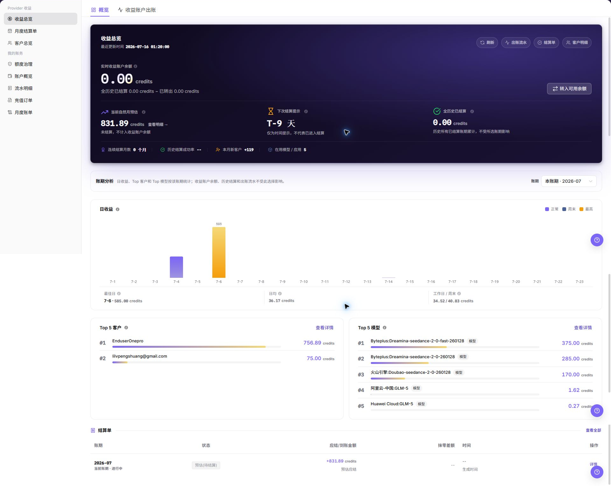
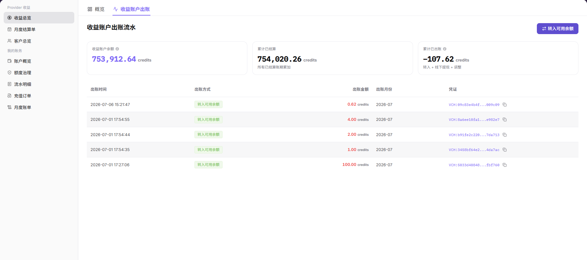

# 收益总览

::: info 文档信息
版本：v1.0
更新日期：2026-07-10
:::

## 功能概述

收益总览用于查看服务商侧 Provider 收益的整体情况，包括收益账户余额、当前自然月预估、账期分析、日收益、Top 客户、Top 模型、收益账户出账、结算单和客户明细。服务商账号可以通过该页面确认收益趋势、核对出账记录，并与月度结算单和客户维度收益进行交叉校验。

| 项目 | 内容 |
| --- | --- |
| 适用角色 | 服务商账号、服务商财务查看人员、收益运营人员 |
| 导航路径 | 账务 > Provider 收益 > 收益总览 |
| 页面路由 | `/billing/provider/revenue` |
| 管理对象 | 收益概览、收益账户余额、收益账户出账、账期分析、结算单、客户收益 |
| 典型途径 | 查看 Provider 收益、核对收益账户出账、与结算单和客户明细对账 |

#### 新手理解

收益总览像服务商收益看板。先通过顶部指标判断收益账户当前状态，再通过账期分析查看某个账期内的收益趋势、主要客户和主要模型来源。需要核对明细时，再切换到收益账户出账，或进入月度结算单、客户总览继续核对。

#### 术语速查

| 术语 | 含义 | 处理建议 |
| --- | --- | --- |
| 收益账户余额 | Provider 当前可查看的收益账户余额。 | 与收益账户出账和月度结算单一起核对。 |
| 当前自然月预估 | 当前自然月内根据已有数据估算的收益。 | 不要当作最终结算金额。 |
| 账期分析 | 按指定账期展示日收益、客户贡献和模型贡献。 | 比较数据前先统一账期。 |
| 收益账户出账 | 收益账户发生出账或账户活动的明细记录。 | 金额异常时优先核对。 |
| 月度结算单 | 按账期生成的结算结果。 | 用于确认预估收益和实际结算差异。 |

## 前提条件

1. 当前账号具备查看 Provider 收益的权限。
2. 已进入 `Provider 收益 > 收益总览`。
3. 页面数据加载完成后再核对收益、账期、客户和模型数据。

::: warning 高风险操作边界
收益账户余额、出账金额、客户名称、账期和结算状态属于敏感信息。学习或截图时只查看页面、页签、列表字段和状态，不导出真实收益数据，不记录真实客户名、账号、金额、流水号、结算单号、Token 或 Key。
:::

## 页面说明

下图展示收益总览页面。截图中的金额、客户和收益明细已做脱敏处理。

| 区域 | 说明 |
| --- | --- |
| 概览 | 查看 Provider 收益的核心指标和账期分析。 |
| 收益账户出账 | 查看收益账户出账或账户活动列表。 |
| 收益账户余额 | 展示收益账户当前余额。 |
| 当前自然月预估 | 展示当前自然月的预估收益。 |
| 账期分析 | 按所选账期展示日收益、Top 客户、Top 模型和结算单概览。 |
| 结算单 | 查看账期结算记录。 |
| 客户明细 | 查看客户维度收益。 |

## 主要操作

### 查看收益概览

1. 进入 `Provider 收益 > 收益总览`。
2. 查看 `收益账户余额`、`当前自然月预估`、下次结算提示和历史结算表现。
3. 在 `账期` 中确认当前分析的账期范围。
4. 查看 `日收益`、`Top 客户` 和 `Top 模型`，判断收益趋势和主要来源。
5. 如需核对结算结果，查看页面中的结算单概览，或进入月度结算单继续核对。
6. 如仅学习或截图，只查看汇总指标和脱敏后的图表，不导出真实收益数据，不记录客户、金额或账户敏感信息。

### 查看收益账户出账

1. 进入 `Provider 收益 > 收益总览`。
2. 切换到 `收益账户出账` 页签。
3. 查看收益账户出账列表。
4. 按需核对出账时间、出账类型、金额、状态、关联账期和说明。
5. 如需与结算结果核对，返回收益总览或进入月度结算单查看对应账期。
6. 如仅学习或截图，只查看列表字段和状态，不导出真实收益数据，不记录客户、金额或账户敏感信息。

## 参数说明

| 字段名称 | 是否必填 | 字段类型 | 示例 | 说明 |
| --- | --- | --- | --- | --- |
| 概览 | 否 | 页签 | `概览` | 查看收益总览和账期分析。 |
| 收益账户出账 | 否 | 页签 | `收益账户出账` | 查看收益账户出账或账户活动列表。 |
| 收益账户余额 | 系统生成 | Credits | `100.00 credits` | 展示当前收益账户余额，截图时必须脱敏。 |
| 当前自然月预估 | 系统生成 | Credits | `100.00 credits` | 展示当前自然月预估收益，不代表最终结算金额。 |
| 账期 | 否 | 月份 / 账期 | `2026-07` | 控制账期分析区域展示的数据范围。 |
| 日收益 | 系统生成 | 图表 | `Jul 6` | 展示所选账期内每天的收益变化。 |
| Top 客户 | 系统生成 | 排名 | `示例客户` | 展示所选账期内贡献较高的客户，截图时必须脱敏。 |
| Top 模型 | 系统生成 | 排名 | `示例模型` | 展示所选账期内贡献较高的模型。 |
| 出账时间 | 系统生成 | 时间 | `2026-07-10 12:00:00` | 收益账户出账或账户活动发生时间。 |
| 出账类型 | 系统生成 | 枚举 | `结算入账` | 收益账户出账或账户活动类型。 |
| 出账金额 | 系统生成 | Credits | `100.00 credits` | 收益账户出账金额，截图和工单中必须脱敏。 |
| 出账状态 | 系统生成 | 枚举 | `成功` | 收益账户出账处理状态。 |
| 关联账期 | 系统生成 | 账期 | `2026-07` | 该出账记录关联的结算账期。 |
| 说明 | 否 | 文本 | `示例说明` | 出账记录说明，不写真实客户、账号或内部处理信息。 |

## 踩坑提示

- 不要只看收益账户余额判断收益是否正确，应结合收益账户出账、月度结算单和客户明细核对来源。
- 当前自然月预估会随消费和结算处理变化，不要当作最终到账金额。
- Top 客户或 Top 模型为空不一定是异常，先确认账期内是否有真实收益。
- 收益账户余额、出账金额、客户名称、账期和结算状态属于敏感信息，截图、导出、工单和评论必须脱敏。
- 学习或截图时只查看页面、页签、列表字段和状态，不导出真实收益数据。

## 结果校验

| 检查项 | 成功表现 | 异常时处理 |
| --- | --- | --- |
| 页面加载 | 收益指标、账期分析和入口按钮正常显示。 | 刷新页面，或检查当前账号是否具备 Provider 收益权限。 |
| 概览可读 | 收益账户余额、当前自然月预估、日收益、Top 客户和 Top 模型可见。 | 等待数据刷新，或切换到有收益的账期查看。 |
| 出账列表可读 | `收益账户出账` 页签下列表字段和状态可见。 | 刷新页面，或确认当前账号是否具备出账查看权限。 |
| 对账路径可用 | 可返回收益总览或进入月度结算单核对对应账期。 | 从左侧菜单重新进入目标页面。 |

## 常见问题

#### 收益余额与预期不一致

**问题现象：**

收益总览中的余额或预估收益与内部记录不一致。

**可能原因：**

所选账期不同、收益账户出账尚未全部核对，或结算单状态仍在处理中。

**处理方式：**

先确认账期，再进入 `收益账户出账`、`月度结算单` 和 `客户总览` 分别核对来源、状态和客户维度数据。

#### Top 客户或 Top 模型为空

**问题现象：**

账期分析中客户排行或模型排行没有数据。

**可能原因：**

当前账期内没有对应收益，或页面数据仍在加载。

**处理方式：**

切换到已有收益的账期重新查看；如果其他指标也为空，检查账号权限和页面加载状态。

#### 收益账户出账列表为空

**问题现象：**

切换到 `收益账户出账` 后没有出账记录。

**可能原因：**

当前账号尚未产生已结算收益、所选范围内无出账活动，或数据仍在同步。

**处理方式：**

先返回收益总览核对历史结算状态，再进入月度结算单查看对应账期是否已结算。

## 后续操作

1. 需要核对结算状态时，进入 [月度结算单](../settlements/)。
2. 需要按客户维度核对收益时，进入 [客户总览](../customers/)。
3. 需要排查收益账户出账时，保留脱敏后的页面路径、账期和状态信息。

## 注意事项

- 收益总览展示的是汇总视图，最终核对应结合收益账户出账、结算单和客户明细。
- 收益账户余额、出账金额、客户名称、账号、账期、流水号和结算单号属于敏感信息，禁止直接外传。
- 截图、导出、工单和评论必须脱敏。
- 不记录真实客户名、账号、金额、流水号、结算单号、Token 或 Key。
