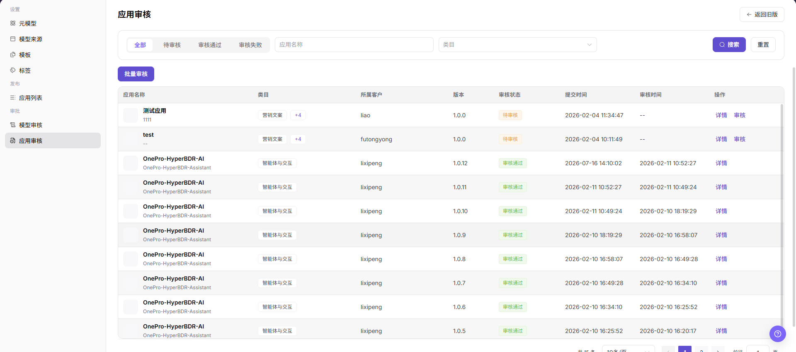
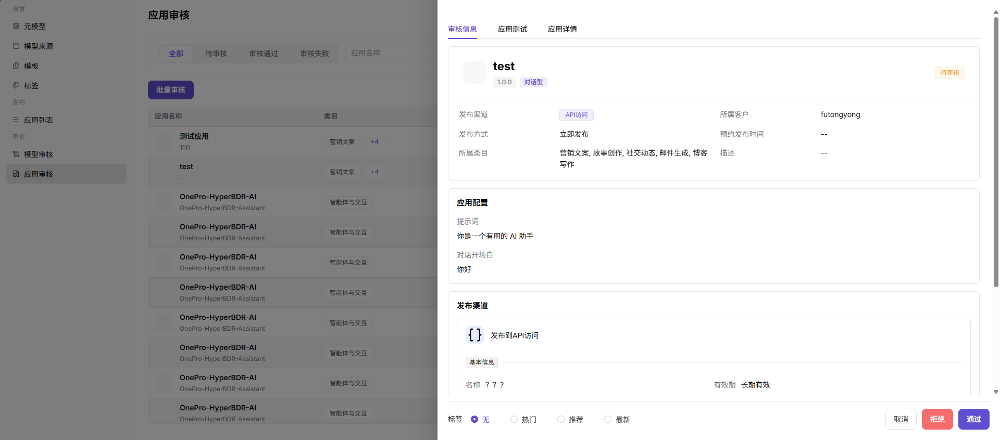

# 应用审核

::: info 文档信息
版本：v1.0
更新日期：2026-07-08
:::

## 功能概述

`应用审核` 用于处理应用接入模型的权限申请，核对客户信息、调用范围、模型权限和审核意见。

| 项目 | 内容 |
| --- | --- |
| 适用角色 | 运营方 |
| 导航路径 | 模型及AI服务 > 审批 > 应用审核 |
| 页面路由 | /modelone/audit/app |
| 管理对象 | 应用申请、模型权限、调用范围、客户信息和审核意见 |
| 典型用途 | 审核应用是否允许调用模型服务 |

#### 新手理解

应用审核像把模型能力交给客户前的门禁，重点确认应用描述、绑定模型、客户可见范围和调用风险是否清楚。

#### 术语速查

| 术语 | 说明 |
| --- | --- |
| 应用审核单 | 应用发布或变更进入审核流程后的处理记录。 |
| 绑定模型 | 应用实际调用的模型或聚合模型。 |
| 客户可见范围 | 应用发布后允许访问的客户集合。 |
| 补充材料 | 申请方需要补齐的说明、授权或测试信息。 |

## 前提条件

1. 当前账号具备`应用审核` 权限。
2. 申请方已提交应用说明、绑定模型、客户可见范围和调用入口。
3. 审核前已确认绑定模型状态、客户授权和使用边界。

## 页面说明

页面用于处理应用发布审核，展示应用名称、绑定模型、申请人、可见客户、调用入口、使用说明和审核意见。审核人需要判断应用是否具备发布条件以及是否存在越权展示风险。

页面截图：

用于查看应用发布审核状态和处理入口。

## 主要操作

### 审核应用

1. 进入 `模型及AI服务 > 审批 > 应用审核`。
2. 在应用审核列表中查看 `应用名称`、`类目`、`所属客户`、`版本`、`审核状态`、`提交时间`、`审核时间` 和 `操作`。
3. 通过 `全部`、`待审核`、`审核通过`、`审核失败` 状态页签，或按 `应用名称`、`类目` 筛选目标记录。
4. 点击目标应用的 `详情` 或 `审核`，打开审核详情。
5. 在详情页核对 `审核信息`、`应用测试`、`应用详情`、发布渠道、应用配置、标签和客户信息。
6. 根据审核结论选择 `通过` 或 `拒绝`；点击最终确认前再次核对审核意见和影响范围。
7. 如仅学习或验证页面，请只查看详情或打开审核入口后关闭，不点击最终 `通过` 或 `拒绝`。

## 参数说明

| 字段名称 | 是否必填 | 字段类型 | 示例 | 说明 |
| --- | --- | --- | --- | --- |
| 应用名称 | 系统展示 | 文本 | `测试应用` | 待审核或已审核的应用名称。 |
| 类目 | 系统展示 | 标签 | `营销文案` | 应用所属分类。 |
| 所属客户 | 系统展示 | 文本 | `futongyong` | 应用所属客户或提交方。 |
| 版本 | 系统展示 | 文本 | `1.0.0` | 当前提交审核的应用版本。 |
| 审核状态 | 系统展示 | 枚举 | `待审核` / `审核通过` / `审核失败` | 应用审核生命周期状态。 |
| 提交时间 | 系统展示 | 日期时间 | `2026-02-04 10:11:49` | 应用提交审核的时间。 |
| 审核时间 | 系统展示 | 日期时间 | `2026-02-11 10:52:27` | 审核完成时间，未审核时显示为空或 `--`。 |
| 审核意见 | 条件必填 | 多行文本 | `需补充使用边界` | 驳回或要求补充材料时填写。 |
| 操作 | 按权限展示 | 按钮 | `详情` / `审核` | 查看详情或进入审核处理的入口。 |

## 踩坑提示

- 应用说明不要包含客户隐私、真实业务数据或内部 Endpoint。
- 可见范围要按最小必要原则配置。
- 绑定模型下架或限流会影响应用审核结论。

## 结果校验

| 检查项 | 成功表现 | 异常时处理 |
| --- | --- | --- |
| 审核列表可进入 | 应用审核列表正常打开。 | 未达到时回到对应页面核对权限、菜单入口和页面加载状态 |
| 待审核应用正常显示 | 待审核应用显示在列表中，并展示应用名称、客户、状态和时间。 | 未达到时检查模型、来源、模板、审核状态、调用配置和可见范围 |
| 筛选条件可用 | 状态页签、应用名称和类目筛选可定位目标记录。 | 未达到时回到对应页面核对筛选条件和数据状态 |
| 审核详情可打开 | 点击 `详情` 或 `审核` 后可查看审核信息和应用详情。 | 未达到时回到对应页面核对权限和记录状态 |
| 审核结论可核对 | 最终确认前可核对 `通过` 或 `拒绝` 操作及审核意见。 | 学习或验证页面时不要点击最终确认按钮 |

## 常见问题

#### 应用审核被驳回

**问题现象：**

应用提交后未通过审核。

**可能原因：**

- 使用说明不完整。
- 绑定模型状态不可用。
- 客户可见范围过宽或缺少授权。

**处理方式：**

1. 根据审核意见补充材料。
2. 检查绑定模型状态。
3. 缩小或说明客户可见范围。

#### 通过后客户仍不可见

**问题现象：**

审核通过后，客户侧没有看到应用。

**可能原因：**

- 发布步骤未完成。
- 客户不在可见范围内。
- 应用发布同步延迟。

**处理方式：**

1. 进入应用发布页确认状态。
2. 核对客户可见范围。
3. 等待同步后重新验证。

#### 应用审核通过后用户仍不可见

**问题现象：**

应用审核已通过，但目标客户或调用方仍看不到应用入口。

**可能原因：**

应用可见范围、客户授权、模型权限或发布状态未同步完成。

**处理方式：**

核对应用发布状态、客户范围和模型权限；必要时进入应用列表刷新发布配置，并让调用方重新进入页面确认。

## 后续操作

1. 进入应用发布页确认状态。
2. 查看客户调用总览。
3. 根据反馈调整应用说明和模型绑定。

## 注意事项

- 应用说明中不要出现客户隐私、内部 Endpoint 或真实 API Key。
- 审核可见范围时按最小必要原则处理。
- 绑定模型不可用时不应通过应用审核。
