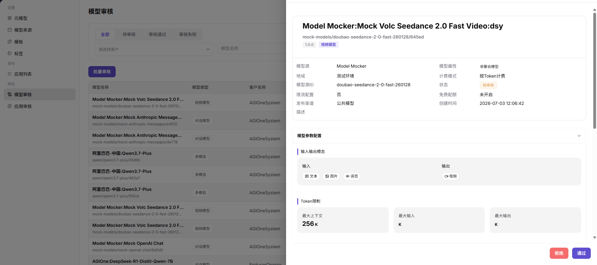

# 模型审核

::: info 文档信息
版本：v1.0
更新日期：2026-07-08
:::

## 功能概述

`模型审核` 用于处理模型发布申请，核对来源配置、协议、计费、限流、授权材料和审核意见，决定模型是否可进入上架与调用流程。

| 项目 | 内容 |
| --- | --- |
| 适用角色 | 运营方 |
| 导航路径 | 模型及AI服务 > 审批 > 模型审核 |
| 页面路由 | /operator/approvals/model-reviews |
| 管理对象 | 模型发布申请、来源配置、协议、计费、限流和审核意见 |
| 典型用途 | 审核模型是否允许上架 |

#### 新手理解

模型审核像上架前的质检，重点不是只看名称是否完整，而是确认模型来源、协议、能力说明、安全边界和可见范围是否可发布。

#### 术语速查

| 术语 | 说明 |
| --- | --- |
| 审核单 | 模型发布、更新或下架进入审核流程后的处理记录。 |
| 授权材料 | 证明模型来源、使用权和发布范围的材料。 |
| 风险说明 | 对数据、内容安全、调用稳定性和成本风险的说明。 |
| 审核意见 | 通过、驳回或要求补充材料时给申请方的处理说明。 |

## 前提条件

1. 当前账号具备`模型审核` 权限。
2. 申请方已提交模型来源、授权材料、协议说明、测试结果和使用边界。
3. 审核人已明确通过、驳回和补充材料的处理标准。

## 页面说明

页面用于处理模型上架、更新或下架审核，展示申请模型、供应方、元模型、来源凭据、风险说明和审核意见。审核人应围绕授权、能力、合规和调用可用性给出明确结论。

页面截图：

用于查看审核状态、申请方、模型和处理入口。

## 主要操作

### 模型审核

1. 进入 `模型及AI服务 > 审批 > 模型审核`。
2. 在模型审核列表中查看 `模型名称`、`模型类型`、`客户名称`、`版本`、`免费配额`、`状态`、`提交时间`、`审核时间` 和 `操作`。
3. 通过 `全部`、`待审核`、`审核通过`、`审核失败` 状态页签，或按 `客户`、`模型名称` 筛选目标记录。
4. 点击目标模型的 `详情` 或 `审核`，打开模型审核详情。
5. 在详情页核对模型名称、模型源、地域、模型源ID、限流配置、发布渠道、模型属性、计费模式、状态、免费配额和创建时间。
6. 继续核对 `模型参数配置` 中的输入输出模态、Token 限制、协议、能力说明和使用边界。
7. 根据审核结论选择 `通过` 或 `拒绝`；点击最终确认前再次核对审核意见和影响范围。
8. 如仅学习或验证页面，请只查看详情或打开审核入口后关闭，不点击最终 `通过` 或 `拒绝`。

## 参数说明

| 字段名称 | 是否必填 | 字段类型 | 示例 | 说明 |
| --- | --- | --- | --- | --- |
| 模型名称 | 系统展示 | 文本 | `Model Mocker:Mock Volc Seedance 2.0 Fast Video` | 待审核或已审核的模型名称。 |
| 客户名称 | 系统展示 | 文本 | `AGIOneSystem` | 模型所属客户或提交方。 |
| 模型源 | 系统展示 | 文本 | `Model Mocker` | 模型来源或供应方。 |
| 模型类型 | 系统展示 | 标签 | `视频模型` / `对话模型` | 模型能力类型。 |
| 版本 | 系统展示 | 文本 | `1.0.0` | 当前提交审核的模型版本。 |
| 免费配额 | 系统展示 | 文本 | `无` | 模型是否配置免费额度。 |
| 审核状态 | 系统展示 | 枚举 | `待审核` / `审核通过` / `审核失败` | 模型审核生命周期状态。 |
| 提交时间 | 系统展示 | 日期时间 | `2026-07-08 16:49:47` | 模型提交审核的时间。 |
| 审核时间 | 系统展示 | 日期时间 | `2026-07-15 17:30:01` | 审核完成时间，未审核时显示为空或 `--`。 |
| 审核意见 | 条件必填 | 多行文本 | `需补充授权说明` | 驳回或要求补充材料时填写。 |
| 操作 | 按权限展示 | 按钮 | `详情` / `审核` | 查看详情或进入审核处理的入口。 |

## 踩坑提示

- 审核意见不要粘贴真实密钥、完整请求头或客户原始调用内容。
- 通过前确认模型协议、Token 限制和输入输出模态一致。
- 驳回时写清缺失材料，避免申请方反复提交。

## 结果校验

| 检查项 | 成功表现 | 异常时处理 |
| --- | --- | --- |
| 审核列表可进入 | 模型审核列表正常打开。 | 未达到时回到对应页面核对权限、菜单入口和页面加载状态 |
| 待审核模型正常显示 | 待审核模型显示在列表中，并展示模型名称、客户、状态和时间。 | 未达到时检查模型、来源、模板、审核状态、调用配置和可见范围 |
| 筛选条件可用 | 状态页签、客户和模型名称筛选可定位目标记录。 | 未达到时回到对应页面核对筛选条件和数据状态 |
| 审核详情可打开 | 点击 `详情` 或 `审核` 后可查看模型基础信息和模型参数配置。 | 未达到时回到对应页面核对权限和记录状态 |
| 审核结论可核对 | 最终确认前可核对 `通过` 或 `拒绝` 操作及审核意见。 | 学习或验证页面时不要点击最终确认按钮 |

## 常见问题

#### 审核材料不足

**问题现象：**

审核详情缺少来源授权、协议说明或测试结果。

**可能原因：**

- 申请方只提交了模型名称。
- 供应方授权边界不清。
- 连通性或调用测试未完成。

**处理方式：**

1. 驳回或要求补充材料。
2. 列明需要补充的授权、协议和测试项。
3. 补充后重新审核。

#### 通过后模型仍不可见

**问题现象：**

审核通过后，用户侧模型市场没有展示。

**可能原因：**

- 模型未正式上架。
- 可见范围或标签未配置。
- 发布同步任务未完成。

**处理方式：**

1. 检查模型发布状态。
2. 核对可见范围和标签。
3. 等待或触发同步任务。

#### 模型审核通过后仍无法调用

**问题现象：**

模型审核状态为通过，但市场或体验中心调用失败。

**可能原因：**

模型尚未上架，来源连通性异常，计费或限流配置不完整，或调用方没有可见范围和有效 Key。

**处理方式：**

先核对模型发布状态和可见范围；再检查模型来源、计费、限流和调用日志；确认调用方凭据是否有效。

## 后续操作

1. 进入模型发布或模型设置页面。
2. 验证模型市场可见性。
3. 跟踪调用日志和用户反馈。

## 注意事项

- 审核意见不要粘贴原始密钥、完整请求头或客户数据。
- 通过前重点核对来源授权、协议、Token 限制和使用边界。
- 驳回意见应写清可操作的补充项。
