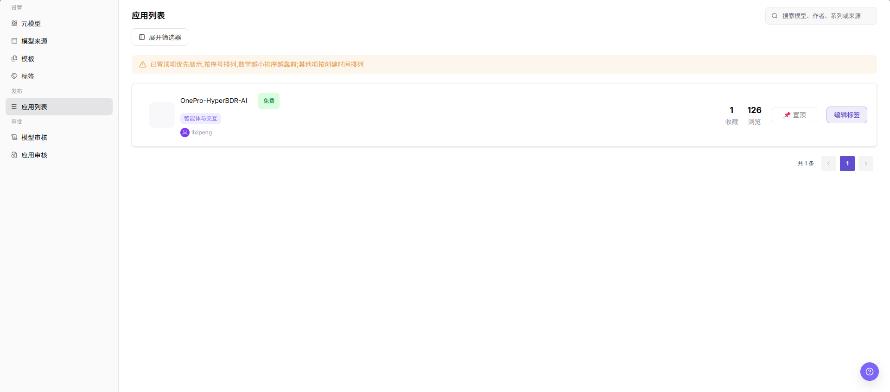

# 应用列表

::: info 文档信息
版本：v1.0
更新日期：2026-07-08
:::

## 功能概述

`应用列表` 用于查看已接入应用、模型权限、调用范围和发布记录，帮助运营方治理应用侧模型调用边界。

| 项目 | 内容 |
| --- | --- |
| 适用角色 | 运营方 |
| 导航路径 | 模型及AI服务 > 发布 > 应用列表 |
| 页面路由 | /modelone/audit/app |
| 管理对象 | 应用、模型权限、调用范围、状态和发布记录 |
| 典型用途 | 维护可调用模型服务的应用 |

#### 新手理解

应用发布像把模型能力包装成一个面向客户的入口。运营方关注的是应用信息、可见范围、调用模型和发布状态是否一致。

#### 术语速查

| 术语 | 说明 |
| --- | --- |
| 应用 | 面向客户封装模型能力的使用入口。 |
| 绑定模型 | 应用后端实际调用的模型。 |
| 发布状态 | 草稿、审核中、已发布或已下架等生命周期状态。 |
| 调用入口 | 客户访问应用或 API 的入口，文档中使用占位符。 |

## 前提条件

1. 当前账号具备应用发布管理权限。
2. 应用绑定模型、调用入口、客户可见范围和发布说明已准备。
3. 发布前已确认客户授权和模型状态。

## 页面说明

页面用于管理应用发布记录，包括应用名称、绑定模型、可见范围、发布状态、调用入口和审核信息。运营方应确认应用展示信息、模型权限和客户可见范围匹配。

页面截图：

用于查看应用状态、绑定模型和可见范围。

## 主要操作

### 查看应用列表

1. 进入 `模型及AI服务 > 发布 > 应用列表`。
2. 在 `应用列表` 页面查看应用名称、标签、作者、计费状态、收藏数和浏览数。
3. 在右上角搜索框中输入模型、作者、系列或来源关键字。
4. 如需更多筛选条件，点击 `展开筛选器` 后按页面筛选项查询。
5. 在应用卡片中按需查看 `置顶`、`编辑标签` 等操作入口；执行变更类操作前应确认影响范围。

## 参数说明

| 字段名称 | 是否必填 | 字段类型 | 示例 | 说明 |
| --- | --- | --- | --- | --- |
| 应用名称 | 系统展示 | 文本 | `OnePro-HyperBDR-AI` | 应用列表中展示的应用名称。 |
| 标签 | 系统展示 | 标签 | `智能体与交互` | 应用所属分类或展示标签。 |
| 作者 | 系统展示 | 文本 | `lixipeng` | 应用创建者或维护者。 |
| 计费状态 | 系统展示 | 标签 | `免费` | 应用当前计费或价格状态。 |
| 收藏数 | 系统展示 | 数字 | `1` | 应用被收藏的次数。 |
| 浏览数 | 系统展示 | 数字 | `126` | 应用被浏览的次数。 |
| 操作 | 按权限展示 | 按钮 | `置顶` / `编辑标签` | 当前账号可执行的应用列表操作入口。 |

## 踩坑提示

- 发布前确认绑定模型已上架且授权范围覆盖目标客户。
- 下架应用前评估客户侧调用影响。
- 截图时遮挡客户名称、内部应用 ID 和调用入口。

## 结果校验

| 检查项 | 成功表现 | 异常时处理 |
| --- | --- | --- |
| 页面可进入 | 应用列表页面正常打开。 | 未达到时回到对应页面核对权限、菜单入口和页面加载状态 |
| 列表正常加载 | 应用卡片、收藏数、浏览数和操作入口正常显示。 | 未达到时检查模型、来源、模板、审核状态、调用配置和可见范围 |
| 搜索条件可用 | 输入关键字后可定位符合条件的应用。 | 未达到时回到对应页面核对搜索词、筛选条件和数据状态 |
| 筛选器可用 | 点击 `展开筛选器` 后可查看并使用筛选项。 | 未达到时回到对应页面核对页面状态和筛选条件 |
| 查看入口可用 | 可通过应用卡片查看应用基础信息和可用操作入口。 | 未达到时回到对应页面核对权限和页面状态 |

## 常见问题

#### 应用发布后客户不可见

**问题现象：**

应用状态为已发布，但客户侧列表没有展示。

**可能原因：**

- 可见范围未包含该客户。
- 绑定模型未授权或已下架。
- 发布缓存尚未刷新。

**处理方式：**

1. 核对应用可见范围。
2. 检查绑定模型状态和授权。
3. 刷新客户侧页面或等待同步。

#### 应用调用失败

**问题现象：**

客户能看到应用，但调用返回错误。

**可能原因：**

- 绑定模型不可用。
- 调用入口或参数映射错误。
- 客户配额或限流触发。

**处理方式：**

1. 检查模型状态和调用日志。
2. 核对应用参数映射。
3. 查看客户调用错误码和配额。

#### 应用发布记录状态长期不变

**问题现象：**

应用列表中的发布状态长期停留在处理中或待发布。

**可能原因：**

审核流程未完成，模型权限配置缺失，或发布任务同步延迟。

**处理方式：**

检查应用审核记录和模型权限；确认发布任务是否有错误提示；必要时记录应用 ID 和时间交给平台管理员排查。

## 后续操作

1. 查看应用调用日志。
2. 分析客户调用趋势。
3. 按客户反馈调整模型或可见范围。

## 注意事项

- 下架应用前确认客户调用影响。
- 截图时遮挡客户名称、应用 ID 和调用入口。
- 真实调用地址和凭据只在平台安全区域展示。
