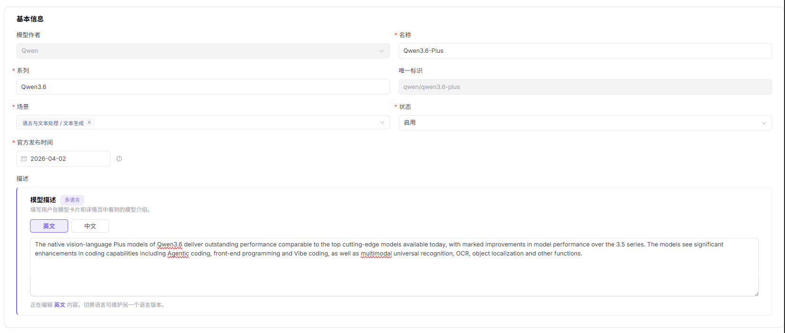
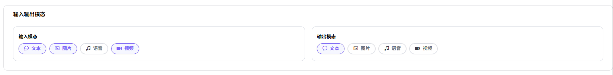

# 元模型

:::: info 文档信息
版本：v1.0
更新日期：2026-07-08
::::

## 功能概述

`元模型` 用于维护或查看模型能力、协议、模态、Token 限制、默认参数和能力标签，支撑模型发布、体验、调用、统计和运营治理。

| 项目 | 内容 |
| --- | --- |
| 适用角色 | 运营方 |
| 导航路径 | 系统设置 > 元模型 |
| 页面路由 | /operator/settings/meta-models |
| 管理对象 | 模型能力、协议、模态、Token 限制、默认参数和能力标签 |
| 典型用途 | 维护模型能力抽象和协议定义 |

### 新手理解

元模型像模型能力说明书，用来定义模型支持什么输入输出、走哪种协议、最多处理多少 Token，以及体验和调用时默认使用哪些参数。它不是某个具体供应方实例，而是模型发布和模板配置都会引用的基础定义。

### 术语速查

| 术语 | 说明 |
| --- | --- |
| 元模型 | 描述模型能力和调用协议的抽象定义。 |
| 输入输出模态 | 模型支持的文本、图像、音频或视频输入输出类型。 |
| Token 限制 | 模型上下文、输入和输出长度限制。 |
| 官方原生协议 | OpenAI、Anthropic 等兼容协议定义。 |

## 前提条件

1. 当前账号具备元模型配置权限。
2. 模型类型、输入输出模态、上下文长度、Token 限制和默认参数已确认。
3. 兼容协议、Endpoint 路径和请求/响应格式已由技术负责人确认。
4. 新增或变更元模型前已评估对模型发布模板和已发布模型的影响。
## 页面说明

页面用于维护模型能力抽象，包括输入输出模态、协议、Token 限制、能力标签和默认参数。元模型不等于具体供应方实例，它更像模型发布时引用的能力说明书。

页面截图：

用于查看元模型状态、模态、协议和操作入口。

## 主要操作

### 操作步骤

1. 进入 `系统设置 > 元模型`。
2. 新增或编辑元模型基础信息。
3. 选择输入模态和输出模态。
4. 配置 OpenAI、Anthropic 等兼容协议及 Endpoint 路径。
5. 维护上下文、最大输入、最大输出和默认参数后保存。

关键步骤截图：

基础信息决定模型发布时的展示名称和能力分类。

模态配置会影响模型市场筛选和 Playground 入口。

Token 限制应与真实模型能力一致。

### 参数说明

| 字段名称 | 是否必填 | 字段类型 | 示例 | 说明 |
| --- | --- | --- | --- | --- |
| 元模型名称 | 是 | 文本 | `Qwen Text` | 模型能力抽象名称。 |
| 输入输出模态 | 是 | 多选 | `文本 -> 文本` | 声明模型支持的数据类型。 |
| 协议 | 是 | 多选 | `openai/chat_completions` | 模型兼容调用协议。 |
| Token 限制 | 是 | 数字 | `128000` | 上下文、输入或输出 Token 上限。 |
| 默认参数 | 否 | JSON | `{"temperature":0.7}` | 协议调用默认参数。 |

### 踩坑提示

- Token 限制写大于真实模型能力会导致调用失败。
- 协议 Endpoint 路径应是路径或占位示例，不要写真实内部地址。
- 输入输出模态配置错误会影响模型市场筛选。

### 结果校验

1. 新增的元模型在列表中可见。
2. 发布模型或配置模板时能选择到该元模型。
3. 协议、模态、Token 限制与模型实际能力一致。
4. 默认参数在体验或调用测试中能按预期生效。
## 常见问题

### 发布模型时选不到元模型

**问题现象：**

模型提供方进入发布流程后，元模型下拉框中没有目标项。

**可能原因：**

- 元模型未启用。
- 模型类型或模态与发布方式不匹配。
- 当前角色或租户没有使用该元模型的权限。

**处理方式：**

1. 确认元模型状态为启用。
2. 核对模型类型、输入输出模态和发布方式。
3. 检查角色、租户和可见范围配置。

### 调用时提示 Token 超限

**问题现象：**

模型体验或 API 调用返回上下文长度、输入长度或输出长度超限。

**可能原因：**

- 元模型 Token 限制小于实际请求。
- 默认 Max Tokens 设置过大。
- 调用方传入了过长上下文。

**处理方式：**

1. 核对元模型上下文、输入和输出限制。
2. 调整默认参数或调用参数。
3. 缩短 Prompt 或对话上下文后重试。
## 后续操作

1. 在模型模板或模型发布流程中选择该元模型，确认协议、模态和 Token 限制可被正确引用。
2. 使用代表性模型做一次发布验证，检查输入输出格式是否匹配。
3. 当协议、上下文长度或默认参数变化时，同步通知模板维护者和模型提供方。

## 注意事项

- 元模型变更会影响模型发布、模板选择和市场筛选，发布前应确认依赖范围。
- Token 限制、协议路径和默认参数必须与真实模型能力一致。
- 调整输入输出模态前，先核对已发布模型是否仍能被正确筛选和调用。
