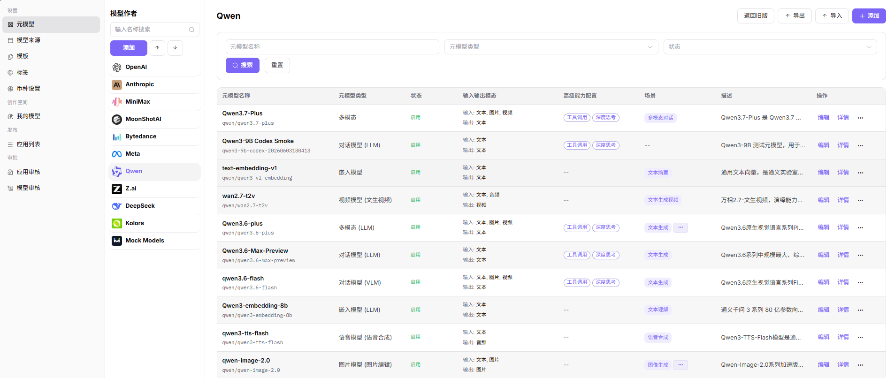
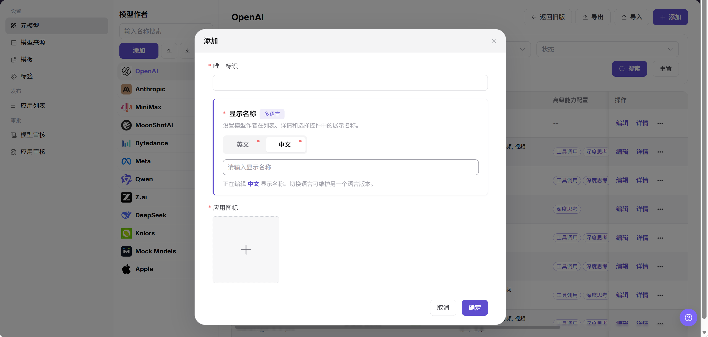
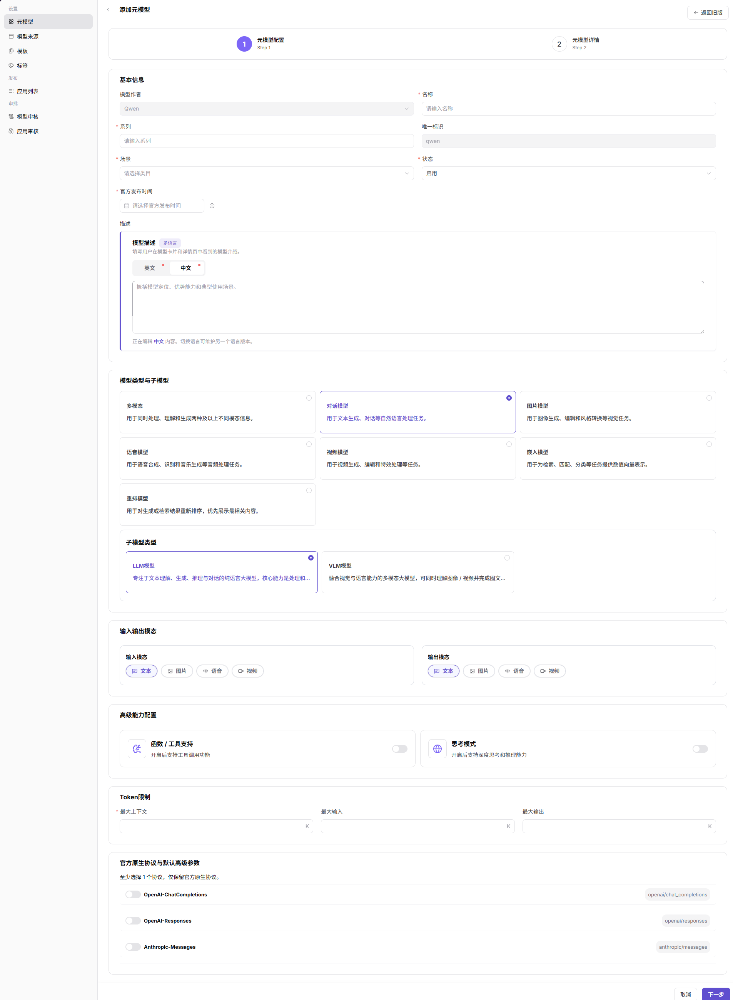
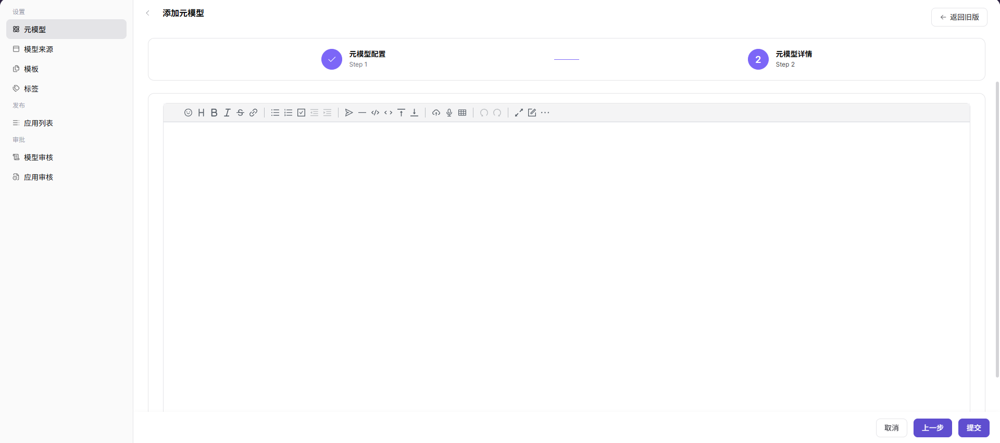

# 元模型

::: info 文档信息
版本：v1.0
更新日期：2026-07-08
:::

## 功能概述

`元模型` 用于定义模型能力、协议、模态、上下文、Token 限制和默认参数，是发布模型时选择能力边界的基础数据。

| 项目 | 内容 |
| --- | --- |
| 适用角色 | 运营方 |
| 导航路径 | 模型及AI服务 > 设置 > 元模型 |
| 页面路由 | `/modelone/settings/meta` |
| 管理对象 | 模型能力、协议、模态、Token 限制、默认参数和能力标签 |
| 典型途径 | 维护模型能力抽象和协议定义 |

#### 新手理解

元模型像模型能力说明书，用来定义模型支持什么输入输出、走哪种协议、最多处理多少 Token，以及体验和调用时默认使用哪些参数。它不代表某个具体供应方实例，而作为模型发布和模板配置都会引用的基础定义。

#### 术语速查

| 术语 | 说明 |
| --- | --- |
| 元模型 | 描述模型能力和调用协议的抽象定义。 |
| 输入输出模态 | 模型支持的文本、图像、音频或视频输入输出类型。 |
| Token 限制 | 模型上下文、输入和输出长度限制。 |
| 官方原生协议 | OpenAI、Anthropic 等兼容协议定义。 |

## 前提条件

1. 当前账号具备`元模型` 配置权限。
2. 模型类型、输入输出模态、上下文长度、Token 限制和默认参数已确认。
3. 兼容协议、Endpoint 路径和请求/响应格式已由技术负责人确认。
4. 新增或变更元模型前已评估对模型发布模板和已发布模型的影响。

## 页面说明

页面用于维护模型能力抽象，包括输入输出模态、协议、Token 限制、能力标签和默认参数。元模型不等于具体供应方实例，像模型发布时引用的能力说明书。

页面截图：

用于查看元模型状态、模态、协议和操作入口。

## 主要操作

### 添加模型作者

1. 进入 `模型及AI服务 > 设置 > 元模型`。
2. 在左侧 `模型作者` 区域点击 `添加`，打开 `添加` 弹窗。
3. 填写 `唯一标识`，用于区分不同模型作者。
4. 在 `显示名称` 中维护 `英文` 和 `中文` 展示名称。
5. 上传或选择 `应用图标`。
6. 点击 `确定` 前确认字段信息无误；如仅学习或验证页面，请点击 `取消` 关闭。

### 添加元模型

1. 进入 `模型及AI服务 > 设置 > 元模型`。
2. 在页面右上角点击 `添加`，进入 `添加元模型` 页面。
3. 在 `元模型配置` 步骤填写或选择 `模型作者`、`名称`、`系列`、`唯一标识`、`场景`、`状态`、`官方发布时间` 和 `描述`。
4. 选择 `模型类型与子模型`，并配置 `输入输出模态` 和 `高级能力配置`。
5. 填写 `Token限制`，并选择 `官方原生协议与默认高级参数`。

6. 点击 `下一步`，进入 `元模型详情` 页面。
7. 在 `元模型详情` 中按页面要求维护模型说明、能力详情、参数说明或其他详情配置。
8. 点击最终提交或保存前确认配置无误；如仅学习或验证页面，请点击 `取消` 或返回关闭。

## 参数说明

| 字段名称 | 是否必填 | 字段类型 | 示例 | 说明 |
| --- | --- | --- | --- | --- |
| 唯一标识 | 必填 | 文本 / 只读文本 | `qwen` | 模型作者或元模型的唯一识别标识。 |
| 显示名称 | 必填 | 多语言文本 | `Qwen` | 模型作者在列表、详情和选择控件中的展示名称。 |
| 应用图标 | 必填 | 图片上传 | `qwen.png` | 模型作者在列表中的图标。 |
| 模型作者 | 必填 | 下拉选择 | `Qwen` | 新增元模型所属的模型作者。 |
| 名称 | 必填 | 文本 | `Qwen Text` | 元模型在页面和发布流程中的展示名称。 |
| 系列 | 必填 | 文本 | `Qwen` | 元模型所属系列。 |
| 场景 | 必填 | 下拉选择 | `文本生成` | 元模型适用的业务场景。 |
| 状态 | 必填 | 下拉选择 | `启用` | 控制元模型是否可在后续流程中使用。 |
| 官方发布时间 | 否 | 日期选择 | `2026-07-08` | 元模型对应能力的官方发布时间。 |
| 模型描述 | 否 | 多语言文本 | `适用于文本生成。` | 展示在模型卡片和详情中的说明。 |
| 模型类型与子模型 | 必填 | 单选卡片 | `对话模型` / `LLM模型` | 定义元模型能力分类和子类型。 |
| 输入模态 / 输出模态 | 必填 | 多选 | `文本 -> 文本` | 声明模型支持的数据输入和输出类型。 |
| 函数 / 工具支持 | 否 | 开关 | `关闭` | 控制是否开启工具调用能力。 |
| 思考模式 | 否 | 开关 | `关闭` | 控制是否开启深度思考或推理能力。 |
| 最大上下文 / 最大输入 / 最大输出 | 必填 | 数字 | `128` K | 定义上下文、输入和输出 Token 上限。 |
| 官方原生协议与默认高级参数 | 必填 | 开关 / 参数配置 | `OpenAI-ChatCompletions` | 选择兼容协议并维护默认高级参数。 |

## 踩坑提示

- Token 限制写大于真实模型能力会导致调用失败。
- 协议 Endpoint 路径应是路径或占位示例，不要写真实内部地址。
- 输入输出模态配置错误会影响模型市场筛选。

## 结果校验

| 检查项 | 成功表现 | 异常时处理 |
| --- | --- | --- |
| 新增的元模型在列表中可见 | 新增的元模型在列表中可见。 | 未达到时检查模型、来源、模板、审核状态、调用配置和可见范围 |
| 发布模型或配置模板时能选择到该元模型 | 发布模型或配置模板时能选择到该元模型。 | 未达到时检查模型、来源、模板、审核状态、调用配置和可见范围 |
| 协议、模态、Token 限制与模型实际能力一致 | 协议、模态、Token 限制与模型实际能力一致。 | 未达到时检查模型、来源、模板、审核状态、调用配置和可见范围 |
| 默认参数在体验或调用测试中能按预期生效 | 默认参数在体验或调用测试中能按预期生效。 | 未达到时检查模型、来源、模板、审核状态、调用配置和可见范围 |

## 常见问题

#### 发布模型时选不到元模型

**问题现象：**

模型提供方进入发布流程后，元模型下拉框中没有目标项。

**可能原因：**

- 元模型未启用。
- 模型类型或模态与发布方式不匹配。
- 当前角色或租户没有使用该元模型的权限。

**处理方式：**

1. 确认元模型状态为启用。
2. 核对模型类型、输入输出模态和发布方式。
3. 检查角色、租户和可见范围配置。

#### 调用时提示 Token 超限

**问题现象：**

模型体验或 API 调用返回上下文长度、输入长度或输出长度超限。

**可能原因：**

- 元模型 Token 限制小于实际请求。
- 默认 Max Tokens 设置过大。
- 调用方传入了过长上下文。

**处理方式：**

1. 核对元模型上下文、输入和输出限制。
2. 调整默认参数或调用参数。
3. 缩短 Prompt 或对话上下文后重试。

#### 发布模型时元模型参数不匹配

**问题现象：**

提供方发布模型时，元模型默认参数或上下文限制与实际能力不一致。

**可能原因：**

元模型协议、模态、Token 限制或默认参数维护错误，或模板引用了旧版本配置。

**处理方式：**

回到元模型页核对协议、模态和 Token 限制；同步检查模型模板引用；修改后用测试发布流程验证。

## 后续操作

1. 在模型模板或模型发布流程中选择该元模型，确认协议、模态和 Token 限制可被正确引用。
2. 使用代表性模型做一次发布验证，检查输入输出格式是否匹配。
3. 当协议、上下文长度或默认参数变化时，同步通知模板维护者和模型提供方。

## 注意事项

- 元模型变更会影响模型发布、模板选择和市场筛选，发布前应确认依赖范围。
- Token 限制、协议路径和默认参数必须与真实模型能力一致。
- 调整输入输出模态前，先核对已发布模型是否仍能被正确筛选和调用。
