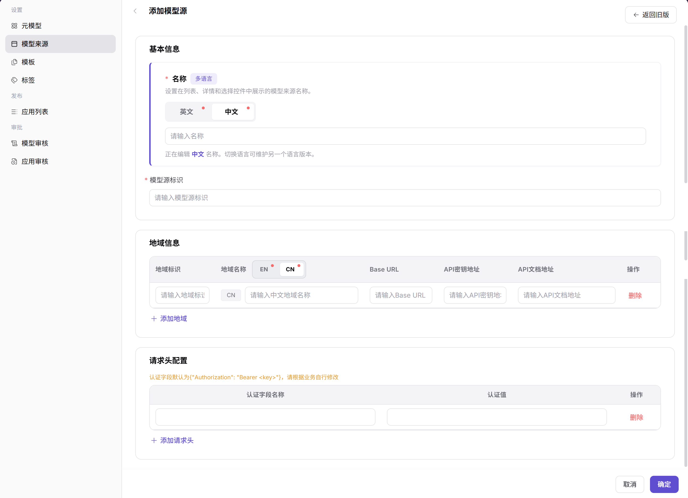

# 模型来源

::: info 文档信息
版本：v1.0
更新日期：2026-07-08
:::

## 功能概述

`模型来源` 用于维护上游模型服务的 Base URL、请求头、认证方式、区域和连通性，是模型发布前必须确认的接入配置。

| 项目 | 内容 |
| --- | --- |
| 适用角色 | 运营方 |
| 导航路径 | 模型及AI服务 > 设置 > 模型来源 |
| 页面路由 | `/modelone/settings/vendor` |
| 管理对象 | 来源渠道、区域、Base URL、请求头、认证信息和连通性状态 |
| 典型途径 | 维护上游模型服务来源 |

#### 新手理解

模型来源像上游模型服务的地址簿。来源配置错了，后续模型模板和发布模型都会调用失败。

#### 术语速查

| 术语 | 说明 |
| --- | --- |
| 来源渠道 | 模型服务所属厂商、组织或接入渠道。 |
| Base URL | 上游模型服务基础地址。 |
| 请求头 | 调用上游服务时附加的认证或自定义 Header。 |
| 连通性 | 平台测试上游服务能否访问的结果。 |

## 前提条件

1. 当前账号具备`模型来源` 维护权限。
2. Endpoint、Base URL、区域、认证方式和请求头字段已准备。
3. 上游模型服务的网络连通性和证书策略已确认。
4. 连通性测试使用的凭据已通过安全方式录入。

## 页面说明

页面用于维护上游模型来源，包括 Endpoint、区域、请求头认证、来源渠道和连通性。模型来源配置错了，后续模型发布和调用都会失败。

页面截图：

用于查看来源状态、区域和连通性。

## 主要操作

### 添加模型来源

1. 进入 `模型及AI服务 > 设置 > 模型来源`。
2. 点击 `添加`，进入 `添加模型源` 页面。
3. 在 `基本信息` 中维护 `名称` 的 `英文` 和 `中文` 展示名称。
4. 填写 `模型源标识`，用于区分不同模型来源。
5. 在 `地域信息` 中维护 `地域标识`、`地域名称`、`Base URL`、`API密钥地址` 和 `API文档地址`；如需多个地域，可点击 `添加地域`。
6. 在 `请求头配置` 中维护 `认证字段名称` 和 `认证值`；如需多个请求头，可点击 `添加请求头`。
7. 点击 `确定` 前确认字段信息无误；如仅学习或验证页面，请点击 `取消` 关闭。

## 参数说明

| 字段名称 | 是否必填 | 字段类型 | 示例 | 说明 |
| --- | --- | --- | --- | --- |
| 名称 | 必填 | 多语言文本 | `DashScope` | 在列表、详情和选择控件中展示的模型来源名称。 |
| 模型源标识 | 必填 | 文本 | `dashscope-cn` | 模型来源的唯一识别标识。 |
| 地域标识 | 必填 | 文本 | `cn-shanghai` | 来源服务所在地域的标识。 |
| 地域名称 | 必填 | 多语言文本 | `华东 1` | 来源服务所在地域的展示名称。 |
| Base URL | 必填 | URL | `https://api.example.com/v1` | 上游服务基础地址，示例使用占位符。 |
| API密钥地址 | 否 | URL | `https://example.com/keys` | 获取或管理上游 API Key 的地址。 |
| API文档地址 | 否 | URL | `https://example.com/docs` | 上游服务 API 文档地址。 |
| 认证字段名称 | 条件必填 | 文本 | `Authorization` | 请求头中的认证字段名称。 |
| 认证值 | 条件必填 | 文本 | `Bearer <key>` | 请求头中的认证值，禁止写真实密钥。 |
| 连通性状态 | 系统生成 | 枚举 | `通过` | 测试上游服务是否可访问。 |

## 踩坑提示

- Endpoint 不要拼错协议前缀和路径。
- 请求头认证值应使用安全输入，不要写入备注。
- 连通性通过后仍要用具体模型做协议测试。

## 结果校验

| 检查项 | 成功表现 | 异常时处理 |
| --- | --- | --- |
| 模型来源在列表中显示连通或可用状态 | 模型来源在列表中显示连通或可用状态。 | 未达到时检查模型、来源、模板、审核状态、调用配置和可见范围 |
| 模板和模型发布流程能选择该来源 | 模板和模型发布流程能选择该来源。 | 未达到时检查模型、来源、模板、审核状态、调用配置和可见范围 |
| 请求头、地域和 Base URL 与上游服务要求一致 | 请求头、地域和 Base URL 与上游服务要求一致。 | 未达到时检查模型、来源、模板、审核状态、调用配置和可见范围 |
| 连通性测试失败时能看到明确错误提示 | 连通性测试失败时能看到明确错误提示。 | 未达到时检查模型、来源、模板、审核状态、调用配置和可见范围 |

## 常见问题

#### 模型来源连通性测试失败

**问题现象：**

保存来源后，测试连接返回超时、401、403 或 5xx。

**可能原因：**

- Endpoint、路径或区域填写错误。
- 请求头认证值无效或权限不足。
- 网络、代理、证书或防火墙不可达。

**处理方式：**

1. 核对 Endpoint、区域和路径。
2. 更新认证请求头或凭据引用。
3. 联系网络或上游服务管理员检查连通性。

#### 模板无法引用模型来源

**问题现象：**

来源已创建，但模型模板或发布流程中不可选。

**可能原因：**

- 来源未启用。
- 来源供应方或区域与模板不匹配。
- 来源同步状态异常。

**处理方式：**

1. 确认来源状态和供应方。
2. 核对模板适用范围。
3. 刷新同步后重新选择。

#### 来源连通正常但调用仍失败

**问题现象：**

模型来源连通性测试通过，但模型市场或体验中心调用失败。

**可能原因：**

连通性测试只验证基础网络，实际调用参数、模型源 ID、请求头、限流或计费配置仍可能不完整。

**处理方式：**

对照实际调用请求核对 Base URL、模型源 ID、请求头和协议；再到调用日志查看错误码和上游返回摘要。

## 后续操作

1. 立即执行连通性测试，确认 Endpoint、认证请求头和返回格式可用。
2. 在关联模型或模板中选择该来源，验证调用链路是否正常。
3. 按周期检查来源健康状态、限流策略和凭据有效期。

## 注意事项

- 模型来源涉及 Endpoint、请求头和认证信息，所有示例必须使用占位符。
- 连通性测试通过不代表长期可用，应结合供应方限流、白名单和健康状态复核。
- 变更认证方式或请求头后，应同步验证已关联模型的体验中心和 API 调用。
