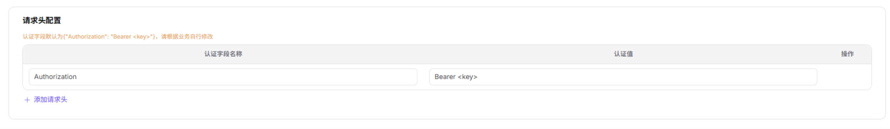

# 模型来源

::: info 文档信息
版本：v1.0
更新日期：2026-07-06
:::

::: warning 安全提示
模型服务文档和截图中不要暴露真实 Endpoint、API Key、请求头认证值、模型源密钥、内部模型 ID、客户调用内容或业务价格策略；示例统一使用占位符。
:::

## 功能概述

`模型来源` 用于维护或查看来源渠道、区域、Base URL、请求头、认证信息和连通性状态，支撑模型发布、体验、调用、统计和运营治理。

| 项目 | 内容 |
| --- | --- |
| 适用角色 | 运营方 |
| 导航路径 | 系统设置 > 模型来源 |
| 页面路由 | /operator/settings/model-source |
| 管理对象 | 来源渠道、区域、Base URL、请求头、认证信息和连通性状态 |
| 典型用途 | 维护上游模型服务来源 |

### 新手理解

模型来源像上游模型服务的地址簿。来源配置错了，后续模型模板和发布模型都会调用失败。

### 术语速查

| 术语 | 说明 |
| --- | --- |
| 来源渠道 | 模型服务所属厂商、组织或接入渠道。 |
| Base URL | 上游模型服务基础地址。 |
| 请求头 | 调用上游服务时附加的认证或自定义 Header。 |
| 连通性 | 平台测试上游服务是否可访问的结果。 |

## 前提条件

1. 当前账号具备模型来源维护权限。
2. Endpoint、Base URL、区域、认证方式和请求头字段已准备。
3. 上游模型服务的网络连通性和证书策略已确认。
4. 连通性测试使用的凭据已通过安全方式录入。
## 页面说明

页面用于维护上游模型来源，包括 Endpoint、区域、请求头认证、来源渠道和连通性。模型来源配置错了，后续模型发布和调用都会失败。

页面截图：

用于查看来源状态、区域和连通性。

## 主要操作

### 操作步骤

1. 进入 `系统设置 > 模型来源`。
2. 新增或编辑来源名称、供应方和区域。
3. 填写脱敏 Endpoint 或 Base URL 占位示例。
4. 配置请求头名称和认证值占位符。
5. 执行连通性测试并保存。

关键步骤截图：

填写来源名称、协议和 Endpoint 时使用占位示例。

请求头中不要暴露真实 API Key 或认证值。

### 参数说明

| 字段名称 | 是否必填 | 字段类型 | 示例 | 说明 |
| --- | --- | --- | --- | --- |
| 来源名称 | 是 | 文本 | `dashscope-cn` | 模型来源展示名称。 |
| 区域 | 是 | 文本 | `cn-shanghai` | 来源服务所在区域。 |
| Endpoint | 是 | URL | `https://api.example.com/v1` | 上游基础地址，示例使用占位符。 |
| 请求头 | 条件必填 | 键值对 | `Authorization: Bearer <key>` | 认证请求头，禁止写真实密钥。 |
| 连通性状态 | 系统生成 | 枚举 | `通过` | 测试上游服务是否可访问。 |

### 踩坑提示

- Endpoint 不要拼错协议前缀和路径。
- 请求头认证值应使用安全输入，不要写入备注。
- 连通性通过后仍要用具体模型做协议测试。

### 结果校验

1. 模型来源在列表中显示连通或可用状态。
2. 模板和模型发布流程能选择该来源。
3. 请求头、区域和 Base URL 与上游服务要求一致。
4. 连通性测试失败时能看到明确错误提示。
## 常见问题

### 模型来源连通性测试失败

**问题现象：**

保存来源后，测试连接返回超时、401、403 或 5xx。

**可能原因：**

- Endpoint、路径或区域填写错误。
- 请求头认证值无效或权限不足。
- 网络、代理、证书或防火墙不可达。

**处理方式：**

1. 核对 Endpoint、区域和路径。
2. 更新认证请求头或凭据引用。
3. 联系网络或上游服务管理员检查连通性。

### 模板无法引用模型来源

**问题现象：**

来源已创建，但模型模板或发布流程中不可选。

**可能原因：**

- 来源未启用。
- 来源供应方或区域与模板不匹配。
- 来源同步状态异常。

**处理方式：**

1. 确认来源状态和供应方。
2. 核对模板适用范围。
3. 刷新同步后重新选择。
## 后续操作

1. 立即执行连通性测试，确认 Endpoint、认证请求头和返回格式可用。
2. 在关联模型或模板中选择该来源，验证调用链路是否正常。
3. 按周期检查来源健康状态、限流策略和凭据有效期。

## 注意事项

- 模型来源涉及 Endpoint、请求头和认证信息，所有示例必须使用占位符。
- 连通性测试通过不代表长期可用，应结合供应方限流、白名单和健康状态复核。
- 变更认证方式或请求头后，应同步验证已关联模型的 Playground 和 API 调用。
